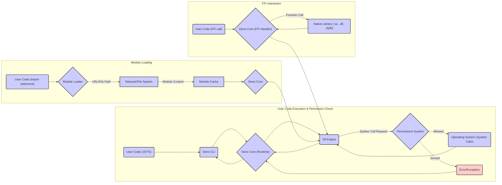

# Project Design Document: Deno Runtime Environment

**Version:** 1.1
**Date:** October 26, 2023
**Author:** AI Software Architect

## 1. Introduction

This document provides an enhanced and detailed architectural design of the Deno runtime environment. This design serves as the foundation for subsequent threat modeling activities, enabling a comprehensive understanding of potential security vulnerabilities and attack vectors. Deno is a secure runtime for JavaScript and TypeScript, built with a focus on security, developer experience, and modern web standards. This revision adds further detail and clarifies certain aspects for improved threat analysis.

## 2. Goals and Objectives

*   Provide a clear and comprehensive overview of Deno's architecture, with enhanced detail on component interactions.
*   Identify key components and meticulously describe their responsibilities and relationships.
*   Illustrate data flow within the system with greater precision.
*   Highlight security-relevant aspects of the design, providing context for potential threats.
*   Serve as a robust and detailed basis for identifying potential threats and vulnerabilities during threat modeling exercises.

## 3. Architectural Overview

Deno's architecture is built around a core runtime implemented in Rust, leveraging the high-performance V8 JavaScript engine and the asynchronous capabilities of the Tokio runtime. A central design principle is security by default, enforced through a granular permissions system that restricts access to system resources unless explicitly granted by the user.

## 4. Key Components

*   **Deno Core (Runtime):**
    *   Implemented in Rust, ensuring memory safety and performance.
    *   Responsible for the entire lifecycle of a Deno process, from bootstrapping to termination.
    *   Manages the permission model, enforcing access controls for various system resources.
    *   Handles module resolution and loading, including fetching remote modules.
    *   Provides core APIs accessible to JavaScript/TypeScript code (e.g., timers, network operations).
    *   Embeds and manages the lifecycle of the V8 JavaScript engine.
    *   Utilizes the Tokio asynchronous runtime for non-blocking I/O operations, enabling efficient handling of concurrent tasks.
    *   Includes sub-modules for specific functionalities like:
        *   **`deno_runtime`:** The main runtime logic.
        *   **`deno_permissions`:** Implementation of the permission system.
        *   **`deno_fetch`:** Handling network requests for module loading.
        *   **`deno_fs`:** Providing access to the file system (subject to permissions).
*   **V8 JavaScript Engine:**
    *   Google's open-source, high-performance engine for JavaScript and WebAssembly.
    *   Responsible for parsing, compiling (including just-in-time compilation), and executing JavaScript and TypeScript code after compilation.
    *   Provides the execution context and manages the JavaScript heap.
    *   Offers APIs for embedding and interacting with native code (used by Deno Core).
*   **TypeScript Compiler:**
    *   An integrated TypeScript compiler, enabling direct execution of TypeScript code.
    *   Performs static type checking, catching potential errors before runtime.
    *   Compiles TypeScript code to JavaScript before it is executed by the V8 engine.
    *   Configuration is often managed through `deno.json` or command-line flags.
*   **Standard Library (std):**
    *   A curated and reviewed collection of modules providing common, secure functionalities.
    *   Part of the Deno project, ensuring quality and security.
    *   Includes modules for:
        *   File system operations (`std/fs`).
        *   HTTP client and server (`std/http`).
        *   Testing utilities (`std/testing`).
        *   Encoding and decoding (`std/encoding`).
        *   Asynchronous utilities (`std/async`).
*   **Permissions System:**
    *   A core security mechanism that restricts access to sensitive system resources.
    *   Requires explicit user grants via command-line flags or configuration for operations such as:
        *   File system access (`--allow-read`, `--allow-write`).
        *   Network access (`--allow-net`).
        *   Environment variable access (`--allow-env`).
        *   Plugin loading (`--allow-plugin`).
        *   Running subprocesses (`--allow-run`).
        *   High-resolution time (`--allow-hrtime`).
    *   Permissions can be granted broadly or specifically (e.g., allowing network access only to a specific domain).
*   **Module Loader:**
    *   Responsible for resolving and fetching module dependencies.
    *   Supports loading modules from:
        *   Remote URLs (encouraged for transparency and verifiability).
        *   Local file paths.
    *   Caches downloaded modules to improve performance.
    *   Verifies module integrity using lockfiles (`deno.lock.json`) to prevent supply chain attacks by ensuring consistent dependencies.
    *   Supports Subresource Integrity (SRI) for verifying the integrity of fetched remote modules.
*   **Foreign Function Interface (FFI):**
    *   Allows Deno code to call functions in dynamically linked libraries (primarily C libraries).
    *   Provides a mechanism to extend Deno's capabilities by leveraging existing native code.
    *   Requires the `--allow-plugin` permission, highlighting the inherent security risks.
    *   Involves defining the function signatures and loading the library at runtime.
*   **Command Line Interface (CLI):**
    *   The primary interface for interacting with the Deno runtime.
    *   Provides commands for:
        *   Running Deno scripts (`deno run`).
        *   Formatting code (`deno fmt`).
        *   Linting code (`deno lint`).
        *   Bundling code (`deno bundle`).
        *   Managing dependencies (`deno cache`).
        *   Testing code (`deno test`).
        *   Generating documentation (`deno doc`).
    *   Parses command-line arguments, including permission flags.
    *   Initiates the Deno Core runtime with the specified parameters.

## 5. Data Flow

*   **User Code Execution & Permission Check:**
    *   The user provides JavaScript or TypeScript code to the Deno CLI.
    *   The CLI invokes the Deno Core runtime.
    *   The Deno Core passes the code to the V8 engine for execution.
    *   When the V8 engine attempts a privileged operation (e.g., file access), it triggers a system call request.
    *   The Permissions System intercepts this request and checks if the necessary permission has been granted.
    *   If allowed, the system call proceeds to the Operating System. If denied, an error or exception is raised back to the user code.
*   **Module Loading:**
    *   When an `import` statement is encountered, the Module Loader is invoked by the Deno Core.
    *   The Module Loader resolves the module specifier (URL or file path).
    *   It fetches the module content from the network or file system.
    *   Downloaded modules are stored in the Module Cache.
    *   The Deno Core integrates the loaded module into the execution environment.
*   **FFI Interaction:**
    *   When user code makes a call to a foreign function, the Deno Core's FFI Handler is invoked.
    *   The FFI Handler loads the specified native library (if not already loaded).
    *   It then calls the function within the native library.
    *   The result is passed back to the V8 engine and the user code.

## 6. Security Considerations

*   **Robust Sandboxing:** Deno operates with a strong sandbox by default, severely limiting access to system resources. This significantly reduces the attack surface for malicious or unintended behavior.
    *   **Threat Example:** Without explicit `--allow-net`, a script cannot make arbitrary network requests, preventing exfiltration of data or communication with malicious servers.
*   **Granular and Explicit Permissions:** The permission system forces users to explicitly grant access to sensitive APIs. This principle of least privilege minimizes the potential damage from compromised or malicious code.
    *   **Threat Example:** A compromised dependency cannot arbitrarily read sensitive files without the `--allow-read` flag being present.
*   **Secure Module Loading Practices:** Encouraging module loading from URLs promotes transparency and allows for easier auditing of dependencies. Lockfiles and SRI further enhance security by ensuring dependency integrity.
    *   **Threat Example:** Lockfiles prevent malicious actors from injecting compromised versions of dependencies into a project without detection.
*   **Memory Safety of Core Runtime:** The use of Rust for the Deno Core eliminates many common memory safety vulnerabilities (e.g., buffer overflows, use-after-free) that are prevalent in languages like C and C++.
*   **Security Audits and Reviews:** The Deno project undergoes security audits and code reviews to identify and address potential vulnerabilities.
*   **Standard Library Focus on Security:** The curated standard library aims to provide secure and reliable implementations of common functionalities, reducing the need to rely on potentially vulnerable third-party libraries for basic tasks.
*   **FFI as a Potential Attack Surface:** While powerful, the FFI introduces potential security risks if not used carefully. Calling into untrusted native libraries can bypass Deno's security sandbox. The requirement for `--allow-plugin` serves as a strong warning.
    *   **Threat Example:** A malicious native library loaded via FFI could perform arbitrary system operations outside of Deno's control.
*   **Mitigation of Supply Chain Attacks:** The combination of URL-based module loading, lockfiles, and SRI helps mitigate the risk of supply chain attacks by ensuring the integrity and provenance of dependencies.
*   **Regular Security Updates:** The Deno team actively addresses reported security vulnerabilities and releases updates to patch them.

## 7. Deployment Considerations

*   **Local Script Execution:** Deno excels at running individual scripts with fine-grained permission control.
*   **Server-Side Applications:** Deno is well-suited for building server-side applications due to its asynchronous nature, built-in HTTP support, and security features.
*   **Edge Computing Environments:** Its lightweight nature and security model make it suitable for deployment in edge computing scenarios.
*   **Containerization:** Deno applications can be easily containerized using Docker or other containerization technologies for consistent and scalable deployments.
*   **Integration with Serverless Functions:** Deno can be used to develop serverless functions, benefiting from its fast startup times and security features.

## 8. Future Considerations

*   **Further Refinement of the Permissions System:** Exploring more granular permissions and potentially introducing a policy-based permission management system.
*   **Enhanced WebAssembly Integration:** Deepening the integration with WebAssembly, potentially allowing for more secure execution of untrusted code.
*   **Improved FFI Security Mechanisms:** Investigating safer ways to interact with native code, potentially through more restrictive sandboxing or formal verification techniques.
*   **Strengthening Supply Chain Security:** Continuous efforts to improve the security of the Deno module ecosystem, potentially through enhanced verification and auditing tools.
*   **Formal Security Modeling and Analysis:** Implementing formal security modeling techniques to proactively identify potential vulnerabilities.

## 9. Conclusion

This enhanced design document provides a comprehensive and detailed overview of the Deno runtime environment's architecture, with a strong emphasis on its security features and considerations. This detailed understanding is crucial for conducting thorough threat modeling exercises, enabling the identification and mitigation of potential vulnerabilities. Deno's commitment to security by default, coupled with its granular permission system and robust core runtime, positions it as a secure and modern platform for JavaScript and TypeScript development.