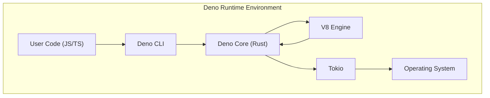
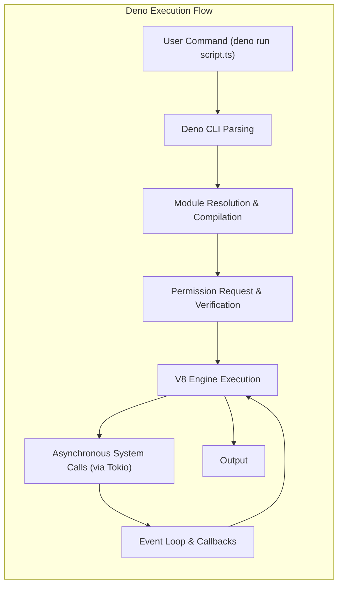

# Project Design Document: Deno Runtime Environment

**Version:** 1.1
**Date:** October 26, 2023
**Author:** AI Software Architect

## 1. Introduction

This document provides an enhanced and detailed architectural design of the Deno runtime environment. It elaborates on the key components, their interactions, and the overall system architecture. This document serves as a robust foundation for understanding the system's structure and will be used as a comprehensive input for subsequent threat modeling activities.

Deno is a secure, modern runtime for JavaScript and TypeScript. It is built using the V8 JavaScript engine, the Rust programming language, and the Tokio asynchronous runtime. Deno's design emphasizes security, developer productivity, and the inclusion of built-in tooling to streamline the development process.

## 2. Goals and Objectives

The core goals driving the Deno project are:

*   To establish a secure-by-default runtime environment for executing JavaScript and TypeScript code.
*   To offer a streamlined and efficient developer experience, minimizing configuration and setup overhead.
*   To integrate essential development tools directly into the runtime, such as a test runner, linter, and code formatter.
*   To provide seamless support for modern JavaScript and TypeScript language features.
*   To facilitate the creation and distribution of single-file executable applications.
*   To maintain a minimal set of dependencies and offer a self-contained runtime environment.

## 3. System Architecture

Deno's architecture is structured in a layered manner, promoting modularity and separation of concerns:

*   **User Code Layer:** This represents the JavaScript or TypeScript code authored by developers, which forms the core logic of Deno applications.
*   **Deno CLI Layer:** The command-line interface serves as the primary point of interaction for users, enabling actions such as running scripts, executing tests, and managing Deno projects.
*   **Deno Core (Rust) Layer:** This layer, implemented in Rust, constitutes the heart of the Deno runtime. It manages critical functionalities including permission control, module resolution and loading, networking operations, and interactions with the underlying operating system.
*   **V8 JavaScript Engine Layer:**  Google's high-performance V8 engine is responsible for the just-in-time compilation and execution of JavaScript and TypeScript code within the Deno environment.
*   **Tokio Asynchronous Runtime Layer:**  Tokio, a Rust library, provides the foundation for asynchronous, event-driven, and non-blocking I/O operations within Deno, enabling efficient handling of concurrent tasks.
*   **Operating System Layer:** The underlying operating system provides the necessary system calls and resources upon which the Deno runtime operates.

## 4. Key Components

This section provides a more detailed breakdown of the major components within the Deno runtime environment:

*   **Deno Executable:** This is the primary executable file that initiates the Deno runtime process. It encapsulates the Deno Core logic and essential runtime resources.
*   **Compiler (TypeScript):** Integrated within the Deno Core, this component is responsible for transpiling TypeScript code into JavaScript before it is executed by the V8 engine. It handles type checking and code transformation.
*   **Module Loader:** This crucial component manages the process of resolving and loading both local and remote modules, identified by URLs. It enforces security policies by verifying module integrity and permissions during the loading process.
*   **Permission System:** A central security mechanism that mandates explicit user authorization for accessing sensitive system resources. This includes file system access, network communication, environment variable access, and more. Permissions are granted via command-line flags.
*   **Standard Library (`std`):** A collection of officially maintained and reviewed modules offering common functionalities. This ensures consistency, security, and a high level of quality for frequently used utilities.
*   **Foreign Function Interface (FFI):** This feature allows Deno code to interact with native libraries written in languages like C or Rust. It enables access to system-level functionalities and integration with existing native codebases.
*   **WebAssembly (Wasm) Support:** Deno provides the capability to execute WebAssembly modules, allowing developers to leverage code written in languages like C, C++, or Rust within the Deno environment.
*   **Test Runner (`deno test`):** A built-in tool for discovering and executing tests written in JavaScript or TypeScript. It provides features for test organization, reporting, and asynchronous test execution.
*   **Linter (`deno lint`):** A static analysis tool that examines Deno code for potential errors, stylistic inconsistencies, and security vulnerabilities. It helps enforce code quality and best practices.
*   **Formatter (`deno fmt`):** An automatic code formatting tool that ensures consistent code style across a project. It automatically adjusts code formatting according to predefined rules.
*   **REPL (Read-Eval-Print Loop):** An interactive shell environment that allows developers to execute Deno code snippets and experiment with the runtime in real-time.
*   **Bundle Tool (`deno bundle`):** This tool packages a Deno application and its dependencies into a single JavaScript file, simplifying deployment and distribution for certain use cases.
*   **Install Tool (`deno install`):** Enables the installation of Deno scripts as executable commands on the user's system, making them easily accessible from the command line.
*   **Language Server Protocol (LSP) Server:** Provides language intelligence features to code editors, such as autocompletion, go-to-definition, and error highlighting, enhancing the developer experience.

## 5. Data Flow

The execution of a Deno application involves the following key stages of data flow:

*   **Initiation:** The user initiates the execution of a Deno application by running the `deno` command followed by the script file path or a specific Deno subcommand (e.g., `deno test`).
*   **Command Parsing:** The Deno CLI parses the command-line arguments provided by the user, determining the intended action and any associated flags or parameters.
*   **Module Resolution and Loading:** If the command involves executing a script, the module loader begins resolving and fetching module dependencies. This process involves checking local cache, and if necessary, fetching remote modules via HTTP(S). TypeScript files are compiled to JavaScript during this stage.
*   **Permission Request and Verification:** Before any operation that requires access to sensitive resources (e.g., file system access, network requests), the Deno Core checks if the necessary permissions have been granted by the user. If not, an error is raised, preventing unauthorized access.
*   **V8 Engine Execution:** Once modules are loaded and permissions are verified, the compiled JavaScript code is passed to the V8 engine for execution. The V8 engine interprets and executes the code.
*   **Asynchronous System Calls via Tokio:** When the executing code needs to interact with the operating system (e.g., reading a file, making a network request), these operations are handled asynchronously through the Tokio runtime. This prevents blocking the main thread and allows for efficient handling of I/O operations.
*   **Event Loop and Callbacks:** Tokio manages the asynchronous operations and notifies the V8 engine when these operations complete. This is typically done through callbacks or promises, allowing the JavaScript code to continue execution without waiting for the I/O operation to finish.
*   **Output and Termination:** The application produces output to the console or performs other actions as defined by the code. Upon completion of the script or if an error occurs, the Deno process terminates.

## 6. Security Considerations

Security is a paramount concern in Deno's design. The following features and considerations are central to Deno's security model:

*   **Secure by Default Execution Sandbox:** Deno programs operate within a security sandbox by default. This means they have no inherent access to the file system, network, environment variables, or other sensitive resources unless explicitly granted permission by the user via command-line flags.
*   **Granular Permission Model:** Deno employs a fine-grained permission system, allowing users to grant specific access to resources. For example, `--allow-read=/path/to/directory` grants read access only to the specified directory.
*   **Module Integrity Verification:** When fetching remote modules, Deno verifies their integrity using Subresource Integrity (SRI) hashes (if provided) and lockfiles (`deno.lock.json`). This helps prevent tampering and ensures that the expected code is being executed.
*   **Adherence to Web Standards:** Deno strives to adhere to web standards, reducing the likelihood of encountering browser-specific security vulnerabilities and promoting interoperability.
*   **Built-in Security Tooling:** The integrated linter (`deno lint`) helps identify potential security flaws and coding errors, while the formatter (`deno fmt`) promotes consistent code style, which can indirectly improve security by making code easier to review.
*   **V8 Engine Security:** The underlying V8 JavaScript engine incorporates its own security mechanisms, including sandboxing and mitigations against common JavaScript vulnerabilities.
*   **Memory Safety of Rust Core:** The Deno Core is implemented in Rust, a language known for its memory safety features. This significantly reduces the risk of memory-related vulnerabilities such as buffer overflows and use-after-free errors, which are common in languages like C and C++.
*   **Supply Chain Security through URL-based Dependencies:** Deno's reliance on URLs for module imports provides transparency regarding the source of dependencies. Combined with lockfiles, this enhances supply chain security by pinning specific versions of dependencies.
*   **Mitigation of Common Web Vulnerabilities:** Deno's design and built-in APIs aim to mitigate common web vulnerabilities such as cross-site scripting (XSS) and cross-site request forgery (CSRF), although developers still need to be mindful of these risks in their application code.

## 7. Deployment

Deno applications offer flexible deployment options:

*   **Direct Script Execution:** Deno scripts can be executed directly on any system with the Deno runtime installed using the `deno run` command.
*   **Single Executable Compilation:** The `deno compile` command allows developers to compile Deno applications into standalone, platform-specific executables. This bundles the application code and the Deno runtime into a single binary, simplifying distribution and execution without requiring a separate Deno installation.
*   **Containerization with Docker:** Deno applications can be easily containerized using Docker. Official Deno Docker images are available, providing a consistent and reproducible environment for deployment.
*   **Serverless Functions:** Deno is well-suited for serverless environments like AWS Lambda, Google Cloud Functions, and Azure Functions. Its fast startup time and small footprint make it an efficient choice for these platforms.
*   **Deno Deploy:** Deno Deploy is Deno's own globally distributed platform specifically designed for running JavaScript, TypeScript, and WebAssembly at the edge. It offers seamless deployment and automatic scaling.
*   **Integration with Existing Infrastructure:** Deno applications can be integrated into existing infrastructure using reverse proxies, load balancers, and other standard deployment patterns.

## 8. Future Considerations

The Deno project is continuously evolving, with several potential future developments under consideration:

*   **Stabilization and Enhancement of FFI:** Further development and stabilization of the Foreign Function Interface to provide a robust and reliable mechanism for interacting with native libraries.
*   **Improved WebAssembly System Interface (WASI) Support:** Enhancing support for the WebAssembly System Interface to enable more seamless interaction between WebAssembly modules and the operating system.
*   **Further Security Model Refinements:** Ongoing efforts to refine the security model, potentially including more granular permission controls and improved mechanisms for auditing and managing permissions.
*   **Ecosystem Growth and Maturity:** Encouraging the growth of the Deno ecosystem through the development of more third-party libraries, frameworks, and tools.
*   **Performance Optimizations:** Continuous efforts to optimize the performance of the Deno runtime, including improvements to the V8 integration and asynchronous I/O handling.
*   **Expansion of the Standard Library:** Adding more modules to the standard library to provide a wider range of built-in functionalities and reduce reliance on external dependencies for common tasks.
*   **Enhanced Tooling and Developer Experience:**  Further improvements to the built-in tooling, such as the test runner, linter, and formatter, to provide a more comprehensive and user-friendly development experience.

This enhanced document provides a more in-depth and comprehensive architectural design of the Deno runtime environment. It serves as a valuable and detailed resource for understanding the intricacies of the system and will be crucial for conducting thorough and effective threat modeling activities.