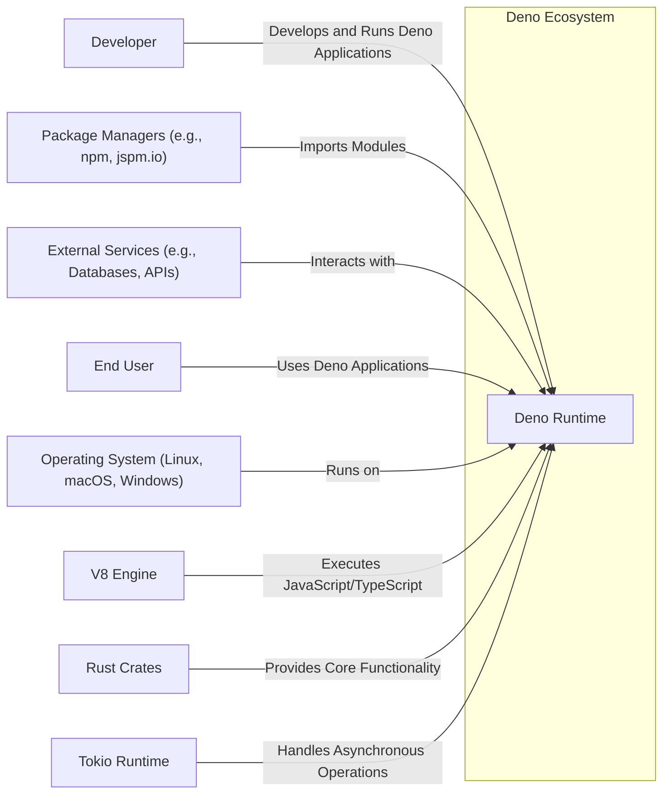
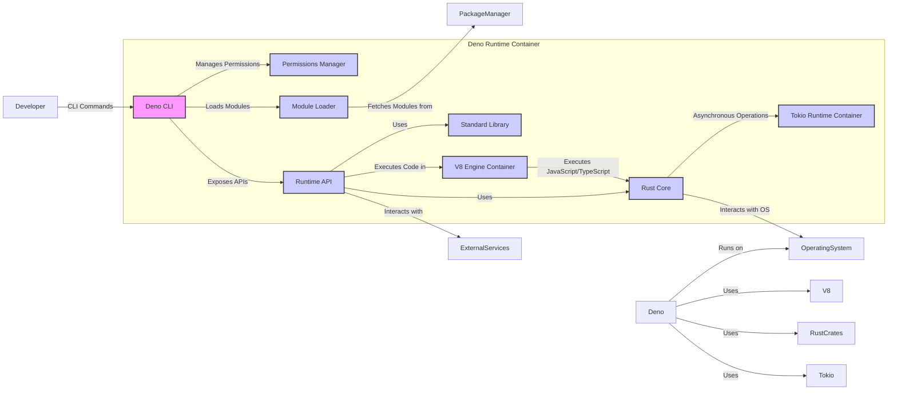
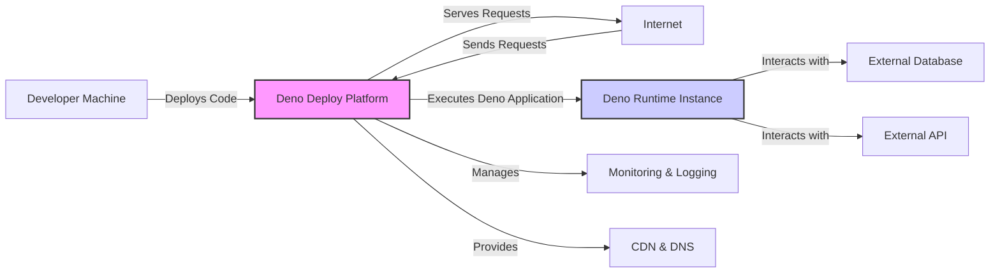
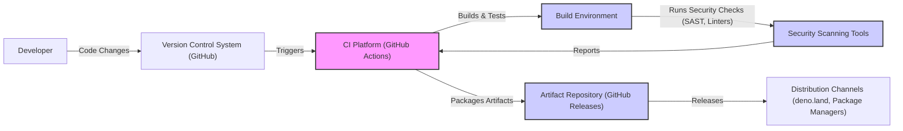

# BUSINESS POSTURE

- Business Priorities and Goals:
  - Provide a secure runtime environment for JavaScript and TypeScript.
  - Offer a modern alternative to Node.js, addressing perceived shortcomings in Node.js design and security.
  - Enable developers to build reliable and performant applications with improved developer experience.
  - Foster a strong and active community around Deno.
  - Promote the adoption of web standards and modern JavaScript/TypeScript features.

- Business Risks:
  - Security vulnerabilities in the runtime environment could damage user trust and hinder adoption.
  - Performance issues compared to established runtimes could limit use cases.
  - Lack of compatibility with existing Node.js ecosystems might slow down adoption.
  - Community fragmentation or lack of community support could hinder long-term growth.
  - Competition from other runtimes and technologies could limit market share.

# SECURITY POSTURE

- Existing Security Controls:
  - security control: Secure coding practices in Rust, a memory-safe language, are used for core runtime development.
  - security control: Permission-based security model, requiring explicit permissions for file system access, network access, and environment variables.
  - security control: Built-in security review process for code contributions (implied by open-source nature and project maturity).
  - security control: Usage of standard cryptographic libraries in Rust ecosystem.
  - security control: Regular updates and security patches (implied by active development).
  - security control: Input validation and sanitization within standard library functions (where applicable).
  - security control: Dependency management and supply chain security through curated and audited dependencies in Rust ecosystem.
  - accepted risk: Reliance on third-party libraries and modules, which may introduce vulnerabilities.
  - accepted risk: Potential for vulnerabilities in V8 JavaScript engine, which is a dependency.
  - accepted risk: Security misconfigurations by end-users when deploying and configuring Deno applications.

- Recommended Security Controls:
  - security control: Implement automated security scanning (SAST/DAST) in the CI/CD pipeline for Deno runtime development.
  - security control: Conduct regular penetration testing and security audits of the Deno runtime and standard library.
  - security control: Establish a formal vulnerability disclosure and incident response process.
  - security control: Provide security guidelines and best practices documentation for Deno application developers.
  - security control: Implement code signing for Deno releases to ensure integrity and authenticity.

- Security Requirements:
  - Authentication:
    - Requirement: Deno runtime itself does not require authentication as it is an execution environment.
    - Requirement: Applications built with Deno should implement appropriate authentication mechanisms based on their specific needs (e.g., OAuth 2.0, JWT, API keys).
    - Requirement: Deno standard library should provide secure and easy-to-use APIs for implementing authentication in applications.
  - Authorization:
    - Requirement: Deno's permission model should enforce fine-grained authorization for system resources (file system, network, environment variables, etc.).
    - Requirement: Applications built with Deno should implement application-level authorization to control access to specific functionalities and data based on user roles and permissions.
    - Requirement: Deno standard library should provide secure and flexible APIs for implementing authorization logic in applications.
  - Input Validation:
    - Requirement: Deno runtime and standard library APIs should perform robust input validation to prevent common vulnerabilities like injection attacks (e.g., SQL injection, command injection, cross-site scripting).
    - Requirement: Deno should encourage and facilitate developers to implement input validation in their applications.
    - Requirement: Provide clear documentation and examples on how to perform secure input validation in Deno applications.
  - Cryptography:
    - Requirement: Deno standard library should provide secure and well-vetted cryptographic APIs for common cryptographic operations (e.g., hashing, encryption, digital signatures).
    - Requirement: Ensure that cryptographic APIs are easy to use correctly and discourage insecure cryptographic practices.
    - Requirement: Keep cryptographic libraries up-to-date with the latest security standards and best practices.

# DESIGN

## C4 CONTEXT

- Context Diagram Elements:
  - Element:
    - Name: Deno Runtime
    - Type: Software System
    - Description: A secure runtime for JavaScript and TypeScript, built with Rust and V8. It executes Deno applications and provides a secure and modern environment for developers.
    - Responsibilities:
      - Execute JavaScript and TypeScript code.
      - Manage permissions for system resources.
      - Provide standard library APIs.
      - Handle module loading and dependency management.
    - Security controls:
      - Permission-based security model.
      - Secure coding practices in Rust.
      - Input validation in standard library.
      - Cryptographic APIs in standard library.
  - Element:
    - Name: Developer
    - Type: Person
    - Description: Software developers who use Deno to build and run applications.
    - Responsibilities:
      - Write Deno application code.
      - Configure Deno runtime environment.
      - Deploy and maintain Deno applications.
    - Security controls:
      - Secure coding practices in application development.
      - Proper configuration of Deno permissions.
      - Secure deployment and infrastructure management.
  - Element:
    - Name: Package Managers (e.g., npm, jspm.io)
    - Type: External System
    - Description: External package registries and managers from which Deno applications can import modules. While Deno encourages using URLs for modules, it can interact with package managers.
    - Responsibilities:
      - Host and distribute JavaScript and TypeScript modules.
      - Manage module versions and dependencies.
    - Security controls:
      - Package managers' own security measures to prevent malicious packages.
      - Deno's dependency resolution and integrity checks (e.g., lockfiles, subresource integrity).
  - Element:
    - Name: External Services (e.g., Databases, APIs)
    - Type: External System
    - Description: External services and systems that Deno applications interact with, such as databases, REST APIs, message queues, and other backend services.
    - Responsibilities:
      - Provide data storage, processing, and external functionalities.
      - Authenticate and authorize access to their resources.
    - Security controls:
      - Service-specific security controls (e.g., database authentication, API authorization).
      - Network security controls (e.g., TLS encryption, firewalls).
  - Element:
    - Name: User
    - Type: Person
    - Description: End-users who interact with applications built and run on Deno.
    - Responsibilities:
      - Use Deno applications for their intended purpose.
    - Security controls:
      - User authentication and authorization within Deno applications.
      - Input validation and output encoding in Deno applications to protect against user-driven attacks.
  - Element:
    - Name: Operating System (Linux, macOS, Windows)
    - Type: Infrastructure
    - Description: The underlying operating system on which the Deno runtime is executed.
    - Responsibilities:
      - Provide system resources and APIs for Deno runtime.
      - Enforce operating system-level security controls.
    - Security controls:
      - Operating system security features (e.g., user permissions, process isolation, firewalls).
      - Regular operating system updates and patching.
  - Element:
    - Name: V8 Engine
    - Type: Software System
    - Description: Google's open-source high-performance JavaScript and WebAssembly engine, used by Deno to execute JavaScript and TypeScript code.
    - Responsibilities:
      - Compile and execute JavaScript and TypeScript code.
      - Manage memory and resources for JavaScript execution.
    - Security controls:
      - V8's own security mechanisms and vulnerability patching process.
  - Element:
    - Name: Rust Crates
    - Type: Software System
    - Description: Rust libraries and modules that provide core functionalities for the Deno runtime, such as networking, file system access, and cryptography.
    - Responsibilities:
      - Implement core runtime features in a memory-safe language.
      - Provide secure and efficient implementations of system functionalities.
    - Security controls:
      - Rust's memory safety features.
      - Security audits and reviews of Rust crates.
  - Element:
    - Name: Tokio Runtime
    - Type: Software System
    - Description: An asynchronous runtime for Rust, used by Deno for handling asynchronous operations and I/O.
    - Responsibilities:
      - Manage asynchronous tasks and event loops.
      - Provide efficient and scalable I/O operations.
    - Security controls:
      - Tokio's own security mechanisms and stability.

## C4 CONTAINER

- Container Diagram Elements:
  - Element:
    - Name: Deno CLI
    - Type: Container - Application
    - Description: The command-line interface for interacting with the Deno runtime. It handles user commands, manages permissions, loads modules, and executes code.
    - Responsibilities:
      - Parse command-line arguments.
      - Initiate module loading and execution.
      - Manage and enforce permissions.
      - Provide developer tools (e.g., formatter, linter, test runner).
    - Security controls:
      - Input validation of CLI arguments.
      - Secure handling of user credentials (if any, though Deno itself aims to avoid needing credentials).
      - Principle of least privilege in CLI operations.
  - Element:
    - Name: Permissions Manager
    - Type: Container - Component
    - Description: A component responsible for managing and enforcing the permission-based security model in Deno. It checks permissions before allowing access to system resources.
    - Responsibilities:
      - Store and manage granted permissions.
      - Intercept system calls and check for required permissions.
      - Prompt user for permissions when necessary.
      - Enforce fine-grained permissions for file system, network, environment variables, etc.
    - Security controls:
      - Secure storage and management of permission state.
      - Robust permission checking logic to prevent bypasses.
      - Clear and informative permission prompts for users.
  - Element:
    - Name: Module Loader
    - Type: Container - Component
    - Description: A component that handles loading modules from URLs or local file paths. It fetches modules, resolves dependencies, and caches modules for efficiency.
    - Responsibilities:
      - Fetch modules from remote URLs or local file system.
      - Resolve module dependencies.
      - Cache downloaded modules.
      - Verify module integrity (e.g., using subresource integrity).
    - Security controls:
      - Secure fetching of modules over HTTPS.
      - Integrity checks for downloaded modules (e.g., using lockfiles, subresource integrity).
      - Protection against malicious module injection or tampering.
  - Element:
    - Name: Runtime API
    - Type: Container - Component
    - Description: The core runtime API exposed to JavaScript and TypeScript code running in Deno. It provides access to standard library functionalities and system resources, subject to permission checks.
    - Responsibilities:
      - Expose standard library APIs to JavaScript/TypeScript code.
      - Handle system calls and interact with the operating system.
      - Manage memory and resources for running code.
      - Enforce permission checks before granting access to resources.
    - Security controls:
      - Input validation and sanitization in API implementations.
      - Secure handling of system calls and resource access.
      - Principle of least privilege in API design.
  - Element:
    - Name: Standard Library
    - Type: Container - Library
    - Description: A curated collection of modules providing common functionalities for Deno applications, such as file system access, networking, HTTP, and utilities.
    - Responsibilities:
      - Provide well-tested and secure implementations of common functionalities.
      - Offer consistent and easy-to-use APIs.
      - Reduce the need for external dependencies.
    - Security controls:
      - Security reviews and audits of standard library modules.
      - Input validation and sanitization in standard library functions.
      - Secure coding practices in standard library development.
  - Element:
    - Name: V8 Engine Container
    - Type: Container - Runtime Environment
    - Description: A containerized environment for the V8 JavaScript engine within Deno. It isolates the JavaScript execution environment and provides necessary interfaces to the Rust core.
    - Responsibilities:
      - Host and manage the V8 JavaScript engine.
      - Provide an interface for executing JavaScript/TypeScript code.
      - Isolate JavaScript execution from the rest of the runtime.
    - Security controls:
      - V8's own security sandbox and isolation mechanisms.
      - Secure communication channels between V8 and Rust core.
  - Element:
    - Name: Rust Core
    - Type: Container - Component
    - Description: The core of the Deno runtime, implemented in Rust. It provides low-level functionalities, interacts with the operating system, and manages other components.
    - Responsibilities:
      - Implement core runtime logic in Rust.
      - Manage permissions and security policies.
      - Interact with the operating system for system calls.
      - Coordinate other runtime components.
    - Security controls:
      - Memory safety provided by Rust language.
      - Secure coding practices in Rust core development.
      - Principle of least privilege in system interactions.
  - Element:
    - Name: Tokio Runtime Container
    - Type: Container - Runtime Environment
    - Description: A containerized environment for the Tokio asynchronous runtime within Deno. It manages asynchronous operations and I/O for the Rust core.
    - Responsibilities:
      - Host and manage the Tokio asynchronous runtime.
      - Provide an environment for asynchronous task execution.
      - Handle I/O operations efficiently and securely.
    - Security controls:
      - Tokio's own security mechanisms and stability.
      - Secure handling of asynchronous operations and I/O.

## DEPLOYMENT

- Deployment Options:
  - Standalone Executable: Deno applications can be compiled into standalone executables for various platforms, simplifying deployment.
  - Serverless Functions: Deno is well-suited for serverless environments like AWS Lambda, Google Cloud Functions, and Deno Deploy.
  - Containerized Deployment (Docker): Deno applications can be containerized using Docker and deployed to container orchestration platforms like Kubernetes.
  - Virtual Machines/Cloud Instances: Deno applications can be deployed on virtual machines or cloud instances running operating systems like Linux, macOS, or Windows.

- Detailed Deployment (Serverless Functions - Deno Deploy):

- Deployment Diagram Elements (Serverless Functions - Deno Deploy):
  - Element:
    - Name: Deno Deploy Platform
    - Type: Platform as a Service (PaaS)
    - Description: Deno's own serverless platform for deploying and running Deno applications globally. It provides automatic scaling, CDN, and DNS management.
    - Responsibilities:
      - Host and manage Deno runtime environments.
      - Deploy and scale Deno applications.
      - Provide CDN and DNS services.
      - Offer monitoring and logging capabilities.
    - Security controls:
      - Platform-level security controls (e.g., infrastructure security, access control).
      - Isolation of tenant environments.
      - Secure deployment pipelines.
      - DDoS protection.
  - Element:
    - Name: Deno Runtime Instance
    - Type: Software Instance
    - Description: An instance of the Deno runtime running a deployed Deno application within the Deno Deploy platform.
    - Responsibilities:
      - Execute the deployed Deno application code.
      - Handle incoming requests and generate responses.
      - Interact with external services as needed.
    - Security controls:
      - Deno's permission-based security model.
      - Resource limits and isolation within the platform.
      - Secure communication with external services (e.g., TLS).
  - Element:
    - Name: Developer Machine
    - Type: Development Environment
    - Description: The developer's local machine used to write, test, and deploy Deno applications to Deno Deploy.
    - Responsibilities:
      - Develop and test Deno application code.
      - Package and deploy applications to Deno Deploy.
    - Security controls:
      - Developer machine security best practices (e.g., OS security, endpoint protection).
      - Secure deployment processes (e.g., secure credentials management).
  - Element:
    - Name: Internet
    - Type: Network
    - Description: The public internet through which users access Deno applications deployed on Deno Deploy.
    - Responsibilities:
      - Route user requests to Deno Deploy.
    - Security controls:
      - General internet security considerations.
      - DDoS mitigation at the platform level.
  - Element:
    - Name: External Database
    - Type: External Service
    - Description: External database services (e.g., PostgreSQL, MongoDB) that Deno applications might interact with for data storage.
    - Responsibilities:
      - Store and manage application data.
      - Provide data access to Deno applications.
    - Security controls:
      - Database-specific security controls (e.g., authentication, authorization, encryption at rest and in transit).
      - Network security controls to restrict database access.
  - Element:
    - Name: External API
    - Type: External Service
    - Description: External APIs and services that Deno applications might integrate with to access external functionalities or data.
    - Responsibilities:
      - Provide external functionalities or data.
      - Authenticate and authorize API access.
    - Security controls:
      - API-specific security controls (e.g., API keys, OAuth 2.0).
      - Secure communication with APIs (e.g., HTTPS).
  - Element:
    - Name: Monitoring & Logging
    - Type: Platform Service
    - Description: Monitoring and logging services provided by Deno Deploy to track application performance, errors, and security events.
    - Responsibilities:
      - Collect and store application logs and metrics.
      - Provide dashboards and alerts for monitoring.
      - Enable security event logging and analysis.
    - Security controls:
      - Secure storage and access to logs and metrics.
      - Access control for monitoring dashboards.
  - Element:
    - Name: CDN & DNS
    - Type: Platform Service
    - Description: Content Delivery Network (CDN) and Domain Name System (DNS) services integrated into Deno Deploy for improved performance and availability.
    - Responsibilities:
      - Distribute application content globally for faster access.
      - Manage DNS records for application domains.
      - Provide DDoS protection at the network edge.
    - Security controls:
      - CDN security features (e.g., DDoS protection, WAF).
      - DNS security best practices (e.g., DNSSEC).

## BUILD

- Build Process Elements:
  - Element:
    - Name: Developer
    - Type: Person
    - Description: Software developers who write and contribute code to the Deno project.
    - Responsibilities:
      - Write code and commit changes to the version control system.
      - Review code changes from other developers.
    - Security controls:
      - Secure coding practices.
      - Code review process.
      - Access control to the version control system.
  - Element:
    - Name: Version Control System (GitHub)
    - Type: Software System
    - Description: GitHub repository used for managing Deno source code, tracking changes, and collaboration.
    - Responsibilities:
      - Store and manage source code.
      - Track code changes and history.
      - Facilitate code collaboration and reviews.
    - Security controls:
      - Access control and authentication for repository access.
      - Branch protection and code review requirements.
      - Audit logging of repository activities.
  - Element:
    - Name: CI Platform (GitHub Actions)
    - Type: Automation System
    - Description: GitHub Actions is used for continuous integration and continuous delivery (CI/CD) of the Deno project. It automates the build, test, and release processes.
    - Responsibilities:
      - Automate build, test, and release workflows.
      - Run security scanning tools.
      - Package build artifacts.
      - Publish releases to artifact repositories.
    - Security controls:
      - Secure configuration of CI/CD pipelines.
      - Access control to CI/CD workflows and secrets.
      - Audit logging of CI/CD activities.
  - Element:
    - Name: Build Environment
    - Type: Infrastructure
    - Description: The environment where the Deno runtime is built and tested during the CI/CD process. It includes necessary tools and dependencies for building Deno from source.
    - Responsibilities:
      - Provide a consistent and reproducible build environment.
      - Execute build scripts and commands.
      - Run automated tests.
    - Security controls:
      - Securely configured build environment.
      - Isolation of build processes.
      - Regular patching and updates of build environment.
  - Element:
    - Name: Security Scanning Tools
    - Type: Security Tool
    - Description: Static Application Security Testing (SAST) tools and linters used to automatically scan the Deno codebase for potential security vulnerabilities and code quality issues during the build process.
    - Responsibilities:
      - Analyze source code for security vulnerabilities and code defects.
      - Generate reports of identified issues.
      - Integrate with CI/CD pipeline to fail builds on critical findings.
    - Security controls:
      - Properly configured and up-to-date security scanning tools.
      - Regular review and updates of scanning rules and policies.
  - Element:
    - Name: Artifact Repository (GitHub Releases)
    - Type: Storage System
    - Description: GitHub Releases is used as an artifact repository to store and manage built Deno runtime binaries and release artifacts.
    - Responsibilities:
      - Store and manage build artifacts (e.g., binaries, installers).
      - Provide access to release artifacts for distribution.
      - Version control of release artifacts.
    - Security controls:
      - Access control to artifact repository.
      - Integrity checks for stored artifacts (e.g., checksums, signatures).
  - Element:
    - Name: Distribution Channels (deno.land, Package Managers)
    - Type: Distribution System
    - Description: Various channels through which Deno runtime binaries and related resources are distributed to end-users and developers (e.g., official website deno.land, package managers).
    - Responsibilities:
      - Distribute Deno runtime binaries and resources.
      - Provide installation instructions and documentation.
      - Ensure availability and integrity of distributed artifacts.
    - Security controls:
      - Secure distribution channels (e.g., HTTPS).
      - Code signing for distributed binaries.
      - Integrity checks for downloaded artifacts.

# RISK ASSESSMENT

- Critical Business Processes:
  - Secure execution of JavaScript and TypeScript code is the core critical business process. Any vulnerability that allows code execution outside of the permission sandbox or bypasses security controls is a critical risk.
  - Availability and integrity of the Deno runtime itself. If the runtime is unavailable or compromised, applications built on Deno will be affected.
  - Secure module loading and dependency management. Compromised modules or supply chain attacks can introduce vulnerabilities into Deno applications.

- Data Sensitivity:
  - Deno runtime itself does not directly handle sensitive user data. However, applications built with Deno can handle various types of data, including sensitive user data, depending on their functionality.
  - Sensitivity of data handled by Deno applications depends entirely on the application's purpose and data processing logic. It can range from publicly available data to highly confidential personal or financial information.
  - The security of Deno runtime is crucial for protecting the confidentiality, integrity, and availability of data processed by applications built on Deno.

# QUESTIONS & ASSUMPTIONS

- Questions:
  - What are the specific SAST/DAST tools currently used in the Deno CI/CD pipeline?
  - Is there a formal vulnerability disclosure program in place for Deno?
  - Are there regular penetration tests or security audits conducted for the Deno runtime?
  - What are the specific security guidelines and best practices recommended for Deno application developers?
  - What is the process for handling security incidents and releasing security patches for Deno?

- Assumptions:
  - BUSINESS POSTURE: Assumed that security and developer experience are top priorities for Deno project.
  - SECURITY POSTURE: Assumed that standard secure development practices are followed, but there is room for improvement in formalizing and documenting certain security controls.
  - DESIGN: Assumed a typical serverless deployment scenario for detailed deployment diagram, but acknowledged other deployment options. Assumed GitHub Actions and GitHub Releases are used for CI/CD and artifact management, based on common open-source project practices.