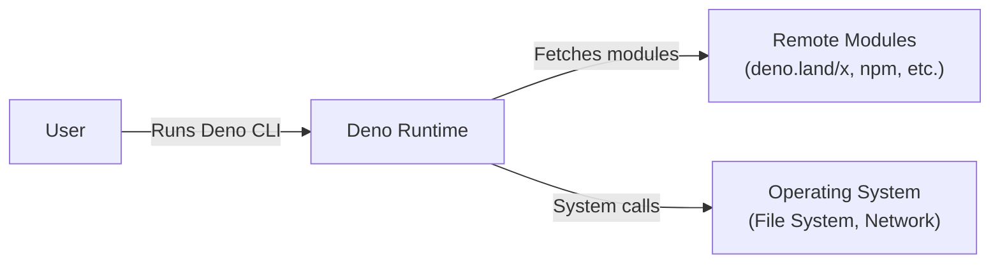
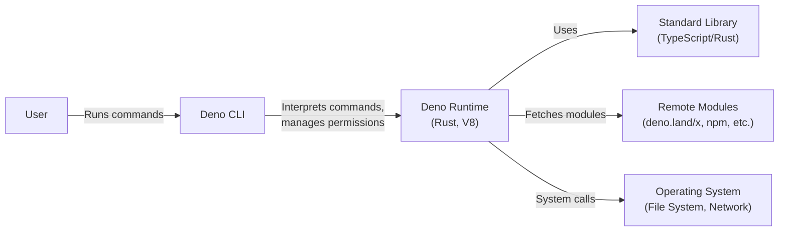
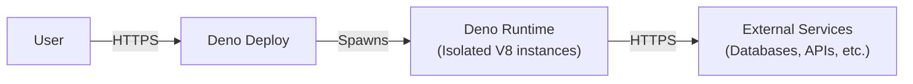

# BUSINESS POSTURE

Deno's primary business goal is to provide a modern, secure, and productive runtime environment for JavaScript and TypeScript, challenging the dominance of Node.js. It aims to simplify development workflows, improve security, and enhance performance.

Business priorities:

- Developer adoption: Attracting developers from the existing Node.js ecosystem and new developers.
- Ecosystem growth: Fostering a vibrant community and a rich set of third-party modules.
- Enterprise readiness: Becoming a viable option for enterprise-level applications.
- Long-term sustainability: Ensuring the project's continued development and maintenance.

Business risks:

- Insufficient adoption: Failure to attract a critical mass of developers could lead to the project's stagnation.
- Security vulnerabilities: Undiscovered vulnerabilities could damage Deno's reputation and hinder adoption.
- Competition: Node.js and other emerging runtimes could outpace Deno in terms of features, performance, or community support.
- Fragmentation: Incompatible forks or competing standards could dilute the Deno ecosystem.
- Lack of tooling: Insufficient tooling, libraries, and frameworks could make development with Deno less efficient than with Node.js.

# SECURITY POSTURE

Existing security controls:

- security control: Permission system: Deno implements a fine-grained permission system (–allow-read, –allow-write, –allow-net, –allow-env, –allow-run, –allow-ffi, –allow-hrtime) that restricts access to system resources by default. Described in the Deno manual and implemented in the core runtime.
- security control: Secure by default: Unlike Node.js, Deno requires explicit permissions for network and file system access, reducing the attack surface. Implemented in the core runtime.
- security control: TypeScript support: Built-in TypeScript support helps catch errors at compile time, reducing the likelihood of runtime errors and potential vulnerabilities. Implemented in the core runtime.
- security control: Module integrity: Deno uses checksums to verify the integrity of fetched modules, preventing the execution of tampered code. Implemented in the core runtime and module fetching mechanism.
- security control: Remote code loading restrictions: Deno's permission system also applies to remote code, preventing malicious modules from gaining unauthorized access. Implemented in the core runtime.
- security control: Regular security audits: The Deno project undergoes regular security audits to identify and address potential vulnerabilities. Documented on the Deno website and in security reports.
- security control: Sandboxed execution: Deno uses V8 isolates to sandbox the execution of JavaScript code, limiting the impact of potential vulnerabilities. Implemented in the core runtime using V8.

Accepted risks:

- accepted risk: Third-party module vulnerabilities: While Deno verifies module integrity, it cannot guarantee the security of third-party code. Users are responsible for vetting the modules they use.
- accepted risk: Emerging technology: Deno is a relatively new technology, and undiscovered vulnerabilities may exist.
- accepted risk: Reliance on V8: Deno's security is partly dependent on the security of the V8 JavaScript engine.

Recommended security controls:

- security control: Content Security Policy (CSP): Implement support for CSP to mitigate XSS attacks.
- security control: Regular dependency updates: Automate the process of updating dependencies to address known vulnerabilities.
- security control: Enhanced sandboxing: Explore additional sandboxing techniques to further isolate code execution.
- security control: Fuzzing: Implement regular fuzzing to identify potential vulnerabilities.

Security requirements:

- Authentication: Not directly applicable to the Deno runtime itself, but Deno applications should implement secure authentication mechanisms when required.
- Authorization: Deno's permission system provides a built-in authorization mechanism. Applications should leverage this system to control access to resources.
- Input validation: Deno applications should validate all user inputs to prevent injection attacks.
- Cryptography: Deno provides a built-in Web Crypto API for cryptographic operations. Applications should use this API for secure key management and data encryption.

# DESIGN

## C4 CONTEXT



Element descriptions:

- Name: User
  - Type: Person
  - Description: A developer or user interacting with Deno.
  - Responsibilities: Writing and running Deno code, managing dependencies, configuring permissions.
  - Security controls: None (external to Deno).

- Name: Deno Runtime
  - Type: Software System
  - Description: The core Deno runtime environment.
  - Responsibilities: Executing JavaScript/TypeScript code, managing permissions, fetching modules, interacting with the operating system.
  - Security controls: Permission system, secure by default, TypeScript support, module integrity, remote code loading restrictions, sandboxed execution.

- Name: Remote Modules
  - Type: Software System
  - Description: External modules hosted on remote servers (e.g., deno.land/x, npm).
  - Responsibilities: Providing reusable code libraries.
  - Security controls: Module integrity checks (checksums) performed by Deno.

- Name: Operating System
  - Type: Software System
  - Description: The underlying operating system (Linux, macOS, Windows).
  - Responsibilities: Providing access to file system, network, and other system resources.
  - Security controls: OS-level security controls (e.g., file permissions, network firewalls).

## C4 CONTAINER



Element descriptions:

- Name: User
  - Type: Person
  - Description: A developer or user interacting with Deno.
  - Responsibilities: Writing and running Deno code, managing dependencies, configuring permissions.
  - Security controls: None (external to Deno).

- Name: Deno CLI
  - Type: Container: Command-line interface
  - Description: The command-line interface for interacting with Deno.
  - Responsibilities: Parsing command-line arguments, managing permissions, starting the runtime.
  - Security controls: Enforces permission flags.

- Name: Deno Runtime
  - Type: Container: Runtime environment
  - Description: The core runtime, built with Rust and V8.
  - Responsibilities: Executing JavaScript/TypeScript code, managing the event loop, handling system calls.
  - Security controls: Permission system, secure by default, sandboxed execution (V8 isolates).

- Name: Standard Library
  - Type: Container: Code library
  - Description: The standard library, providing built-in functionality.
  - Responsibilities: Providing core modules for common tasks (e.g., file I/O, networking).
  - Security controls: Code reviews, regular security audits.

- Name: Remote Modules
  - Type: Container: Code library
  - Description: External modules hosted on remote servers.
  - Responsibilities: Providing reusable code libraries.
  - Security controls: Module integrity checks (checksums) performed by Deno.

- Name: Operating System
  - Type: Software System
  - Description: The underlying operating system.
  - Responsibilities: Providing access to file system, network, and other system resources.
  - Security controls: OS-level security controls.

## DEPLOYMENT

Deno applications can be deployed in various ways:

1.  Standalone executable: Compiled into a single self-contained executable.
2.  On a server: Run directly on a server (physical or virtual) using the Deno CLI.
3.  Serverless functions: Deployed to platforms like Deno Deploy, AWS Lambda, or Cloudflare Workers.
4.  Containers: Packaged and deployed using Docker or other containerization technologies.

Chosen deployment solution (Serverless - Deno Deploy):



Element descriptions:

- Name: User
  - Type: Person
  - Description: A user accessing the deployed Deno application.
  - Responsibilities: Interacting with the application through its exposed interface.
  - Security controls: None (external to the deployment).

- Name: Deno Deploy
  - Type: Platform
  - Description: Deno's serverless platform.
  - Responsibilities: Managing the deployment, scaling, and execution of Deno applications.
  - Security controls: Automatic HTTPS, DDoS protection, isolation between deployments, regular security updates.

- Name: Deno Runtime
  - Type: Container: Runtime environment
  - Description: Instances of the Deno runtime, running in isolated V8 isolates.
  - Responsibilities: Executing the application code.
  - Security controls: Deno's built-in security features (permission system, sandboxing), isolation provided by Deno Deploy.

- Name: External Services
  - Type: Software System
  - Description: Any external services the application interacts with (databases, APIs, etc.).
  - Responsibilities: Providing specific services to the application.
  - Security controls: Dependent on the specific service (e.g., authentication, authorization, encryption).

## BUILD

Deno's build process is relatively simple compared to many other languages. It doesn't require a separate compilation step for TypeScript, as it's handled internally. However, Deno does offer a `deno compile` command to create self-contained executables.

```mermaid
graph LR
    Developer["Developer"] --> GitRepo["Git Repository"]
    GitRepo -- "Push" --> CI["CI/CD Pipeline\n(e.g., GitHub Actions)"]
    CI -- "deno test" --> TestResults["Test Results"]
    CI -- "deno lint" --> LintResults["Lint Results"]
    CI -- "deno fmt" --> FormatCheck["Format Check"]
    CI -- "deno compile" --> Executable["Executable"]
    Executable --> Deployment["Deployment Platform\n(e.g., Deno Deploy)"]

    subgraph CI
        SAST["SAST Scanner\n(e.g., Snyk)"]
        CI -.-> SAST
    end
```

Build process description:

1.  Developer writes code and pushes it to a Git repository.
2.  A CI/CD pipeline (e.g., GitHub Actions) is triggered.
3.  The pipeline runs tests (`deno test`).
4.  The pipeline runs linting (`deno lint`).
5.  The pipeline checks code formatting (`deno fmt`).
6.  Optionally, a SAST scanner (e.g., Snyk) is run to identify potential vulnerabilities.
7.  If all checks pass, the pipeline compiles the code into a self-contained executable (`deno compile`).
8.  The executable is deployed to the target platform (e.g., Deno Deploy).

Security controls in the build process:

- security control: Testing: `deno test` helps ensure code quality and identify potential bugs.
- security control: Linting: `deno lint` enforces code style and helps prevent common errors.
- security control: Formatting: `deno fmt` ensures consistent code formatting.
- security control: SAST: Static Application Security Testing (SAST) tools can identify potential vulnerabilities in the code.
- security control: Dependency analysis: Tools like `deno info` can be used to analyze dependencies and identify potential vulnerabilities in third-party modules.
- security control: CI/CD pipeline: Automating the build process ensures consistency and reduces the risk of human error.

# RISK ASSESSMENT

Critical business processes to protect:

- Code execution: Ensuring the secure and reliable execution of user-provided code.
- Module fetching: Preventing the execution of malicious or tampered modules.
- Access to system resources: Controlling access to file system, network, and other sensitive resources.
- Reputation: Maintaining the trust and confidence of developers and users.

Data to protect and their sensitivity:

- Source code: (Sensitivity: Medium to High) - The source code of Deno itself and Deno applications may contain sensitive logic or intellectual property.
- User data: (Sensitivity: Variable, potentially High) - Deno applications may process user data, which could range from low sensitivity (e.g., public profiles) to high sensitivity (e.g., personal information, financial data).
- Credentials: (Sensitivity: High) - Deno applications may handle credentials for accessing external services. These credentials must be protected.
- Configuration data: (Sensitivity: Medium to High) - Configuration data may contain sensitive information, such as API keys or database connection strings.

# QUESTIONS & ASSUMPTIONS

Questions:

- What is the specific threat model for Deno Deploy?
- What are the plans for supporting WebAssembly in Deno?
- What are the plans for further enhancing the permission system?
- What specific external services are commonly used with Deno applications, and what are their security implications?

Assumptions:

- BUSINESS POSTURE: Deno's primary target audience is developers familiar with JavaScript/TypeScript.
- BUSINESS POSTURE: Deno aims to be a general-purpose runtime, not limited to specific use cases.
- SECURITY POSTURE: Deno's security model is based on the principle of least privilege.
- SECURITY POSTURE: Users are responsible for securing their own applications built with Deno.
- DESIGN: Deno's core functionality is implemented in Rust and V8.
- DESIGN: Deno's standard library is written in TypeScript and Rust.
- DESIGN: Deno applications can be deployed to various environments, including serverless platforms.