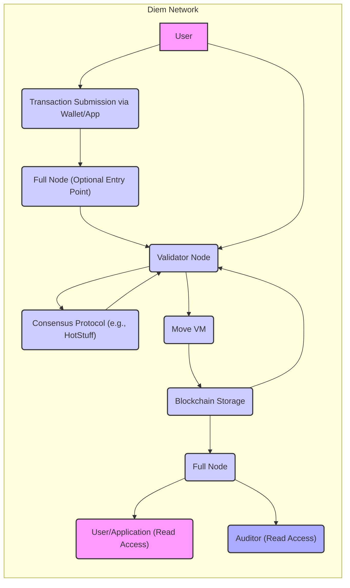
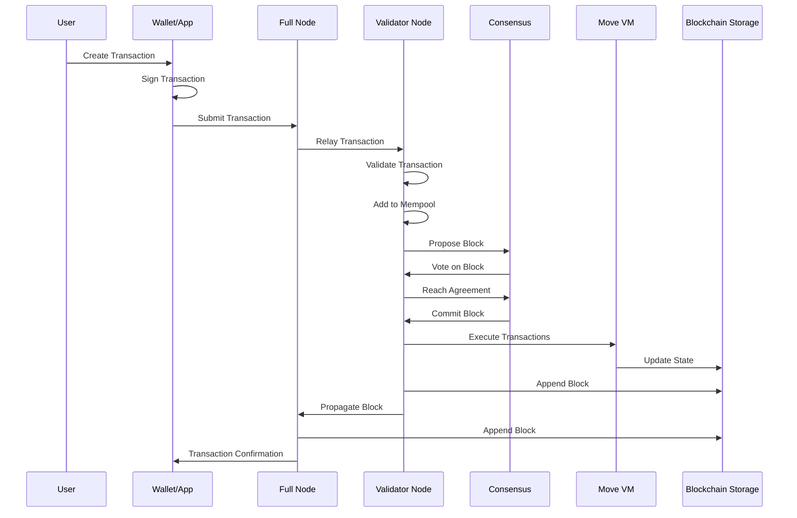

# Project Design Document: Diem Blockchain

**Version:** 1.1
**Date:** October 26, 2023
**Author:** AI Software Architect

## 1. Introduction

This document provides an enhanced architectural design of the Diem blockchain project, based on the information available in the provided GitHub repository (https://github.com/diem/diem). This iteration aims to provide a more granular and comprehensive overview of the system's components, their interactions, and the overall architecture. It will serve as a robust foundation for subsequent threat modeling activities.

## 2. Goals and Objectives

The primary goals of the Diem blockchain project, as understood from the repository, are to:

*   Enable secure and efficient peer-to-peer transactions for a global user base.
*   Provide a robust and developer-friendly platform for creating and deploying secure smart contracts.
*   Offer a highly scalable and reliable infrastructure for managing and transferring digital assets.
*   Facilitate near-instantaneous global payments with significantly reduced transaction fees compared to traditional systems.
*   Operate as a permissioned blockchain network, ensuring controlled participation and regulatory compliance.

## 3. High-Level Architecture

The Diem blockchain operates as a distributed, permissioned ledger maintained by a set of trusted validators. Key actors and components include:

*   **Users:** End-users who initiate and receive transactions on the network through wallets or applications.
*   **Validators:** Designated and trusted nodes responsible for the core operations of the blockchain, including proposing, voting on, and committing new blocks.
*   **Full Nodes:** Nodes that maintain a complete copy of the blockchain ledger and provide read-only access to users, applications, and potentially auditors.
*   **Move Virtual Machine (Move VM):** The secure runtime environment for executing smart contracts written in the Move programming language.
*   **Blockchain Storage:** The persistent and immutable storage layer for all blockchain data, including blocks, transactions, and account states.
*   **Networking Layer:** The communication infrastructure enabling secure and reliable message exchange between nodes in the network.
*   **Consensus Mechanism:** The fault-tolerant protocol used by validators to reach agreement on the order of transactions and the state of the blockchain.

## 4. Component Breakdown

This section provides a more detailed breakdown of the key components within the Diem blockchain:

*   **User Interface/Wallet & Client Applications:**
    *   Provides the primary interface for users to interact with the Diem network.
    *   Functionalities include account creation and management (key generation, storage).
    *   Enables the construction and signing of transactions.
    *   Facilitates the submission of transactions to the network (typically via full nodes).
    *   Allows users to query account balances and transaction history.

*   **Transaction Submitter (within Wallet/Client):**
    *   Responsible for packaging transaction details into a structured format.
    *   Includes information such as sender address, recipient address, transfer amount, gas price, and gas limit.
    *   Cryptographically signs the transaction using the sender's private key to ensure authenticity and non-repudiation.

*   **Validator Node:**
    *   The core operational unit of the Diem blockchain, operated by authorized entities.
    *   **Membership Service:** Manages the set of active validators.
    *   **Transaction Receiver:** Accepts and validates incoming transactions from users and full nodes.
    *   **Mempool:** Holds a pool of pending, validated transactions awaiting inclusion in a block.
    *   **Consensus Engine:** Implements the chosen consensus protocol (e.g., HotStuff) to agree on block proposals.
    *   **Execution Engine (Move VM):** Executes transactions within proposed blocks.
    *   **Storage Engine:** Persists the blockchain data, including blocks and the current state.
    *   **Networking Module:** Handles communication with other validators and full nodes.

*   **Consensus Protocol (e.g., HotStuff):**
    *   A Byzantine Fault Tolerant (BFT) algorithm ensuring agreement among validators despite potential failures or malicious behavior.
    *   Involves a leader-based approach with rounds of proposing, pre-voting, pre-committing, and committing blocks.
    *   Guarantees safety (no two conflicting blocks are committed) and liveness (progress is eventually made).

*   **Move Virtual Machine (Move VM):**
    *   A bytecode interpreter designed specifically for the Move programming language.
    *   Provides a secure and deterministic execution environment for smart contracts.
    *   Emphasizes resource safety and prevents common smart contract vulnerabilities like reentrancy.
    *   Manages access control and ensures that contracts can only access the resources they are authorized to.

*   **Blockchain Storage:**
    *   A persistent and immutable ledger storing the entire history of the Diem blockchain.
    *   Organized as a chain of blocks, each containing a set of validated and executed transactions.
    *   Utilizes cryptographic hashing to link blocks together, ensuring data integrity.
    *   Stores the current state of accounts and smart contract data.

*   **Networking Layer:**
    *   Provides the communication infrastructure for the Diem network.
    *   **Peer Discovery:** Mechanisms for nodes to find and connect to other nodes.
    *   **Message Routing:** Efficiently delivers messages between nodes.
    *   **Secure Communication:** Employs encryption and authentication to protect communication channels.
    *   Supports various message types, including transaction broadcasts, block proposals, and consensus votes.

*   **Full Node:**
    *   Maintains a complete and up-to-date copy of the blockchain data.
    *   Provides a read-only interface for users, applications, and auditors to query the blockchain state.
    *   Does not participate in the consensus process or block production.
    *   Can relay transactions to validator nodes but primarily serves as a data access point.

*   **Move Language:**
    *   A statically-typed programming language designed for writing secure smart contracts.
    *   Focuses on resource safety, preventing issues like double-spending and unauthorized resource access.
    *   Uses a module system for code organization and access control.
    *   Undergoes formal verification to ensure the correctness and security of critical contracts.

## 5. Data Flow

The typical lifecycle of a transaction on the Diem blockchain involves the following steps:

1. **Transaction Creation & Signing:** A user initiates a transaction through their wallet or a client application. The transaction details are packaged, and the user's private key is used to create a digital signature.
2. **Transaction Submission:** The signed transaction is submitted to the Diem network. This can be directly to a validator node or, more commonly, to a full node, which then relays it to validators.
3. **Transaction Reception & Validation:** A validator node receives the transaction and performs initial validation checks (e.g., signature verification, sufficient balance).
4. **Mempool Storage:** Validated transactions are added to the validator's mempool, awaiting inclusion in a block.
5. **Consensus Process Initiation:** The consensus protocol begins, with a leader validator proposing a new block containing a set of transactions from its mempool.
6. **Block Proposal & Voting:** Validators exchange messages (proposals, votes) according to the consensus algorithm to reach agreement on the proposed block.
7. **Block Commitment:** Once a sufficient number of validators agree, the block is considered committed and added to the blockchain.
8. **Transaction Execution:** The transactions within the committed block are executed sequentially by the Move VM on each validator node.
9. **State Update:** The execution of transactions results in updates to the blockchain's state, such as changes to account balances or smart contract data.
10. **Blockchain Storage Update:** The new block, along with the updated state, is permanently stored in the blockchain storage on all validator and full nodes.
11. **Block Propagation:** The newly committed block is propagated to other nodes in the network, including full nodes.
12. **Transaction Confirmation:** Users can query full nodes to verify the inclusion and execution of their transaction in the blockchain.

## 6. Security Considerations

Building upon the initial considerations, here are more specific security aspects of the Diem blockchain:

*   **Private Key Security:**
    *   The security of the entire system relies heavily on the secure generation, storage, and handling of user private keys.
    *   Risks include key theft, loss, or compromise, leading to unauthorized access to funds.
    *   Mitigations involve secure key management practices, hardware wallets, and multi-signature schemes.
*   **Transaction Integrity and Authenticity:**
    *   Cryptographic signatures ensure that transactions are originated by the legitimate owner of the private key and have not been tampered with in transit.
    *   Hashing algorithms provide integrity checks for block data.
*   **Consensus Mechanism Security:**
    *   The BFT consensus protocol is designed to tolerate a certain number of malicious or faulty validators.
    *   Vulnerabilities could arise from flaws in the consensus algorithm implementation or if the number of compromised validators exceeds the fault tolerance threshold.
    *   Sybil attack prevention mechanisms are crucial to ensure that a single attacker cannot control a significant portion of the validator set.
*   **Smart Contract Security (Move VM & Language):**
    *   The Move language and VM are designed with security in mind, but vulnerabilities can still exist in smart contract code.
    *   Common smart contract vulnerabilities include reentrancy, integer overflow/underflow, and access control issues.
    *   Rigorous code auditing, formal verification, and secure development practices are essential.
*   **Node Security:**
    *   Validator nodes are critical infrastructure and must be protected against various attacks.
    *   Security measures include robust access control, intrusion detection systems, regular security audits, and secure key management for validator signing keys.
    *   DoS protection is necessary to prevent attackers from overwhelming nodes with requests.
*   **Network Security:**
    *   Secure communication protocols (e.g., TLS) are needed to protect the confidentiality and integrity of messages exchanged between nodes.
    *   Authentication mechanisms ensure that nodes are communicating with legitimate peers.
    *   Protection against network-level attacks like man-in-the-middle attacks is crucial.
*   **Access Control and Permissions:**
    *   The permissioned nature of Diem allows for controlled access to the network and its resources.
    *   Mechanisms for managing validator membership and permissions for different types of nodes are important.
*   **Data Privacy:**
    *   While Diem is permissioned, considerations for the privacy of transaction data are still relevant.
    *   Techniques like zero-knowledge proofs or other privacy-enhancing technologies could be explored for future enhancements.
*   **Denial of Service (DoS) and Distributed Denial of Service (DDoS) Attacks:**
    *   Mechanisms to limit the impact of DoS/DDoS attacks on both validator and full nodes are necessary.
    *   Rate limiting, traffic filtering, and robust network infrastructure are important countermeasures.

## 7. Deployment Model

The Diem blockchain operates as a permissioned network with a defined set of participants:

*   **Validator Nodes:** Operated by a consortium of trusted organizations, responsible for maintaining the integrity and security of the blockchain. These entities undergo a vetting process to become validators.
*   **Full Nodes:** Can be run by various participants, including exchanges, custodians, and other interested parties, to access and query blockchain data. The requirements for running a full node are less stringent than for a validator.
*   **User Clients (Wallets and Applications):** Interact with the network through full nodes or potentially directly with validator nodes for transaction submission (depending on the specific implementation and permissions).

## 8. Assumptions and Constraints

This design document is based on the following assumptions and constraints:

*   The information gleaned from the public Diem GitHub repository accurately reflects the core architectural principles and components.
*   The Diem network operates as a permissioned blockchain, with validator participation being controlled.
*   The Move programming language is the designated language for developing smart contracts on the platform.
*   A Byzantine Fault Tolerant (BFT) consensus mechanism, likely a variant of HotStuff, is employed for achieving agreement among validators.
*   Standard cryptographic primitives are utilized for essential security functions, including digital signatures, hashing, and encryption.

## 9. Future Considerations

Potential future developments and areas for exploration include:

*   **Cross-Chain Interoperability:** Implementing mechanisms to enable seamless communication and asset transfers between the Diem blockchain and other blockchain networks.
*   **Scalability Enhancements:** Investigating and implementing techniques to further improve transaction throughput and overall network capacity to accommodate a growing user base.
*   **Advanced Privacy Features:** Exploring and integrating privacy-enhancing technologies to provide greater confidentiality for transactions and user data.
*   **Decentralized Governance:** Evolving the governance model to potentially incorporate more decentralized decision-making processes.
*   **Ecosystem Growth and Tooling:** Fostering the development of a robust ecosystem of applications, tools, and services built on top of the Diem platform.
*   **Formal Verification of Core Components:** Applying formal verification techniques to critical components of the blockchain to provide stronger guarantees of their correctness and security.

This enhanced design document provides a more detailed and comprehensive understanding of the Diem blockchain architecture, serving as a valuable resource for subsequent threat modeling and security analysis.
