# Project Design Document: Diem Blockchain for Threat Modeling

**Version:** 1.1
**Date:** October 26, 2023
**Author:** Gemini AI - Software Architecture Expert

## 1. Introduction

This document provides an enhanced and more detailed design overview of the Diem blockchain project (based on the information available at [https://github.com/diem/diem](https://github.com/diem/diem)). This revised document is specifically crafted to serve as a robust foundation for subsequent threat modeling activities. It elaborates on the key components, their intricate interactions, and the comprehensive architecture of the Diem system. The aim is to provide sufficient granularity to effectively identify potential attack surfaces, vulnerabilities, and security control gaps.

## 2. Goals

*   Deliver a refined and more detailed architectural overview of the Diem blockchain, emphasizing security-relevant aspects.
*   Clearly define the key components and their specific functionalities, including security mechanisms.
*   Illustrate the interactions and data flow between different components with greater precision.
*   Pinpoint potential security-relevant aspects with concrete examples for effective threat modeling.
*   Serve as an authoritative and up-to-date reference point for security discussions, analysis, and mitigation planning.

## 3. Target Audience

This document is intended for:

*   Security engineers, architects, and threat modelers responsible for identifying and mitigating security risks.
*   Development teams involved in designing, implementing, and maintaining the Diem blockchain and related applications.
*   Operations teams tasked with deploying, monitoring, and securing the Diem network infrastructure.
*   Auditors and compliance officers assessing the security posture of the Diem system.

## 4. System Overview

The Diem blockchain is a permissioned blockchain platform engineered for the creation and management of stable digital currencies. Its design prioritizes scalability, robust security, and adherence to regulatory compliance. The fundamental components of the Diem system can be categorized as follows:

*   **Core Blockchain Layer:** The foundational distributed ledger responsible for maintaining the immutable transaction history and the current state of the network.
*   **Move Virtual Machine (Move VM) Layer:** The secure execution environment for smart contracts (Move Modules), providing a sandboxed and deterministic execution context.
*   **Smart Contract (Move Module) Layer:**  The layer where code defining the logic for transactions, assets, and system governance resides.
*   **Application Programming Interface (API) Layer:**  The interfaces that facilitate interaction between external entities (clients, validators, and other services) and the blockchain.
*   **Client Layer:** Applications and services that act as intermediaries for users and other systems to interact with the Diem blockchain.
*   **Validator Node Layer:** The network participants responsible for proposing, validating, and committing new blocks, thereby ensuring the integrity and availability of the blockchain.

## 5. Component Details

This section provides an in-depth description of the key components within the Diem architecture, with a focus on security-relevant details.

### 5.1. Core Blockchain Layer

*   **Ledger:** A distributed, append-only, and cryptographically secured database that stores the complete history of transactions and the current global state of the Diem network. This includes account balances, smart contract code and data, and system parameters.
    *   Security Implication: The integrity and immutability of the ledger are paramount. Any compromise could lead to loss of funds or manipulation of the system state.
*   **Consensus Mechanism (likely HotStuff BFT variant):** A Byzantine Fault Tolerant consensus algorithm that enables validators to collectively agree on the next block of transactions, even in the presence of malicious actors.
    *   Security Implication: The robustness of the consensus mechanism against attacks (e.g., byzantine faults, denial-of-service) is crucial for maintaining network availability and preventing forking.
*   **Transaction Execution Engine:**  The component responsible for processing and executing transactions submitted to the network. It interacts with the Move VM to execute smart contract logic.
    *   Security Implication:  The execution engine must enforce deterministic execution and prevent resource exhaustion or other attacks stemming from malicious transactions.
*   **Storage Layer (likely RocksDB or similar):** The persistent storage mechanism used by validator nodes to store the ledger data.
    *   Security Implication: Secure storage practices, including encryption at rest and access controls, are necessary to protect the integrity and confidentiality of the ledger data.
*   **Networking Layer (libp2p or similar):** Handles secure communication between validator nodes for consensus participation, state synchronization, and transaction dissemination.
    *   Security Implication: Secure communication protocols (e.g., TLS with mutual authentication) are essential to prevent eavesdropping, man-in-the-middle attacks, and unauthorized participation in the network.

### 5.2. Move Virtual Machine (Move VM) Layer

*   **Bytecode Interpreter:** Executes the bytecode of Move smart contracts in a sandboxed environment.
    *   Security Implication: The interpreter must be resilient against malicious bytecode that could attempt to escape the sandbox or cause unexpected behavior.
*   **Security Features:**  The Move VM is designed with security as a core principle, incorporating features like memory safety, type safety, and resource management.
    *   Security Implication: These features aim to prevent common smart contract vulnerabilities such as buffer overflows, reentrancy attacks, and integer overflows.
*   **Resource Model:** Move's resource-oriented programming model ensures that assets cannot be duplicated or lost, preventing double-spending and other asset manipulation issues.
    *   Security Implication: This model provides a strong foundation for secure asset management on the blockchain.
*   **Gas Metering:** A mechanism to limit the computational resources consumed by smart contract execution, preventing denial-of-service attacks.
    *   Security Implication: Proper gas metering is crucial for ensuring the availability and stability of the network.

### 5.3. Smart Contract (Move Module) Layer

*   **Core Modules:** Pre-deployed smart contracts that define the fundamental rules and functionalities of the Diem system, including currency creation, transaction processing, account management, and governance mechanisms.
    *   Security Implication: The security of these core modules is paramount, as vulnerabilities could have system-wide consequences. They are typically subject to rigorous audits.
*   **Custom Modules:** Smart contracts developed by users or developers to implement specific applications and functionalities on the Diem blockchain.
    *   Security Implication: The security of custom modules is the responsibility of their developers. The Move VM provides tools and safeguards, but developers must follow secure coding practices.
*   **Access Control Mechanisms:**  Move provides mechanisms to control which accounts or entities can interact with specific smart contract functions and data.
    *   Security Implication: Proper access control is essential to prevent unauthorized access and manipulation of smart contract logic and data.

### 5.4. Application Programming Interface (API) Layer

*   **Validator API (Private/Admin API):** Provides interfaces for privileged operations performed by validator nodes, such as participating in consensus, submitting governance proposals, and managing network configuration. This API is highly secured and access is strictly controlled.
    *   Security Implication:  Compromise of this API could allow an attacker to disrupt the network, manipulate consensus, or gain unauthorized control.
*   **Client API (Diem JSON RPC API):**  Allows clients to submit transactions, query account balances, retrieve blockchain data, and subscribe to events. This API needs to be robust and secure against malicious requests and unauthorized access.
    *   Security Implication: Vulnerabilities in this API could allow attackers to steal information, forge transactions, or launch denial-of-service attacks. Rate limiting and input validation are crucial.
*   **Event Streaming API (WebSockets or similar):** Enables clients to subscribe to real-time events occurring on the blockchain, such as new transactions or state changes.
    *   Security Implication:  Security considerations include preventing unauthorized subscription to sensitive events and protecting against data leaks.

### 5.5. Client Layer

*   **Wallet Applications (Mobile, Desktop, Web):** User-facing applications that allow users to manage their Diem accounts, view balances, and send/receive payments. These applications hold or manage user private keys.
    *   Security Implication: These applications are a prime target for attackers seeking to steal private keys and access user funds. Secure key storage and management are critical.
*   **Merchant Integrations (Payment Gateways, APIs):** Systems that enable merchants to accept Diem as a form of payment, often involving interaction with the Client API.
    *   Security Implication: Secure integration with the Client API is crucial to prevent fraudulent transactions and protect merchant funds.
*   **Custodial Services:** Platforms that hold Diem on behalf of users, managing private keys and facilitating transactions.
    *   Security Implication: These services are high-value targets and require robust security measures to protect the large amounts of Diem they hold.
*   **Blockchain Explorers:** Web applications that allow users to browse the blockchain, view transaction history, and inspect account details.
    *   Security Implication: While primarily read-only, these applications should be protected against cross-site scripting (XSS) and other web vulnerabilities.

### 5.6. Validator Node Layer

*   **Block Proposer:** A validator node selected (based on the consensus algorithm) to propose the next block of transactions to the network.
    *   Security Implication: A compromised block proposer could attempt to include invalid transactions or censor legitimate ones.
*   **Voter:** Validator nodes participate in the consensus process by voting on proposed blocks, ensuring agreement on the blockchain's state.
    *   Security Implication:  Compromised voters could collude to approve invalid blocks or disrupt the consensus process.
*   **State Synchronization:** Validators synchronize their local copies of the ledger with other validators to maintain a consistent view of the blockchain.
    *   Security Implication: Secure and efficient synchronization protocols are necessary to prevent attacks that aim to desynchronize nodes or introduce inconsistencies.
*   **Key Management (HSMs or Secure Enclaves):** Validators manage cryptographic keys used for signing blocks, participating in consensus, and securing communication.
    *   Security Implication: The security of validator private keys is paramount. They are typically stored in Hardware Security Modules (HSMs) or secure enclaves.

## 6. Data Flow

The following diagram provides a more detailed illustration of the data flow for a typical transaction on the Diem blockchain, highlighting key components and interactions.

```mermaid
graph LR
    subgraph "User"
        A["User Application"]
    end
    subgraph "Client SDK"
        B["Diem Client SDK"]
    end
    subgraph "API Gateway"
        C["Client API (JSON RPC)"]
    end
    subgraph "Validator Node"
        D["Mempool"]
        E["Transaction Pre-Processing & Validation"]
        F["Move VM Execution"]
        G["Consensus Engine"]
        H["Ledger Storage"]
    end

    A -- "Transaction Request (e.g., Pay)" --> B
    B -- "Construct & Sign Transaction" --> C
    C -- "Receive Transaction Request" --> D
    D -- "Initial Validation & Broadcast" --> E
    E -- "Signature Verification, Gas Estimation" --> F
    F -- "Execute Move Bytecode" --> G
    G -- "Propose Block with Transactions" --> G
    G -- "Consensus Round & Voting" --> G
    G -- "Commit Block" --> H
    H -- "Update Ledger State" --> C
    C -- "Transaction Confirmation" --> B
    B -- "Confirmation Received" --> A
```

**Detailed Steps:**

1. **User Initiates Transaction:** A user interacts with a client application (e.g., a wallet) to initiate a Diem transaction, such as sending a payment.
2. **Client SDK Constructs and Signs:** The client application utilizes the Diem Client SDK to construct the transaction object, including the sender, receiver, amount, and any relevant metadata. The SDK then signs the transaction using the user's private key.
3. **Transaction Submission to API:** The signed transaction is submitted to the Validator's Client API (JSON RPC endpoint). This communication is typically secured using HTTPS/TLS.
4. **Transaction Enters Mempool:** The Validator node receives the transaction request and places it in its mempool, a temporary holding area for pending transactions.
5. **Initial Validation and Broadcast:** The validator performs initial validation checks on the transaction (e.g., signature verification, sufficient balance) and broadcasts it to other validators.
6. **Pre-processing and Validation:**  A validator selected as the block proposer performs more thorough pre-processing and validation steps, including gas estimation and further signature verification.
7. **Move VM Execution (Simulated):** Before proposing the block, the validator may simulate the execution of the transactions in the Move VM to ensure they are valid and do not cause errors.
8. **Block Proposal:** The block proposer selects a set of valid transactions from the mempool and proposes a new block to the network.
9. **Consensus Round and Voting:**  Other validators receive the proposed block and participate in the BFT consensus process by verifying the transactions and voting on the proposal.
10. **Block Commitment:** Once a sufficient number of validators have voted in favor (reaching the quorum), the block is considered committed to the blockchain.
11. **Ledger Update:** The transaction execution engine executes the transactions within the committed block, and the ledger storage is updated with the new block and the resulting state changes (e.g., updated account balances).
12. **Confirmation Propagation:** The transaction confirmation is propagated back through the Validator API to the client and ultimately to the user application, indicating the successful completion of the transaction.

## 7. Security Considerations (Detailed for Threat Modeling)

This section provides more specific examples of potential threats and vulnerabilities that should be thoroughly explored during threat modeling.

*   **Consensus Mechanism Vulnerabilities:**
    *   **Byzantine Faults Exploitation:**  Malicious validators colluding to halt the network, censor transactions, or double-spend.
    *   **Long-Range Attacks:**  Acquiring historical validator keys to rewrite blockchain history.
    *   **Denial of Service (DoS) on Validators:**  Overwhelming validators with network traffic to prevent them from participating in consensus.
*   **Validator Compromise:**
    *   **Key Leakage/Theft:**  Attackers gaining access to validator private keys, allowing them to impersonate validators and manipulate the network.
    *   **Supply Chain Attacks:**  Compromising the software or hardware used by validators.
    *   **Insider Threats:**  Malicious actions by authorized validator operators.
*   **Smart Contract Vulnerabilities:**
    *   **Reentrancy Attacks:**  Exploiting vulnerabilities in smart contracts to repeatedly withdraw funds.
    *   **Integer Overflow/Underflow:**  Causing unexpected behavior due to arithmetic errors.
    *   **Logic Errors:**  Flaws in the smart contract code that can be exploited for unintended consequences.
    *   **Denial of Service (DoS) via Smart Contracts:**  Crafting transactions that consume excessive gas, halting contract execution.
*   **API Security:**
    *   **Authentication and Authorization Bypass:**  Gaining unauthorized access to privileged Validator APIs.
    *   **Injection Attacks (SQL Injection, Command Injection):**  Exploiting vulnerabilities in API endpoints to execute arbitrary code or access sensitive data.
    *   **Man-in-the-Middle (MITM) Attacks:**  Intercepting communication between clients and validators to steal credentials or manipulate transactions.
    *   **Cross-Site Scripting (XSS) and Cross-Site Request Forgery (CSRF):**  Attacking client applications through vulnerabilities in the API.
*   **Client-Side Security:**
    *   **Private Key Theft:**  Malware or phishing attacks targeting user wallets to steal private keys.
    *   **Transaction Malleability:**  Altering transaction data before it is submitted to the network.
    *   **Vulnerabilities in Wallet Software:**  Bugs in wallet applications that can be exploited by attackers.
*   **Networking Attacks:**
    *   **Sybil Attacks:**  Creating multiple fake identities to disrupt network operations.
    *   **Eclipse Attacks:**  Isolating a node from the rest of the network.
    *   **Routing Attacks (BGP Hijacking):**  Redirecting network traffic to malicious nodes.
*   **Denial of Service (DoS) Attacks:**
    *   **Network Flooding:**  Overwhelming the network infrastructure with traffic.
    *   **Resource Exhaustion Attacks:**  Consuming excessive resources on validator nodes.
*   **Key Management Security:**
    *   **Weak Key Generation:**  Using insecure methods for generating cryptographic keys.
    *   **Insecure Key Storage:**  Storing private keys in plaintext or poorly protected locations.
*   **Governance Attacks:**
    *   **Malicious Governance Proposals:**  Submitting proposals that benefit attackers or harm the network.
    *   **Voting Manipulation:**  Gaining control of a sufficient number of validator votes to pass malicious proposals.
*   **Data Privacy:**
    *   **Transaction Linkability:**  Analyzing transaction patterns to deanonymize users.
    *   **Metadata Leaks:**  Exposing sensitive information through transaction metadata.

## 8. Assumptions and Dependencies

*   This design document is based on publicly available information and the general architecture of blockchain systems. Specific implementation details within the Diem codebase may differ.
*   It is assumed that standard security best practices are followed in the development and deployment of the Diem platform and its related components.
*   The security of underlying infrastructure (e.g., cloud providers, operating systems) is a shared responsibility and is assumed to be reasonably secure.
*   The security of third-party libraries and dependencies used by the Diem project is crucial and assumed to be regularly assessed and updated.

## 9. Future Considerations

*   Detailed threat modeling workshops involving security experts, developers, and operations teams.
*   Security audits of core components, smart contracts, and APIs by reputable security firms.
*   Implementation of robust monitoring and logging mechanisms for security incident detection and response.
*   Development of incident response plans to address potential security breaches.
*   Regular security assessments and penetration testing to identify and remediate vulnerabilities.
*   Exploration of formal verification techniques for critical smart contracts.

This enhanced document provides a more comprehensive and detailed foundation for conducting thorough threat modeling of the Diem blockchain. By understanding the intricacies of its architecture and potential attack vectors, security professionals can effectively identify, assess, and mitigate security risks, ensuring the robustness and trustworthiness of the platform.
