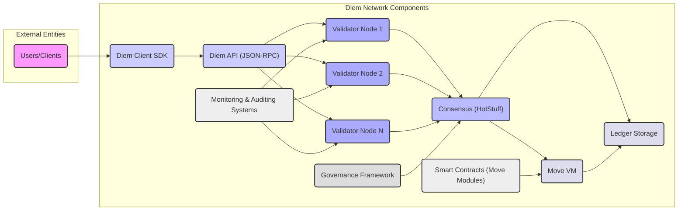

# Project Design Document: Diem

**Version:** 1.1
**Date:** October 26, 2023
**Author:** Gemini AI (as per prompt)
**Project:** Diem (formerly Libra) - Permissioned Blockchain for Financial Transactions

## 1. Introduction

This document provides a detailed architectural overview of the Diem blockchain project, based on the information available in the provided GitHub repository (https://github.com/diem/diem). This document is intended to serve as a foundation for subsequent threat modeling activities by clearly outlining the system's components and their interactions.

## 2. Goals and Objectives

The primary goals of the Diem project are to:

*   Facilitate secure, low-cost, and efficient global value transfer.
*   Provide a blockchain platform suitable for regulated financial services.
*   Enable programmability through smart contracts for innovative financial applications.
*   Maintain a high degree of security and resilience through a permissioned validator set.
*   Support regulatory compliance and oversight.
*   Achieve scalability to handle a significant volume of transactions.

## 3. High-Level Architecture

The Diem network operates as a permissioned blockchain, where a defined set of validators governs the consensus process. Key architectural components include:

*   **Users/Clients:** Entities (individuals, businesses, applications) initiating transactions on the Diem network.
*   **Diem Client SDK:** Software Development Kits providing libraries and tools for interacting with the Diem blockchain.
*   **Diem API (JSON-RPC Interface):** The primary communication interface for clients to interact with validator nodes.
*   **Validator Nodes:** Designated entities responsible for participating in consensus, validating transactions, and maintaining the ledger.
*   **Consensus Protocol (HotStuff):** The Byzantine Fault Tolerant (BFT) protocol ensuring agreement on the state of the blockchain.
*   **Ledger Storage:** The persistent storage mechanism for the blockchain data, including transaction history and account states.
*   **Move Virtual Machine (Move VM):** The execution environment for smart contracts written in the Move programming language.
*   **Smart Contracts (Move Modules):** Programmable logic deployed on the blockchain to define rules and functionalities.
*   **Governance Framework:** Mechanisms for managing and upgrading the Diem network's protocol and smart contracts.
*   **Monitoring and Auditing Systems:** Tools and processes for observing network activity and ensuring system integrity.

## 4. Detailed Component Descriptions

*   **Users/Clients:**
    *   Interact with the Diem network to perform actions like sending payments, querying account balances, and interacting with smart contracts.
    *   Utilize the Diem Client SDK to construct, sign (using their private keys), and submit transactions.
    *   Rely on the Diem API to communicate with the network.

*   **Diem Client SDK:**
    *   Provides a set of libraries and tools in various programming languages (e.g., Rust) to facilitate interaction with the Diem network.
    *   Handles transaction creation, signing, and serialization.
    *   Offers functionalities for querying blockchain state, such as account information and transaction history.
    *   Manages cryptographic keys securely (though key management is ultimately the client's responsibility).

*   **Diem API (JSON-RPC Interface):**
    *   Serves as the primary interface for external entities to interact with the Diem network's validator nodes.
    *   Exposes endpoints for submitting transactions, querying account data, retrieving block information, and other network-related queries.
    *   Implements authentication and authorization mechanisms to control access and prevent unauthorized actions.
    *   Typically uses HTTPS for secure communication.

*   **Validator Nodes:**
    *   Operated by authorized entities who are responsible for maintaining the integrity and availability of the Diem network.
    *   Participate in the HotStuff consensus protocol to propose, vote on, and commit new blocks of transactions.
    *   Execute transactions within the Move VM.
    *   Maintain a full replica of the Diem blockchain ledger.
    *   Communicate with other validator nodes over a secure, peer-to-peer network, often using gRPC.

*   **Consensus Protocol (HotStuff):**
    *   A leader-based BFT consensus protocol designed for high performance and resilience.
    *   Ensures that all honest validators agree on the order of transactions, even if some validators are faulty or malicious (up to a certain threshold).
    *   Involves rounds of proposing, pre-voting, and committing blocks, with a designated leader for each round.
    *   Relies on cryptographic signatures and quorum certificates to ensure the validity of messages.

*   **Ledger Storage:**
    *   The persistent storage layer for the Diem blockchain, containing the complete history of transactions and the current state of accounts.
    *   Designed for high availability, durability, and efficient querying.
    *   May utilize technologies like RocksDB or other key-value stores optimized for blockchain workloads.
    *   Stores data in a structured format, including blocks, transactions, and account states.

*   **Move Virtual Machine (Move VM):**
    *   The runtime environment for executing smart contracts written in the Move programming language.
    *   Designed with a focus on security and resource management, preventing common smart contract vulnerabilities.
    *   Provides a deterministic execution environment, ensuring that the same smart contract code executed with the same inputs will always produce the same output.
    *   Manages resources (digital assets) securely, preventing issues like double-spending.

*   **Smart Contracts (Move Modules):**
    *   Programs written in the Move programming language that define the rules and logic for various functionalities on the Diem network.
    *   Deployed on the blockchain and their execution is triggered by transactions.
    *   Examples include payment logic, asset management, and governance mechanisms.
    *   Move's type system and resource-oriented programming model enhance security and prevent common vulnerabilities.

*   **Governance Framework:**
    *   The set of rules, processes, and smart contracts that govern the evolution and management of the Diem network.
    *   May involve on-chain voting by validators or other designated stakeholders to approve protocol upgrades, changes to smart contracts, or other network parameters.
    *   Ensures that changes to the network are made in a transparent and controlled manner.

*   **Monitoring and Auditing Systems:**
    *   Infrastructure for observing the health, performance, and security of the Diem network.
    *   Includes tools for collecting metrics, logging events, and generating alerts for anomalous activity.
    *   Provides insights into network performance, transaction throughput, and potential security incidents.
    *   May involve both on-chain and off-chain monitoring components.

## 5. Data Flow

A typical transaction flow within the Diem network proceeds as follows:

1. A user initiates a transaction using the Diem Client SDK, specifying the recipient, amount, and any relevant data for smart contract interaction.
2. The Diem Client SDK constructs the transaction and signs it using the user's private key.
3. The client submits the signed transaction to a Diem API endpoint exposed by one or more validator nodes.
4. The receiving validator node verifies the transaction's signature and basic validity.
5. The validator node broadcasts the transaction to other validator nodes within the network.
6. Validator nodes participate in the HotStuff consensus protocol to agree on the order of pending transactions.
7. The leader in the current HotStuff round proposes a new block containing a set of transactions.
8. Validators vote on the proposed block. If a quorum of votes is reached, the block is committed.
9. The committed block is added to the Ledger Storage on each validator node.
10. The Move VM on each validator executes the smart contracts associated with the transactions in the block, updating the blockchain state.
11. The client can query the Diem API to confirm the transaction's inclusion in a block and its execution status.

```mermaid
graph LR
    A("User/Client") --> B("Diem Client SDK: Construct & Sign Transaction");
    B --> C("Diem API (JSON-RPC) on Validator Node");
    C --> D("Validator Nodes: Verify & Broadcast Transaction");
    D --> E("Consensus (HotStuff): Propose, Vote, Commit Block");
    E --> F("Ledger Storage: Append New Block");
    E --> G("Move VM: Execute Smart Contracts");
    G --> F;
    F --> H("Ledger Storage: Update Blockchain State");
    H --> I("Diem API (JSON-RPC): Transaction Confirmation");
    I --> A;
    style A fill:#f9f,stroke:#333,stroke-width:2px
    style B fill:#ccf,stroke:#333,stroke-width:2px
    style C fill:#ccf,stroke:#333,stroke-width:2px
    style D fill:#aaf,stroke:#333,stroke-width:2px
    style E fill:#bbf,stroke:#333,stroke-width:2px
    style F fill:#dde,stroke:#333,stroke-width:2px
    style G fill:#dde,stroke:#333,stroke-width:2px
    style H fill:#dde,stroke:#333,stroke-width:2px
    style I fill:#ccf,stroke:#333,stroke-width:2px
```

## 6. Key Technologies

*   **Core Programming Language:** Rust (for the Diem Core and Move VM).
*   **Smart Contract Language:** Move.
*   **Consensus Algorithm:** HotStuff (Byzantine Fault Tolerant).
*   **Inter-node Communication:** Likely gRPC for efficient and secure communication between validator nodes.
*   **Client Communication:** JSON-RPC over HTTPS for client interaction with validator nodes.
*   **Cryptography:**  Uses various cryptographic libraries for hashing, digital signatures (e.g., EdDSA), and encryption.
*   **Data Storage:**  Potentially RocksDB or a similar embedded key-value store for ledger persistence.

## 7. Security Considerations (For Threat Modeling)

This section outlines key security considerations relevant for threat modeling:

*   **Cryptographic Vulnerabilities:**
    *   Weaknesses in the cryptographic algorithms used for signing transactions or securing communication channels.
    *   Improper key management practices by users or within the validator infrastructure.
    *   Potential for attacks like signature forgery or replay attacks.
*   **Access Control and Authentication:**
    *   Unauthorized access to validator nodes or the Diem API.
    *   Compromise of validator private keys, allowing malicious actors to participate in consensus.
    *   Insufficient authentication mechanisms for client interactions.
*   **Consensus Mechanism Attacks:**
    *   Attempts to disrupt the HotStuff consensus protocol, leading to forks or denial of service.
    *   Byzantine behavior from compromised validators attempting to manipulate the transaction order or block content.
    *   Susceptibility to network partitioning or Sybil attacks.
*   **Smart Contract Vulnerabilities:**
    *   Bugs or flaws in Move smart contracts that could be exploited to drain funds or disrupt functionality.
    *   Reentrancy attacks, integer overflows, or other common smart contract vulnerabilities.
    *   Issues with the Move VM itself that could lead to unexpected behavior.
*   **Network Security:**
    *   Denial-of-service (DoS) or distributed denial-of-service (DDoS) attacks targeting validator nodes or the Diem API.
    *   Man-in-the-middle (MITM) attacks on communication channels between clients and validators or between validators themselves.
    *   Network infrastructure vulnerabilities that could be exploited to compromise nodes.
*   **Data Integrity and Immutability:**
    *   Attempts to tamper with the blockchain ledger or transaction history.
    *   Vulnerabilities in the ledger storage mechanism that could lead to data corruption.
*   **Governance Attacks:**
    *   Attempts to manipulate the governance process to introduce malicious changes to the protocol or smart contracts.
    *   Compromise of governance keys or voting mechanisms.
*   **Supply Chain Attacks:**
    *   Compromise of dependencies or build processes for Diem Core or related tools.
*   **Monitoring and Auditing Deficiencies:**
    *   Insufficient logging or monitoring capabilities, hindering the detection of security incidents.
    *   Lack of effective alerting mechanisms for suspicious activity.

## 8. Assumptions and Constraints

*   The design is based on the publicly available information in the Diem GitHub repository.
*   The network operates as a permissioned blockchain with a known set of validators.
*   The HotStuff consensus protocol provides Byzantine fault tolerance.
*   The Move VM offers a secure and deterministic execution environment for smart contracts.
*   Standard security best practices are followed in the development and operation of the Diem network.
*   The network relies on secure key management practices by both users and validators.

## 9. Future Considerations

*   Potential evolution of the governance model and validator selection process.
*   Exploration of interoperability with other blockchain networks or traditional financial systems.
*   Further optimizations for performance and scalability.
*   Development of new smart contract functionalities and applications.
*   Adaptation to evolving regulatory requirements.

This improved design document provides a more detailed and structured overview of the Diem project's architecture, specifically tailored for use in threat modeling activities. The enhanced component descriptions and expanded security considerations offer a more comprehensive understanding of the system's potential attack surfaces and vulnerabilities.