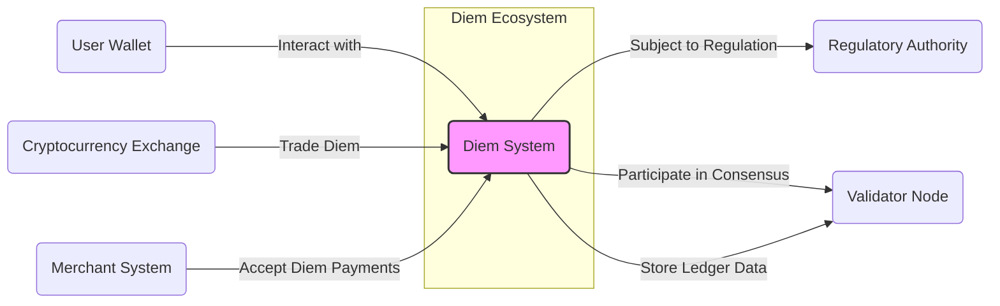
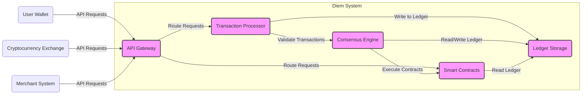
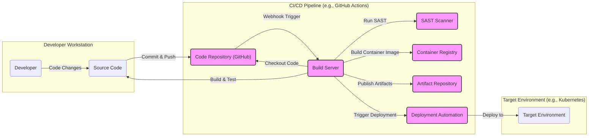

# BUSINESS POSTURE

The Diem project aims to create a permissioned blockchain-based payment system to enable efficient and low-cost global payments. The primary business goal is to provide a more accessible and efficient financial infrastructure, particularly for cross-border transactions and underserved populations.

Business priorities include:

*   Regulatory compliance: Adhering to financial regulations across different jurisdictions is critical for Diem's operation and acceptance.
*   Security and trust: Maintaining the security and integrity of the Diem network and user funds is paramount to build trust and ensure adoption.
*   Scalability and performance: The system needs to handle a large volume of transactions efficiently and reliably.
*   Interoperability:  Diem should be able to integrate with existing financial systems and services.
*   Adoption and ecosystem growth:  Encouraging the development of applications and services on top of Diem to expand its utility.

Most important business risks:

*   Regulatory rejection:  Failure to obtain necessary regulatory approvals in key jurisdictions could prevent Diem from launching or operating effectively.
*   Security breaches:  Successful cyberattacks or vulnerabilities in the Diem network could lead to loss of funds, reputational damage, and loss of trust.
*   Scalability issues:  Inability to handle transaction volume growth could lead to performance degradation and user dissatisfaction.
*   Lack of adoption:  Insufficient user and developer adoption could result in Diem failing to achieve its goals and becoming irrelevant.
*   Competition:  Existing payment systems and emerging cryptocurrencies pose competitive threats to Diem's market position.

# SECURITY POSTURE

Existing security controls:

*   security control: Permissioned blockchain: Access to the Diem network and participation in consensus are restricted to authorized validators. Described in Diem documentation.
*   security control: Cryptographic protocols:  Utilizing strong cryptography for transaction signing, data encryption, and secure communication. Described in Diem documentation and code.
*   security control: Secure coding practices:  Following secure coding guidelines during software development to minimize vulnerabilities. Implemented by development team.
*   security control: Code reviews:  Conducting peer reviews of code changes to identify potential security flaws. Implemented by development team.
*   security control: Penetration testing:  Regularly performing penetration testing to identify vulnerabilities in the Diem network and infrastructure. Implemented by security team.
*   security control: Incident response plan:  Having a documented plan for responding to and recovering from security incidents. Implemented by security team.

Accepted risks:

*   accepted risk: Complexity of blockchain technology:  Inherent complexity of blockchain systems can introduce subtle vulnerabilities that are difficult to detect.
*   accepted risk: Dependence on validator security:  Security of the Diem network relies on the security of individual validators. Compromise of a significant number of validators could impact network security.
*   accepted risk: Smart contract vulnerabilities:  Smart contracts deployed on Diem may contain vulnerabilities that could be exploited.

Recommended security controls:

*   security control: Automated security scanning: Implement SAST and DAST tools in the CI/CD pipeline to automatically detect vulnerabilities in code and deployed applications.
*   security control: Bug bounty program:  Establish a bug bounty program to incentivize external security researchers to find and report vulnerabilities.
*   security control: Security awareness training:  Provide regular security awareness training to developers and operations staff to promote secure practices.
*   security control: Key management system: Implement a robust key management system for managing cryptographic keys used in the Diem network.
*   security control: Security Information and Event Management (SIEM): Deploy a SIEM system to monitor security events and detect suspicious activity in real-time.

Security requirements:

*   Authentication:
    *   Requirement:  Validators must be strongly authenticated to participate in the consensus process.
    *   Requirement:  Users accessing Diem services (e.g., wallets, APIs) must be authenticated.
    *   Requirement:  Authentication mechanisms should support multi-factor authentication where appropriate.
*   Authorization:
    *   Requirement:  Access to sensitive data and operations within the Diem network must be strictly controlled based on roles and permissions.
    *   Requirement:  Authorization policies should be clearly defined and enforced consistently.
    *   Requirement:  Principle of least privilege should be applied to all access controls.
*   Input validation:
    *   Requirement:  All inputs to the Diem network and its components must be thoroughly validated to prevent injection attacks and other input-related vulnerabilities.
    *   Requirement:  Input validation should be performed at multiple layers of the system.
    *   Requirement:  Use of secure coding practices to handle input validation.
*   Cryptography:
    *   Requirement:  Strong cryptographic algorithms and protocols must be used to protect sensitive data in transit and at rest.
    *   Requirement:  Cryptographic keys must be securely generated, stored, and managed throughout their lifecycle.
    *   Requirement:  Regularly review and update cryptographic algorithms and protocols to maintain security against evolving threats.

# DESIGN

## C4 CONTEXT



Context Diagram Elements:

*   Element:
    *   Name: Diem System
    *   Type: Software System
    *   Description: The core Diem blockchain platform, responsible for processing transactions, maintaining the ledger, and enforcing network rules.
    *   Responsibilities:
        *   Transaction processing and validation.
        *   Maintaining the distributed ledger.
        *   Enforcing consensus and network governance rules.
        *   Providing APIs for clients and applications to interact with the network.
    *   Security controls:
        *   security control: Permissioned access control for validators.
        *   security control: Cryptographic protocols for transaction integrity and confidentiality.
        *   security control: Consensus mechanism to ensure data consistency and fault tolerance.
        *   security control: Smart contract security audits.

*   Element:
    *   Name: User Wallet
    *   Type: Software System
    *   Description: Applications used by end-users to manage their Diem accounts, send and receive Diem, and interact with Diem services.
    *   Responsibilities:
        *   Managing user private keys securely.
        *   Creating and signing transactions.
        *   Interacting with the Diem System to send and receive Diem.
        *   Displaying account balances and transaction history.
    *   Security controls:
        *   security control: Client-side encryption of private keys.
        *   security control: Secure storage of user credentials.
        *   security control: Input validation to prevent malicious transactions.
        *   security control: Secure communication channels (HTTPS) to interact with Diem System.

*   Element:
    *   Name: Cryptocurrency Exchange
    *   Type: Software System
    *   Description: Platforms that allow users to buy and sell Diem for other cryptocurrencies or fiat currencies.
    *   Responsibilities:
        *   Providing a marketplace for trading Diem.
        *   Matching buy and sell orders.
        *   Custody of user funds (Diem and other currencies).
        *   Integrating with the Diem System for deposit and withdrawal of Diem.
    *   Security controls:
        *   security control: Secure custody solutions for digital assets.
        *   security control: KYC/AML compliance measures.
        *   security control: Robust trading platform security to prevent manipulation and attacks.
        *   security control: Secure APIs for integration with Diem System.

*   Element:
    *   Name: Merchant System
    *   Type: Software System
    *   Description: Systems used by merchants to accept Diem as payment for goods and services.
    *   Responsibilities:
        *   Integrating with the Diem System to receive Diem payments.
        *   Processing Diem transactions at point-of-sale.
        *   Managing Diem balances and settlements.
    *   Security controls:
        *   security control: Secure integration with Diem payment APIs.
        *   security control: Protection of merchant private keys and credentials.
        *   security control: Secure handling of transaction data.

*   Element:
    *   Name: Regulatory Authority
    *   Type: Organization
    *   Description: Government agencies and bodies responsible for regulating financial activities and ensuring compliance with laws and regulations.
    *   Responsibilities:
        *   Overseeing Diem's operations and compliance with financial regulations.
        *   Issuing licenses and approvals for Diem to operate in specific jurisdictions.
        *   Monitoring Diem's activities for potential risks and illicit activities.
    *   Security controls:
        *   security control: Regulatory oversight and audits of Diem's security practices and compliance.

*   Element:
    *   Name: Validator Node
    *   Type: Software System / Infrastructure
    *   Description:  Nodes operated by authorized validators that participate in the Diem consensus mechanism, validate transactions, and maintain the ledger.
    *   Responsibilities:
        *   Participating in the consensus process.
        *   Validating transactions and blocks.
        *   Storing and replicating the Diem ledger.
        *   Securing the validator infrastructure.
    *   Security controls:
        *   security control: Hardware Security Modules (HSMs) for key management.
        *   security control: Secure operating system and network configurations.
        *   security control: Intrusion detection and prevention systems.
        *   security control: Physical security of validator infrastructure.

## C4 CONTAINER



Container Diagram Elements:

*   Element:
    *   Name: API Gateway
    *   Type: Web Application
    *   Description:  Entry point for external clients (wallets, exchanges, merchants) to interact with the Diem System. Handles authentication, authorization, and request routing.
    *   Responsibilities:
        *   Receiving and routing API requests from clients.
        *   Authentication and authorization of clients.
        *   Rate limiting and traffic management.
        *   API documentation and versioning.
    *   Security controls:
        *   security control: API authentication (e.g., API keys, OAuth 2.0).
        *   security control: Input validation and sanitization.
        *   security control: Web Application Firewall (WAF).
        *   security control: DDoS protection.
        *   security control: TLS encryption for communication.

*   Element:
    *   Name: Transaction Processor
    *   Type: Application Service
    *   Description:  Component responsible for processing and validating incoming transactions before they are submitted to the consensus engine.
    *   Responsibilities:
        *   Receiving transactions from the API Gateway.
        *   Verifying transaction signatures and formats.
        *   Checking account balances and permissions.
        *   Submitting valid transactions to the Consensus Engine.
    *   Security controls:
        *   security control: Transaction validation logic.
        *   security control: Access control to transaction processing functions.
        *   security control: Logging and monitoring of transaction processing activities.

*   Element:
    *   Name: Consensus Engine
    *   Type: Application Service
    *   Description:  The core component that implements the Diem consensus protocol, ensuring agreement among validators on the state of the ledger.
    *   Responsibilities:
        *   Participating in the consensus protocol (e.g., HotStuff).
        *   Proposing and voting on new blocks.
        *   Maintaining the consistency and integrity of the ledger.
        *   Executing smart contracts.
    *   Security controls:
        *   security control: Byzantine Fault Tolerance (BFT) consensus algorithm.
        *   security control: Secure communication channels between validators.
        *   security control: Validator node authentication and authorization.
        *   security control: Resistance to Sybil attacks and other consensus-related attacks.

*   Element:
    *   Name: Ledger Storage
    *   Type: Database
    *   Description:  Persistent storage for the Diem blockchain ledger, including transaction history, account balances, and smart contract code.
    *   Responsibilities:
        *   Storing the blockchain ledger data.
        *   Providing efficient read and write access to ledger data.
        *   Ensuring data integrity and durability.
        *   Data replication and backup for fault tolerance.
    *   Security controls:
        *   security control: Database access controls and encryption at rest.
        *   security control: Data integrity checks (e.g., Merkle trees).
        *   security control: Regular backups and disaster recovery procedures.
        *   security control: Audit logging of data access.

*   Element:
    *   Name: Smart Contracts
    *   Type: Application Code / Runtime Environment
    *   Description:  Programmable contracts deployed on the Diem blockchain to automate specific functionalities and business logic.
    *   Responsibilities:
        *   Implementing specific functionalities (e.g., payment logic, token issuance).
        *   Enforcing contract terms and conditions.
        *   Interacting with the ledger and other smart contracts.
    *   Security controls:
        *   security control: Secure smart contract development practices.
        *   security control: Formal verification and security audits of smart contracts.
        *   security control: Gas limits and resource management to prevent denial-of-service attacks.
        *   security control: Access control within smart contracts.

## DEPLOYMENT

Deployment Solution: Cloud-based Deployment on Kubernetes

```mermaid
graph LR
    subgraph "Cloud Provider (e.g., AWS, GCP, Azure)"
        subgraph "Kubernetes Cluster"
            namespace_diem("Diem Namespace")
            subgraph namespace_diem
                pod_api_gateway_1("API Gateway Pod 1")
                pod_api_gateway_2("API Gateway Pod 2")
                pod_transaction_processor_1("Transaction Processor Pod 1")
                pod_transaction_processor_2("Transaction Processor Pod 2")
                pod_consensus_engine_1("Consensus Engine Pod 1")
                pod_consensus_engine_2("Consensus Engine Pod 2")
                pod_ledger_storage_1("Ledger Storage Pod 1")
                pod_ledger_storage_2("Ledger Storage Pod 2")
                pod_smart_contracts_1("Smart Contracts Pod 1")
                pod_smart_contracts_2("Smart Contracts Pod 2")
                service_api_gateway("API Gateway Service")
                service_transaction_processor("Transaction Processor Service")
                service_consensus_engine("Consensus Engine Service")
                service_ledger_storage("Ledger Storage Service")
                service_smart_contracts("Smart Contracts Service")
            end
            node_1("Worker Node 1")
            node_2("Worker Node 2")
            node_3("Worker Node 3")
        end
        load_balancer("Load Balancer")
        firewall("Cloud Firewall")
    end

    internet("Internet")

    internet -- "HTTPS Requests" --> load_balancer
    load_balancer -- "Route to Service" --> service_api_gateway
    service_api_gateway -- "Route to Pod" --> pod_api_gateway_1 & pod_api_gateway_2

    service_transaction_processor -- "Route to Pod" --> pod_transaction_processor_1 & pod_transaction_processor_2
    service_consensus_engine -- "Route to Pod" --> pod_consensus_engine_1 & pod_consensus_engine_2
    service_ledger_storage -- "Route to Pod" --> pod_ledger_storage_1 & pod_ledger_storage_2
    service_smart_contracts -- "Route to Pod" --> pod_smart_contracts_1 & pod_smart_contracts_2

    pod_api_gateway_1 & pod_api_gateway_2 -- "Internal Communication" --> service_transaction_processor
    pod_api_gateway_1 & pod_api_gateway_2 -- "Internal Communication" --> service_smart_contracts

    pod_transaction_processor_1 & pod_transaction_processor_2 -- "Internal Communication" --> service_consensus_engine
    pod_transaction_processor_1 & pod_transaction_processor_2 -- "Write to Storage" --> service_ledger_storage

    pod_consensus_engine_1 & pod_consensus_engine_2 -- "Read/Write Storage" --> service_ledger_storage
    pod_consensus_engine_1 & pod_consensus_engine_2 -- "Execute Contracts" --> service_smart_contracts

    pod_smart_contracts_1 & pod_smart_contracts_2 -- "Read Storage" --> service_ledger_storage

    pod_api_gateway_1 & pod_api_gateway_2 -- node_1
    pod_transaction_processor_1 & pod_transaction_processor_2 -- node_2
    pod_consensus_engine_1 & pod_consensus_engine_2 -- node_3
    pod_ledger_storage_1 & pod_ledger_storage_2 -- node_1
    pod_smart_contracts_1 & pod_smart_contracts_2 -- node_2

    load_balancer -- firewall
    firewall -- Kubernetes_Cluster

    style namespace_diem fill:#eee,stroke:#333,stroke-width:1px,stroke-dasharray:5 5
```

Deployment Diagram Elements:

*   Element:
    *   Name: Cloud Provider (e.g., AWS, GCP, Azure)
    *   Type: Infrastructure Provider
    *   Description:  Provides the underlying infrastructure for deploying and running the Diem System, including compute, storage, and networking resources.
    *   Responsibilities:
        *   Providing reliable and scalable infrastructure.
        *   Ensuring physical security of data centers.
        *   Providing network connectivity and security services.
    *   Security controls:
        *   security control: Physical security of data centers.
        *   security control: Cloud provider security certifications (e.g., ISO 27001, SOC 2).
        *   security control: Network security controls (firewalls, VPCs).
        *   security control: Identity and Access Management (IAM) for cloud resources.

*   Element:
    *   Name: Kubernetes Cluster
    *   Type: Container Orchestration Platform
    *   Description:  Used to orchestrate and manage the deployment, scaling, and networking of Diem containers.
    *   Responsibilities:
        *   Container orchestration and management.
        *   Service discovery and load balancing within the cluster.
        *   Automated scaling and self-healing of applications.
    *   Security controls:
        *   security control: Kubernetes Role-Based Access Control (RBAC).
        *   security control: Network policies to isolate namespaces and services.
        *   security control: Container image security scanning.
        *   security control: Kubernetes audit logging.
        *   security control: Regular security updates and patching of Kubernetes components.

*   Element:
    *   Name: Diem Namespace
    *   Type: Kubernetes Namespace
    *   Description:  A logical isolation boundary within the Kubernetes cluster to separate Diem resources from other applications.
    *   Responsibilities:
        *   Resource isolation for Diem components.
        *   Namespace-level access control.
        *   Dedicated network policies for Diem services.
    *   Security controls:
        *   security control: Kubernetes Network Policies to restrict traffic within and outside the namespace.
        *   security control: Kubernetes RBAC to control access to resources within the namespace.

*   Element:
    *   Name: API Gateway Pods (x2)
    *   Type: Container Instance
    *   Description:  Instances of the API Gateway container running within Kubernetes pods for scalability and redundancy.
    *   Responsibilities:
        *   Handling API requests as described in Container Diagram.
    *   Security controls:
        *   security control: Container image security scanning.
        *   security control: Resource limits and quotas to prevent resource exhaustion.
        *   security control: Regular patching of container OS and application dependencies.

*   Element:
    *   Name: Transaction Processor Pods (x2)
    *   Type: Container Instance
    *   Description:  Instances of the Transaction Processor container running within Kubernetes pods for scalability and redundancy.
    *   Responsibilities:
        *   Transaction processing as described in Container Diagram.
    *   Security controls:
        *   security control: Container image security scanning.
        *   security control: Resource limits and quotas.
        *   security control: Regular patching.

*   Element:
    *   Name: Consensus Engine Pods (x2)
    *   Type: Container Instance
    *   Description:  Instances of the Consensus Engine container running within Kubernetes pods for scalability and redundancy.
    *   Responsibilities:
        *   Consensus operations as described in Container Diagram.
    *   Security controls:
        *   security control: Container image security scanning.
        *   security control: Resource limits and quotas.
        *   security control: Regular patching.
        *   security control: Secure inter-pod communication (e.g., mTLS).

*   Element:
    *   Name: Ledger Storage Pods (x2)
    *   Type: Container Instance
    *   Description:  Instances of the Ledger Storage container running within Kubernetes pods for scalability and redundancy.
    *   Responsibilities:
        *   Ledger data storage as described in Container Diagram.
    *   Security controls:
        *   security control: Container image security scanning.
        *   security control: Resource limits and quotas.
        *   security control: Regular patching.
        *   security control: Persistent volume encryption.

*   Element:
    *   Name: Smart Contracts Pods (x2)
    *   Type: Container Instance
    *   Description:  Instances of the Smart Contracts container running within Kubernetes pods for scalability and redundancy.
    *   Responsibilities:
        *   Smart contract execution as described in Container Diagram.
    *   Security controls:
        *   security control: Container image security scanning.
        *   security control: Resource limits and quotas.
        *   security control: Regular patching.
        *   security control: Secure execution environment for smart contracts.

*   Element:
    *   Name: API Gateway Service
    *   Type: Kubernetes Service
    *   Description:  Kubernetes service to expose API Gateway pods and provide load balancing within the cluster.
    *   Responsibilities:
        *   Internal load balancing for API Gateway pods.
        *   Service discovery for other Diem components.
    *   Security controls:
        *   security control: Kubernetes Network Policies to control access to the service.

*   Element:
    *   Name: Transaction Processor Service, Consensus Engine Service, Ledger Storage Service, Smart Contracts Service
    *   Type: Kubernetes Service
    *   Description:  Kubernetes services to expose respective pods and provide internal load balancing.
    *   Responsibilities:
        *   Internal load balancing and service discovery.
    *   Security controls:
        *   security control: Kubernetes Network Policies.

*   Element:
    *   Name: Load Balancer
    *   Type: Cloud Load Balancer
    *   Description:  Cloud provider load balancer to distribute external traffic to API Gateway services.
    *   Responsibilities:
        *   External load balancing for API Gateway.
        *   TLS termination.
        *   Health checks for API Gateway pods.
    *   Security controls:
        *   security control: TLS encryption.
        *   security control: Load balancer security configurations.
        *   security control: Integration with Cloud Firewall.

*   Element:
    *   Name: Cloud Firewall
    *   Type: Cloud Firewall
    *   Description:  Cloud provider firewall to protect the Kubernetes cluster from external threats.
    *   Responsibilities:
        *   Network perimeter security.
        *   Filtering inbound and outbound traffic.
        *   Blocking malicious traffic.
    *   Security controls:
        *   security control: Firewall rules based on least privilege.
        *   security control: Regular review and updates of firewall rules.
        *   security control: Intrusion detection and prevention capabilities.

## BUILD



Build Process Description:

1.  Developer writes code changes on their workstation and commits them to the source code repository (e.g., GitHub).
2.  Pushing code changes to the repository triggers a webhook, initiating the CI/CD pipeline.
3.  The Build Server (e.g., GitHub Actions runner) checks out the latest code from the repository.
4.  The Build Server compiles the code, runs unit tests, and performs other build steps.
5.  SAST Scanner performs static application security testing to identify potential vulnerabilities in the code.
6.  If SAST scan passes and build is successful, the Build Server builds container images for the Diem components and pushes them to the Container Registry.
7.  Build artifacts (e.g., binaries, configuration files) are published to the Artifact Repository.
8.  Deployment Automation tool (e.g., Kubernetes deployment scripts) is triggered to deploy the new version of the application to the Target Environment (e.g., Kubernetes cluster).

Build Process Security Controls:

*   security control: Secure Code Repository: Access control to the code repository, branch protection, and audit logging.
*   security control: Authenticated CI/CD Pipeline: Secure authentication and authorization for accessing and executing the CI/CD pipeline.
*   security control: Secure Build Environment: Hardened build servers, isolated build environments, and regular security patching.
*   security control: Static Application Security Testing (SAST): Automated SAST scanning integrated into the pipeline to detect code vulnerabilities.
*   security control: Container Image Scanning: Security scanning of container images in the Container Registry for vulnerabilities before deployment.
*   security control: Artifact Signing: Signing build artifacts to ensure integrity and authenticity.
*   security control: Access Control to Artifact Repositories: Role-based access control to container and artifact registries.
*   security control: Immutable Infrastructure: Deploying immutable container images to prevent runtime modifications.
*   security control: Deployment Authorization: Secure authorization mechanisms for deployment automation to prevent unauthorized deployments.
*   security control: Audit Logging: Comprehensive audit logging of all build and deployment activities.
*   security control: Dependency Scanning: Scanning dependencies for known vulnerabilities.

# RISK ASSESSMENT

Critical business processes to protect:

*   Transaction processing: Ensuring the reliable and secure processing of Diem transactions is fundamental to the system's operation.
*   Ledger integrity: Maintaining the integrity and immutability of the Diem ledger is crucial for trust and accountability.
*   Consensus mechanism: Protecting the consensus mechanism from attacks and manipulation is essential for network security and stability.
*   Smart contract execution: Secure execution of smart contracts is necessary to prevent vulnerabilities and ensure predictable behavior.
*   Key management: Protecting cryptographic keys used for transaction signing and network security is paramount.

Data to protect and sensitivity:

*   Transaction data: Contains information about senders, receivers, amounts, and timestamps. Sensitivity: High (PII, financial data). Requires confidentiality, integrity, and availability.
*   Account balances: Represents user holdings of Diem. Sensitivity: High (financial data). Requires confidentiality, integrity, and availability.
*   Smart contract code: Contains business logic and potentially sensitive algorithms. Sensitivity: Medium (intellectual property, business logic). Requires confidentiality and integrity.
*   Validator private keys: Used for signing blocks and participating in consensus. Sensitivity: Critical (network security). Requires extreme confidentiality and integrity.
*   User private keys: Used for authorizing transactions. Sensitivity: Critical (user funds). Requires extreme confidentiality and integrity.
*   Audit logs: Records of system events and activities. Sensitivity: Medium (security monitoring, compliance). Requires integrity and availability.

# QUESTIONS & ASSUMPTIONS

Questions:

*   What specific regulatory frameworks is Diem targeting for compliance?
*   What is the planned throughput and latency for Diem transactions?
*   What specific consensus algorithm is being used (e.g., HotStuff variant)?
*   What type of database is used for Ledger Storage?
*   What are the key management practices for validator and user keys?
*   What specific SAST and DAST tools are planned to be used in the CI/CD pipeline?
*   What is the disaster recovery plan for the Diem network?

Assumptions:

*   BUSINESS POSTURE: Diem aims to be a globally compliant and secure payment system. Security and regulatory compliance are top priorities.
*   SECURITY POSTURE: Diem is being developed with security in mind, employing standard security practices for blockchain and software development.  A permissioned blockchain model is a key security control.
*   DESIGN: Diem adopts a microservices architecture deployed on a cloud-based Kubernetes platform for scalability and resilience. Standard security controls for cloud environments and containerized applications are assumed to be in place.  A CI/CD pipeline with security checks is used for software delivery.