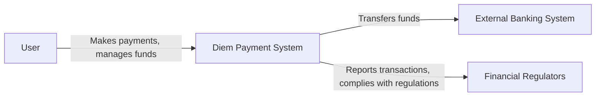
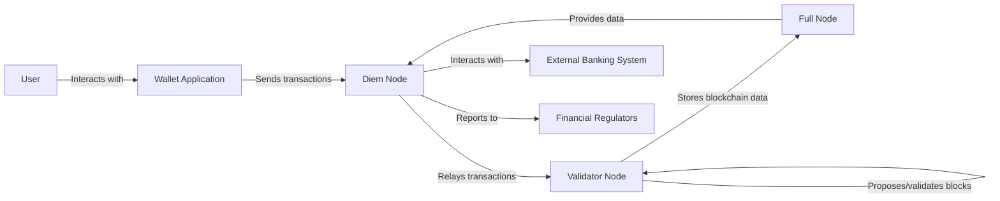
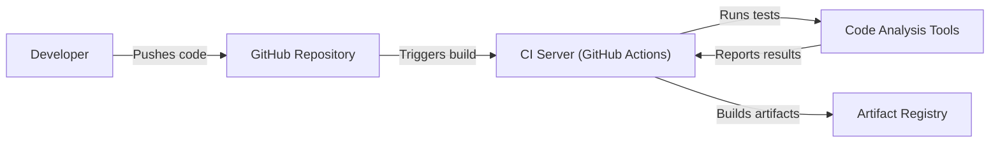

Okay, let's dive into designing a comprehensive document for the Diem project (now defunct, but we can still analyze it for architectural purposes), keeping threat modeling in mind.  I'll follow your specified structure meticulously.

# BUSINESS POSTURE

Diem (formerly Libra) was a permissioned blockchain-based payment system proposed by Meta (formerly Facebook).  The project aimed to provide a stable, low-volatility cryptocurrency that could be used for global payments and financial inclusion.  It faced significant regulatory hurdles and ultimately did not launch.  However, analyzing its design is still valuable.

Business Priorities and Goals:

*   Enable fast, low-cost, and secure global payments.
*   Promote financial inclusion by providing access to financial services for the unbanked.
*   Create a stable cryptocurrency that avoids the volatility of traditional cryptocurrencies.
*   Build a platform for developers to create financial applications.
*   Comply with global financial regulations.

Most Important Business Risks:

*   Regulatory Compliance:  Failure to meet the requirements of financial regulators worldwide (e.g., anti-money laundering (AML), know your customer (KYC), data privacy). This was the primary reason for the project's failure.
*   Security Breaches:  Loss of funds due to hacking, vulnerabilities in the blockchain, or compromise of user wallets.
*   Scalability and Performance:  Inability to handle a large volume of transactions quickly and efficiently.
*   Reputation Risk:  Damage to the reputation of Meta and its partners due to security breaches, regulatory issues, or public perception.
*   Adoption:  Lack of widespread adoption by users and merchants.
*   Centralization Concerns:  Criticism regarding the potential for centralization and control by the Diem Association.
*   Economic Stability:  Potential impact on the stability of existing financial systems.

# SECURITY POSTURE

Based on the available information from the GitHub repository and whitepapers, here's a breakdown of the Diem project's security posture:

Existing Security Controls:

*   security control: Move Language: The Diem blockchain used the Move programming language, designed for safety and verifiability to prevent common smart contract vulnerabilities (e.g., reentrancy). Described in the Move whitepaper and implemented in the codebase.
*   security control: Byzantine Fault Tolerance (BFT) Consensus: Diem used a variant of the HotStuff BFT consensus algorithm to ensure the integrity of the blockchain even if some validator nodes are malicious. Described in the consensus protocol documentation.
*   security control: Validator Node Security: Validator nodes were expected to implement robust security measures, including secure infrastructure, intrusion detection, and key management.  Guidelines were provided to validator operators.
*   security control: Digital Signatures: Transactions and other critical operations were secured using digital signatures to ensure authenticity and non-repudiation. Implemented throughout the codebase.
*   security control: Key Management: The system included mechanisms for managing cryptographic keys, including user keys and validator keys.  Best practices for key management were emphasized.
*   security control: Audits and Bug Bounty Program: The Diem Association planned to conduct regular security audits and operate a bug bounty program to identify and address vulnerabilities. Mentioned in various documents.
*   security control: Data Encryption: Data at rest and in transit was intended to be encrypted using appropriate cryptographic techniques. Implemented in storage and networking components.
*   security control: Access Control: Access to sensitive data and systems was to be restricted based on the principle of least privilege. Implemented in various layers of the system.

Accepted Risks:

*   accepted risk: Regulatory Uncertainty: The project launched with significant regulatory uncertainty, acknowledging the risk that it might not be able to comply with all applicable regulations.
*   accepted risk: Novel Technology Risk: Diem relied on relatively new blockchain technology, accepting the inherent risks associated with unproven technology.
*   accepted risk: Centralization Risk: While aiming for decentralization over time, the initial design involved a permissioned network with a limited number of validators, accepting some degree of centralization risk.

Recommended Security Controls (High Priority):

*   Formal Verification:  Rigorous formal verification of the Move language and core blockchain components to mathematically prove their correctness and security.
*   Hardware Security Modules (HSMs):  Mandatory use of HSMs for validator nodes to protect private keys.
*   Multi-signature Wallets:  Implementation of multi-signature wallets for enhanced user security.
*   Threshold Cryptography:  Use of threshold cryptography for key management and other critical operations to distribute trust.
*   Privacy-Enhancing Technologies (PETs):  Exploration and implementation of PETs (e.g., zero-knowledge proofs) to enhance user privacy.
*   Supply Chain Security: Implement robust measures to secure the software supply chain, including code signing, dependency verification, and vulnerability scanning.

Security Requirements:

*   Authentication:
    *   Users must be authenticated using strong cryptographic methods (e.g., digital signatures).
    *   Validator nodes must be authenticated to participate in the consensus protocol.
    *   Multi-factor authentication should be considered for user accounts.

*   Authorization:
    *   Access control mechanisms must enforce the principle of least privilege.
    *   Only authorized users and nodes should be able to perform specific actions.
    *   Role-based access control (RBAC) should be implemented for managing permissions.

*   Input Validation:
    *   All inputs to the system (e.g., transactions, smart contract calls) must be rigorously validated to prevent malicious data from causing harm.
    *   The Move language's type system and static analysis capabilities should be leveraged for input validation.

*   Cryptography:
    *   Strong, well-vetted cryptographic algorithms must be used for all security-critical operations.
    *   Key management practices must adhere to industry best practices.
    *   Data encryption must be used to protect data at rest and in transit.
    *   Regular review and updates of cryptographic libraries and algorithms are essential.

# DESIGN

## C4 CONTEXT



Element Descriptions:

*   Element:
    *   Name: User
    *   Type: Person
    *   Description: An individual or entity using the Diem payment system to send and receive payments.
    *   Responsibilities: Initiating transactions, managing their Diem wallet, ensuring the security of their private keys.
    *   Security controls: Digital signatures, strong password/key management, optional multi-factor authentication.

*   Element:
    *   Name: Diem Payment System
    *   Type: Software System
    *   Description: The core blockchain-based payment system that processes transactions and maintains the ledger.
    *   Responsibilities: Validating transactions, executing smart contracts, maintaining consensus, storing transaction history.
    *   Security controls: Move language, BFT consensus, validator node security, digital signatures, key management, audits, bug bounty program, data encryption, access control.

*   Element:
    *   Name: External Banking System
    *   Type: Software System
    *   Description: Traditional banking systems that interact with the Diem network for fiat currency on/off-ramping.
    *   Responsibilities: Converting fiat currency to Diem and vice versa, complying with banking regulations.
    *   Security controls: Standard banking security controls (e.g., firewalls, intrusion detection, AML/KYC compliance).

*   Element:
    *   Name: Financial Regulators
    *   Type: Person
    *   Description: Government agencies responsible for overseeing and regulating financial systems.
    *   Responsibilities: Setting regulations, monitoring compliance, enforcing laws related to financial transactions and cryptocurrencies.
    *   Security controls: Regulatory frameworks, audits, reporting requirements.

## C4 CONTAINER



Element Descriptions:

*   Element:
    *   Name: User
    *   Type: Person
    *   Description: An individual or entity using the Diem payment system.
    *   Responsibilities: Initiating transactions, managing their Diem wallet.
    *   Security controls: Digital signatures, strong password/key management.

*   Element:
    *   Name: Wallet Application
    *   Type: Application
    *   Description: A software application (mobile or web) that allows users to interact with the Diem network.
    *   Responsibilities: Creating and managing user accounts, displaying balances, sending and receiving transactions, interacting with Diem nodes.
    *   Security controls: Secure storage of private keys, secure communication with Diem nodes, user authentication, transaction signing.

*   Element:
    *   Name: Diem Node
    *   Type: Application
    *   Description: A software component that acts as an intermediary between wallet applications and the Diem blockchain.
    *   Responsibilities: Relaying transactions to validator nodes, querying blockchain data, providing API access to the network.
    *   Security controls: Secure communication with wallet applications and validator nodes, input validation, rate limiting, access control.

*   Element:
    *   Name: Validator Node
    *   Type: Application
    *   Description: A specialized node that participates in the consensus protocol to validate transactions and add blocks to the blockchain.
    *   Responsibilities: Running the Move VM, executing smart contracts, participating in BFT consensus, storing the blockchain state.
    *   Security controls: HSMs for key storage, secure infrastructure, intrusion detection, regular security audits, Move language security features.

*   Element:
    *   Name: Full Node
    *   Type: Application
    *   Description: A node that stores a complete copy of the blockchain and verifies transactions.
    *   Responsibilities: Storing the blockchain data, verifying transactions, providing data to other nodes.
    *   Security controls: Data integrity checks, secure storage, access control.

*   Element:
    *   Name: External Banking System
    *   Type: Software System
    *   Description: Traditional banking systems.
    *   Responsibilities: Converting fiat currency to Diem and vice versa.
    *   Security controls: Standard banking security controls.

*   Element:
    *   Name: Financial Regulators
    *   Type: Person
    *   Description: Government agencies.
    *   Responsibilities: Setting regulations, monitoring compliance.
    *   Security controls: Regulatory frameworks, audits.

## DEPLOYMENT

Possible Deployment Solutions:

1.  Cloud-Based Deployment (e.g., AWS, Google Cloud, Azure): Validator nodes and full nodes could be deployed on virtual machines or containers within a cloud environment. This offers scalability, flexibility, and managed services.
2.  Hybrid Deployment: A combination of cloud-based and on-premises infrastructure. Some validator nodes might be run by the Diem Association or its partners in their own data centers, while others could be deployed in the cloud.
3.  On-Premises Deployment:  All validator nodes and full nodes could be deployed in dedicated data centers controlled by the Diem Association and its partners. This offers maximum control but requires significant infrastructure investment.

Chosen Solution (for detailed description): Cloud-Based Deployment (AWS)

```mermaid
graph LR
    Internet["Internet"]
    VPC["AWS VPC"]
    PublicSubnet["Public Subnet"]
    PrivateSubnet["Private Subnet"]
    ValidatorNode["Validator Node (EC2)"]
    FullNode["Full Node (EC2)"]
    LoadBalancer["Load Balancer (ELB)"]
    RDS["Database (RDS)"]
    S3["Storage (S3)"]

    Internet -- --> LoadBalancer
    LoadBalancer -- --> ValidatorNode
    LoadBalancer -- --> FullNode
    ValidatorNode -- "Private Network" --> PrivateSubnet
    FullNode -- "Private Network" --> PrivateSubnet
    PrivateSubnet -- --> ValidatorNode
    PrivateSubnet -- --> FullNode
    PrivateSubnet -- --> RDS
    PrivateSubnet -- --> S3
```

Element Descriptions:

*   Element:
    *   Name: Internet
    *   Type: Infrastructure
    *   Description: The global network connecting users and services.
    *   Responsibilities: Providing connectivity.
    *   Security controls: Standard internet security protocols (e.g., TLS/SSL).

*   Element:
    *   Name: AWS VPC
    *   Type: Infrastructure
    *   Description: A logically isolated section of the AWS cloud.
    *   Responsibilities: Providing a private network environment for Diem nodes.
    *   Security controls: Network ACLs, security groups, VPC peering.

*   Element:
    *   Name: Public Subnet
    *   Type: Infrastructure
    *   Description: A subnet that has a route to the internet.
    *   Responsibilities: Hosting components that require direct internet access (e.g., load balancers).
    *   Security controls: Network ACLs, security groups.

*   Element:
    *   Name: Private Subnet
    *   Type: Infrastructure
    *   Description: A subnet that does not have a direct route to the internet.
    *   Responsibilities: Hosting Diem validator nodes and full nodes for enhanced security.
    *   Security controls: Network ACLs, security groups, NAT gateway for outbound internet access.

*   Element:
    *   Name: Validator Node (EC2)
    *   Type: Infrastructure
    *   Description: An Amazon EC2 instance running the Diem validator node software.
    *   Responsibilities: Participating in consensus, validating transactions.
    *   Security controls: Security groups, IAM roles, HSM integration, regular patching and updates.

*   Element:
    *   Name: Full Node (EC2)
    *   Type: Infrastructure
    *   Description: An Amazon EC2 instance running the Diem full node software.
    *   Responsibilities: Storing the blockchain data, providing data to other nodes.
    *   Security controls: Security groups, IAM roles, regular patching and updates.

*   Element:
    *   Name: Load Balancer (ELB)
    *   Type: Infrastructure
    *   Description: An AWS Elastic Load Balancer that distributes traffic across multiple validator nodes and full nodes.
    *   Responsibilities: Distributing traffic, health checks.
    *   Security controls: SSL/TLS termination, security groups.

*   Element:
    *   Name: Database (RDS)
    *   Type: Infrastructure
    *   Description: An Amazon RDS instance used for storing off-chain data or metadata.
    *   Responsibilities: Storing data that does not need to be on the blockchain.
    *   Security controls: Encryption at rest and in transit, IAM roles, security groups, regular backups.

*   Element:
    *   Name: Storage (S3)
    *   Type: Infrastructure
    *   Description: An Amazon S3 bucket used for storing backups, logs, and other files.
    *   Responsibilities: Providing durable and scalable storage.
    *   Security controls: Encryption at rest and in transit, IAM roles, access control lists, versioning.

## BUILD

The Diem project used a combination of Rust and Move for its codebase. The build process would likely involve the following steps and security controls:



*   Developer: Writes code and pushes it to the GitHub repository.
*   GitHub Repository: Stores the source code and triggers the build process upon code changes.
    *   security control: Branch protection rules to enforce code reviews and prevent direct pushes to main branches.
    *   security control: Git commit signing to verify the authenticity of commits.
*   CI Server (GitHub Actions): Automates the build, test, and packaging process.
    *   security control: Secure configuration of CI workflows to prevent unauthorized access and modifications.
    *   security control: Use of trusted base images and dependencies.
    *   security control: Regular updates of CI tools and dependencies.
*   Code Analysis Tools: Perform static analysis, security scans, and other checks on the codebase.
    *   security control: SAST (Static Application Security Testing) tools to identify vulnerabilities in the code.
    *   security control: SCA (Software Composition Analysis) tools to scan for known vulnerabilities in dependencies.
    *   security control: Linters to enforce coding standards and best practices.
    *   security control: Move Prover for formal verification of Move code.
*   Artifact Registry: Stores the compiled binaries and other build artifacts.
    *   security control: Access control to restrict access to build artifacts.
    *   security control: Integrity checks to ensure that artifacts have not been tampered with.

# RISK ASSESSMENT

Critical Business Processes to Protect:

*   Transaction Processing: Ensuring the integrity, confidentiality, and availability of transaction processing is paramount.
*   Key Management: Protecting the private keys of users and validator nodes is crucial to prevent unauthorized access and theft of funds.
*   Consensus Mechanism: Maintaining the integrity and stability of the BFT consensus mechanism is essential for the overall security of the blockchain.
*   Regulatory Compliance:  Adhering to all applicable financial regulations is critical for the long-term viability of the project.

Data to Protect and Sensitivity:

*   Transaction Data:  Includes sender, receiver, amount, and timestamp.  Sensitivity: High (due to financial privacy and regulatory requirements).
*   User Account Data:  Includes user identifiers, balances, and potentially personally identifiable information (PII). Sensitivity: High (due to privacy regulations and potential for identity theft).
*   Validator Node Keys:  Private keys used by validator nodes to sign blocks. Sensitivity: Extremely High (compromise could lead to control of the blockchain).
*   Smart Contract Code:  The code that governs the behavior of smart contracts on the Diem blockchain. Sensitivity: High (vulnerabilities could be exploited to steal funds or disrupt the network).
*   Blockchain State: The complete history of all transactions and the current state of the network. Sensitivity: High (tampering could undermine the integrity of the entire system).

# QUESTIONS & ASSUMPTIONS

Questions:

*   What specific regulatory requirements were the most challenging to meet?
*   What were the detailed plans for key recovery in case of user key loss?
*   What were the specific performance targets (transactions per second) for the Diem network?
*   What were the contingency plans in case of a major security breach or consensus failure?
*   How was the interaction with external banking systems (fiat on/off-ramping) secured and audited?
*   What specific mechanisms were in place to prevent denial-of-service (DoS) attacks?
*   How would the Diem Association ensure the ongoing security and maintenance of the codebase after launch?

Assumptions:

*   BUSINESS POSTURE: The Diem Association had sufficient funding and resources to implement the necessary security controls.
*   BUSINESS POSTURE: The project aimed for a phased rollout, starting with a limited set of features and gradually expanding.
*   SECURITY POSTURE: Validator nodes would adhere to the security guidelines provided by the Diem Association.
*   SECURITY POSTURE: Users would take reasonable precautions to protect their private keys.
*   DESIGN: The system would be designed to be resilient to various types of attacks, including network attacks, software vulnerabilities, and social engineering.
*   DESIGN: Regular security audits and penetration testing would be conducted.
*   DESIGN: The system would be designed to be scalable to handle a large volume of transactions.