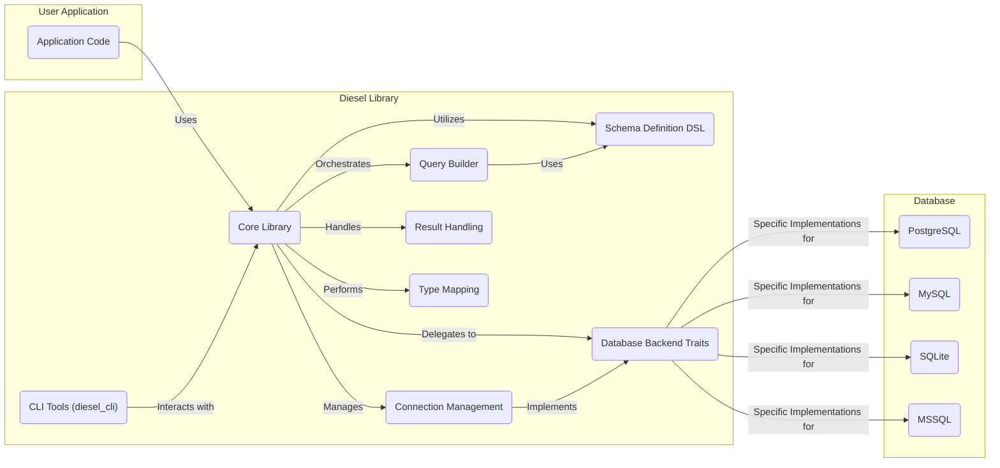
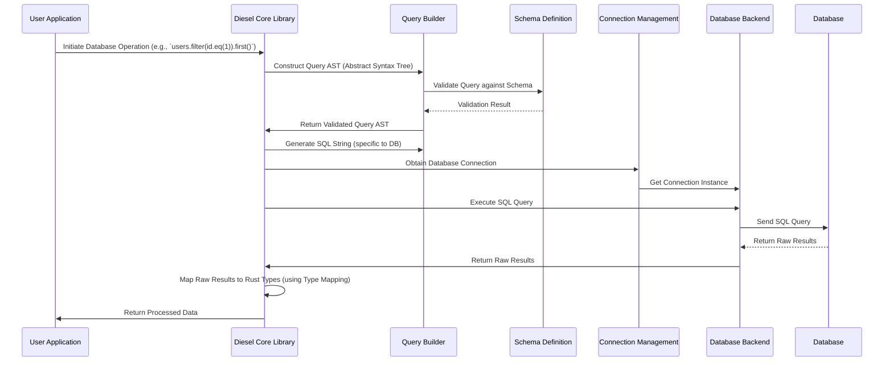

## Project Design Document: Diesel - A Safe and Extensible ORM and Query Builder

**Version:** 1.1
**Date:** October 26, 2023
**Author:** AI Architecture Expert

### 1. Introduction

This document provides an enhanced architectural design of the Diesel project, a Rust Object-Relational Mapper (ORM) and query builder. This revised document aims to provide a more detailed and nuanced understanding of the system's components, interactions, and data flow, specifically for threat modeling purposes. It builds upon the previous version by adding more detail and clarifying certain aspects. The design focuses on the core library functionality as found in the linked GitHub repository: [https://github.com/diesel-rs/diesel](https://github.com/diesel-rs/diesel).

### 2. Goals

*   Clearly define the major components of the Diesel library with greater detail.
*   Illustrate the interactions between these components, including data exchange and dependencies.
*   Describe the typical data flow within a Diesel-powered application with more granularity.
*   Identify key areas relevant for security considerations and potential threats, providing more specific examples.
*   Provide clear and accurate visual representations of the architecture and data flow using Mermaid diagrams.

### 3. Project Overview

Diesel is a robust and type-safe ORM and query builder for the Rust programming language. Its primary goals are to provide compile-time safety, prevent runtime errors related to database interactions, and offer a performant and developer-friendly experience. Diesel achieves this through its powerful type system and macro-based code generation. It supports a variety of popular database backends.

### 4. Architectural Design

The following diagram illustrates the refined high-level architecture of the Diesel library:

#### 4.1. Component Descriptions

*   **User Application ("Application Code"):** This represents the Rust application code that integrates and utilizes the Diesel library to perform database operations. This is the entry point for any database interaction.
*   **Diesel Library ("Core Library"):** This is the central orchestrator of the Diesel library. It provides the fundamental types, traits, and functions that other components rely on. It manages the overall lifecycle of database interactions, from query construction to result processing.
*   **Diesel Library ("Query Builder"):** This component offers a fluent and type-safe Domain Specific Language (DSL) for constructing SQL queries programmatically. It allows developers to build complex queries without writing raw SQL, reducing the risk of syntax errors and SQL injection vulnerabilities.
*   **Diesel Library ("Schema Definition DSL"):** This component provides a DSL within Rust for defining the database schema (tables, columns, types, constraints). Diesel uses this definition for compile-time validation and to generate efficient SQL. Changes to the schema are managed through migrations.
*   **Diesel Library ("Connection Management"):** This component is responsible for establishing, managing, and pooling connections to the database. It handles connection lifecycle, transaction management (start, commit, rollback), and ensures efficient resource utilization.
*   **Diesel Library ("Database Backend Traits"):** This defines a set of traits that different database backend implementations must adhere to. This abstraction layer allows Diesel to support multiple database systems while maintaining a consistent API.
*   **Diesel Library ("CLI Tools (diesel_cli)"):** This is a separate command-line tool that provides utilities for database schema management, including creating and running migrations, generating schema definitions from existing databases, and executing raw SQL queries for debugging or administrative tasks.
*   **Diesel Library ("Result Handling"):** This component deals with processing the results returned from the database. It handles potential errors, maps database-specific data types to Rust types, and provides mechanisms for iterating over result sets.
*   **Diesel Library ("Type Mapping"):** This component is responsible for mapping Rust data types to corresponding database column types and vice versa. This ensures type safety and correct data serialization and deserialization between the application and the database.
*   **Database ("PostgreSQL", "MySQL", "SQLite", "MSSQL"):** These represent the specific database management systems that Diesel supports. Each database has its own specific implementation of the `Database Backend Traits`.

#### 4.2. Component Interactions

*   The **User Application** initiates database interactions by using the **Core Library's** API.
*   The **Core Library** orchestrates the query building process by utilizing the **Query Builder**.
*   The **Core Library** relies on the **Schema Definition DSL** to understand the database structure and perform compile-time checks on queries.
*   The **Core Library** manages database connections through the **Connection Management** component.
*   The **Core Library** delegates the actual database communication to the specific **Database Backend Traits** implementation for the chosen database.
*   The **Core Library** uses the **Result Handling** component to process the data returned from the database.
*   The **Core Library** utilizes the **Type Mapping** component to convert data between Rust types and database types.
*   The **Query Builder** uses the information from the **Schema Definition DSL** to ensure the validity of the constructed queries.
*   The **Connection Management** component implements the **Database Backend Traits** to interact with specific databases.
*   The **CLI Tools** interact with the **Core Library** to perform administrative tasks, often bypassing the typical application data flow.

### 5. Data Flow

The following sequence diagram illustrates a more detailed data flow for executing a database query using Diesel:

#### 5.1. Data Flow Description

1. The **User Application** initiates a database operation using Diesel's API. This often involves methods provided by the **Core Library** and the **Query Builder**.
2. The **Core Library** delegates the initial query construction to the **Query Builder**, which builds an Abstract Syntax Tree (AST) representing the query.
3. The **Query Builder** consults the **Schema Definition** to validate the query against the defined database schema, ensuring type correctness and valid column/table references.
4. The **Schema Definition** returns the validation result to the **Query Builder**.
5. The **Query Builder** returns the validated Query AST to the **Diesel Core Library**.
6. The **Diesel Core Library** instructs the **Query Builder** to generate the final SQL string, tailored to the specific database backend being used.
7. The **Diesel Core Library** requests a database connection from the **Connection Management** component.
8. The **Connection Management** component retrieves or establishes a connection through the appropriate **Database Backend** implementation.
9. The **Diesel Core Library** passes the generated SQL query to the **Database Backend**.
10. The **Database Backend** sends the SQL query to the actual **Database**.
11. The **Database** executes the query and returns raw results to the **Database Backend**.
12. The **Database Backend** passes the raw results back to the **Diesel Core Library**.
13. The **Diesel Core Library** uses the **Type Mapping** component to map the raw database results into corresponding Rust data structures.
14. The **Diesel Core Library** returns the processed data to the **User Application**.

### 6. Security Considerations

This section expands on the previous security considerations, providing more specific examples and potential threats:

*   **SQL Injection Prevention:**
    *   Diesel's primary defense is its type-safe query builder. Parameterized queries are generated automatically, preventing the injection of arbitrary SQL code through user input.
    *   **Threat:** If raw SQL is used (via `sql_query`), the safety guarantees are lost, and SQL injection becomes a significant risk. Developers must exercise extreme caution when using this feature.
    *   **Mitigation:**  Discourage the use of `sql_query` unless absolutely necessary. Thoroughly sanitize any input used in raw SQL queries.
*   **Database Connection Security:**
    *   Secure storage and retrieval of database credentials are paramount.
    *   **Threat:** Hardcoding credentials in the application code or storing them in easily accessible configuration files exposes the database to unauthorized access.
    *   **Mitigation:** Utilize environment variables, secure configuration management tools (e.g., HashiCorp Vault), or cloud provider secrets management services to store credentials. Ensure proper file system permissions on configuration files.
*   **Dependency Management:**
    *   Vulnerabilities in database driver crates or other dependencies can indirectly impact the security of applications using Diesel.
    *   **Threat:** A compromised database driver could allow attackers to intercept or manipulate database communication.
    *   **Mitigation:** Regularly audit and update dependencies using tools like `cargo audit`. Subscribe to security advisories for relevant crates.
*   **Schema Definition Integrity:**
    *   The schema definition dictates how Diesel interacts with the database.
    *   **Threat:** If the schema definition is tampered with maliciously, it could lead to incorrect query generation or unexpected data manipulation.
    *   **Mitigation:** Secure the schema definition files and the process for applying migrations. Use version control for schema changes.
*   **CLI Tool Security (`diesel_cli`):**
    *   The `diesel_cli` tool has direct access to the database and should be protected.
    *   **Threat:** Unauthorized access to `diesel_cli` could allow attackers to modify the database schema, execute arbitrary SQL, or potentially gain access to sensitive data.
    *   **Mitigation:** Restrict access to the `diesel_cli` tool, especially in production environments. Use strong authentication for database connections used by the CLI.
*   **Database Backend Vulnerabilities:**
    *   While Diesel abstracts some interaction, vulnerabilities in the underlying database system can still be exploited.
    *   **Threat:** Known vulnerabilities in PostgreSQL, MySQL, etc., could be exploited if the database software is not kept up-to-date.
    *   **Mitigation:** Ensure the database software is patched and updated regularly. Follow security best practices for the specific database system.
*   **Error Handling:**
    *   Insufficient or overly verbose error handling can leak sensitive information.
    *   **Threat:** Error messages revealing database structure or internal application details can aid attackers in reconnaissance.
    *   **Mitigation:** Implement robust error handling that logs detailed errors securely but provides generic error messages to the user.
*   **Data Validation:**
    *   While Diesel provides type safety, application-level validation of data before persisting it to the database is still crucial.
    *   **Threat:**  Relying solely on database constraints might not be sufficient to prevent invalid or malicious data from entering the system.
    *   **Mitigation:** Implement thorough input validation in the application layer before interacting with Diesel to persist data.

### 7. Dependencies

Diesel relies on a set of external crates for its functionality. Key dependencies include:

*   **Database Driver Crates:**
    *   `postgres`: For PostgreSQL support.
    *   `mysqlclient`: For MySQL support.
    *   `rusqlite`: For SQLite support.
    *   `sqlserver`: For MSSQL support.
*   **Procedural Macro Crates:**
    *   `syn`: For parsing Rust code.
    *   `quote`: For generating Rust code.
    *   `proc-macro2`: A lower-level API for working with procedural macros.
*   **Utility Crates:**
    *   `chrono`: For date and time handling.
    *   `serde`: For serialization and deserialization (often used with database interactions).
    *   `dotenv`: For loading environment variables from `.env` files (useful for managing database credentials in development).

### 8. Deployment Considerations

Diesel is integrated as a library within a Rust application. Deployment considerations include:

*   **Environment-Specific Configurations:** Database connection details often vary between development, staging, and production environments. Use environment variables or configuration files to manage these differences.
*   **Connection Pooling:**  Properly configure connection pooling to optimize database resource utilization and performance, especially in high-traffic applications.
*   **Secure Communication:** Ensure secure communication between the application and the database, especially in cloud environments. Consider using TLS/SSL for database connections.
*   **Monitoring and Logging:** Implement monitoring and logging to track database interactions, identify potential performance issues, and detect security anomalies.

### 9. Future Considerations

Potential future enhancements and considerations for Diesel include:

*   **Enhanced Asynchronous Support:** Further improvements to asynchronous database operations for better concurrency.
*   **More Advanced Query Features:**  Support for more complex database-specific features and query optimizations.
*   **Improved Schema Migration Tools:**  More sophisticated tools for managing database schema changes and migrations.
*   **Integration with Other Ecosystem Tools:**  Deeper integration with other Rust libraries and frameworks.

This improved design document provides a more detailed and security-focused overview of the Diesel project's architecture. It serves as a valuable resource for understanding the system's inner workings and identifying potential areas of risk for threat modeling activities.
