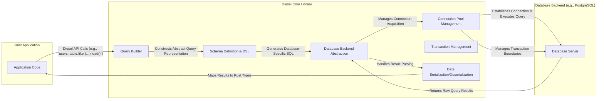

## Project Design Document: Diesel ORM (Improved)

**1. Introduction**

This document provides an enhanced architectural overview of the Diesel ORM (Object-Relational Mapper) project, focusing on details relevant for threat modeling. It outlines the key components, their interactions, data flow with greater granularity, and expanded security considerations. This document serves as a robust foundation for subsequent threat modeling activities.

**2. Project Overview**

Diesel is a robust and type-safe ORM and query builder for the Rust programming language. Its primary goal is to offer a compile-time verified interface for database interactions, thereby minimizing runtime errors and enhancing developer productivity. Diesel provides support for popular database systems including PostgreSQL, MySQL, and SQLite.

**3. Goals**

* Provide a memory-safe and type-safe mechanism for interacting with relational databases in Rust.
* Inherently prevent a wide range of SQL injection vulnerabilities through its architectural design.
* Offer a high-performance alternative to manual SQL query construction.
* Maintain support for multiple distinct database backends through a unified API.
* Offer a highly flexible and composable query building API that feels natural within Rust.

**4. Architecture Diagram**

**5. Component Breakdown**

* **Rust Application:** The user-written Rust code that leverages the Diesel library to perform database operations. This code defines the application's logic and data structures.
* **Diesel Core Library:** The core functionality of the ORM, encompassing various sub-components:
    * **Query Builder:**  Provides a fluent and type-safe Domain Specific Language (DSL) for constructing database queries. It takes Rust expressions representing database operations and translates them into an abstract query representation.
    * **Schema Definition & DSL:**  Allows developers to define their database schema directly within Rust code. This includes defining tables, columns with their types, constraints, and relationships. This information is used by the Query Builder for type checking and SQL generation.
    * **Connection Pool Management:**  Manages a pool of database connections to improve performance by reusing connections instead of establishing new ones for each query. This component handles connection acquisition, release, and potential reconnection logic.
    * **Transaction Management:** Provides mechanisms for managing database transactions, ensuring atomicity, consistency, isolation, and durability (ACID properties) of database operations. This includes starting, committing, and rolling back transactions.
    * **Data Serialization/Deserialization:** Responsible for converting data between Rust's type system and the database's data types. This involves mapping database rows to Rust structs and vice versa, handling type conversions and potential errors.
    * **Database Backend Abstraction:** Provides an abstraction layer over the specific database backends (PostgreSQL, MySQL, SQLite). This component handles the nuances of different SQL dialects and database communication protocols, allowing the rest of Diesel to operate agnostically.
* **Database Backend:** The specific relational database system being utilized (e.g., PostgreSQL, MySQL, SQLite). Diesel interacts with these backends through database-specific drivers managed by the Backend Abstraction layer.

**6. Data Flow (Detailed)**

1. **Query Initiation:** The Rust application code initiates a database operation using Diesel's API. This typically involves methods on table objects defined through the Schema Definition (e.g., `users::table.filter(users::columns::name.eq("John")).load(&mut connection)`).
2. **Abstract Query Construction:** The Query Builder takes the application's intent, expressed through the DSL, and constructs an internal, abstract representation of the query. This representation is independent of the specific database backend.
3. **SQL Generation:** The abstract query representation is passed to the Database Backend Abstraction component. This component translates the abstract query into the specific SQL dialect understood by the target database (e.g., PostgreSQL, MySQL, or SQLite). This is where parameterized queries are constructed to prevent SQL injection.
4. **Connection Acquisition:** The Backend Abstraction requests a database connection from the Connection Pool Management component. The connection pool either provides an existing idle connection or establishes a new one if necessary.
5. **Query Execution:** The generated SQL query is sent to the Database Backend for execution through the established connection.
6. **Result Retrieval (Raw):** The Database Backend executes the query and returns the raw results (typically in a binary format specific to the database protocol) to the Backend Abstraction component.
7. **Result Parsing:** The Backend Abstraction component parses the raw results from the database into a more structured format that Diesel can understand.
8. **Data Deserialization:** The Data Serialization/Deserialization component takes the parsed results and maps them into instances of Rust structs or other data types as defined in the application's code. This involves converting database types to corresponding Rust types.
9. **Data Return:** The deserialized data objects are returned to the Rust application code, allowing it to work with the retrieved information in a type-safe manner.
10. **Transaction Management (If Applicable):** If the operation is part of a transaction, the Transaction Management component ensures that all operations within the transaction are either committed atomically or rolled back in case of errors. This involves sending transaction control commands (e.g., `BEGIN`, `COMMIT`, `ROLLBACK`) to the Database Backend.

**7. Security Considerations (Expanded)**

* **SQL Injection Prevention (Core Design):** Diesel's fundamental design principle of using parameterized queries by default significantly mitigates the risk of SQL injection vulnerabilities. The Query Builder ensures that user-provided data is treated as data, not executable code, during SQL generation. Direct string interpolation for query building is discouraged and requires explicit unsafe operations.
* **Connection String Security (Application Responsibility):** The security of the database connection string (containing credentials) is primarily the responsibility of the application using Diesel. Best practices include:
    * Avoiding hardcoding credentials directly in the application code.
    * Utilizing environment variables for storing sensitive information.
    * Employing secure secrets management solutions (e.g., HashiCorp Vault, AWS Secrets Manager).
    * Restricting access to configuration files containing connection strings.
* **Data Validation (Application Layer):** While Diesel enforces type safety at the database interaction level, input validation at the application layer remains crucial. This prevents malformed or malicious data from even reaching Diesel, reducing the attack surface. Sanitize and validate user inputs before using them in Diesel queries.
* **Dependency Management (Supply Chain Security):** The security of Diesel itself is dependent on its transitive dependencies. Regularly auditing and updating dependencies using tools like `cargo audit` is essential to mitigate risks from known vulnerabilities in dependent crates.
* **Database Permissions (Principle of Least Privilege):** The database user credentials used by Diesel should adhere to the principle of least privilege. Grant only the necessary permissions (e.g., `SELECT`, `INSERT`, `UPDATE`, `DELETE` on specific tables) required for the application's functionality. Avoid using overly permissive database users (e.g., `root`).
* **Schema Management and Migrations:** Securely manage database schema changes using Diesel's migration features. Ensure that migration scripts are reviewed and applied in a controlled manner to prevent unintended data modifications or the introduction of vulnerabilities through schema changes.
* **Error Handling and Information Disclosure:** Implement robust error handling in the application to prevent sensitive database information (e.g., internal schema details, error messages) from being exposed to unauthorized users through error responses.
* **Denial of Service (DoS):** Be mindful of potential DoS attacks through resource exhaustion. Implement appropriate connection pooling limits and query timeouts to prevent the application from overwhelming the database.
* **Logging and Auditing:** Implement adequate logging of database interactions for auditing and security monitoring purposes. This can help in detecting and investigating suspicious activities.
* **TLS Encryption:** Ensure that connections between the application and the database are encrypted using TLS to protect data in transit, especially when communicating over untrusted networks. Configure the database connection to enforce TLS.

**8. Technology Stack**

* **Primary Programming Language:** Rust
* **Supported Database Systems:**
    * PostgreSQL
    * MySQL
    * SQLite
* **Build and Dependency Management:** Cargo
* **Database Drivers (Dependencies):**  Relies on database-specific Rust crates (e.g., `postgres`, `mysqlclient-sys`, `rusqlite`) for low-level database communication.

**9. Deployment Model**

Diesel, being a Rust library, is integrated directly into Rust applications. The deployment model is therefore dictated by how the encompassing Rust application is deployed. Common deployment scenarios include:

* **Standalone Executables:** The application, including the Diesel library, is compiled into a self-contained executable and deployed directly to a server or desktop environment. Security considerations here involve protecting the executable and its configuration.
* **Web Applications (Backend):** Diesel is commonly used within Rust-based web frameworks (e.g., Actix Web, Rocket, Warp) to handle data persistence. Deployment to web servers (e.g., Nginx, Apache) or cloud platforms (e.g., AWS EC2, Google Cloud Compute Engine, Azure Virtual Machines) requires securing the web server, application dependencies, and database connections.
* **Containerized Applications (Docker, Kubernetes):**  Deploying applications using Docker containers and orchestrating them with Kubernetes is a prevalent approach. Security considerations include securing the container images, managing secrets within the container environment, and network security between containers and the database.
* **Serverless Functions (AWS Lambda, Google Cloud Functions, Azure Functions):** Diesel can be used within serverless functions, although connection pooling and management might require careful consideration due to the ephemeral nature of these environments. Security focuses on function permissions, secure storage of connection details, and managing cold starts.

**10. Future Considerations (Beyond Initial Threat Model)**

* **Advanced Query Features Security:**  As Diesel evolves to support more complex features like full-text search, geospatial queries, or interaction with database-specific extensions, new security implications might arise that need to be analyzed.
* **Asynchronous Operations Security:** If Diesel introduces widespread asynchronous capabilities, the potential for race conditions or other concurrency-related vulnerabilities needs to be assessed.
* **Extensibility and Plugin Security:** If a plugin or extension mechanism is introduced, the security of these external components and their interaction with Diesel core would be a critical area of concern.
* **Query Caching Mechanisms:** If caching is implemented, ensuring cache invalidation and preventing the leakage of sensitive data through the cache becomes important.

This improved document provides a more detailed and nuanced understanding of the Diesel ORM's architecture and its security considerations. This enhanced level of detail will be beneficial for conducting a more comprehensive and effective threat modeling exercise.