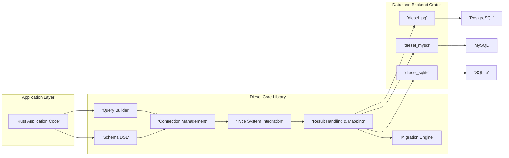
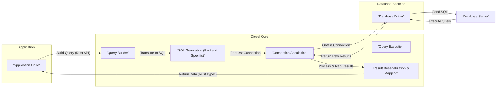

# Project Design Document: Diesel ORM

**Version:** 1.1
**Date:** October 26, 2023
**Author:** Gemini (AI Language Model)

## 1. Introduction

This document provides an enhanced and more detailed design overview of the Diesel ORM (Object-Relational Mapper) project, located at [https://github.com/diesel-rs/diesel](https://github.com/diesel-rs/diesel). This document aims to provide a comprehensive understanding of Diesel's architectural components, data flow mechanisms, and crucial security considerations. This detailed design will serve as a solid foundation for subsequent threat modeling activities.

## 2. Project Overview

Diesel is a robust, safe, and highly extensible Object-Relational Mapper (ORM) and query builder specifically designed for the Rust programming language. It offers a high-level, type-safe interface for interacting with various relational databases, empowering developers to construct database queries using idiomatic Rust code instead of writing raw SQL strings. Diesel prioritizes compile-time safety and runtime performance, effectively leveraging Rust's powerful type system to proactively prevent common database-related errors before execution.

## 3. Goals

* To furnish a type-safe and compile-time verified interface for all database interactions within Rust applications.
* To deliver a performant and efficient alternative to manual construction of raw SQL queries, reducing boilerplate and potential errors.
* To provide comprehensive support for a range of popular database backends, including but not limited to PostgreSQL, MySQL, and SQLite.
* To offer a highly flexible and extensible query builder that allows for complex and customized query construction.
* To equip developers with robust tools for managing database schemas and executing migrations in a safe and reliable manner.

## 4. Non-Goals

* To function as a complete application framework. Diesel's scope is deliberately limited to database interaction and management.
* To implement its own independent database engine. Diesel relies entirely on the capabilities of existing, established database systems.
* To offer a visual, drag-and-drop style query builder interface. The focus remains on a code-centric approach to query construction.
* To provide advanced real-time data synchronization or complex caching mechanisms beyond fundamental connection pooling.

## 5. Architecture

Diesel's architecture is structured in a layered fashion, promoting modularity and separation of concerns:

* **Application Layer:** This is where the Rust application code resides, directly utilizing the Diesel library to interact with the database.
* **Diesel Core Library:** The central component of Diesel, providing the core ORM functionalities, including the query builder, schema DSL, and connection management abstractions.
* **Database Backend Crates:** These are distinct, independent crates (e.g., `diesel_pg` for PostgreSQL, `diesel_mysql` for MySQL, `diesel_sqlite` for SQLite) that offer database-specific implementations and low-level driver integrations.
* **Database System:** The underlying relational database server itself (e.g., PostgreSQL, MySQL, SQLite) responsible for data storage and retrieval.

### 5.1. Components

* **Query Builder:**  A fluent and composable API that allows developers to construct SQL queries programmatically using Rust code. It enforces type safety, preventing many common SQL syntax and logical errors at compile time.
* **Schema DSL (Domain Specific Language):**  Enables developers to define their database schemas directly within Rust code. Diesel uses this schema definition for type checking, query generation, and migration management.
* **Connection Management:**  Responsible for establishing, managing, and pooling connections to the database. This includes handling connection lifecycle, timeouts, and potential errors during connection attempts.
* **Type System Integration:**  Deeply integrates with Rust's strong type system to map database tables and columns to corresponding Rust structs and types. This ensures data integrity and reduces the likelihood of type mismatches.
* **Result Handling & Mapping:** Provides a consistent and ergonomic way to handle the results of database operations. This includes error handling, and the automatic mapping of database rows to Rust structs based on the defined schema.
* **Migration Engine:**  A built-in system for managing database schema changes over time. It allows developers to define migrations in Rust code and apply them to the database in a controlled and versioned manner.
* **Database Backend Crates:** These crates contain the database-specific logic required for interacting with different database systems:
    * **SQL Dialect Generation:** Translating Diesel's abstract query representation into the specific SQL dialect understood by the target database.
    * **Data Type Mapping:**  Handling the conversion between database-specific data types and their corresponding Rust types.
    * **Low-Level Connection Implementation:** Providing the necessary drivers and interfaces to establish and maintain communication with the database server.

## 6. Data Flow

The typical sequence of operations for a database interaction using Diesel follows this path:

1. **Application Code:** The developer writes Rust code using Diesel's query builder or schema DSL to define the desired database operation (e.g., selecting data, inserting new records, updating existing entries).
2. **Query Builder:** Diesel's query builder constructs an internal, type-safe representation of the SQL query based on the provided Rust code.
3. **SQL Generation (Backend Specific):** The appropriate database backend crate (e.g., `diesel_pg`) takes the internal query representation and translates it into the specific SQL dialect required by the target database system.
4. **Connection Acquisition:** Diesel's connection management component retrieves an available database connection from its internal connection pool.
5. **Query Execution:** The generated SQL query is passed to the database driver.
6. **Database Driver:** The database driver uses the underlying database client library to send the SQL query to the database server.
7. **Database Server:** The database server receives and executes the SQL query against the database.
8. **Return Raw Results:** The database server returns the raw results of the query (typically in a tabular format) back to the database driver.
9. **Process & Map Results:** Diesel receives the raw results from the driver and processes them. This involves deserializing the data and mapping the database rows to instances of Rust structs or other data structures as defined in the schema.
10. **Return Data (Rust Types):** Finally, Diesel returns the processed data, now represented as strongly-typed Rust values, back to the application code.

## 7. Security Considerations

Security is a paramount concern when interacting with databases. Here are key security considerations for projects utilizing Diesel:

* **SQL Injection Prevention:** Diesel's core design inherently mitigates SQL injection vulnerabilities by employing parameterized queries. When using the standard query builder API, user-provided data is treated as parameters, preventing malicious SQL from being injected. However, the use of raw SQL via the `sql_query` function requires extreme caution and manual input sanitization to avoid vulnerabilities.
* **Database Credentials Management:** Securely storing and managing database credentials is the responsibility of the application utilizing Diesel. Avoid hardcoding credentials directly in the code. Employ secure methods such as environment variables, dedicated secrets management systems (e.g., HashiCorp Vault), or configuration files with restricted access.
* **Connection Security (Encryption):** Ensure that connections between the application and the database server are encrypted, especially in production environments. Configure both the database server and the Diesel backend crate to utilize TLS/SSL to protect data in transit.
* **Dependency Security:** Diesel relies on various crates within the Rust ecosystem. Regularly audit and update these dependencies to patch any known security vulnerabilities in those libraries. Use tools like `cargo audit` to identify potential issues.
* **Schema Security and Permissions:** The database schema itself and the associated user permissions are critical security aspects. Implement the principle of least privilege, granting only necessary permissions to the database user used by the application. Avoid using overly permissive database accounts.
* **Data Validation and Sanitization:** While Diesel provides type safety at the database interaction level, it's crucial to perform thorough input validation and sanitization within the application layer *before* data reaches Diesel. This helps prevent logic errors and potential exploits.
* **Error Handling and Information Disclosure:** Implement robust error handling to prevent sensitive information from being leaked in error messages. Avoid exposing database-specific error details to end-users. Log errors securely for debugging purposes.
* **Denial of Service (DoS) Attacks:** Be mindful of potential DoS attacks targeting the database through excessive or inefficient queries. Implement rate limiting or other protective measures at the application level to mitigate this risk. Optimize database queries to minimize resource consumption.
* **Data Breach Prevention:** Protecting the database server itself from unauthorized access is paramount. Implement strong authentication mechanisms, enforce network segmentation, keep the database software up-to-date with security patches, and regularly audit database access logs.
* **Migration Security:** Secure the process of applying database migrations. Ensure that only authorized personnel can execute migrations, and consider using checksums or other mechanisms to verify the integrity of migration scripts.

## 8. Deployment Considerations

Successfully deploying applications using Diesel involves several key considerations:

* **Database Backend Compatibility:**  Ensure that the correct Diesel backend crate is included in the project's dependencies and that it matches the target database system being used in the deployment environment.
* **Connection Pooling Configuration:**  Carefully tune the connection pool settings (e.g., maximum connections, minimum idle connections, connection timeout) based on the application's expected load and the database server's capacity. Incorrectly configured connection pools can lead to performance issues or resource exhaustion.
* **Migration Management Strategy:**  Establish a clear strategy for managing database schema migrations in different environments (development, staging, production). Automate the migration process as part of the deployment pipeline to ensure consistency.
* **Environment-Specific Configuration:**  Utilize environment variables or configuration files to manage database connection details (host, port, username, password) that vary across different deployment environments. Avoid hardcoding these values.
* **Monitoring and Logging:** Implement comprehensive monitoring and logging for database interactions. Track query performance, error rates, and connection pool statistics to identify potential issues and optimize performance.
* **Rollback Strategy:**  Have a well-defined rollback strategy for database migrations in case of errors or unexpected issues during deployment.
* **Disaster Recovery:**  Plan for disaster recovery scenarios, including regular database backups and procedures for restoring the database in case of failure.

## 9. Future Considerations

The Diesel project continues to evolve. Potential future enhancements and considerations include:

* **Enhanced Asynchronous Support:**  Further improvements to asynchronous capabilities to better leverage Rust's async/await features, leading to improved performance and concurrency in I/O-bound applications.
* **Support for More Advanced Database Features:**  Expanding support for more complex and database-specific features, such as window functions, common table expressions (CTEs), and advanced indexing strategies.
* **Improved Error Reporting and Diagnostics:**  Providing more detailed, context-rich, and actionable error messages to aid developers in debugging database-related issues.
* **Tighter Integration with the Rust Ecosystem:**  Exploring deeper integration with other popular Rust libraries and frameworks, such as web frameworks (e.g., Actix Web, Rocket) and testing frameworks.
* **Code Generation Improvements:**  Potentially enhancing code generation capabilities to further reduce boilerplate and improve developer ergonomics.
* **More Flexible Schema Introspection:**  Providing more powerful and flexible ways to introspect existing database schemas.

This revised document provides a more in-depth and comprehensive design overview of the Diesel ORM project. It aims to serve as a valuable resource for understanding the system's architecture, data flow, and critical security considerations, ultimately facilitating more effective threat modeling and secure application development.