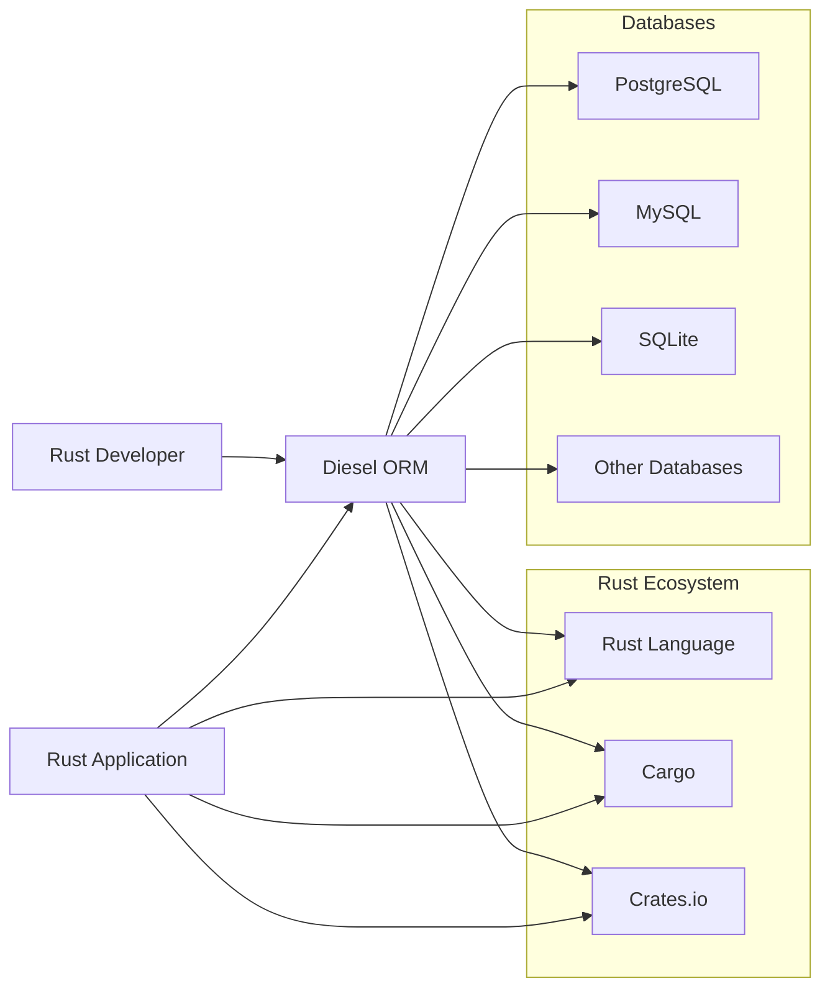
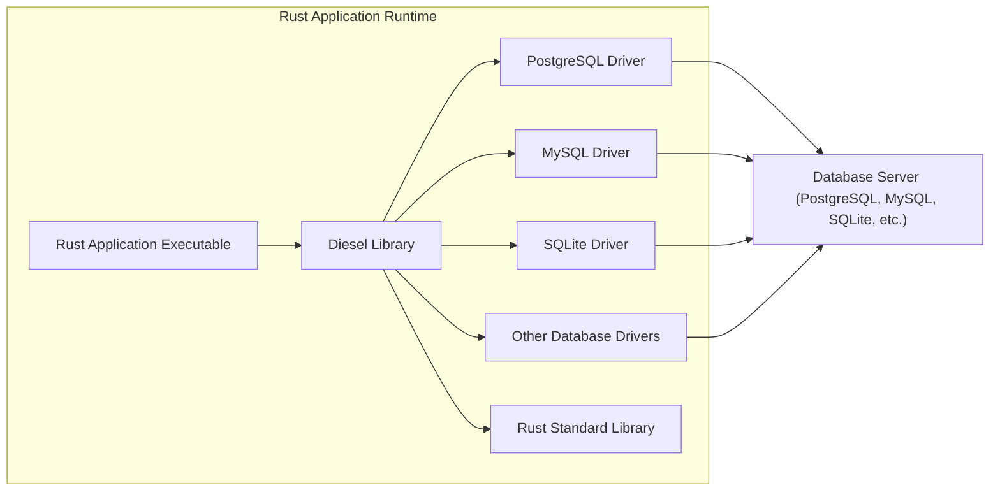
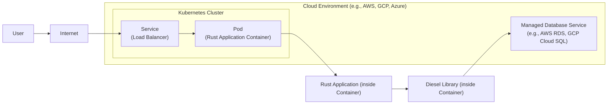
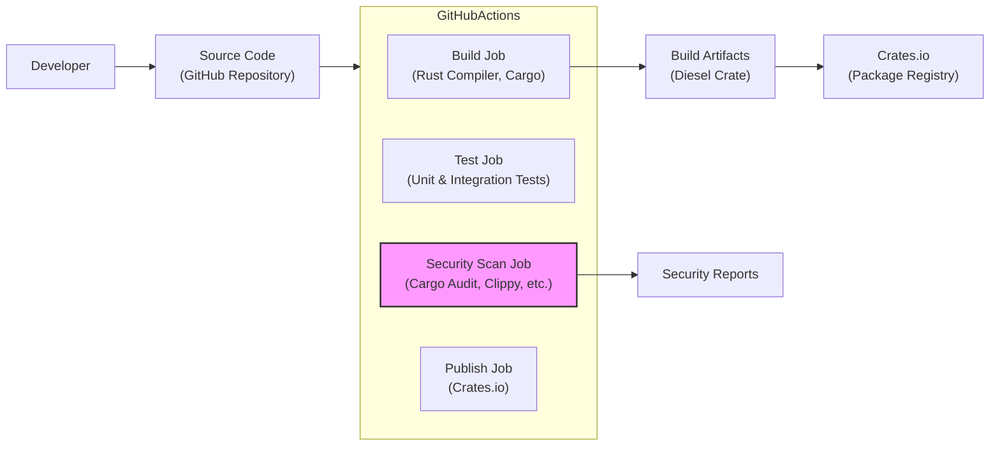

# BUSINESS POSTURE

This project, Diesel, is an Object Relational Mapper (ORM) written in Rust. Its primary business goal is to provide a safe, performant, and productive way for Rust developers to interact with databases. By abstracting away the complexities of raw SQL, Diesel aims to increase developer efficiency and reduce the likelihood of database-related errors in Rust applications.

The main business priorities for Diesel are:
- Developer Productivity: Simplifying database interactions for Rust developers, allowing them to focus on application logic rather than database intricacies.
- Performance: Ensuring efficient database queries and operations, minimizing overhead introduced by the ORM.
- Data Integrity: Providing compile-time safety and runtime checks to prevent common database errors and maintain data consistency.
- Database Agnosticism: Supporting multiple database systems (e.g., PostgreSQL, MySQL, SQLite) to offer flexibility to developers.
- Community Support: Building a strong and active community to ensure the project's long-term sustainability and improvement.

The most important business risks associated with Diesel are:
- Data Breaches: Vulnerabilities in Diesel or its usage could lead to unauthorized access to sensitive data stored in databases.
- Application Downtime: Bugs or performance issues in Diesel could cause application failures or slowdowns, impacting business operations.
- Data Corruption: Errors in data mapping or query generation could lead to data inconsistencies or corruption.
- Security Vulnerabilities in Dependencies: Diesel relies on external crates and database drivers, which could introduce security vulnerabilities if not properly managed.
- Adoption Risk: If developers perceive Diesel as too complex, insecure, or underperforming, adoption rates may be low, hindering its business goals.

# SECURITY POSTURE

Existing security controls for the Diesel project and its ecosystem include:
- security control: Rust's Memory Safety: Rust's core language features prevent many common memory safety vulnerabilities like buffer overflows and use-after-free errors, which can indirectly improve the security of applications using Diesel. Implemented by Rust compiler.
- security control: Database Security Mechanisms: Relies on underlying database systems for access control, authentication, and authorization. Described in database documentation.
- security control: Secure Coding Practices: The Diesel project aims to follow secure coding practices in its development. Evident in code reviews and issue discussions in the GitHub repository.
- security control: Dependency Management: Cargo, Rust's package manager, helps manage dependencies and their versions. Described in Cargo documentation.

Accepted risks for the Diesel project include:
- accepted risk: Vulnerabilities in Diesel Library: Despite best efforts, vulnerabilities might be discovered in the Diesel library itself. Mitigation relies on community security audits and timely patching.
- accepted risk: Insecure Application Code: Developers using Diesel might still write insecure application code that bypasses or misuses Diesel's features, leading to vulnerabilities. Mitigation relies on developer education and secure coding guidelines.
- accepted risk: Supply Chain Attacks: Dependencies of Diesel or its build process could be compromised, leading to supply chain attacks. Mitigation relies on dependency scanning and build process security.

Recommended security controls to implement for Diesel and projects using it:
- recommended security control: Static Analysis: Integrate static analysis tools (e.g., `cargo clippy`, `rustsec`) into the Diesel development and CI process to automatically detect potential security issues and coding flaws.
- recommended security control: Dependency Scanning: Regularly scan Diesel's dependencies for known vulnerabilities using tools like `cargo audit` and integrate this into the CI process.
- recommended security control: Security Audits: Conduct periodic security audits of the Diesel codebase by external security experts to identify and address potential vulnerabilities.
- recommended security control: Input Validation Guidance: Provide clear guidance and examples in Diesel documentation on how to perform input validation when using Diesel to prevent SQL injection vulnerabilities.
- recommended security control: Secure Configuration Examples: Offer secure configuration examples for common database setups and Diesel usage scenarios in the documentation.
- recommended security control: Fuzzing: Implement fuzzing techniques to automatically test Diesel's robustness and identify potential crash bugs or vulnerabilities.

Security requirements for Diesel and applications using it:
- Authentication:
    - Requirement: Diesel itself does not handle authentication. Authentication is delegated to the underlying database system. Applications using Diesel must configure database authentication properly.
    - Requirement: Applications should use strong authentication mechanisms provided by the database (e.g., password policies, multi-factor authentication where supported).
- Authorization:
    - Requirement: Diesel does not enforce authorization. Authorization logic must be implemented within the application code using Diesel.
    - Requirement: Applications should implement fine-grained authorization controls to ensure users only have access to the data and operations they are permitted to perform.
    - Requirement: Consider using database-level roles and permissions in conjunction with application-level authorization.
- Input Validation:
    - Requirement: Diesel helps prevent SQL injection by using parameterized queries. Developers must use Diesel's query builder and avoid constructing raw SQL queries from user input.
    - Requirement: Applications must validate all user inputs before using them in Diesel queries, even when using parameterized queries, to prevent other types of input-related vulnerabilities.
    - Requirement: Diesel documentation should provide clear guidelines and examples on how to perform input validation effectively.
- Cryptography:
    - Requirement: Diesel itself does not provide cryptographic functions. If applications need to handle sensitive data that requires encryption, they should use Rust's cryptographic libraries (e.g., `ring`, `rust-crypto`).
    - Requirement: When storing sensitive data in the database, consider using database-level encryption features or encrypting data at the application level before storing it using Diesel.
    - Requirement: Ensure secure handling of cryptographic keys and secrets used for encryption.

# DESIGN

## C4 CONTEXT

Context Diagram Elements:

- Element:
    - Name: Rust Developer
    - Type: Person
    - Description: Software developers who use Rust programming language to build applications.
    - Responsibilities: Develops Rust applications that interact with databases. Uses Diesel ORM to simplify database interactions.
    - Security controls: Follows secure coding practices, performs input validation in application code, implements application-level authorization.

- Element:
    - Name: Rust Application
    - Type: Software System
    - Description: Applications built using Rust programming language that require database interaction.
    - Responsibilities: Provides business logic, interacts with users, stores and retrieves data from databases using Diesel.
    - Security controls: Implements authentication and authorization, performs input validation, handles sensitive data securely, uses HTTPS for external communication.

- Element:
    - Name: Diesel ORM
    - Type: Software System
    - Description: Object Relational Mapper library written in Rust, providing a safe and efficient way to interact with databases.
    - Responsibilities: Abstracting database interactions, generating SQL queries, mapping database data to Rust data structures, preventing SQL injection.
    - Security controls: Parameterized queries, compile-time query checks, aims for memory safety through Rust language features.

- Element:
    - Name: PostgreSQL
    - Type: Software System
    - Description: A popular open-source relational database management system supported by Diesel.
    - Responsibilities: Storing application data, managing data integrity, providing database-level access control and security features.
    - Security controls: Database authentication, authorization, encryption at rest and in transit, audit logging.

- Element:
    - Name: MySQL
    - Type: Software System
    - Description: A popular open-source relational database management system supported by Diesel.
    - Responsibilities: Storing application data, managing data integrity, providing database-level access control and security features.
    - Security controls: Database authentication, authorization, encryption at rest and in transit, audit logging.

- Element:
    - Name: SQLite
    - Type: Software System
    - Description: A lightweight, file-based relational database management system supported by Diesel.
    - Responsibilities: Storing application data, managing data integrity, providing file-based access control.
    - Security controls: File system permissions, encryption extensions (if used).

- Element:
    - Name: Other Databases
    - Type: Software System
    - Description: Other database systems potentially supported by Diesel through extensions or community efforts.
    - Responsibilities: Storing application data, managing data integrity, providing database-level access control and security features.
    - Security controls: Database specific security controls.

- Element:
    - Name: Rust Language
    - Type: Technology
    - Description: The Rust programming language, providing memory safety and performance.
    - Responsibilities: Providing a safe and efficient environment for developing Diesel and Rust applications.
    - Security controls: Memory safety features, strong type system.

- Element:
    - Name: Cargo
    - Type: Tool
    - Description: Rust's package manager and build tool.
    - Responsibilities: Managing dependencies, building Rust projects, running tests.
    - Security controls: Dependency management, build process integrity.

- Element:
    - Name: Crates.io
    - Type: Platform
    - Description: The official package registry for Rust crates (libraries).
    - Responsibilities: Hosting and distributing Rust crates, including Diesel.
    - Security controls: Package signing, vulnerability reporting.

## C4 CONTAINER

Container Diagram Elements:

- Element:
    - Name: Rust Application Executable
    - Type: Application
    - Description: The compiled executable of the Rust application that uses Diesel.
    - Responsibilities: Executes application logic, interacts with Diesel library, handles user requests.
    - Security controls: Application-level authentication and authorization, input validation, secure session management, error handling.

- Element:
    - Name: Diesel Library
    - Type: Library
    - Description: The Diesel ORM library, providing APIs for database interaction.
    - Responsibilities: Query building, data mapping, database connection management, preventing SQL injection.
    - Security controls: Parameterized queries, compile-time query checks, memory safety (Rust).

- Element:
    - Name: PostgreSQL Driver
    - Type: Library
    - Description: Rust driver for connecting to PostgreSQL databases.
    - Responsibilities: Establishing connections to PostgreSQL, sending and receiving data, handling PostgreSQL-specific protocols.
    - Security controls: Secure connection establishment (TLS/SSL), authentication with PostgreSQL.

- Element:
    - Name: MySQL Driver
    - Type: Library
    - Description: Rust driver for connecting to MySQL databases.
    - Responsibilities: Establishing connections to MySQL, sending and receiving data, handling MySQL-specific protocols.
    - Security controls: Secure connection establishment (TLS/SSL), authentication with MySQL.

- Element:
    - Name: SQLite Driver
    - Type: Library
    - Description: Rust driver for connecting to SQLite databases.
    - Responsibilities: Interacting with SQLite database files, handling SQLite-specific operations.
    - Security controls: File access permissions, potentially encryption extensions for SQLite.

- Element:
    - Name: Other Database Drivers
    - Type: Library
    - Description: Drivers for other databases supported by Diesel.
    - Responsibilities: Establishing connections, data transfer, database-specific protocol handling.
    - Security controls: Database-specific security controls in drivers.

- Element:
    - Name: Rust Standard Library
    - Type: Library
    - Description: The standard library provided by Rust, used by Diesel and Rust applications.
    - Responsibilities: Providing core functionalities like networking, file I/O, data structures.
    - Security controls: Memory safety, secure implementations of standard functionalities.

- Element:
    - Name: Database Server (PostgreSQL, MySQL, SQLite, etc.)
    - Type: Database
    - Description: The database server instance (PostgreSQL, MySQL) or database file (SQLite) that stores application data.
    - Responsibilities: Data persistence, data integrity, access control, query processing.
    - Security controls: Database authentication, authorization, encryption at rest and in transit, audit logging, network security (firewalls).

## DEPLOYMENT

Deployment of Diesel itself is not applicable as it is a library. Deployment refers to how a Rust application *using* Diesel is deployed. A common deployment scenario is using containers in a cloud environment.

Deployment Diagram Elements:

- Element:
    - Name: Kubernetes Cluster
    - Type: Infrastructure
    - Description: A cluster of virtual machines managed by Kubernetes for container orchestration.
    - Responsibilities: Running and managing containerized applications, providing scalability and resilience.
    - Security controls: Network policies, RBAC (Role-Based Access Control), container security context, secrets management, regular security updates.

- Element:
    - Name: Pod (Rust Application Container)
    - Type: Container
    - Description: A Kubernetes Pod containing the Docker container for the Rust application using Diesel.
    - Responsibilities: Running the Rust application, interacting with Diesel library and database.
    - Security controls: Container image scanning, least privilege user, resource limits, network isolation within the pod.

- Element:
    - Name: Service (Load Balancer)
    - Type: Infrastructure
    - Description: Kubernetes Service of type LoadBalancer, providing external access to the application.
    - Responsibilities: Load balancing traffic to application pods, exposing the application to the internet.
    - Security controls: HTTPS termination, network security groups, DDoS protection.

- Element:
    - Name: Managed Database Service (e.g., AWS RDS, GCP Cloud SQL)
    - Type: Managed Service
    - Description: A managed database service provided by the cloud provider, simplifying database management.
    - Responsibilities: Hosting and managing the database (PostgreSQL, MySQL), providing backups, high availability, and security features.
    - Security controls: Database encryption at rest and in transit, database access control, regular patching, audit logging, network isolation.

- Element:
    - Name: Internet
    - Type: Network
    - Description: The public internet.
    - Responsibilities: Public network for user access.
    - Security controls: DDoS protection, firewall.

- Element:
    - Name: User
    - Type: Person
    - Description: End-user accessing the Rust application.
    - Responsibilities: Interacting with the application.
    - Security controls: Strong passwords, multi-factor authentication (if applicable).

## BUILD

Build Process Diagram Elements:

- Element:
    - Name: Developer
    - Type: Person
    - Description: Software developer contributing to the Diesel project.
    - Responsibilities: Writing code, committing changes to the GitHub repository.
    - Security controls: Secure development environment, code reviews, access control to the repository.

- Element:
    - Name: Source Code (GitHub Repository)
    - Type: Code Repository
    - Description: The GitHub repository hosting the Diesel source code.
    - Responsibilities: Version control, code storage, collaboration platform.
    - Security controls: Access control (authentication and authorization), branch protection, audit logging.

- Element:
    - Name: GitHub Actions (CI/CD Pipeline)
    - Type: CI/CD System
    - Description: GitHub's built-in CI/CD service used for automating the build, test, and release process of Diesel.
    - Responsibilities: Automated build, testing, security scanning, and publishing of Diesel crate.
    - Security controls: Secure pipeline configuration, secrets management, access control to workflows, audit logging.

- Element:
    - Name: Build Job (Rust Compiler, Cargo)
    - Type: Build Process
    - Description: GitHub Actions job that compiles the Rust code using `rustc` and `cargo`.
    - Responsibilities: Compiling Rust code, resolving dependencies, creating build artifacts.
    - Security controls: Use of trusted build environment, dependency integrity checks.

- Element:
    - Name: Test Job (Unit & Integration Tests)
    - Type: Test Process
    - Description: GitHub Actions job that runs unit and integration tests for Diesel.
    - Responsibilities: Ensuring code quality and functionality, detecting bugs early.
    - Security controls: Test environment isolation, secure test data management.

- Element:
    - Name: Security Scan Job (Cargo Audit, Clippy, etc.)
    - Type: Security Tooling
    - Description: GitHub Actions job that performs security scans using tools like `cargo audit`, `cargo clippy`, and potentially SAST tools.
    - Responsibilities: Identifying potential vulnerabilities in dependencies and code, enforcing coding standards.
    - Security controls: Regularly updated vulnerability databases, secure configuration of scanning tools.

- Element:
    - Name: Publish Job (Crates.io)
    - Type: Release Process
    - Description: GitHub Actions job that publishes the built Diesel crate to Crates.io.
    - Responsibilities: Releasing new versions of Diesel to the Rust community.
    - Security controls: Secure credentials management for Crates.io, package signing.

- Element:
    - Name: Build Artifacts (Diesel Crate)
    - Type: Software Artifact
    - Description: The compiled Diesel crate ready for distribution.
    - Responsibilities: Providing the distributable package of Diesel library.
    - Security controls: Integrity checks (checksums, signatures).

- Element:
    - Name: Crates.io (Package Registry)
    - Type: Package Registry
    - Description: The official Rust package registry where Diesel crate is published.
    - Responsibilities: Hosting and distributing Rust crates, including Diesel.
    - Security controls: Package signing, vulnerability reporting, access control.

- Element:
    - Name: Security Reports
    - Type: Report
    - Description: Reports generated by security scanning tools, detailing potential vulnerabilities and code quality issues.
    - Responsibilities: Providing feedback to developers on security and code quality.
    - Security controls: Secure storage and access control to security reports.

# RISK ASSESSMENT

Critical business process being protected:
- Secure and reliable data access for Rust applications using Diesel. This includes data persistence, retrieval, and manipulation.

Data being protected and its sensitivity:
- Application data stored in databases accessed through Diesel. The sensitivity of this data depends entirely on the applications using Diesel. It can range from publicly available information to highly sensitive personal or financial data.
- Diesel library code itself. Protecting the integrity and security of the Diesel library is crucial to prevent vulnerabilities in applications that depend on it.

Data sensitivity levels can be categorized as:
- Public: Non-sensitive data, publicly accessible.
- Internal: Data intended for internal use within an organization, not publicly accessible.
- Confidential: Sensitive data that requires strict access control and confidentiality, such as personal data, financial records, or trade secrets.

The risk assessment should be performed in the context of the specific application using Diesel, considering the sensitivity of the data it handles and the potential impact of security breaches.

# QUESTIONS & ASSUMPTIONS

Questions:
- What is the intended deployment environment for applications using Diesel? (Cloud, on-premise, hybrid?)
- What type of data will applications using Diesel handle, and what is its sensitivity level?
- What are the specific compliance requirements for applications using Diesel (e.g., GDPR, HIPAA, PCI DSS)?
- What is the organization's risk appetite regarding security vulnerabilities in open-source libraries?
- Are there any existing security policies or guidelines that applications using Diesel must adhere to?

Assumptions:
- Applications using Diesel will handle some level of sensitive data, requiring appropriate security measures.
- The target deployment environment is likely to include cloud environments and containerization.
- Security is a significant concern for projects using Diesel, and proactive security measures are desired.
- Developers using Diesel are expected to follow secure coding practices and utilize Diesel's security features correctly.
- The organization deploying applications using Diesel has a moderate to high risk awareness and is willing to invest in security controls.