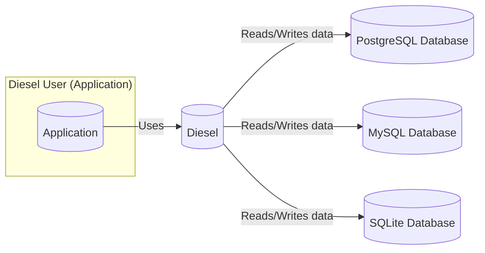
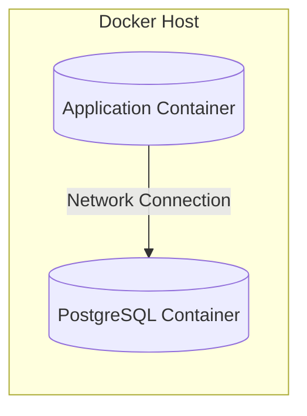

Okay, let's create a design document for the Diesel Rust ORM project, keeping in mind its purpose and potential security considerations.

# BUSINESS POSTURE

Diesel is a popular Rust ORM (Object-Relational Mapper) and query builder.  It aims to provide a safe and efficient way for Rust applications to interact with databases.  The primary business goals are:

*   Productivity:  Enable developers to interact with databases in a type-safe and expressive manner, reducing boilerplate and increasing development speed.
*   Performance:  Provide a high-performance database interaction layer, leveraging Rust's speed and efficiency.
*   Correctness:  Ensure that database interactions are correct and prevent common errors like SQL injection through compile-time checks.
*   Maintainability: Offer a clean and well-documented API that is easy to understand and maintain.
*   Extensibility: Support multiple database backends (PostgreSQL, MySQL, SQLite) and allow for custom extensions.

The most important business risks that need to be addressed are:

*   Data Breaches:  Vulnerabilities in Diesel could lead to unauthorized access to sensitive data stored in databases.
*   Data Corruption:  Bugs or incorrect usage of Diesel could lead to data corruption or loss.
*   Denial of Service:  Exploitable vulnerabilities could allow attackers to disrupt database access for applications using Diesel.
*   Reputation Damage:  Security incidents or major bugs could damage the reputation of Diesel and the applications that rely on it.
*   Supply Chain Attacks: Compromised dependencies or build processes could introduce vulnerabilities into Diesel.

# SECURITY POSTURE

Existing security controls and accepted risks (based on the GitHub repository and common practices):

*   security control:  Type Safety:  Rust's strong type system and ownership model provide inherent protection against many common memory safety vulnerabilities (e.g., buffer overflows, use-after-free) that often plague C/C++ ORMs. Implemented in Rust language.
*   security control:  Compile-Time Query Checking:  Diesel's query builder uses Rust's macro system to perform compile-time checks of SQL syntax and type compatibility, preventing many SQL injection vulnerabilities and runtime errors. Implemented in Diesel's query builder.
*   security control:  Parameterized Queries:  Diesel encourages the use of parameterized queries, which are the primary defense against SQL injection.  This separates data from SQL code, preventing attackers from injecting malicious SQL commands. Implemented in Diesel's query builder.
*   security control:  Regular Dependency Updates:  The project appears to actively manage dependencies, reducing the risk of known vulnerabilities in third-party libraries. Implemented in Cargo.toml and CI workflows.
*   security control:  Continuous Integration (CI):  The project uses CI (GitHub Actions) to automatically run tests and checks on every commit and pull request, helping to catch bugs and regressions early. Implemented in GitHub Actions workflows.
*   security control:  Code Reviews:  All changes go through a pull request process, which likely includes code reviews by other maintainers, improving code quality and security. Implemented in GitHub pull request process.
*   security control:  Fuzz Testing: Diesel includes fuzz tests to find potential vulnerabilities and edge cases. Implemented in `diesel_tests/fuzz`.
*   accepted risk:  Database-Specific Vulnerabilities:  Diesel relies on underlying database drivers (e.g., `libpq` for PostgreSQL).  Vulnerabilities in these drivers are outside the direct control of the Diesel project, although Diesel should aim to use secure configurations and stay up-to-date with driver releases.
*   accepted risk:  Incorrect Usage:  While Diesel provides many safety features, it's still possible for developers to misuse the library in ways that introduce security vulnerabilities (e.g., constructing raw SQL queries unsafely, disabling security features).
*   accepted risk:  Denial of Service via Resource Exhaustion: Complex or inefficient queries generated through Diesel could potentially lead to database resource exhaustion (CPU, memory, connections), causing a denial-of-service condition. This is partially mitigated by the performance focus of Diesel, but ultimately depends on the queries written by the user.

Recommended security controls (high priority):

*   security control:  Security Audits:  Regular, independent security audits of the Diesel codebase would help identify potential vulnerabilities that might be missed by internal reviews and testing.
*   security control:  Static Analysis:  Integrate static analysis tools (e.g., Clippy, RustSec) into the CI pipeline to automatically detect potential security issues and code quality problems.
*   security control:  Documentation on Secure Usage:  Provide clear and comprehensive documentation on how to use Diesel securely, including best practices for avoiding common pitfalls and vulnerabilities.

Security Requirements:

*   Authentication: Diesel itself does not handle authentication *to* the database. It relies on the underlying database connection configuration (e.g., providing credentials in a connection string or environment variables).  However, Diesel *should* support secure authentication mechanisms provided by the database drivers (e.g., using TLS/SSL for encrypted connections, using strong password hashing algorithms).
*   Authorization: Diesel does not implement application-level authorization. Authorization (who can access what data) is typically handled by the database itself (e.g., using database roles and permissions) or by the application logic using Diesel. Diesel should not bypass or interfere with database-level authorization mechanisms.
*   Input Validation: Diesel's query builder and schema definition features provide strong input validation at compile time, preventing many SQL injection vulnerabilities.  However, any user-provided data used to construct queries (even indirectly) should be carefully validated to prevent unexpected behavior or vulnerabilities.
*   Cryptography: Diesel should use secure cryptographic practices where appropriate. This primarily relates to:
    *   Database Connection Security:  Supporting TLS/SSL encryption for database connections to protect data in transit.
    *   Data Encryption at Rest:  Diesel should be compatible with database-level encryption at rest features (if used). Diesel itself does not handle data encryption at rest.
    *   Password Storage: Diesel does not directly handle password storage. This is the responsibility of the application using Diesel.

# DESIGN

## C4 CONTEXT



Element Descriptions:

*   Element:
    *   Name: Diesel User (Application)
    *   Type: Person
    *   Description: A developer or application using Diesel to interact with a database.
    *   Responsibilities:
        *   Defines database schema using Diesel's DSL.
        *   Constructs queries using Diesel's query builder.
        *   Handles database connection configuration.
        *   Processes data retrieved from the database.
    *   Security controls:
        *   Input validation of user-provided data.
        *   Secure handling of database credentials.
        *   Implementation of application-level authorization logic.

*   Element:
    *   Name: Diesel
    *   Type: Software System
    *   Description: The Diesel ORM and query builder library.
    *   Responsibilities:
        *   Provides a type-safe and expressive API for interacting with databases.
        *   Translates Rust code into SQL queries.
        *   Manages database connections (through underlying drivers).
        *   Performs compile-time query checking.
    *   Security controls:
        *   Compile-time query checking.
        *   Parameterized queries.
        *   Type safety.
        *   Regular dependency updates.
        *   Fuzz testing.

*   Element:
    *   Name: PostgreSQL Database
    *   Type: Software System
    *   Description: A PostgreSQL database instance.
    *   Responsibilities:
        *   Stores and manages data.
        *   Executes SQL queries.
        *   Enforces database-level security constraints (e.g., roles, permissions).
    *   Security controls:
        *   Database-level access control (roles, permissions).
        *   Network security (firewall, etc.).
        *   Encryption at rest (if configured).
        *   Regular security updates and patching.

*   Element:
    *   Name: MySQL Database
    *   Type: Software System
    *   Description: A MySQL database instance.
    *   Responsibilities:
        *   Stores and manages data.
        *   Executes SQL queries.
        *   Enforces database-level security constraints.
    *   Security controls:
        *   Database-level access control.
        *   Network security.
        *   Encryption at rest (if configured).
        *   Regular security updates and patching.

*   Element:
    *   Name: SQLite Database
    *   Type: Software System
    *   Description: An SQLite database instance.
    *   Responsibilities:
        *   Stores and manages data.
        *   Executes SQL queries.
    *   Security controls:
        *   File system permissions (controlling access to the database file).
        *   Encryption at rest (if configured, e.g., using SEE or other extensions).

## C4 CONTAINER

```mermaid
graph LR
    subgraph Diesel User["Diesel User (Application)"]
        direction LR
        App[(Application Code)]
    end

    subgraph Diesel[(Diesel)]
        direction LR
        QueryBuilder[(Query Builder)]
        Schema[(Schema Definition)]
        Connection[(Connection Management)]
        Driver[(Database Driver Adapter)]
    end

    PostgreSQL[(PostgreSQL Database)]
    MySQL[(MySQL Database)]
    SQLite[(SQLite Database)]
    PostgresDriver[("libpq (Postgres Driver)")]
    MySQLDriver[("MySQL C Driver")]
    SQLiteDriver[("SQLite C Driver")]

    App -- "Uses" --> QueryBuilder
    App -- "Uses" --> Schema
    QueryBuilder -- "Uses" --> Connection
    Schema -- "Uses" --> Connection
    Connection -- "Uses" --> Driver
    Driver -- "Uses" --> PostgresDriver
    Driver -- "Uses" --> MySQLDriver
    Driver -- "Uses" --> SQLiteDriver
    PostgresDriver -- "Communicates with" --> PostgreSQL
    MySQLDriver -- "Communicates with" --> MySQL
    SQLiteDriver -- "Communicates with" --> SQLite
```

Element Descriptions:

*   Element:
    *   Name: Application Code
    *   Type: Container
    *   Description: The code of the application using Diesel.
    *   Responsibilities:
        *   Defines the application's data models and business logic.
        *   Uses Diesel's API to interact with the database.
    *   Security controls:
        *   Input validation.
        *   Secure handling of database credentials.
        *   Application-level authorization.

*   Element:
    *   Name: Query Builder
    *   Type: Container
    *   Description: Diesel's component for constructing SQL queries in a type-safe manner.
    *   Responsibilities:
        *   Provides a DSL for building queries.
        *   Performs compile-time checks of query syntax and type compatibility.
        *   Generates SQL queries from the DSL.
    *   Security controls:
        *   Compile-time query checking.
        *   Parameterized queries.

*   Element:
    *   Name: Schema Definition
    *   Type: Container
    *   Description: Diesel's component for defining the database schema in Rust code.
    *   Responsibilities:
        *   Defines tables, columns, and relationships.
        *   Provides type information for query building and result mapping.
    *   Security controls:
        *   Type safety.

*   Element:
    *   Name: Connection Management
    *   Type: Container
    *   Description: Diesel's component for managing database connections.
    *   Responsibilities:
        *   Establishes and maintains connections to the database.
        *   Handles connection pooling (if configured).
    *   Security controls:
        *   Secure connection configuration (e.g., TLS/SSL).

*   Element:
    *   Name: Database Driver Adapter
    *   Type: Container
    *   Description: A layer that adapts Diesel to specific database drivers.
    *   Responsibilities:
        *   Provides a common interface for interacting with different database drivers.
        *   Translates Diesel's internal representation of queries and data into driver-specific calls.
    *   Security controls:
        *   Relies on the security of the underlying database drivers.

*   Element:
    *   Name: libpq (Postgres Driver)
    *   Type: Library
    *   Description: The official PostgreSQL C driver library.
    *   Responsibilities: Provides low-level communication with PostgreSQL databases.
    *   Security controls: Implements PostgreSQL's security features (e.g., TLS/SSL, authentication).

*   Element:
    *   Name: MySQL C Driver
    *   Type: Library
    *   Description: The official MySQL C driver library.
    *   Responsibilities: Provides low-level communication with MySQL databases.
    *   Security controls: Implements MySQL's security features.

*   Element:
    *   Name: SQLite C Driver
    *   Type: Library
    *   Description: The SQLite C library.
    *   Responsibilities: Provides low-level communication with SQLite databases.
    *   Security controls: Implements SQLite's security features (e.g., file permissions, encryption extensions).

*   Element:
    *   Name: PostgreSQL Database, MySQL Database, SQLite Database
    *   Type: Software System
    *   Description: Same as in C4 Context diagram.

## DEPLOYMENT

Diesel, as a library, is not "deployed" in the traditional sense. It becomes part of the application that uses it. Therefore, the deployment diagram focuses on how an application *using* Diesel might be deployed.  We'll consider a few common scenarios and then detail one:

Possible Deployment Solutions:

1.  Single Server:  Application and database on the same server.
2.  Separate Servers:  Application and database on separate servers (physical or virtual).
3.  Cloud-Based (e.g., AWS, Azure, GCP):  Application running on a compute instance (e.g., EC2, VM) and database using a managed database service (e.g., RDS, Cloud SQL).
4.  Containerized (e.g., Docker, Kubernetes): Application and database running in separate containers, potentially orchestrated by Kubernetes.

Chosen Solution (for detailed description):  Containerized Deployment with Docker and PostgreSQL.



Element Descriptions:

*   Element:
    *   Name: Docker Host
    *   Type: Infrastructure Node
    *   Description: The physical or virtual machine running the Docker engine.
    *   Responsibilities:
        *   Hosts and runs Docker containers.
        *   Provides resources (CPU, memory, storage) to containers.
    *   Security controls:
        *   Operating system security (updates, firewall, etc.).
        *   Docker daemon security configuration.
        *   Network security (restricting access to the Docker host).

*   Element:
    *   Name: Application Container
    *   Type: Container
    *   Description: A Docker container running the application that uses Diesel.
    *   Responsibilities:
        *   Executes the application code.
        *   Connects to the database container.
    *   Security controls:
        *   Minimal base image (reducing attack surface).
        *   Secure container configuration (e.g., non-root user, limited capabilities).
        *   Regular image updates (to patch vulnerabilities).

*   Element:
    *   Name: PostgreSQL Container
    *   Type: Container
    *   Description: A Docker container running the PostgreSQL database.
    *   Responsibilities:
        *   Runs the PostgreSQL database server.
        *   Stores and manages data.
    *   Security controls:
        *   Official PostgreSQL image (or a trusted base image).
        *   Secure database configuration (e.g., strong passwords, limited access).
        *   Regular image updates.
        *   Data volume mounted securely (if persistent storage is needed).

## BUILD

The build process for an application using Diesel typically involves the following steps, with a focus on security:

```mermaid
graph LR
    Developer[(Developer)] --> GitRepo[(Git Repository)]
    GitRepo -- "Push" --> CI[(CI Server (e.g., GitHub Actions))]
    CI -- "Cargo Build" --> Build[(Build Process)]
    CI -- "Cargo Test" --> Test[(Test Process)]
    CI -- "Cargo Clippy" --> Lint[(Linting (Clippy))]
    CI -- "Cargo Audit" --> Audit[(Dependency Audit (cargo-audit))]
    CI -- "Fuzz Tests" --> Fuzz[(Fuzz Testing)]
    Build -- "Creates" --> Artifact[(Application Binary)]
    Test -- "Pass/Fail" --> CI
    Lint -- "Pass/Fail" --> CI
    Audit -- "Pass/Fail" --> CI
    Fuzz -- "Pass/Fail" --> CI
    CI -- "If all Pass" --> Publish[(Publish Artifact)]
```

Description:

1.  Developer: The developer writes code and commits it to a Git repository.
2.  Git Repository:  The code is stored in a Git repository (e.g., GitHub, GitLab).
3.  CI Server:  A continuous integration server (e.g., GitHub Actions, Jenkins) is triggered by changes to the repository.
4.  Cargo Build:  The CI server uses `cargo build` to compile the Rust code, including Diesel and the application logic. This leverages Rust's inherent memory safety and compile-time checks.
5.  Cargo Test:  The CI server uses `cargo test` to run unit and integration tests.  This helps ensure the correctness of the code and can catch potential security-related bugs.
6.  Cargo Clippy:  The CI server uses `cargo clippy` to perform static analysis of the code. Clippy can identify potential code quality issues and some security vulnerabilities.
7.  Cargo Audit: The CI server uses `cargo audit` to check for known vulnerabilities in the project's dependencies. This helps prevent the inclusion of vulnerable libraries.
8.  Fuzz Testing: The CI server runs fuzz tests (using `cargo fuzz` or similar) to test Diesel and the application with a wide range of inputs, helping to discover edge cases and potential vulnerabilities.
9.  Build Process: The `cargo build` command compiles the application and its dependencies, including Diesel, into an executable binary.
10. Test Process: The `cargo test` command runs the unit and integration tests defined in the project.
11. Linting (Clippy): `cargo clippy` performs static analysis to identify potential code quality and security issues.
12. Dependency Audit (cargo-audit): `cargo audit` checks for known vulnerabilities in the project's dependencies.
13. Fuzz Testing: Fuzz tests are run to discover edge cases and potential vulnerabilities.
14. Application Binary: The output of the build process is an executable binary of the application.
15. Publish Artifact: If all checks and tests pass, the CI server can publish the application binary (e.g., to a container registry, a release page).

Security Controls in Build Process:

*   security control:  Automated Build:  The build process is fully automated, ensuring consistency and reducing the risk of manual errors.
*   security control:  Dependency Management:  Cargo (Rust's package manager) manages dependencies and their versions, making it easier to track and update them.
*   security control:  Static Analysis (Clippy):  Clippy helps identify potential code quality and security issues before runtime.
*   security control:  Dependency Audit (cargo-audit):  `cargo audit` helps prevent the inclusion of known vulnerable libraries.
*   security control:  Testing:  Automated tests (unit, integration, fuzz) help catch bugs and regressions that could lead to security vulnerabilities.
*   security control:  Reproducible Builds:  Cargo builds are generally reproducible, meaning that the same source code and dependencies will produce the same binary output. This helps with auditing and verification.

# RISK ASSESSMENT

*   Critical Business Processes:
    *   Data Access: Providing applications with reliable and secure access to data stored in databases.
    *   Data Integrity: Maintaining the integrity and consistency of data.
    *   Application Functionality: Enabling the core functionality of applications that rely on database interaction.

*   Data Sensitivity:
    *   Diesel itself does not handle specific data. The sensitivity of the data depends entirely on the application using Diesel and the data stored in the connected database. This could range from non-sensitive public data to highly sensitive personal information, financial data, or trade secrets. The application developer is responsible for classifying and protecting data appropriately. Diesel provides the *mechanism* for database interaction, but the *responsibility* for data security lies with the application.

# QUESTIONS & ASSUMPTIONS

*   Questions:
    *   Are there any specific compliance requirements (e.g., GDPR, HIPAA, PCI DSS) that applications using Diesel need to adhere to? This would influence the security controls needed at the application level.
    *   What is the expected threat model for applications using Diesel? (e.g., public-facing web applications, internal tools, etc.) This helps prioritize security efforts.
    *   What level of performance is required for typical use cases? This can impact the choice of database and query optimization strategies.
    *   What are the specific database versions and configurations that Diesel will be used with? This can affect compatibility and security considerations.

*   Assumptions:
    *   BUSINESS POSTURE: We assume a moderate risk appetite, balancing the need for rapid development with the importance of security. The project is open-source, so reputation and community trust are crucial.
    *   SECURITY POSTURE: We assume that developers using Diesel have a basic understanding of secure coding practices. We assume that the underlying database systems are configured securely.
    *   DESIGN: We assume a typical deployment scenario where the application and database are separate but communicate over a network. We assume that the application will handle sensitive data, requiring appropriate security measures. We assume that the build process will be automated using a CI/CD system.