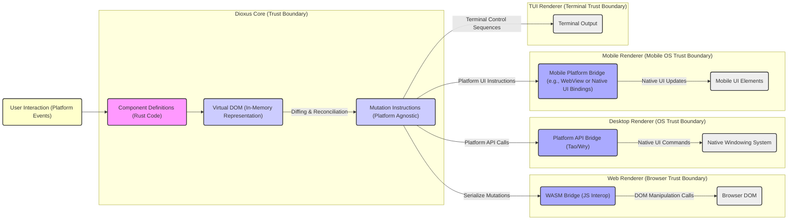

## Project Design Document: Dioxus UI Framework

**Version:** 1.1
**Date:** October 26, 2023
**Author:** AI Software Architect

### 1. Introduction

This document provides an enhanced and more detailed design overview of the Dioxus project, a Rust library for building user interfaces that run on desktop, web, mobile, and more. This document aims to capture the key architectural components, data flows, and interactions within the Dioxus ecosystem with greater specificity. It will serve as a robust foundation for subsequent threat modeling activities by clearly outlining potential attack surfaces and trust boundaries.

### 2. Project Overview

Dioxus is a modern, declarative, and component-based UI framework written in Rust. It leverages a virtual DOM and highly efficient diffing algorithms to minimize UI updates and maximize performance. A core strength of Dioxus is its ability to target a wide range of platforms through its adaptable rendering backends, allowing for code reuse across different environments.

### 3. Goals

* Provide a highly performant and memory-efficient way to build user interfaces in Rust.
* Enable true cross-platform UI development, minimizing platform-specific code.
* Offer a developer-friendly and intuitive API, drawing inspiration from successful frameworks like React.
* Facilitate the creation of rich, interactive, and dynamic user experiences with a focus on responsiveness.
* Maintain a strong emphasis on Rust's safety and performance characteristics.

### 4. Non-Goals

* To provide a low-level, direct manipulation graphics API. Dioxus relies on platform-specific rendering capabilities.
* To be a comprehensive application framework covering areas beyond UI rendering and management (e.g., networking, data persistence). While it offers state management, it's not intended to be a full application architecture solution.
* To be directly compatible with UI frameworks written in other languages without explicit interoperability layers.

### 5. Architectural Overview

Dioxus is designed with a clear separation of concerns, featuring a core library responsible for the UI logic and virtual DOM, and distinct renderers that translate these abstract UI descriptions into platform-specific instructions.

#### 5.1. High-Level Architecture Diagram

#### 5.2. Component Breakdown

* **Dioxus Core:**
    * **Component Model:** Defines the structure and lifecycle of UI components, enabling reusability and modularity. Components encapsulate state, logic, and rendering instructions.
    * **Virtual DOM:** An in-memory representation of the UI structure. It acts as an intermediary, allowing Dioxus to efficiently calculate the minimal changes needed to update the actual UI.
    * **Diffing Algorithm:**  Compares the previous and current virtual DOM trees to identify the differences. This algorithm is crucial for performance, as it minimizes the number of DOM manipulations or native UI updates.
    * **Scheduler:** Manages the execution of component updates and rendering tasks, ensuring efficient resource utilization.
    * **State Management:** Provides built-in mechanisms (e.g., `use_state`, `use_reducer`) for managing component-local and application-level state. This state drives the UI and triggers re-renders when it changes.
    * **Event System:** Handles user interactions (e.g., clicks, input changes) and dispatches these events to the appropriate components for processing.
    * **Hooks:** Enables functional components to access state, lifecycle methods, and other Dioxus features, promoting a more concise and reactive programming style.

* **Renderers:**
    * **Web Renderer:**
        * **WASM Compilation:** Compiles Dioxus core and application code to WebAssembly, enabling execution within a web browser.
        * **JavaScript Interop:** Provides a bridge for communication between the WASM code and the browser's JavaScript environment, necessary for DOM manipulation and accessing browser APIs.
        * **DOM Adapter:** Translates the platform-agnostic mutation instructions from the Dioxus Core into specific DOM manipulation calls.
    * **Desktop Renderer (Tao/Wry):**
        * **Window Management (Tao):** Utilizes the Tao library for creating and managing native OS windows.
        * **Webview Integration (Wry):** Embeds a webview (like Chromium's content module) within the native window to render the UI. This approach leverages existing web rendering technology for desktop applications.
        * **Platform API Bindings:** Provides access to native operating system APIs for features beyond basic UI rendering.
    * **Mobile Renderers:**
        * **WebView-based:** Similar to the desktop renderer, embeds a webview for rendering the UI. This offers good cross-platform compatibility but may have performance limitations compared to native UI.
        * **Native UI Bindings (Potential Future):**  Could involve directly interacting with platform-specific native UI toolkits (e.g., UIKit on iOS, Jetpack Compose on Android). This offers better performance and native look-and-feel but requires more platform-specific code.
        * **Mobile Platform Bridge:** Handles communication between the Dioxus Core and the chosen mobile rendering technology.
    * **TUI Renderer:**
        * **Terminal Abstraction:** Uses libraries like `crossterm` to interact with the terminal, providing a platform-agnostic way to control terminal output.
        * **Text-based Rendering:** Translates the Dioxus UI structure into text-based representations suitable for display in a terminal.

* **Tooling:**
    * **Dioxus CLI:** Provides command-line tools for creating, building, testing, and running Dioxus applications across different platforms.
    * **Hot Reloading:** A development feature that automatically rebuilds and refreshes the application in the browser or desktop window when code changes are detected, significantly improving the development workflow.
    * **Formatter:** Enforces consistent code style, improving code readability and maintainability.

#### 5.3. Data Flow

1. **Component Definition:** Developers write Rust code defining UI components, including their structure (using JSX-like syntax), state, and event handlers.
2. **Initial Render:** When the application starts, the Dioxus Core creates an initial virtual DOM representation based on the root component.
3. **User Interaction:** User actions on the rendered UI (e.g., a button click in the browser) are captured by the respective renderer.
4. **Event Propagation:** The renderer translates the platform-specific event into a Dioxus event and propagates it up the component tree.
5. **Event Handling:** The appropriate component's event handler (defined in the Rust code) is executed.
6. **State Update:** The event handler may update the component's state using Dioxus's state management mechanisms.
7. **Virtual DOM Diffing:** When a component's state changes, Dioxus recalculates the virtual DOM for that component and its children. The diffing algorithm compares the new virtual DOM with the previous one.
8. **Mutation Generation:** The diffing algorithm produces a set of platform-agnostic mutation instructions describing the changes needed to update the UI (e.g., add node, remove node, update attribute).
9. **Renderer Update:** The renderer receives these mutation instructions.
10. **Platform-Specific Rendering:** The renderer translates these abstract instructions into concrete actions on the target platform (e.g., DOM manipulation in the browser, native UI calls on desktop/mobile, terminal control sequences).
11. **UI Update:** The user interface is updated to reflect the changes.

### 6. Security Considerations (For Threat Modeling)

This section details potential security concerns, categorized by component and interaction, to facilitate effective threat modeling.

* **Dioxus Core (Trust Boundary):**
    * **Logic Errors:** Flaws in component logic or state management could lead to unintended behavior or vulnerabilities if not thoroughly tested.
    * **Denial of Service (DoS):**  Complex component structures or inefficient rendering logic could be exploited to cause performance degradation or crashes.
    * **State Management Vulnerabilities:** Improper handling of sensitive data within the state could lead to exposure if not managed carefully.

* **Web Renderer (Browser Trust Boundary):**
    * **Cross-Site Scripting (XSS):** If Dioxus components render user-provided content without proper sanitization, malicious scripts could be injected and executed in the user's browser. This is a primary concern for web applications.
    * **Injection Attacks:**  Careless construction of dynamic content or interactions with external APIs could lead to various injection vulnerabilities (e.g., SQL injection if interacting with a backend).
    * **WASM Security:** While WASM provides a sandboxed environment, vulnerabilities in the WASM runtime or the Dioxus WASM bridge itself could be exploited.
    * **Supply Chain Attacks:** Dependencies used by the Dioxus web renderer (including WASM build tools and JavaScript libraries) could be compromised, introducing malicious code.
    * **Client-Side Data Tampering:**  Data stored or manipulated on the client-side could be tampered with if not properly validated on the server.

* **Desktop Renderer (OS Trust Boundary):**
    * **Platform API Vulnerabilities:**  Interactions with the underlying operating system APIs through libraries like Tao and Wry could expose vulnerabilities if not handled securely (e.g., improper file system access, insecure process execution).
    * **Local File System Access:**  If the application needs to access the local file system, insufficient permission checks or improper handling of file paths could lead to unauthorized access or manipulation.
    * **Inter-Process Communication (IPC) Vulnerabilities:** If the desktop application communicates with other processes, insecure IPC mechanisms could be exploited to eavesdrop or inject malicious data.
    * **Code Signing and Distribution:**  Ensuring the integrity and authenticity of the distributed application is crucial to prevent tampering.

* **Mobile Renderers (Mobile OS Trust Boundary):**
    * **WebView Security:** If using webviews, all the XSS and injection concerns of the web renderer apply. Additionally, vulnerabilities in the webview implementation itself could be exploited.
    * **Native UI Vulnerabilities:** If using native UI components, platform-specific security best practices must be followed to avoid vulnerabilities in the native UI toolkit.
    * **Permissions Management:**  Mobile applications require careful management of device permissions. Requesting unnecessary permissions or failing to handle permissions correctly can pose security risks.
    * **Data Storage Security:** Securely storing sensitive data on the mobile device is critical.

* **TUI Renderer (Terminal Trust Boundary):**
    * **Terminal Injection Attacks:**  Improperly sanitized output could allow for the injection of malicious terminal control sequences, potentially leading to unexpected behavior or even security breaches.
    * **Information Disclosure:**  Sensitive information displayed in the terminal could be exposed to unauthorized users.

* **General Concerns:**
    * **Third-Party Dependencies:**  The security of Dioxus applications relies on the security of its dependencies. Regular audits and updates are necessary to address known vulnerabilities.
    * **Input Validation:**  All user input, regardless of the platform, must be properly validated to prevent injection attacks and other vulnerabilities.
    * **Secure Configuration:**  Proper configuration of the build process, deployment environment, and any associated services is essential for security.

### 7. Technologies Used

* **Primary Language:** Rust
* **Web Rendering:** WebAssembly (WASM), JavaScript, HTML, CSS
* **Desktop Rendering:** Tao (window creation), Wry (webview rendering), potentially native UI frameworks in the future
* **Mobile Rendering:**  Webviews (e.g., `webview_flutter`, `Tauri`), potentially native UI frameworks
* **TUI Rendering:** Libraries like `crossterm`
* **Build System and Package Manager:** Cargo

### 8. Deployment Considerations

* **Web Applications:** Typically deployed as static files (HTML, CSS, WASM, JavaScript) on web servers or CDNs. Security best practices include HTTPS, Content Security Policy (CSP), and regular security audits.
* **Desktop Applications:** Distributed as platform-specific executables. Code signing, secure update mechanisms, and adherence to platform security guidelines are important.
* **Mobile Applications:** Packaged and distributed through app stores (e.g., Google Play Store, Apple App Store). Adherence to platform security guidelines and app store review processes is crucial.
* **TUI Applications:** Distributed as executables.

### 9. Future Considerations

* **Enhanced Native UI Renderers:** Further development of native UI renderers for desktop and mobile platforms could improve performance and user experience but will introduce new platform-specific security considerations and complexities.
* **Advanced State Management Patterns:**  The evolution of state management solutions might introduce new security implications that need to be carefully evaluated.
* **Plugin or Extension System:** If a plugin system is introduced, robust security measures, including sandboxing and permission management, will be essential to prevent malicious plugins from compromising the application.
* **Server-Side Rendering (SSR):**  If SSR capabilities are added, new security considerations related to server-side execution and data handling will need to be addressed.

This enhanced design document provides a more detailed and security-focused overview of the Dioxus project. By explicitly outlining components, data flows, and potential security concerns, it serves as a valuable resource for conducting thorough threat modeling and building secure Dioxus applications.