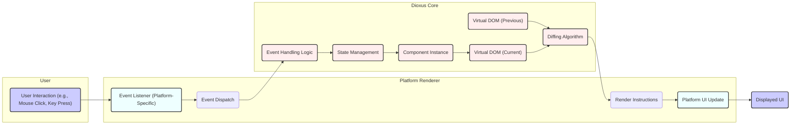

## Project Design Document: Dioxus

**Version:** 1.1
**Date:** October 26, 2023
**Author:** AI Architecture Expert

### 1. Project Overview

Dioxus is a modern, Rust-based framework for building interactive user interfaces across various platforms. It leverages a component-based architecture and a virtual DOM to provide a performant and ergonomic development experience for web, desktop, mobile, and embedded applications. This document details the architectural design of Dioxus, specifically focusing on aspects relevant to security threat modeling.

### 2. Goals and Objectives

* **Provide a comprehensive and technically accurate description of the Dioxus architecture.** This document aims to elucidate the major components, their interactions, and the flow of data within the framework.
* **Identify potential attack surfaces and security vulnerabilities within the Dioxus architecture.** By detailing the system's structure and behavior, we can proactively identify areas requiring careful security consideration.
* **Serve as a foundational document for security assessments, penetration testing, and code reviews.** This document will provide essential context and understanding for security professionals evaluating Dioxus-based applications.
* **Facilitate clear communication and collaboration between development and security teams regarding the system's design and security posture.** A well-defined architecture document ensures a shared understanding of the system's intricacies.

### 3. Target Audience

This document is intended for:

* Security engineers and analysts responsible for threat modeling, security assessments, and penetration testing of Dioxus applications.
* Developers contributing to the Dioxus core framework and related libraries.
* Architects designing and integrating systems that utilize Dioxus.
* Anyone seeking a detailed technical understanding of the internal workings and architecture of Dioxus.

### 4. High-Level Architecture

Dioxus is structured around a core library that manages the application's logic and a set of platform-specific renderers responsible for translating the abstract UI representation into concrete platform views.

### 5. Component Details

This section provides a detailed description of the key components within the Dioxus architecture, focusing on their functionality, interfaces, and potential security considerations:

* **Dioxus Core:**
    * **Functionality:** The central part of the framework, responsible for managing the virtual DOM, component lifecycle (mounting, updating, unmounting), state management through hooks (e.g., `useState`, `useReducer`), and the event handling mechanism. It orchestrates the rendering process and determines the necessary UI updates.
    * **Key Interfaces:** Public API for defining components, using hooks, and interacting with the rendering lifecycle. Internal interfaces for communicating with platform renderers (sending render instructions).
    * **Potential Security Concerns:**
        * **Virtual DOM Manipulation Vulnerabilities:**  Logic flaws in the virtual DOM diffing algorithm could potentially be exploited to cause unexpected UI changes, denial-of-service, or even expose sensitive information if not handled carefully.
        * **State Management Issues:** Improper management of component state, especially shared state, could lead to race conditions, data corruption, or unintended data leaks.
        * **Logic Errors in Core Functionality:** Bugs within the core logic related to component lifecycle or event handling could introduce vulnerabilities.
* **Virtual DOM:**
    * **Functionality:** An in-memory representation of the user interface. Dioxus works by creating and manipulating this virtual representation, and then efficiently updates the actual DOM based on the differences between the current and previous virtual DOM states. This improves performance by minimizing direct DOM manipulations.
    * **Key Interfaces:** Data structures representing UI elements (nodes, attributes, properties, children). Methods for creating, diffing, and patching the virtual DOM.
    * **Potential Security Concerns:**
        * **Cross-Site Scripting (XSS) via DOM Manipulation:** If the virtual DOM is not properly sanitized before being translated into actual DOM updates, it could be susceptible to XSS attacks.
        * **Denial of Service through Resource Exhaustion:**  Maliciously crafted virtual DOM structures could potentially consume excessive memory or CPU resources during the diffing process.
* **Renderers (e.g., `dioxus-web`, `dioxus-desktop`, `dioxus-mobile`):**
    * **Functionality:** Responsible for taking the platform-agnostic render instructions generated by the Dioxus Core and translating them into platform-specific UI updates. Each renderer interacts with the underlying platform's UI toolkit or APIs (e.g., DOM APIs in browsers, native UI libraries for desktop/mobile).
    * **Key Interfaces:** Receives render instructions from the Dioxus Core. Interacts with platform-specific UI APIs to create, update, and remove UI elements. Handles platform-specific event listeners and dispatches events back to the Core.
    * **Potential Security Concerns:**
        * **Cross-Site Scripting (XSS) in Web Renderer:** Failure to properly sanitize data before injecting it into the DOM can lead to XSS vulnerabilities.
        * **Injection Attacks in Other Renderers:**  Similar injection vulnerabilities could exist in other renderers if data is not properly escaped or validated before being passed to platform-specific UI APIs.
        * **Platform-Specific Security Issues:** Vulnerabilities in the underlying platform's UI toolkit or APIs could be indirectly exploitable through the renderer.
        * **Insecure Interoperability:** If the renderer allows interaction with external code or systems (e.g., JavaScript interop in `dioxus-web`), vulnerabilities in those external components could be exploited.
* **Component Model:**
    * **Functionality:** Dioxus applications are built using components, which are self-contained units of UI and logic. Components manage their own state, respond to events, and define their rendering logic. This modular approach promotes code reusability and maintainability.
    * **Key Interfaces:** Functions or structs that define the component's rendering logic and state. Hooks for managing state, lifecycle events, and context.
    * **Potential Security Concerns:**
        * **Component-Level Input Validation Vulnerabilities:**  Individual components may fail to properly validate user inputs, leading to vulnerabilities like injection attacks or data corruption.
        * **Logic Errors within Components:**  Bugs in a component's logic could introduce security flaws.
        * **Over-Privileged Components:** Components might have access to more data or functionality than necessary, increasing the impact of a potential compromise.
* **State Management (Hooks):**
    * **Functionality:** Dioxus provides hooks like `useState`, `useReducer`, `useContext`, and `useRef` to manage component-local state, handle complex state transitions, share data across components, and access mutable references.
    * **Key Interfaces:** The hook APIs provided by the Dioxus Core.
    * **Potential Security Concerns:**
        * **Race Conditions in Shared State:** Improper synchronization of access to shared state can lead to race conditions and unpredictable behavior, potentially creating security vulnerabilities.
        * **Exposure of Sensitive Data in State:**  Storing sensitive information directly in component state without proper protection could lead to data leaks.
        * **Unintended Side Effects:** Incorrectly implemented side effects within hooks could have unintended security implications.
* **Event Handling:**
    * **Functionality:** Dioxus allows components to register event listeners for user interactions and other events. When an event occurs, the corresponding event handler function is executed within the component's scope.
    * **Key Interfaces:** Mechanisms for registering event listeners on UI elements. Event handler function signatures and the event object passed to handlers.
    * **Potential Security Concerns:**
        * **Cross-Site Scripting (XSS) through Event Handlers:** If event handlers directly render user-provided data without sanitization, they can be a source of XSS vulnerabilities.
        * **Logic Vulnerabilities in Event Handlers:**  Bugs in event handler logic could lead to unintended actions or expose vulnerabilities.
        * **Denial of Service through Event Flooding:**  Malicious actors might attempt to flood the application with events to overwhelm resources.

### 6. Data Flow

The typical flow of data within a Dioxus application involves the following steps:

1. **User Interaction:** A user interacts with the application's UI (e.g., clicks a button, enters text in an input field).
2. **Platform Renderer Captures Event:** The platform-specific renderer (e.g., `dioxus-web` in a browser) captures the user interaction event.
3. **Event Dispatch to Dioxus Core:** The renderer dispatches the event to the Dioxus Core, identifying the target component and event type.
4. **Component Event Handler Invoked:** The Dioxus Core identifies the relevant component instance and invokes its registered event handler function.
5. **State Update (Optional):** The event handler may update the component's state using hooks (e.g., `set_state`).
6. **Virtual DOM Re-rendering:** If the component's state changes, Dioxus triggers a re-render of that component, producing a new virtual DOM representation.
7. **Virtual DOM Diffing:** The Dioxus Core compares the new virtual DOM with the previous one to identify the minimal set of changes required to update the UI.
8. **Render Instructions Generation:** The Core generates platform-agnostic render instructions describing the necessary UI updates (e.g., adding, removing, or modifying DOM elements).
9. **Render Instructions Sent to Renderer:** The render instructions are sent to the appropriate platform renderer.
10. **Platform UI Update:** The renderer applies the render instructions to update the actual UI on the target platform.
11. **UI Reflects Changes:** The user interface is updated to reflect the changes caused by the interaction.

### 7. Security Considerations (Detailed)

This section expands on potential security considerations, providing more specific examples of threats and vulnerabilities:

* **Client-Side Vulnerabilities:**
    * **Cross-Site Scripting (XSS):**
        * **Threat:** Malicious scripts injected into the UI through unsanitized user input, potentially stealing user credentials or performing unauthorized actions.
        * **Vulnerability Areas:**  Within component rendering logic, especially when displaying user-provided data; in custom event handlers that manipulate the DOM directly; in the web renderer if it doesn't properly escape output.
    * **Client-Side Injection Attacks:**
        * **Threat:**  Exploiting vulnerabilities to inject malicious code or data that alters the application's behavior on the client-side.
        * **Vulnerability Areas:**  Improper handling of user input in components; vulnerabilities in third-party libraries used by Dioxus applications.
    * **State Management Issues:**
        * **Threat:**  Unauthorized access or modification of application state, leading to data breaches or inconsistent application behavior.
        * **Vulnerability Areas:**  Improperly secured shared state; race conditions in state updates; exposing sensitive data in client-side state.
    * **Third-Party Dependency Vulnerabilities:**
        * **Threat:**  Security flaws in external libraries used by Dioxus or user applications.
        * **Vulnerability Areas:**  Any external crate or library used by the Dioxus core or by applications built with Dioxus. Regular dependency audits are crucial.
* **Renderer-Specific Vulnerabilities:**
    * **Web Renderer (`dioxus-web`):**
        * **Threats:**  Standard web security concerns like DOM-based XSS, clickjacking, and vulnerabilities arising from interaction with browser APIs.
        * **Vulnerability Areas:**  The interface between Dioxus and the browser's DOM; handling of browser events; JavaScript interoperability.
    * **Desktop Renderer (`dioxus-desktop`):**
        * **Threats:**  Vulnerabilities related to interacting with the operating system, file system access, inter-process communication, and native UI libraries.
        * **Vulnerability Areas:**  The bridge between Dioxus and the native UI toolkit; handling of system events; any exposed native APIs.
    * **Mobile Renderer (`dioxus-mobile`):**
        * **Threats:**  Mobile-specific security concerns like permission handling, secure storage, and vulnerabilities in the underlying mobile platform.
        * **Vulnerability Areas:**  Interaction with mobile platform APIs; handling of permissions; secure storage of sensitive data.
* **Build Process Security:**
    * **Threat:**  Compromised build tools or dependencies introducing malicious code into the application.
    * **Vulnerability Areas:**  The entire software supply chain, including build scripts, dependencies, and development environments.
* **Interoperability with Other Technologies:**
    * **JavaScript Interop (in `dioxus-web`):**
        * **Threat:**  Executing untrusted JavaScript code, potentially compromising the application's security.
        * **Vulnerability Areas:**  The mechanism for calling JavaScript functions from Rust and vice versa; handling data passed between Rust and JavaScript.

### 8. Deployment Considerations

The security implications of deploying Dioxus applications vary depending on the target platform:

* **Web Applications:**
    * **Security Considerations:** Subject to standard web application security threats. Requires secure configuration of web servers, HTTPS enforcement, and protection against common web vulnerabilities (OWASP Top Ten). Careful consideration of Content Security Policy (CSP) is crucial.
* **Desktop Applications:**
    * **Security Considerations:**  Need to consider vulnerabilities related to local file system access, inter-process communication, and potential for privilege escalation. Code signing is important for establishing trust.
* **Mobile Applications:**
    * **Security Considerations:**  Focus on mobile-specific security best practices, including secure storage of data, proper handling of permissions, and protection against reverse engineering. Secure communication with backend services is also critical.

### 9. Technologies Used

* **Rust:** The primary programming language providing memory safety and performance.
* **WebAssembly (Wasm):** Enables running Dioxus web applications in modern browsers.
* **HTML, CSS, JavaScript:** Utilized by the `dioxus-web` renderer for interacting with the browser's rendering engine.
* **Platform-Specific UI Libraries (e.g., GTK, Cocoa, Win32 API, Flutter):** Employed by desktop and mobile renderers to create native user interfaces.

### 10. Future Considerations

* **Server-Side Rendering (SSR):** Introducing SSR would necessitate addressing new security considerations related to server-side execution, data handling, and potential exposure of sensitive information.
* **Enhanced Security Auditing Tools:** Development of linters or static analysis tools specifically designed to identify potential security vulnerabilities in Dioxus components and applications.
* **Formal Security Guidelines and Best Practices:**  Establishing comprehensive security guidelines and best practices for Dioxus developers to build secure applications.

This document provides a detailed architectural overview of Dioxus, emphasizing aspects relevant to security. It serves as a crucial foundation for conducting thorough threat modeling and implementing robust security measures for applications built with this framework.
