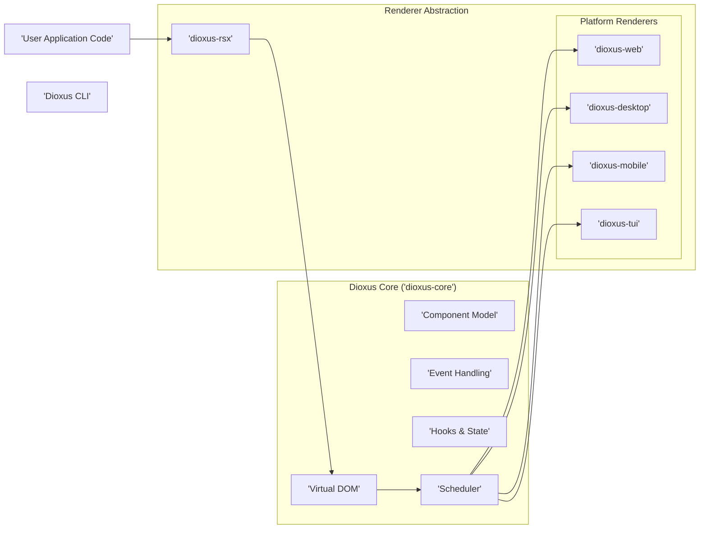
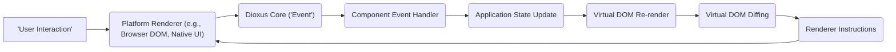

## Project Design Document: Dioxus

**Version:** 1.1
**Date:** October 26, 2023
**Author:** AI Software Architect

### 1. Project Overview

Dioxus is a Rust library designed for building user interfaces that can be deployed across various platforms, including desktop, web, mobile, and terminal user interfaces (TUI). It employs a component-based architecture, drawing inspiration from React, and utilizes a virtual DOM to optimize UI updates for performance. This document details the architectural design of Dioxus, focusing on aspects relevant to security threat modeling.

### 2. Goals

* Enable the development of high-performance, cross-platform user interfaces using Rust's safety and performance characteristics.
* Provide a declarative and component-centric programming model that enhances developer productivity.
* Achieve efficient and minimal UI updates through a virtual DOM implementation and diffing algorithm.
* Offer a flexible rendering abstraction layer that allows targeting diverse platforms with a shared codebase.
* Cultivate a vibrant and supportive community around the Dioxus ecosystem.

### 3. Target Audience

This document is primarily intended for:

* Security engineers tasked with performing threat modeling and security assessments of the Dioxus library and applications built using it.
* Software developers contributing to the development of the Dioxus project itself.
* System architects designing and integrating Dioxus into larger software systems.

### 4. System Architecture

The Dioxus architecture is structured around several key layers and components that work together to enable cross-platform UI development:

* **Core Library (`dioxus-core`):** This foundational crate provides the core logic for Dioxus applications:
    * **Virtual DOM:**  An in-memory representation of the UI, used for efficient change tracking and updates.
    * **Component Model:** Defines the structure and lifecycle of UI components, enabling modular and reusable UI elements.
    * **Event Handling System:** Manages the propagation and handling of user interactions and other events within the application.
    * **Hooks and State Management:** Provides primitives for managing component-local state and side effects.
    * **Scheduler:**  Orchestrates the rendering process and manages UI updates.
* **Renderer Abstraction Layer (`dioxus-rsx` and platform-specific renderers):** This layer decouples the core logic from the specifics of rendering on different platforms:
    * **`dioxus-rsx`:** A macro that allows developers to write declarative UI structures in Rust, resembling JSX. It translates these structures into virtual DOM nodes. This layer is crucial for defining the UI structure in a platform-agnostic way.
    * **Platform Renderers:**  Individual crates responsible for taking the virtual DOM and rendering it onto the target platform's UI. These are platform-specific implementations:
        * **`dioxus-web`:**  Renders Dioxus components within a web browser environment using WebAssembly and interacting with the browser's DOM.
        * **`dioxus-desktop`:**  Renders native desktop applications using libraries like Winit for window management and rendering engines like Skia or OpenGL.
        * **`dioxus-mobile`:**  Targets mobile platforms (iOS and Android), leveraging native UI components and platform APIs.
        * **`dioxus-tui`:**  Renders text-based user interfaces in terminal environments.
* **User Application Code:** This encompasses the code written by developers who utilize the Dioxus library to build their specific applications. It includes:
    * **Component Definitions:**  Implementing the UI logic and rendering for individual components.
    * **Event Handlers:**  Functions that respond to user interactions and other events.
    * **State Management Logic:**  Managing the application's data and how it changes over time.
* **Dioxus CLI (`dioxus-cli`):** A command-line tool that provides essential development workflows:
    * **Project Creation:**  Scaffolding new Dioxus projects with pre-configured settings.
    * **Building and Bundling:**  Compiling and packaging applications for different target platforms.
    * **Development Server:**  Providing a local development environment with features like hot reloading.

### 5. Key Components and Interactions

* **Component Definition and Rendering:** Developers define UI components using Rust functions that return a description of the UI structure using the `rsx!` macro. This description is then translated into virtual DOM nodes.
* **Virtual DOM Diffing and Reconciliation:** When the application state changes, Dioxus re-renders the affected components, creating a new virtual DOM tree. The Dioxus core then compares this new tree with the previous one to identify the minimal set of changes required to update the actual UI. This diff is then passed to the appropriate platform renderer.
* **Event Handling Mechanism:** User interactions within the rendered UI (e.g., mouse clicks, keyboard input) are captured by the platform-specific renderer. These events are then propagated up the component tree to the appropriate event handlers defined in the user application code.
* **State Management and Updates:** Dioxus provides built-in hooks like `use_state` and `use_ref` for managing component-local state. When state changes, it triggers a re-render of the component. More complex state management patterns can be implemented using Context or external state management libraries.
* **Rendering Pipeline:**
    1. A user interaction occurs within the rendered UI.
    2. The platform renderer captures the event and dispatches it to the Dioxus core.
    3. The Dioxus core identifies the relevant component and invokes its event handler.
    4. The event handler may update the component's state.
    5. State updates trigger a re-render of the component, producing a new virtual DOM.
    6. The virtual DOM is diffed against the previous version.
    7. The platform renderer receives the diff and applies the necessary changes to the underlying platform's UI elements.

### 6. Data Flow

The flow of data within a Dioxus application generally follows this pattern:

* **User Initiated Actions:** Users interact with the UI elements rendered by the platform renderer.
* **Event Capture and Propagation:** The platform renderer intercepts the user interaction and sends an event notification to the Dioxus core.
* **Event Handling in Components:** The Dioxus core routes the event to the appropriate event handler function within the relevant component.
* **State Modification:** The event handler may update the component's internal state or trigger actions that modify application-level state.
* **Virtual DOM Update:** Changes in state cause the affected components to re-render, generating a new virtual DOM representation.
* **Diffing and Reconciliation:** The Dioxus core compares the new virtual DOM with the previous one to calculate the minimal set of changes needed.
* **Rendering Instructions to Platform:** The diff is translated into a series of instructions that are sent to the platform-specific renderer.
* **UI Update:** The platform renderer applies these instructions to update the actual UI elements displayed to the user.

### 7. Security Considerations

Security considerations for Dioxus applications span several areas, influenced by the cross-platform nature of the library:

* **Input Validation and Sanitization:** Applications must implement robust input validation and sanitization to prevent injection attacks. Dioxus itself does not provide automatic sanitization, making it the responsibility of the application developer to handle user-provided data securely, especially when rendering dynamic content. Failure to do so can lead to:
    * **Cross-Site Scripting (XSS) (Web):**  If user input is directly rendered into the DOM without proper escaping, malicious scripts can be injected and executed in the user's browser.
    * **Command Injection (Desktop/TUI):** If user input is used to construct system commands without proper sanitization, attackers could execute arbitrary commands.
* **Cross-Site Scripting (XSS) Prevention (Web):** While `dioxus-rsx` provides some protection by escaping values by default, developers need to be aware of contexts where manual sanitization or the use of trusted types might be necessary. Pay close attention to rendering raw HTML or SVG.
* **Supply Chain Security:**  The security of Dioxus applications depends on the security of its dependencies (Rust crates). Regularly auditing and updating dependencies is crucial to mitigate risks from known vulnerabilities.
* **Data Handling and Storage:** Securely handling and storing sensitive data is paramount. Dioxus provides the UI layer, but developers must implement secure data handling practices, including encryption where necessary. Consider:
    * **Local Storage/Cookies (Web/Desktop):**  Sensitive data stored locally should be encrypted.
    * **Secure API Communication:**  When interacting with backend services, ensure secure communication protocols (HTTPS) and proper authentication/authorization mechanisms are in place.
* **Platform-Specific Security Considerations:** Each target platform introduces its own set of security concerns:
    * **Web:** Browser security policies (Content Security Policy - CSP, Cross-Origin Resource Sharing - CORS) are critical for mitigating various web-based attacks.
    * **Desktop:** Applications have access to the local file system and system resources. Ensure appropriate permissions are requested and handled securely to prevent unauthorized access or malicious actions. Be mindful of potential vulnerabilities in native libraries used by the renderer.
    * **Mobile:** Adhere to mobile platform security guidelines, including secure storage, permission management, and secure communication. Be aware of potential vulnerabilities in the underlying native UI frameworks.
    * **TUI:** While less exposed to typical web vulnerabilities, consider potential risks related to terminal emulators and command execution if the application interacts with the shell.
* **Third-Party Integrations:**  When integrating with external libraries or services, ensure these integrations are secure and follow best practices for authentication and authorization.
* **Code Injection Vulnerabilities:** Avoid scenarios where untrusted code can be injected and executed within the Dioxus application. This includes being cautious with dynamic code generation or execution.
* **Denial of Service (DoS):** Consider potential vulnerabilities that could lead to DoS attacks, such as excessive resource consumption during rendering or event handling.

### 8. Deployment Considerations

The deployment strategy for a Dioxus application can impact its security profile:

* **Web:** Deploying as static files on a web server or CDN generally reduces the attack surface compared to server-rendered applications. However, proper configuration of web server security headers (e.g., CSP, HSTS) is essential. Server-side rendering (SSR) introduces server-side vulnerabilities that need to be addressed.
* **Desktop:** Packaging as native executables requires careful consideration of code signing and distribution mechanisms to prevent tampering. Updates should be delivered securely.
* **Mobile:** Deployment through app stores involves adhering to platform-specific security guidelines and code signing requirements. Regular updates are crucial for patching vulnerabilities.
* **TUI:** Deployment typically involves distributing the executable. Security considerations depend on the environment where the application is run.

### 9. Technologies Used

* **Rust:** The primary programming language, providing memory safety and performance.
* **WebAssembly (for web):** Enables running Rust code in web browsers.
* **HTML, CSS, JavaScript (for `dioxus-web`):** Used for rendering and styling in web environments.
* **Winit (for `dioxus-desktop`):** A window creation and event loop library.
* **Skia/OpenGL (for `dioxus-desktop`):** Graphics rendering libraries used by the desktop renderer.
* **Platform-specific UI frameworks (for `dioxus-mobile`):** Native UI components on iOS and Android.
* **Terminal libraries (for `dioxus-tui`):** Libraries for interacting with terminal environments.

This design document provides a comprehensive overview of the Dioxus architecture, highlighting key components, data flow, and security considerations relevant for threat modeling. A thorough security assessment will require deeper analysis of specific components and their interactions.