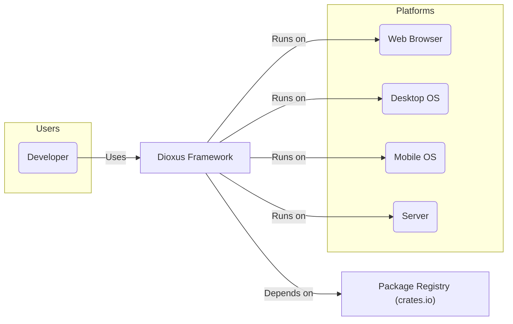
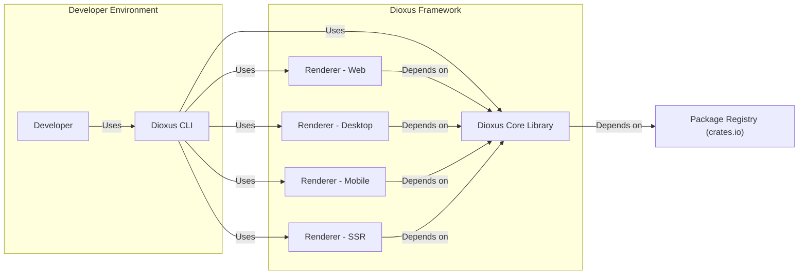
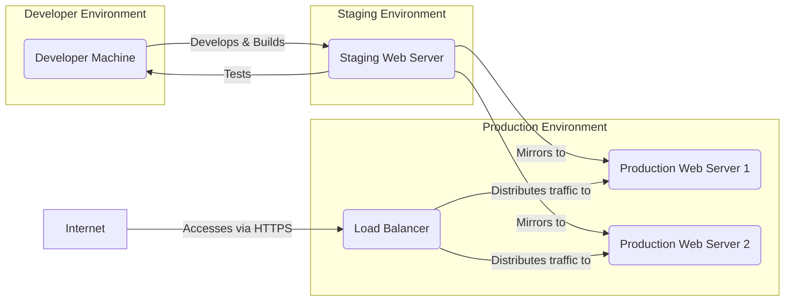
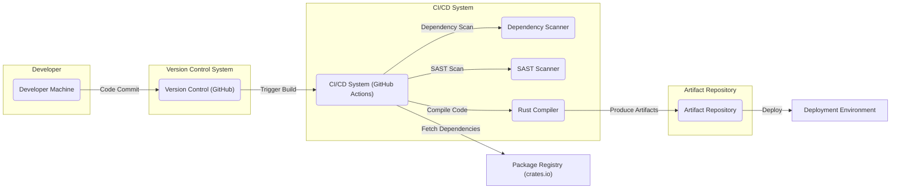

# BUSINESS POSTURE

This project, Dioxus, aims to provide a performant, portable, and developer-friendly user interface framework written in Rust. It seeks to be a compelling alternative to existing JavaScript frameworks by leveraging Rust's strengths in memory safety and performance, while offering a familiar component-based architecture. Dioxus targets a wide range of platforms including web, desktop, mobile, and server-side rendering, broadening its applicability and potential user base.

Business Priorities:
- Performance: Deliver a UI framework that offers superior performance compared to existing solutions, especially in resource-constrained environments.
- Portability: Ensure the framework can be used across multiple platforms (web, desktop, mobile, server) with minimal platform-specific code.
- Developer Experience: Provide a productive and enjoyable development experience, making it easy for developers to build and maintain user interfaces.
- Rust Ecosystem Growth: Contribute to the growth and adoption of the Rust programming language within the UI development domain.

Business Goals:
- Increase Adoption: Drive widespread adoption of Dioxus among developers seeking a modern, performant, and cross-platform UI framework.
- Community Building: Foster a strong and active community around Dioxus to support its development, provide resources, and encourage contributions.
- Ecosystem Development: Expand the Dioxus ecosystem with libraries, tools, and integrations that enhance its functionality and usability.
- Establish Market Presence: Position Dioxus as a leading UI framework within the Rust ecosystem and gain recognition in the broader UI development landscape.

Business Risks:
- Security Vulnerabilities:  Vulnerabilities in the framework itself or its dependencies could lead to security breaches in applications built with Dioxus, damaging reputation and hindering adoption.
- Ecosystem Maturity:  As a relatively new framework, the Dioxus ecosystem might lack the maturity and breadth of established frameworks, potentially limiting its appeal for certain projects.
- Community Support:  Insufficient community support could slow down development, bug fixing, and the availability of learning resources, impacting user satisfaction and adoption.
- Competition:  The UI framework landscape is highly competitive. Dioxus needs to differentiate itself effectively and demonstrate clear advantages over established and emerging alternatives.
- Rust Adoption Barrier:  The learning curve associated with Rust might deter some developers from adopting Dioxus, especially those primarily familiar with JavaScript or other languages.

# SECURITY POSTURE

Security Control: Rust's memory safety features inherently mitigate many common classes of vulnerabilities such as buffer overflows and dangling pointers. Implemented by: Rust compiler and language design.
Security Control: Usage of `crates.io` for dependency management. Implemented by: Rust's build system `cargo`.
Security Control: Standard web security practices are applicable to web applications built with Dioxus, such as HTTPS, Content Security Policy (CSP), and regular security updates of server infrastructure. Implemented by: Developers deploying Dioxus web applications.

Accepted Risk: Dependencies from `crates.io` might contain vulnerabilities. Mitigation: Dependency scanning and regular updates.
Accepted Risk:  Security vulnerabilities might be discovered in Dioxus framework code itself. Mitigation: Security audits, community contributions, and proactive security testing.
Accepted Risk:  Applications built with Dioxus might introduce security vulnerabilities due to developer errors. Mitigation: Secure coding guidelines, static analysis tools, and security training for developers.

Recommended Security Controls:
- Security Control: Implement automated dependency scanning in the build process to detect and alert on known vulnerabilities in dependencies.
- Security Control: Conduct regular security audits of the Dioxus framework codebase, especially before major releases.
- Security Control: Provide secure coding guidelines and best practices documentation for Dioxus developers to help them build secure applications.
- Security Control: Encourage and facilitate community security contributions, including bug bounty programs or vulnerability disclosure processes.
- Security Control: Implement static analysis security testing (SAST) tools in the development and CI/CD pipelines to identify potential code-level vulnerabilities.

Security Requirements:
- Authentication: If applications built with Dioxus require user authentication, the framework and its ecosystem should provide guidance and libraries for implementing secure authentication mechanisms. This might involve integration with existing authentication providers or libraries for handling authentication tokens and sessions securely.
- Authorization: For applications requiring access control, Dioxus should facilitate the implementation of robust authorization mechanisms. This includes defining roles and permissions, and enforcing access control policies based on user identity and context.
- Input Validation: Dioxus applications must implement thorough input validation to prevent injection attacks (e.g., XSS, SQL injection if applicable). The framework should encourage or provide tools for sanitizing and validating user inputs at all application layers.
- Cryptography: If Dioxus applications handle sensitive data, they must employ strong cryptography for data protection in transit and at rest. This includes using HTTPS for communication and appropriate encryption algorithms for data storage. Dioxus ecosystem should provide or integrate with libraries that simplify secure cryptographic operations.

# DESIGN

## C4 CONTEXT

Context Diagram Elements:

- Element:
  - Name: Developer
  - Type: Person
  - Description: Software developers who use Dioxus to build user interfaces.
  - Responsibilities: Develop applications using Dioxus, contribute to the Dioxus framework and ecosystem.
  - Security controls: Secure development practices, code reviews, personal development environment security.

- Element:
  - Name: Dioxus Framework
  - Type: Software System
  - Description: A Rust-based UI framework for building interactive user interfaces across various platforms.
  - Responsibilities: Provide a component-based architecture, rendering engine, platform abstractions, and development tools.
  - Security controls: Secure coding practices, security audits, dependency scanning, input validation guidance for developers using the framework.

- Element:
  - Name: Web Browser
  - Type: Software System
  - Description: Standard web browsers (e.g., Chrome, Firefox, Safari) where Dioxus web applications are executed.
  - Responsibilities: Execute web applications, provide web APIs, enforce browser security policies.
  - Security controls: Browser security features (CSP, Same-Origin Policy, etc.), regular browser updates.

- Element:
  - Name: Desktop OS
  - Type: Software System
  - Description: Desktop operating systems (e.g., Windows, macOS, Linux) where Dioxus desktop applications are executed.
  - Responsibilities: Provide operating system APIs, manage application execution, enforce OS-level security policies.
  - Security controls: OS-level security features (firewall, access control), regular OS updates.

- Element:
  - Name: Mobile OS
  - Type: Software System
  - Description: Mobile operating systems (e.g., iOS, Android) where Dioxus mobile applications are executed.
  - Responsibilities: Provide mobile platform APIs, manage application execution, enforce mobile OS security policies.
  - Security controls: Mobile OS security features (sandboxing, permissions), regular OS updates, app store security reviews.

- Element:
  - Name: Server
  - Type: Software System
  - Description: Servers where Dioxus applications can be rendered server-side or where backend services for Dioxus applications might reside.
  - Responsibilities: Host and serve web applications, execute server-side rendering, provide backend services.
  - Security controls: Server hardening, network security, access control, regular security updates, web application firewalls (WAFs).

- Element:
  - Name: Package Registry (crates.io)
  - Type: External System
  - Description: The Rust package registry where Dioxus and its dependencies are hosted.
  - Responsibilities: Host and distribute Rust packages, ensure package integrity.
  - Security controls: Package signing, malware scanning, community moderation.

## C4 CONTAINER

Container Diagram Elements:

- Element:
  - Name: Developer
  - Type: Person
  - Description: Software developers who use Dioxus to build user interfaces.
  - Responsibilities: Write application code, use Dioxus CLI to build and manage projects.
  - Security controls: Secure coding practices, local development environment security.

- Element:
  - Name: Dioxus CLI
  - Type: Application
  - Description: Command-line interface tool for creating, building, and managing Dioxus projects.
  - Responsibilities: Project scaffolding, build process orchestration, dependency management, development server.
  - Security controls: Secure handling of project files, dependency integrity checks, secure communication if interacting with external services.

- Element:
  - Name: Dioxus Core Library
  - Type: Library
  - Description: The core logic of the Dioxus framework, including component model, virtual DOM, and reactivity system.
  - Responsibilities: Provide core UI framework functionalities, manage application state, handle component lifecycle.
  - Security controls: Memory safety (Rust), input validation within the framework, secure coding practices.

- Element:
  - Name: Renderer - Web
  - Type: Library
  - Description: Renderer for targeting web browsers, translating Dioxus virtual DOM operations into browser DOM manipulations.
  - Responsibilities: Web platform rendering, browser API interaction, event handling for web applications.
  - Security controls:  Adherence to web security standards, output encoding to prevent XSS, secure handling of browser APIs.

- Element:
  - Name: Renderer - Desktop
  - Type: Library
  - Description: Renderer for building desktop applications, leveraging native desktop UI frameworks.
  - Responsibilities: Desktop platform rendering, OS API interaction, native window management.
  - Security controls: Secure interaction with OS APIs, input validation for desktop applications, secure handling of file system operations.

- Element:
  - Name: Renderer - Mobile
  - Type: Library
  - Description: Renderer for building mobile applications, targeting iOS and Android platforms.
  - Responsibilities: Mobile platform rendering, mobile OS API interaction, mobile application lifecycle management.
  - Security controls: Secure interaction with mobile OS APIs, adherence to mobile security guidelines, input validation for mobile applications.

- Element:
  - Name: Renderer - SSR
  - Type: Library
  - Description: Renderer for server-side rendering of Dioxus applications, generating HTML on the server.
  - Responsibilities: Server-side rendering, HTML generation, initial application state rendering.
  - Security controls: Output encoding to prevent XSS in server-rendered HTML, secure handling of server-side data, protection against SSR-specific vulnerabilities.

- Element:
  - Name: Package Registry (crates.io)
  - Type: External System
  - Description: The Rust package registry where Dioxus and its dependencies are hosted.
  - Responsibilities: Host and distribute Rust packages, ensure package integrity.
  - Security controls: Package signing, malware scanning, community moderation.

## DEPLOYMENT

Deployment Diagram for Web Application:

Deployment Diagram Elements (Web Application Production Environment):

- Element:
  - Name: Load Balancer
  - Type: Infrastructure
  - Description: Distributes incoming HTTPS traffic across multiple production web servers.
  - Responsibilities: Traffic distribution, SSL termination, health checks, DDoS protection.
  - Security controls: SSL/TLS configuration, DDoS mitigation measures, access control to management interfaces, regular security updates.

- Element:
  - Name: Production Web Server 1 & 2
  - Type: Infrastructure
  - Description: Web servers hosting Dioxus web application instances.
  - Responsibilities: Serve static assets, execute server-side rendering (if applicable), handle application logic.
  - Security controls: Server hardening, web server configuration (e.g., secure headers), regular security updates, intrusion detection system (IDS), web application firewall (WAF).

- Element:
  - Name: Internet
  - Type: Network
  - Description: Public internet network.
  - Responsibilities: Provide connectivity for users to access the web application.
  - Security controls: N/A - external network, focus on securing application and infrastructure exposed to the internet.

Deployment Notes:
- This diagram represents a typical deployment for a web application built with Dioxus.
- For desktop and mobile applications, deployment would involve packaging and distributing the application through relevant app stores or distribution channels for each platform.
- Server-side rendering deployment would involve servers capable of executing Rust code and rendering HTML to be served to clients.

## BUILD

Build Process Description:

1. Developer writes code on their Developer Machine and commits changes to the Version Control System (VCS), e.g., GitHub.
2. A commit to the VCS triggers the CI/CD system, e.g., GitHub Actions.
3. The CI/CD system fetches project dependencies from the Package Registry (crates.io).
4. Dependency Scanner tool scans the fetched dependencies for known vulnerabilities.
5. SAST Scanner tool performs Static Application Security Testing on the codebase to identify potential security flaws.
6. Rust Compiler compiles the Dioxus application code.
7. Compiled build artifacts (e.g., web bundles, executables) are stored in the Artifact Repository.
8. Artifacts from the repository are then deployed to the target Deployment Environment (Staging, Production, etc.).

Build Security Controls:
- Security Control: Version Control System (VCS) is used to track code changes and provide auditability. Implemented by: Git and GitHub.
- Security Control: Automated CI/CD pipeline ensures consistent and repeatable builds. Implemented by: GitHub Actions.
- Security Control: Dependency scanning identifies vulnerabilities in third-party libraries. Implemented by: Dependency Scanner tool in CI pipeline.
- Security Control: Static Application Security Testing (SAST) identifies potential code-level vulnerabilities. Implemented by: SAST Scanner tool in CI pipeline.
- Security Control: Build artifacts are stored in a secure Artifact Repository, ensuring integrity and controlled access. Implemented by: Artifact Repository with access controls.
- Security Control: Code review process before merging code changes to the main branch. Implemented by: Development team practices.

# RISK ASSESSMENT

Critical Business Processes:
- Development and release of Dioxus framework updates and new versions.
- Development and deployment of applications built using Dioxus by end-users.
- Maintenance and support of the Dioxus framework and ecosystem.
- Community engagement and growth.

Data Sensitivity:
- Dioxus framework itself does not directly handle sensitive user data.
- Applications built with Dioxus may handle various types of data, including potentially sensitive user data (personal information, financial data, etc.).
- Sensitivity of data depends entirely on the specific applications built using Dioxus and is outside the scope of the framework itself.
- For applications built with Dioxus that handle sensitive data, data sensitivity should be assessed and addressed at the application level, considering data in transit, data at rest, and data in use within the application.

# QUESTIONS & ASSUMPTIONS

Questions:
- What are the officially recommended security practices for developers building applications with Dioxus?
- Are there any built-in security features or modules within Dioxus framework specifically designed to aid in building secure applications?
- What is the process for reporting and addressing security vulnerabilities in the Dioxus framework itself?
- Are there any plans for formal security audits of the Dioxus framework codebase?

Assumptions:
- Dioxus is intended to be used for building a wide range of applications, including those that may handle sensitive data.
- Developers using Dioxus are expected to follow general secure coding practices and web security principles when building their applications.
- The security of applications built with Dioxus is ultimately the responsibility of the developers building those applications.
- The Dioxus project aims to provide a secure and reliable framework, but like any software, it may be subject to vulnerabilities. Proactive security measures and community involvement are crucial for maintaining and improving its security posture.