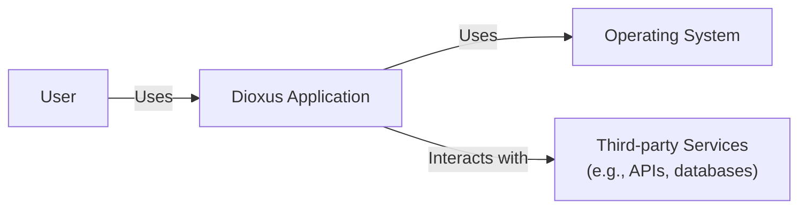
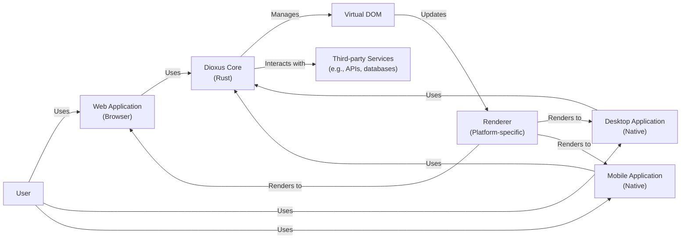
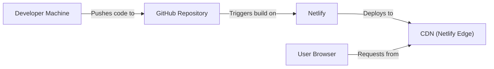
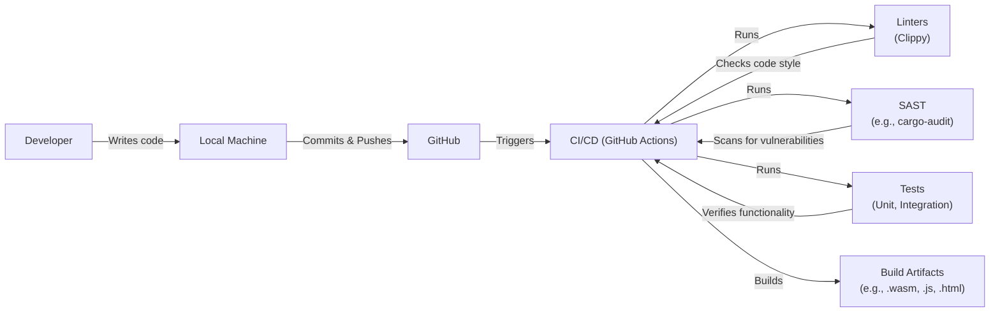

# BUSINESS POSTURE

Dioxus is a Rust library for building user interfaces. It aims to provide a developer-friendly and performant alternative to existing web frameworks like React, Vue, and Angular, while also enabling cross-platform development (desktop, mobile, etc.) using a single codebase.

Business Priorities:

*   Developer Experience: Attract and retain developers by offering a productive and enjoyable development experience. This includes clear documentation, easy-to-use APIs, and fast iteration cycles.
*   Performance: Provide a fast and responsive user experience, even for complex applications. This is crucial for user satisfaction and engagement.
*   Cross-Platform Reach: Enable developers to build applications for multiple platforms (web, desktop, mobile) with minimal platform-specific code. This reduces development costs and time-to-market.
*   Community Growth: Foster a vibrant and active community around Dioxus to drive adoption, contribution, and long-term sustainability.
*   Ecosystem Development: Encourage the creation of third-party libraries and tools to extend Dioxus's functionality and address specific use cases.

Business Goals:

*   Become a leading UI framework in the Rust ecosystem.
*   Gain significant adoption among developers building web, desktop, and mobile applications.
*   Establish a strong reputation for performance, reliability, and developer experience.
*   Build a sustainable open-source project with a thriving community and ecosystem.

Most Important Business Risks:

*   Failure to attract and retain developers due to poor developer experience or lack of features.
*   Performance issues that lead to poor user experience and negative perception.
*   Inability to deliver on the promise of cross-platform development, limiting its appeal.
*   Lack of community engagement and contribution, hindering project growth and sustainability.
*   Security vulnerabilities that could compromise user data or application integrity.
*   Competition from established and well-funded UI frameworks.

# SECURITY POSTURE

Existing Security Controls:

*   security control: The project is written in Rust, a memory-safe language, which inherently prevents many common security vulnerabilities like buffer overflows and use-after-free errors. (Described in the project's README and inherent to the language choice).
*   security control: Regular dependency updates to address known vulnerabilities in third-party libraries. (Evidenced by Dependabot integration and frequent updates in the repository).
*   security control: Use of Cargo, Rust's package manager, which provides some level of supply chain security by verifying package integrity. (Inherent to the Rust ecosystem).
*   security control: Code linting with Clippy to enforce coding best practices and identify potential issues. (Present in the CI workflow).
*   security control: Basic tests are implemented. (Present in the CI workflow).

Accepted Risks:

*   accepted risk: The project is relatively new, and the security posture is still evolving. There may be unknown vulnerabilities or security weaknesses.
*   accepted risk: Limited formal security reviews or audits have been conducted.
*   accepted risk: Reliance on third-party libraries, which may introduce vulnerabilities if not carefully vetted and updated.
*   accepted risk: The cross-platform nature of the project introduces a larger attack surface compared to single-platform applications.
*   accepted risk: The project uses "unsafe" Rust code in some areas for performance optimization, which bypasses some of Rust's safety guarantees and requires careful manual review.

Recommended Security Controls:

*   Implement a comprehensive testing strategy, including unit tests, integration tests, and property-based tests, to cover a wide range of scenarios and edge cases.
*   Conduct regular security reviews and audits, both internal and external, to identify and address potential vulnerabilities.
*   Establish a clear security policy and vulnerability disclosure process.
*   Consider using fuzzing techniques to automatically discover potential vulnerabilities.
*   Implement Content Security Policy (CSP) and other browser-based security mechanisms to mitigate XSS and other web-based attacks (for web deployments).
*   Use a memory sanitizer during testing to detect memory leaks and other memory-related issues.
*   Explore the use of formal verification tools to prove the correctness of critical code sections.
*   Implement code signing to ensure the integrity of released binaries.

Security Requirements:

*   Authentication:
    *   Not directly applicable to the Dioxus library itself, as it's a UI framework. Authentication should be handled by the application using Dioxus.
*   Authorization:
    *   Not directly applicable to the Dioxus library itself. Authorization should be handled by the application using Dioxus.
*   Input Validation:
    *   Dioxus should provide mechanisms for developers to easily validate user input to prevent common vulnerabilities like XSS and injection attacks. This could include built-in validation functions or integration with existing validation libraries.
    *   Dioxus should sanitize user input by default where appropriate, or provide clear guidance to developers on how to do so.
*   Cryptography:
    *   Dioxus should not handle sensitive cryptographic operations directly. It should rely on established cryptographic libraries and best practices for any required cryptographic functionality (e.g., secure communication, data encryption).
*   Output Encoding:
    *   Dioxus should properly encode output to prevent XSS vulnerabilities. This is particularly important for web deployments.

# DESIGN

## C4 CONTEXT

Element Descriptions:

*   Element:
    *   Name: User
    *   Type: Person
    *   Description: A person interacting with the Dioxus application.
    *   Responsibilities: Interacts with the application's UI, provides input, and receives output.
    *   Security controls: None (handled by the application).

*   Element:
    *   Name: Dioxus Application
    *   Type: Software System
    *   Description: The application built using the Dioxus framework.
    *   Responsibilities: Provides the user interface, handles user input, manages application state, and interacts with external services.
    *   Security controls: Input validation, output encoding, secure communication with third-party services, application-specific security logic.

*   Element:
    *   Name: Third-party Services
    *   Type: Software System
    *   Description: External services that the Dioxus application interacts with (e.g., APIs, databases).
    *   Responsibilities: Varies depending on the specific service.
    *   Security controls: Managed by the third-party service provider. The Dioxus application should use secure communication protocols (e.g., HTTPS) and follow best practices for interacting with external services.

*   Element:
    *   Name: Operating System
    *   Type: Software System
    *   Description: The underlying operating system on which the Dioxus application runs (e.g., Windows, macOS, Linux, Web Browser).
    *   Responsibilities: Provides the runtime environment for the application, manages system resources, and handles low-level operations.
    *   Security controls: OS-level security mechanisms (e.g., process isolation, memory protection).

## C4 CONTAINER

Element Descriptions:

*   Element:
    *   Name: User
    *   Type: Person
    *   Description: A person interacting with the Dioxus application.
    *   Responsibilities: Interacts with the application's UI, provides input, and receives output.
    *   Security controls: None (handled by the application).

*   Element:
    *   Name: Web Application
    *   Type: Container: Web Browser
    *   Description: The Dioxus application running in a web browser.
    *   Responsibilities: Renders the UI, handles user input, and communicates with the Dioxus Core.
    *   Security controls: Browser-based security mechanisms (e.g., CSP, same-origin policy), input validation, output encoding.

*   Element:
    *   Name: Desktop Application
    *   Type: Container: Native Application
    *   Description: The Dioxus application running as a native desktop application.
    *   Responsibilities: Renders the UI, handles user input, and communicates with the Dioxus Core.
    *   Security controls: OS-level security mechanisms, input validation, secure communication.

*   Element:
    *   Name: Mobile Application
    *   Type: Container: Native Application
    *   Description: The Dioxus application running as a native mobile application.
    *   Responsibilities: Renders the UI, handles user input, and communicates with the Dioxus Core.
    *   Security controls: OS-level security mechanisms, input validation, secure communication.

*   Element:
    *   Name: Third-party Services
    *   Type: Software System
    *   Description: External services that the Dioxus application interacts with (e.g., APIs, databases).
    *   Responsibilities: Varies depending on the specific service.
    *   Security controls: Managed by the third-party service provider. The Dioxus application should use secure communication protocols (e.g., HTTPS) and follow best practices for interacting with external services.

*   Element:
    *   Name: Dioxus Core
    *   Type: Container: Rust Library
    *   Description: The core logic of the Dioxus framework, written in Rust.
    *   Responsibilities: Manages the Virtual DOM, handles component updates, and provides the core API for developers.
    *   Security controls: Memory safety (due to Rust), input validation, secure communication with third-party services.

*   Element:
    *   Name: Virtual DOM
    *   Type: Component
    *   Description: An in-memory representation of the UI.
    *   Responsibilities: Efficiently tracks changes to the UI and minimizes updates to the actual DOM.
    *   Security controls: None (internal component).

*   Element:
    *   Name: Renderer
    *   Type: Component
    *   Description: A platform-specific component responsible for rendering the UI.
    *   Responsibilities: Translates the Virtual DOM into platform-specific UI elements.
    *   Security controls: Depends on the platform (e.g., browser-based security for web, OS-level security for native).

## DEPLOYMENT

Possible Deployment Solutions:

1.  Web: Static file hosting (e.g., Netlify, Vercel, AWS S3 + CloudFront, GitHub Pages).
2.  Desktop:
    *   Windows: MSI installer, Squirrel.Windows.
    *   macOS: DMG installer, Sparkle.
    *   Linux: AppImage, Flatpak, Snap.
3.  Mobile:
    *   iOS: IPA package (distributed via App Store or TestFlight).
    *   Android: APK package (distributed via Google Play Store or sideloading).

Chosen Deployment Solution (Web - Static File Hosting with Netlify):

Element Descriptions:

*   Element:
    *   Name: Developer Machine
    *   Type: Infrastructure Node
    *   Description: The developer's local machine used for development and building the application.
    *   Responsibilities: Code development, building the application, pushing code to the repository.
    *   Security controls: Local development environment security (e.g., firewall, antivirus).

*   Element:
    *   Name: GitHub Repository
    *   Type: Infrastructure Node
    *   Description: The Git repository hosted on GitHub, containing the application's source code.
    *   Responsibilities: Stores the source code, tracks changes, and triggers builds on Netlify.
    *   Security controls: GitHub's security features (e.g., access control, two-factor authentication).

*   Element:
    *   Name: Netlify
    *   Type: Infrastructure Node
    *   Description: The Netlify platform used for building and deploying the web application.
    *   Responsibilities: Builds the application from the source code, deploys it to the CDN, and manages DNS and SSL certificates.
    *   Security controls: Netlify's security features (e.g., HTTPS, DDoS protection).

*   Element:
    *   Name: CDN (Netlify Edge)
    *   Type: Infrastructure Node
    *   Description: The Content Delivery Network (CDN) provided by Netlify, used to distribute the application's static assets globally.
    *   Responsibilities: Caches and serves the application's static assets (HTML, CSS, JavaScript, images) to users.
    *   Security controls: CDN-level security features (e.g., DDoS protection, HTTPS).

*   Element:
    *   Name: User Browser
    *   Type: Infrastructure Node
    *   Description: The user's web browser used to access the application.
    *   Responsibilities: Requests the application from the CDN, renders the UI, and handles user interaction.
    *   Security controls: Browser-based security mechanisms (e.g., CSP, same-origin policy).

## BUILD

Build Process Description:

1.  Developer writes code on their local machine.
2.  Code is committed and pushed to a GitHub repository.
3.  GitHub Actions (CI/CD) is triggered by the push.
4.  The CI workflow performs the following steps:
    *   Runs linters (e.g., Clippy) to check code style and identify potential issues.
    *   Runs SAST tools (e.g., cargo-audit) to scan for known vulnerabilities in dependencies.
    *   Executes unit and integration tests to verify the functionality of the code.
    *   Builds the application, producing build artifacts (e.g., .wasm, .js, .html for web deployments).
5.  If all checks and tests pass, the build artifacts are ready for deployment.

Security Controls in Build Process:

*   security control: Code linting with Clippy to enforce coding best practices and identify potential issues.
*   security control: SAST scanning with cargo-audit to detect known vulnerabilities in dependencies.
*   security control: Automated testing (unit and integration tests) to verify code correctness and prevent regressions.
*   security control: Use of a CI/CD system (GitHub Actions) to ensure a consistent and reproducible build process.
*   security control: Dependency management with Cargo, which provides some level of supply chain security.

# RISK ASSESSMENT

Critical Business Processes:

*   Application Functionality: The core functionality of the Dioxus application must work as expected to provide value to users.
*   User Interface: The UI must be responsive, intuitive, and visually appealing to ensure a positive user experience.
*   Data Handling: If the application handles user data, it must be done securely to protect user privacy and prevent data breaches.
*   Third-Party Integrations: Interactions with third-party services must be secure and reliable.

Data Sensitivity:

*   The Dioxus library itself does not handle sensitive data directly. However, applications built with Dioxus may handle various types of data, including:
    *   Personally Identifiable Information (PII): Name, email address, contact information, etc. (High sensitivity)
    *   Financial Data: Credit card numbers, bank account details, etc. (High sensitivity)
    *   Authentication Credentials: Usernames, passwords, API keys, etc. (High sensitivity)
    *   User-Generated Content: Text, images, videos, etc. (Variable sensitivity)
    *   Application Data: Data specific to the application's functionality (Variable sensitivity)

# QUESTIONS & ASSUMPTIONS

Questions:

*   Are there any specific compliance requirements (e.g., GDPR, HIPAA, PCI DSS) that the applications built with Dioxus need to adhere to?
*   What is the expected scale of the applications built with Dioxus (number of users, data volume, etc.)?
*   What are the specific security concerns of the developers using Dioxus?
*   What level of security expertise is expected from developers using Dioxus?
*   Are there plans for formal security audits or penetration testing?
*   What is the process for handling security vulnerabilities reported by external researchers?
*   What kind of logging and monitoring capabilities are needed for applications built with Dioxus?
*   Are there any specific requirements for code signing or other integrity checks for released binaries?

Assumptions:

*   BUSINESS POSTURE: The primary goal is to create a popular and widely adopted UI framework, prioritizing developer experience and performance. Security is important, but not at the expense of usability or performance.
*   SECURITY POSTURE: Developers using Dioxus have a basic understanding of security principles but are not necessarily security experts. The framework should provide reasonable security defaults and guidance, but ultimately the responsibility for application security lies with the developer.
*   DESIGN: The design is flexible and can be adapted to various deployment scenarios. The focus is on providing a core set of components and tools that can be extended and customized by developers. The provided design is a general representation and may need to be adjusted based on specific application requirements.