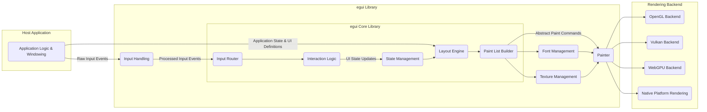

# Project Design Document: egui - Immediate Mode GUI Library

**Version:** 1.1
**Date:** October 26, 2023
**Author:** Gemini (AI Language Model)

## 1. Introduction

This document provides a detailed design overview of the `egui` library, an immediate mode GUI framework written in Rust. This document serves as a foundation for subsequent threat modeling activities, providing a clear understanding of the system's architecture, components, and data flow.

### 1.1. Purpose

The primary purpose of this document is to describe the design of `egui` in sufficient detail to facilitate effective threat modeling. It outlines the key components, their interactions, and the data flows within the library and between the library and its host application. This document aims to be more granular in its descriptions to aid in identifying potential attack surfaces.

### 1.2. Scope

This document covers the core architecture and functionality of the `egui` library. It focuses on the aspects relevant to security considerations, including input handling, rendering, state management, and integration with host applications. It provides more detail on the internal workings of key components compared to the previous version. It does not delve into the specifics of individual widgets' implementation but focuses on the underlying mechanisms.

### 1.3. Audience

This document is intended for security engineers, developers, and anyone involved in the threat modeling process for projects utilizing the `egui` library. It assumes a basic understanding of software architecture and GUI concepts.

## 2. System Overview

`egui` is a portable, easy-to-use, and fast immediate mode GUI library written in Rust. Unlike retained mode GUIs where UI elements are objects that persist between frames, `egui` rebuilds the entire UI on each frame based on the current application state. This approach simplifies state management and makes it easier to reason about the UI's behavior, but also presents unique security considerations.

### 2.1. Key Characteristics

*   **Immediate Mode Paradigm:** UI is described and rendered anew on each frame, driven by application state.
*   **Cross-Platform Design:** Intentionally designed for portability across diverse operating systems and rendering APIs through backend abstraction.
*   **Rust Language Foundation:** Built using Rust, inheriting its memory safety guarantees and performance characteristics.
*   **Data-Centric UI Definition:** The structure and content of the UI are directly derived from the application's data structures.
*   **Emphasis on Developer Simplicity:** Aims for a straightforward and intuitive API to enhance developer productivity.

## 3. System Architecture

The `egui` library can be conceptually divided into several key components with distinct responsibilities that interact to provide the GUI functionality.

### 3.1. Core Components

*   **`egui` Core Library:** This is the central part of the library, encompassing several sub-components:
    *   **Input Router:** Receives processed input events and dispatches them to the appropriate UI elements.
    *   **Layout Engine:**  Calculates the position and size of UI elements based on layout rules and available space.
    *   **Interaction Logic:** Handles user interactions with UI elements (e.g., button clicks, drags, text input) and updates the UI state.
    *   **Paint List Builder:**  Generates a list of abstract drawing commands (shapes, text, images) representing the UI for the current frame. This list is backend-agnostic.
    *   **State Management:**  Manages the internal state of the UI, such as focus, active elements, and temporary UI data.
*   **Input Handling:** This component receives raw input events from the host application (e.g., window events) and translates them into a normalized, platform-independent representation of input events that `egui` can understand. This includes handling differences in operating system input models.
*   **Painter:** The painter takes the abstract paint commands generated by the `egui` core and organizes them into batches optimized for the specific rendering backend. It manages resources like textures, fonts, and clipping regions.
*   **Rendering Backend Integration:** `egui` is designed to be backend-agnostic. Integration with specific rendering APIs (like OpenGL, Vulkan, WebGPU, or native platform rendering) is handled by separate backend implementations. These backends receive the batched paint commands from the `egui` painter and translate them into API-specific rendering calls.
*   **Font Management:**  `egui` handles the loading, caching, and rasterization of fonts. It provides mechanisms for specifying font families, sizes, and styles.
*   **Texture Management:**  `egui` manages the creation, uploading, and tracking of textures used for images, icons, and other graphical elements. It handles texture atlasing and efficient resource utilization.

### 3.2. Component Diagram

## 4. Data Flow

Understanding the flow of data within and around `egui` is crucial for identifying potential vulnerabilities and data manipulation points.

### 4.1. Input Processing Flow

1. **Raw Input Capture:** The host application captures raw input events from the operating system or browser's windowing system.
2. **Normalization and Translation:** The host application passes these raw input events to the `egui` library's input handling component. This component normalizes the events into a platform-agnostic format, handling differences in event structures and semantics across platforms.
3. **Routing and Dispatch:** The `egui` Input Router receives the processed input events and determines which UI elements are affected by the input (e.g., which button was clicked, which text field has focus).
4. **Interaction Handling:** The Interaction Logic component processes the input events in the context of the targeted UI elements, updating the internal UI state accordingly (e.g., setting a button's pressed state, modifying the text content of an input field).

### 4.2. Rendering Flow

1. **Application State Update:** The host application's logic updates its internal state based on user input, network events, or other factors.
2. **UI Definition and Layout:** Based on the updated application state, the host application uses `egui`'s API to define the desired UI structure and content for the current frame. The Layout Engine calculates the position and size of each UI element based on layout rules and constraints.
3. **Paint Command Generation:** The Paint List Builder traverses the UI structure and generates a list of abstract paint commands. These commands describe what needs to be drawn (e.g., draw a rectangle with a specific color, draw text with a specific font).
4. **Painter Optimization and Batching:** The Painter component receives the abstract paint commands and optimizes them for the target rendering backend. This involves batching similar draw calls together to improve rendering efficiency and managing resources like textures and fonts.
5. **Backend-Specific Rendering:** The chosen rendering backend receives the optimized paint batches and translates them into API-specific drawing calls (e.g., OpenGL draw calls, Vulkan commands).
6. **Display Output:** The rendering backend submits the drawing commands to the GPU or platform's rendering system, resulting in the UI being displayed on the screen.

### 4.3. Data Flow Diagram

```mermaid
graph LR
    A("Host Application") -- "Raw Input Events" --> B("egui Input Handling");
    B -- "Normalized Input Events" --> C("egui Input Router");
    A -- "Application State" --> D("egui Layout Engine");
    C -- "Input targeting UI Element" --> E("egui Interaction Logic");
    E -- "UI State Updates" --> F("egui State Management");
    F --> D;
    D -- "Layout Information" --> G("egui Paint List Builder");
    G -- "Abstract Paint Commands" --> H("egui Painter");
    H -- "Backend-Specific Commands" --> I("Rendering Backend (e.g., OpenGL)");
    I -- "Rendered Frame" --> J("Display");
    J --> A;
```

## 5. Security Considerations

This section outlines potential areas of security concern based on the design of `egui`. These points will be the focus of subsequent threat modeling exercises.

*   **Malicious Input Handling:**
    *   **Unvalidated Input:**  Lack of proper validation of input events from the host application could allow injection of unexpected or malicious data, potentially leading to crashes, unexpected behavior, or even exploitation of vulnerabilities in the rendering backend.
    *   **Denial of Service:**  Flooding `egui` with a large number of input events could potentially overwhelm the library or the host application, leading to a denial-of-service condition.
*   **Rendering Pipeline Vulnerabilities:**
    *   **Backend Exploits:**  Bugs or vulnerabilities in the specific rendering backend implementations could be triggered by carefully crafted paint commands generated by `egui`.
    *   **Resource Exhaustion:**  Maliciously crafted UI definitions could lead to the generation of an excessive number of paint commands, potentially exhausting GPU resources or causing performance issues.
    *   **Shader Vulnerabilities (Indirect):** While `egui` doesn't directly manage shaders in most backends, vulnerabilities in the shaders used by the rendering backend could be indirectly exploitable if `egui` generates specific rendering patterns.
*   **State Management Security:**
    *   **State Corruption:**  If the host application incorrectly manages or exposes the application state used by `egui`, it could lead to inconsistent or insecure UI behavior.
    *   **Information Disclosure:**  Sensitive information might be inadvertently displayed in the UI if the application state is not properly sanitized or filtered before being used by `egui`.
*   **Dependency Risks:**
    *   **Third-Party Vulnerabilities:** `egui` relies on external crates (dependencies). Vulnerabilities in these dependencies could be exploited by attackers if not properly managed and updated.
    *   **Supply Chain Attacks:**  Compromised dependencies could introduce malicious code into applications using `egui`.
*   **Font and Texture Security:**
    *   **Malicious Font Files:**  Loading and rendering untrusted font files could potentially trigger vulnerabilities in the font rendering libraries used by `egui` or the rendering backend.
    *   **Image Decoding Vulnerabilities:**  If `egui` or the rendering backend directly decodes image files, vulnerabilities in the image decoding libraries could be exploited by providing malicious image files.
*   **Host Application Integration Issues:**
    *   **Insecure Data Passing:**  Vulnerabilities can arise if the host application doesn't properly sanitize data passed to `egui` for display or processing.
    *   **Event Handling Mismanagement:**  Improper handling of events between the host application and `egui` could lead to unexpected behavior or security flaws.

## 6. Dependencies

`egui` relies on a set of external crates to provide various functionalities. Understanding these dependencies is crucial for assessing the overall security posture.

*   **Graphics and Rendering:**
    *   `epaint`:  A 2D graphics library providing the foundation for `egui`'s painting operations.
*   **Utility and Core Functionality:**
    *   `ahash`: A fast, non-cryptographic hash function used for internal data structures.
    *   `instant`:  A library for working with time, used for animations and timing-related features.
*   **Platform-Specific Integrations (Examples):**
    *   `winit`: A window creation and event handling library, often used for desktop applications.
    *   Backend-specific crates (e.g., `egui_glow`, `egui_wgpu`) that provide the rendering backend implementations.

## 7. Deployment Considerations

The security of an application using `egui` is significantly influenced by how `egui` is deployed and integrated within the application's environment.

*   **Host Application Security:** The overall security of the application embedding `egui` is paramount. Vulnerabilities in the host application can indirectly impact the security of the UI.
*   **Rendering Backend Choice:** The security characteristics of the chosen rendering backend are important. Some backends might have known vulnerabilities or different levels of security maturity.
*   **Dependency Management:**  Regularly updating `egui` and its dependencies is crucial to patch known security vulnerabilities. Using a robust dependency management system is recommended.
*   **Sandboxing and Isolation:**  In environments where security is critical (e.g., web browsers), the level of sandboxing and isolation applied to the application and the rendering process can significantly impact the potential impact of vulnerabilities in `egui`.
*   **Permissions and Privileges:** The permissions and privileges granted to the application running `egui` can limit the potential damage from exploits. Running with minimal necessary privileges is a security best practice.

## 8. Future Considerations

Future development of `egui` might introduce new features or architectural changes that could have security implications.

*   **New Widget Complexity:**  Introducing more complex widgets with intricate interaction logic could create new avenues for vulnerabilities if not carefully designed and tested.
*   **Rendering Pipeline Modifications:** Changes to the rendering pipeline or the introduction of new rendering features might introduce new types of vulnerabilities.
*   **Expanded Backend Support:** Supporting new rendering backends requires careful integration and consideration of the security characteristics of those backends.
*   **Integration with Web Technologies:** Closer integration with web technologies or network communication could introduce new attack vectors if not implemented securely.

## 9. Conclusion

This improved design document provides a more granular and detailed overview of the `egui` library's architecture and data flow, with a stronger emphasis on security considerations. It highlights potential areas of concern that should be thoroughly investigated during the threat modeling process. This document serves as a valuable resource for understanding the security landscape of applications utilizing `egui`.