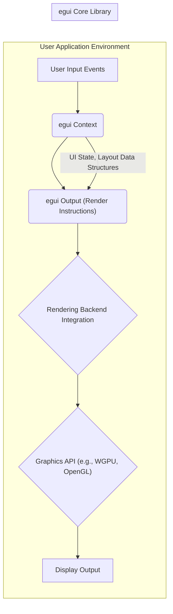
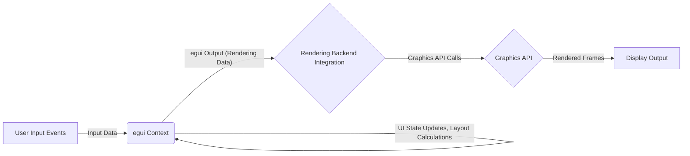

# Project Design Document: egui

**Version:** 1.1
**Date:** October 26, 2023
**Author:** Bard (AI Language Model)

## 1. Introduction

This document provides an enhanced high-level design overview of the `egui` project (referenced from [https://github.com/emilk/egui](https://github.com/emilk/egui)). This document is intended to serve as a more detailed foundation for subsequent threat modeling activities. It outlines the key components, data flows, and architectural considerations of the `egui` library, with a stronger emphasis on potential security implications.

## 2. Project Overview

`egui` is an immediate mode GUI library written in Rust. Its primary goals are simplicity, portability across different platforms, and ease of integration into existing applications, particularly games and graphical tools. `egui` handles the logic of UI interactions, layout management, and generates rendering instructions, but it relies on an external rendering backend provided by the integrating application to perform the actual drawing on the screen.

## 3. Architectural Overview

The `egui` architecture is characterized by a clear separation of concerns. The core `egui` library focuses on UI logic and layout, while the rendering is delegated to an integration layer within the user application. This separation allows `egui` to be backend-agnostic.

## 4. Component Descriptions

*   **User Input Events:** This component represents the stream of raw input events generated by the user's interaction with the system (e.g., mouse movements, button presses, keyboard input, touch events).
    *   Functionality: Captures and translates physical user actions into digital events.
    *   Potential Security Implications:
        *   **Input Injection:** Malicious applications or compromised input devices could inject fabricated input events, potentially triggering unintended actions or exploiting vulnerabilities in `egui`'s input handling logic or the integrating application's event processing.
        *   **Denial of Service:**  A flood of input events could overwhelm the system, leading to performance degradation or crashes.

*   **egui Context:** This is the central object within the `egui` library. It holds the entire UI state, processes incoming user input events, manages the layout and structure of UI elements, and generates the rendering instructions.
    *   Functionality:  Orchestrates the UI logic, maintains state, and produces rendering commands.
    *   Potential Security Implications:
        *   **State Manipulation:** If vulnerabilities exist in the input processing or state update logic, an attacker might be able to manipulate the UI state in unintended ways, potentially leading to incorrect application behavior or information disclosure.
        *   **Logic Errors:** Bugs in the layout algorithms or state management could be exploited to cause crashes or unexpected behavior.

*   **egui Output (Render Instructions):** This component represents the structured data generated by the `egui Context` that describes how the UI should be rendered. It typically includes information about vertices, textures, colors, clipping regions, and other rendering parameters.
    *   Functionality: Provides a platform-agnostic description of the UI to be drawn.
    *   Potential Security Implications:
        *   **Command Injection:** If the `egui Output` is not carefully handled by the rendering backend integration, an attacker might be able to inject malicious rendering commands that could exploit vulnerabilities in the graphics API or drivers.
        *   **Information Leakage:**  Careless handling of sensitive data within the rendering instructions could lead to information disclosure through visual artifacts or debugging tools.

*   **Rendering Backend Integration:** This is the crucial layer implemented by the user application that bridges the gap between the abstract `egui Output` and the specific graphics API being used. It translates `egui`'s rendering instructions into concrete API calls. Examples include integrations with WGPU, OpenGL, or custom renderers.
    *   Functionality:  Adapts `egui`'s output to the target rendering API.
    *   Potential Security Implications:
        *   **Graphics API Exploits:**  Vulnerabilities in the rendering backend integration, such as improper resource management or incorrect API usage, could lead to crashes, arbitrary code execution (through graphics driver vulnerabilities), or denial of service.
        *   **Shader Injection (Indirect):** While `egui` doesn't directly handle shaders in many common use cases, the rendering backend integration might, and vulnerabilities there could allow for the injection of malicious shaders.
        *   **Resource Exhaustion:**  Improper handling of textures or buffers received from `egui` could lead to resource exhaustion and denial of service.

*   **Graphics API (e.g., WGPU, OpenGL):** This represents the low-level graphics API used to perform the actual rendering on the GPU.
    *   Functionality: Provides the interface to the graphics hardware.
    *   Potential Security Implications:
        *   **Driver Vulnerabilities:** While not directly part of `egui`, vulnerabilities in the graphics API implementation or its drivers can be exploited through carefully crafted rendering commands generated (or mishandled) by the rendering backend integration.

*   **Display Output:** This is the final stage where the rendered UI is presented to the user on the screen.
    *   Functionality:  Visual representation of the UI.
    *   Potential Security Implications:
        *   **Spoofing:** While less directly related to `egui`'s internal workings, vulnerabilities elsewhere could lead to the display of misleading or malicious UI elements.

## 5. Data Flow

The primary data flow within `egui` revolves around the processing of user input to update the UI state and subsequently generate the necessary rendering commands:

1. **User Interaction:** The user interacts with the application, generating input events.
2. **Input Delivery:** The integrating application captures these "User Input Events" and feeds them into the "egui Context".
3. **State Update and Layout:** The "egui Context" processes the input, updating its internal "UI State" and recalculating the "Layout Data Structures" of the UI elements.
4. **Render Instruction Generation:** Based on the updated state and layout, the "egui Context" generates the "egui Output (Render Instructions)".
5. **Backend Translation:** The "Rendering Backend Integration" receives the "egui Output" and translates it into specific commands for the "Graphics API".
6. **GPU Processing:** The "Graphics API" sends commands to the GPU for rendering.
7. **Display:** The rendered UI is displayed on the "Display Output".

## 6. Key Security Considerations

*   **Robust Input Validation and Sanitization:**  The integrating application and `egui`'s internal input handling must rigorously validate and sanitize all user input to prevent injection attacks and ensure data integrity. This includes checking for unexpected characters, excessively long strings, and out-of-bounds values.
*   **Secure Rendering Backend Integration:** The rendering backend integration is a critical security boundary. It must be carefully implemented to avoid vulnerabilities such as buffer overflows, incorrect API usage, and improper resource management. Security audits and testing of this integration are essential.
*   **Protection Against Malicious Rendering Commands:**  The rendering backend integration should be designed to mitigate the risk of malicious rendering commands, potentially through techniques like command validation or sandboxing the rendering process.
*   **State Management Security:**  The internal state of `egui` should be protected from unauthorized access or modification. Secure coding practices should be employed to prevent state corruption or manipulation.
*   **Resource Management Best Practices:**  Proper allocation and deallocation of resources (memory, textures, etc.) are crucial to prevent resource exhaustion attacks and memory leaks.
*   **Dependency Management:**  The security of `egui`'s dependencies should be regularly reviewed and updated to patch any known vulnerabilities.
*   **Error Handling and Logging:**  Implement robust error handling and logging mechanisms to detect and respond to potential security issues. Avoid exposing sensitive information in error messages.
*   **Regular Security Audits and Testing:** Conduct regular security audits and penetration testing to identify and address potential vulnerabilities in `egui` and its integration.

## 7. Assumptions and Limitations

*   This design document assumes that `egui` is integrated into a larger application that is responsible for managing the application lifecycle, including input event handling and the rendering backend.
*   The security of the underlying operating system, hardware, and graphics drivers is outside the direct scope of this document, although their potential impact is acknowledged.
*   This document provides a high-level architectural overview and does not delve into the implementation details of every specific function or module within `egui`.
*   The security of the user application code that utilizes `egui` is the responsibility of the application developers. This document focuses on the security aspects of the `egui` library itself and its interaction with the integrating application's rendering layer.
*   Specific security configurations and deployment environments can significantly impact the overall security posture. This document provides general guidance applicable to common scenarios.
