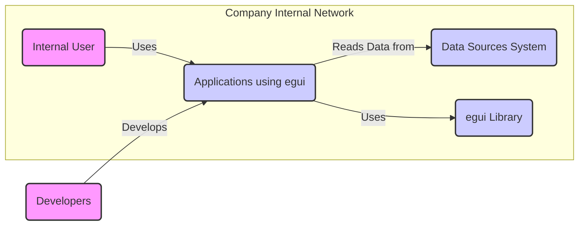
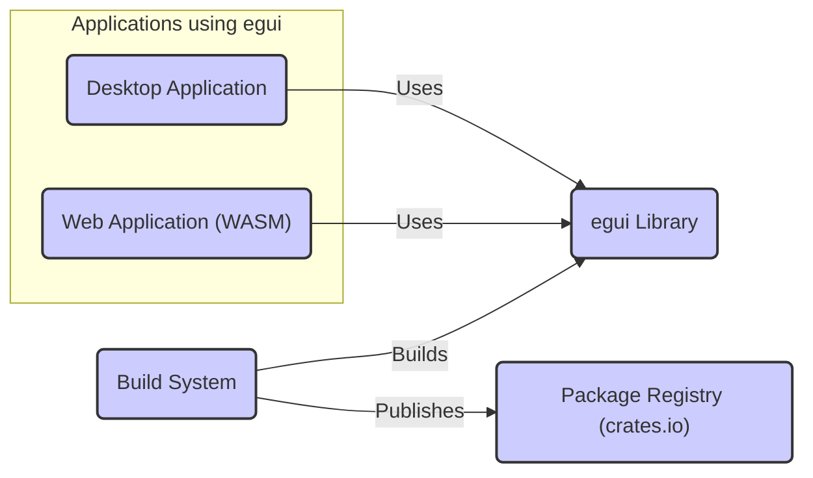
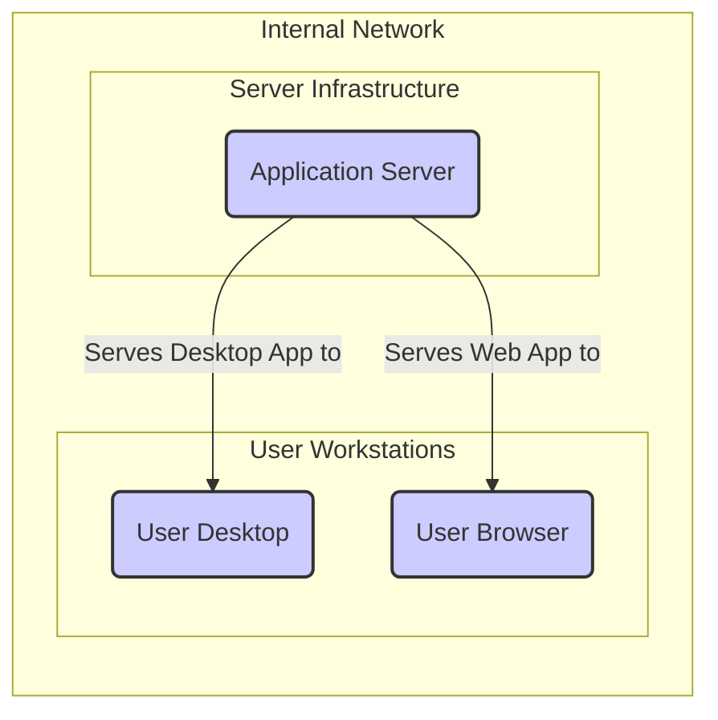
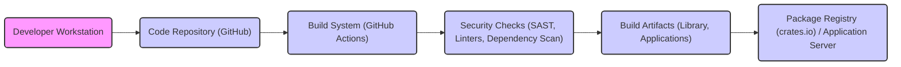

# BUSINESS POSTURE

This project aims to utilize the egui library to develop internal tools for data visualization and analysis. The primary business goal is to empower internal teams with user-friendly and efficient tools to explore and understand complex datasets, leading to faster and more informed decision-making.

Business priorities are:
- Rapid development and deployment of functional tools to meet immediate business needs.
- Ease of use and intuitive interface for internal users with varying technical skills.
- Maintainability and extensibility of the tools to adapt to evolving business requirements.

Most important business risks to address:
- Data breaches or leaks from internal tools exposing sensitive business information.
- Unauthorized access to sensitive data visualized and analyzed through these tools.
- Downtime or unavailability of critical data analysis tools impacting business operations.
- Vulnerabilities in the tools that could be exploited to compromise internal systems.

# SECURITY POSTURE

Existing security controls:
- security control: Source code is hosted on GitHub, providing version control and access control for developers. Implemented in: GitHub repository settings.
- security control: Basic code review process is in place before merging code changes. Implemented in: Development team workflow.
- security control: Dependency management using Cargo, which helps in tracking and managing external libraries. Implemented in: `Cargo.toml` and `Cargo.lock` files.
- security control: Standard software development lifecycle practices are followed, including testing and basic quality assurance. Implemented in: Development team workflow.

Accepted risks:
- accepted risk: Reliance on manual code review for security vulnerabilities.
- accepted risk: Limited automated security scanning and testing in the development pipeline.
- accepted risk: Potential vulnerabilities in third-party dependencies.
- accepted risk: Basic level of security awareness among developers, without dedicated security training.

Recommended security controls:
- security control: Implement automated Static Application Security Testing (SAST) and Dynamic Application Security Testing (DAST) tools in the CI/CD pipeline.
- security control: Integrate dependency vulnerability scanning to identify and address known vulnerabilities in third-party libraries.
- security control: Provide security awareness training to developers, focusing on secure coding practices and common web application vulnerabilities.
- security control: Establish secure coding guidelines and conduct regular security code reviews.
- security control: Implement input validation and output encoding in applications built using egui to prevent common injection attacks.

Security requirements:
- Authentication:
    - Requirement: Access to tools built with egui should be authenticated to ensure only authorized users can access them.
    - Implementation: Application level authentication using existing company identity provider (e.g., Active Directory, Okta) or a simpler solution for internal tools (e.g., basic username/password with strong password policies).
- Authorization:
    - Requirement: Within the tools, authorization mechanisms should control access to specific features and data based on user roles and permissions.
    - Implementation: Role-Based Access Control (RBAC) within the applications, integrated with the authentication system.
- Input Validation:
    - Requirement: All user inputs within applications built with egui must be validated to prevent injection attacks (e.g., SQL injection, Cross-Site Scripting).
    - Implementation: Input validation implemented in the application code using egui, on both client-side and server-side if applicable.
- Cryptography:
    - Requirement: Sensitive data handled by applications built with egui, both in transit and at rest, should be encrypted.
    - Implementation: Encryption of data in transit using HTTPS. Encryption of data at rest in databases or storage systems used by the applications. Cryptographic libraries should be used securely and according to best practices.

# DESIGN

## C4 CONTEXT

Context Diagram Elements:

- Element:
    - Name: Internal User
    - Type: User
    - Description: Company employees who will use the data visualization and analysis tools built with egui.
    - Responsibilities: Use the applications to analyze data and make business decisions.
    - Security controls: Authentication to access company network and applications, authorization based on roles to access specific tools and data.

- Element:
    - Name: Data Sources System
    - Type: System
    - Description: Internal systems that provide the data to be visualized and analyzed by the tools. These could be databases, data warehouses, or other internal applications.
    - Responsibilities: Provide accurate and up-to-date data to the applications. Implement data access controls and security measures to protect sensitive data.
    - Security controls: Access control lists, database security measures, data encryption at rest and in transit, regular security audits.

- Element:
    - Name: Applications using egui
    - Type: System
    - Description: Internal data visualization and analysis tools built using the egui library. These applications will be deployed within the company's internal network.
    - Responsibilities: Provide user-friendly interfaces for data visualization and analysis. Securely access and process data from Data Sources System. Implement authentication, authorization, input validation, and data protection measures.
    - Security controls: Application-level authentication and authorization, input validation, output encoding, secure coding practices, regular security testing, data encryption in transit (HTTPS).

- Element:
    - Name: egui Library
    - Type: System
    - Description: The egui Rust library, used as a component to build the user interfaces of the data visualization and analysis applications.
    - Responsibilities: Provide UI components and functionalities for building graphical interfaces. Ensure the library itself is free of vulnerabilities and follows secure coding practices.
    - Security controls: Dependency scanning, code review of library updates, adherence to secure coding practices in library development.

- Element:
    - Name: Developers
    - Type: User
    - Description: Internal software developers responsible for building and maintaining the data visualization and analysis applications using the egui library.
    - Responsibilities: Develop secure and functional applications using egui. Follow secure coding practices and participate in code reviews.
    - Security controls: Access control to code repositories, secure development environment, security awareness training, code review process.

## C4 CONTAINER

Container Diagram Elements:

- Element:
    - Name: Desktop Application
    - Type: Container
    - Description: Data visualization and analysis application built using egui and packaged as a desktop executable for different operating systems (Windows, macOS, Linux).
    - Responsibilities: Provide a rich desktop user interface for data analysis. Interact with local file systems and potentially network resources.
    - Security controls: Operating system level security controls, application signing, input validation, secure storage of local data if any.

- Element:
    - Name: Web Application (WASM)
    - Type: Container
    - Description: Data visualization and analysis application built using egui and compiled to WebAssembly (WASM) to run in web browsers.
    - Responsibilities: Provide a web-based user interface for data analysis accessible through standard web browsers. Interact with backend services for data retrieval and processing.
    - Security controls: Web application security best practices, input validation, output encoding, secure communication (HTTPS), browser security features, Content Security Policy (CSP).

- Element:
    - Name: egui Library
    - Type: Container
    - Description: The egui Rust library, providing UI components and functionalities. It is used by both Desktop and Web Applications.
    - Responsibilities: Provide secure and reliable UI components.
    - Security controls: Regular security audits, dependency scanning, secure coding practices.

- Element:
    - Name: Build System
    - Type: Container
    - Description: Automated system (e.g., GitHub Actions) responsible for building, testing, and packaging the egui library and applications.
    - Responsibilities: Automate the build process, perform security checks (linters, SAST, dependency scanning), and publish build artifacts.
    - Security controls: Secure build environment, access control to build system, audit logging, secure artifact storage, supply chain security measures.

- Element:
    - Name: Package Registry (crates.io)
    - Type: Container
    - Description: Public registry (crates.io) where the egui library is published and distributed for use by other Rust projects.
    - Responsibilities: Host and distribute the egui library packages. Ensure the integrity and availability of packages.
    - Security controls: Package signing, vulnerability scanning of published packages, access control for publishing.

## DEPLOYMENT

Deployment Architecture: Internal Network Deployment

Deployment Diagram Elements:

- Element:
    - Name: Application Server
    - Type: Infrastructure
    - Description: Server infrastructure within the internal network hosting the applications built with egui. This could be a single server or a cluster of servers depending on scalability requirements.
    - Responsibilities: Host and serve the desktop application executables and web application files. Manage application configurations and dependencies.
    - Security controls: Server hardening, operating system security patches, network firewalls, intrusion detection systems, access control lists, regular security audits.

- Element:
    - Name: User Desktop
    - Type: Infrastructure
    - Description: Company employee workstations where the desktop application built with egui is installed and run.
    - Responsibilities: Provide a secure environment for running the desktop application. Enforce endpoint security policies.
    - Security controls: Endpoint security software (antivirus, EDR), operating system security patches, access control, data loss prevention (DLP) measures.

- Element:
    - Name: User Browser
    - Type: Infrastructure
    - Description: Web browsers running on user workstations used to access the web application built with egui.
    - Responsibilities: Provide a secure browsing environment. Enforce browser security policies and extensions.
    - Security controls: Browser security settings, browser extensions for security, web filtering, secure browsing practices training for users.

## BUILD

Build Process Description:

1. Developer Workstation: Developers write and test code for egui library and applications on their local workstations.
2. Code Repository (GitHub): Code is committed and pushed to a GitHub repository, which serves as the central version control system.
3. Build System (GitHub Actions): GitHub Actions is used as the automated build system. Upon code changes, workflows are triggered to build, test, and package the software.
4. Security Checks (SAST, Linters, Dependency Scan): During the build process, automated security checks are performed. This includes:
    - Static Application Security Testing (SAST) to identify potential security vulnerabilities in the code.
    - Linters to enforce code quality and style guidelines, which can indirectly improve security.
    - Dependency vulnerability scanning to check for known vulnerabilities in third-party libraries used by egui and applications.
5. Build Artifacts (Library, Applications): If security checks pass and build is successful, build artifacts are created. These include:
    - egui library packages.
    - Executables for desktop applications.
    - Web application files (WASM, HTML, JavaScript).
6. Package Registry (crates.io) / Application Server:
    - For the egui library, build artifacts are published to the crates.io package registry, making it available for public use.
    - For internal applications, build artifacts (executables, web application files) are deployed to the Application Server within the internal network.

Build Process Security Controls:

- security control: Access control to the code repository (GitHub) to restrict who can commit and modify code. Implemented in: GitHub repository settings.
- security control: Use of GitHub Actions for automated builds, ensuring a consistent and repeatable build process. Implemented in: GitHub Actions workflows.
- security control: Integration of SAST and linters in the build pipeline to automatically detect code quality and security issues. Implemented in: GitHub Actions workflows.
- security control: Dependency vulnerability scanning to identify and manage vulnerabilities in third-party libraries. Implemented in: GitHub Actions workflows using dependency scanning tools.
- security control: Secure build environment for GitHub Actions runners, minimizing the risk of build system compromise. Implemented in: GitHub Actions infrastructure and configuration.
- security control: Code signing for desktop application executables to ensure integrity and authenticity. Implemented in: Build process within GitHub Actions.
- security control: Access control to the package registry (crates.io) for publishing the egui library. Implemented in: crates.io account settings and publishing process.
- security control: Secure storage of build artifacts and deployment packages. Implemented in: GitHub Actions artifacts storage and Application Server storage.

# RISK ASSESSMENT

Critical business process we are trying to protect:
- Data analysis and reporting for informed decision-making. Disruption or compromise of these processes can lead to poor business decisions, financial losses, and reputational damage.

Data we are trying to protect and their sensitivity:
- Business data used for analysis. This data can vary in sensitivity depending on the specific application. It may include:
    - Financial data: Highly sensitive, requiring strong confidentiality and integrity.
    - Customer data: Sensitive, requiring protection to comply with privacy regulations and maintain customer trust.
    - Operational data: Potentially sensitive, as it can reveal business strategies and performance.
    - Internal reports and analysis: Confidential, as they contain insights and strategic information.

Sensitivity level: Medium to High, depending on the specific data being processed by the applications built with egui. Applications handling financial or customer data will have higher sensitivity.

# QUESTIONS & ASSUMPTIONS

Questions:
- What specific types of data will be visualized and analyzed using the tools built with egui?
- What are the compliance requirements for data security and privacy (e.g., GDPR, HIPAA)?
- What is the expected scale and performance requirements for the applications?
- What existing security infrastructure and services are available within the company?
- What is the budget and timeline for implementing security controls?

Assumptions:
- BUSINESS POSTURE: The primary use case is for internal data visualization and analysis tools. The business prioritizes rapid development and ease of use, with a moderate risk appetite initially, but increasing security focus as the tools become more critical.
- SECURITY POSTURE: Existing security controls are basic, and there is a need to enhance security measures, especially in automated security testing, dependency management, and secure coding practices. The company is willing to invest in improving security posture.
- DESIGN: Applications will be deployed within the internal network, with both desktop and web application versions. The build process will be automated using GitHub Actions, and security checks will be integrated into the CI/CD pipeline.