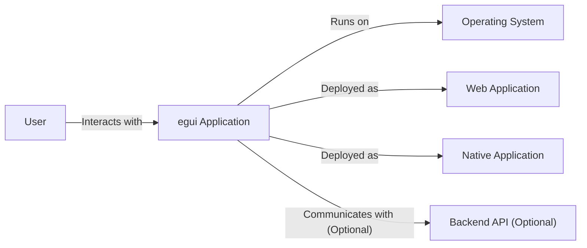
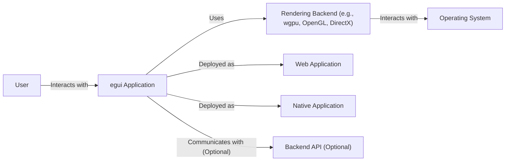
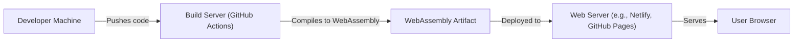
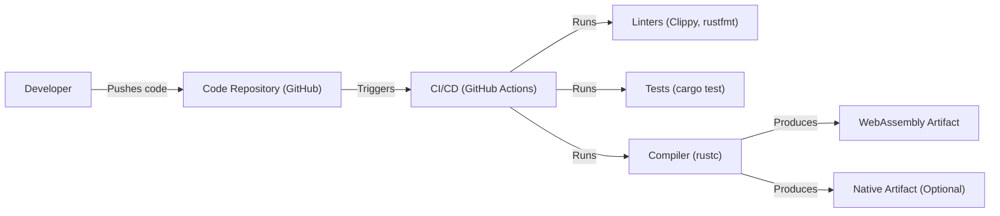

Okay, let's create a design document for the `egui` project, focusing on aspects relevant for threat modeling.

# BUSINESS POSTURE

Business Priorities and Goals:

*   Provide an easy-to-use, immediate-mode GUI library for Rust developers.
*   Enable rapid prototyping and development of interactive applications.
*   Offer a lightweight and portable solution, suitable for web and native platforms.
*   Maintain a clean and understandable codebase, encouraging community contributions.
*   Minimize external dependencies to reduce potential security and maintenance overhead.

Business Risks:

*   Malicious code injection through user-provided input (e.g., text fields, custom widgets).
*   Denial-of-service attacks targeting applications built with `egui`.
*   Cross-site scripting (XSS) vulnerabilities if `egui` is used to render untrusted content in a web context.
*   Data breaches if applications built with `egui` handle sensitive user data without proper security measures.
*   Supply chain attacks if dependencies of `egui` or build tools are compromised.
*   Reputational damage due to security vulnerabilities in `egui` or applications built with it.

# SECURITY POSTURE

Existing Security Controls:

*   security control: The library is written in Rust, a memory-safe language, which inherently mitigates many common vulnerabilities like buffer overflows and use-after-free errors. (Source: Rust language design)
*   security control: The project appears to have a focus on minimizing external dependencies. (Source: `Cargo.toml` file and project philosophy)
*   security control: The project uses GitHub Actions for continuous integration, which can be configured to include security checks. (Source: `.github/workflows` directory)
*   security control: Clippy is used as linter. (Source: `.github/workflows/rust.yml`)
*   security control: `cargo fmt` is used to enforce consistent code style. (Source: `.github/workflows/rust.yml`)

Accepted Risks:

*   accepted risk: The library's immediate-mode nature means that developers are responsible for handling input sanitization and output encoding to prevent injection attacks. The library itself does not provide built-in mechanisms for this.
*   accepted risk: The library's focus on ease of use and portability may lead to developers overlooking security best practices when building applications.
*   accepted risk: The project relies on community contributions, which may introduce vulnerabilities if not thoroughly reviewed.

Recommended Security Controls:

*   security control: Integrate a static analysis tool (e.g., `cargo audit`, `cargo deny`) into the CI pipeline to automatically detect vulnerabilities in dependencies.
*   security control: Implement fuzz testing to identify potential vulnerabilities related to input handling.
*   security control: Provide clear documentation and examples on how to securely handle user input and output in `egui` applications.
*   security control: Establish a security policy and vulnerability disclosure process.
*   security control: Consider using a Content Security Policy (CSP) when deploying `egui` applications in a web context.

Security Requirements:

*   Authentication: `egui` itself does not handle authentication. Applications built with `egui` must implement their own authentication mechanisms if required.
*   Authorization: `egui` does not provide built-in authorization mechanisms. Applications must implement their own authorization logic.
*   Input Validation: Applications built with `egui` MUST thoroughly validate and sanitize all user-provided input to prevent injection attacks. `egui` provides basic input handling, but it is the application's responsibility to ensure that the input is safe.
*   Cryptography: `egui` does not provide cryptographic functions. Applications requiring cryptography must use appropriate Rust libraries.
*   Output Encoding: Applications built with `egui` and rendering to web targets MUST properly encode output to prevent XSS vulnerabilities.

# DESIGN

## C4 CONTEXT

Context Diagram Element List:

*   Element:
    *   Name: User
    *   Type: Person
    *   Description: A person interacting with an application built using `egui`.
    *   Responsibilities: Provides input, views output, interacts with the application's interface.
    *   Security controls: None (external to the system).

*   Element:
    *   Name: egui Application
    *   Type: Software System
    *   Description: An application built using the `egui` library.
    *   Responsibilities: Renders the user interface, handles user input, manages application state.
    *   Security controls: Relies on Rust's memory safety, input validation and output encoding performed by the application developer.

*   Element:
    *   Name: Operating System
    *   Type: Software System
    *   Description: The underlying operating system on which the `egui` application runs (e.g., Windows, macOS, Linux, Web Browser).
    *   Responsibilities: Provides resources and services to the application.
    *   Security controls: OS-level security mechanisms (e.g., process isolation, memory protection).

*   Element:
    *   Name: Web Application
    *   Type: Software System
    *   Description: An `egui` application compiled to WebAssembly and running in a web browser.
    *   Responsibilities: Executes within the browser's sandbox, interacts with the DOM.
    *   Security controls: Browser security mechanisms (e.g., same-origin policy, CSP).

*   Element:
    *   Name: Native Application
    *   Type: Software System
    *   Description: An `egui` application compiled to native code and running directly on the operating system.
    *   Responsibilities: Interacts directly with the operating system.
    *   Security controls: OS-level security mechanisms.

*   Element:
    *   Name: Backend API (Optional)
    *   Type: Software System
    *   Description: An optional backend API that the `egui` application may communicate with.
    *   Responsibilities: Provides data and services to the `egui` application.
    *   Security controls: Authentication, authorization, input validation, encryption (if applicable).

## C4 CONTAINER

Container Diagram Element List:

*   Element:
    *   Name: User
    *   Type: Person
    *   Description: A person interacting with an application built using `egui`.
    *   Responsibilities: Provides input, views output, interacts with the application's interface.
    *   Security controls: None (external to the system).

*   Element:
    *   Name: egui Application
    *   Type: Container
    *   Description: The core application logic built using `egui`.
    *   Responsibilities: Handles user input, manages application state, defines the UI layout.
    *   Security controls: Relies on Rust's memory safety, input validation and output encoding performed by the application developer.

*   Element:
    *   Name: Rendering Backend
    *   Type: Container
    *   Description: The graphics library used by `egui` to render the UI (e.g., `wgpu`, OpenGL, DirectX, or a web-based renderer).
    *   Responsibilities: Translates `egui`'s drawing commands into platform-specific graphics calls.
    *   Security controls: Relies on the security of the underlying graphics library.

*   Element:
    *   Name: Operating System
    *   Type: Software System
    *   Description: The underlying operating system.
    *   Responsibilities: Provides resources and services.
    *   Security controls: OS-level security mechanisms.

*   Element:
    *   Name: Web Application
    *   Type: Software System
    *   Description: An `egui` application compiled to WebAssembly.
    *   Responsibilities: Executes within the browser's sandbox.
    *   Security controls: Browser security mechanisms.

*   Element:
    *   Name: Native Application
    *   Type: Software System
    *   Description: An `egui` application compiled to native code.
    *   Responsibilities: Interacts directly with the operating system.
    *   Security controls: OS-level security mechanisms.

*   Element:
    *   Name: Backend API (Optional)
    *   Type: Container
    *   Description: An optional backend API.
    *   Responsibilities: Provides data and services.
    *   Security controls: Authentication, authorization, input validation, encryption.

## DEPLOYMENT

Possible Deployment Solutions:

1.  Native Application (Windows, macOS, Linux): Compiled executable distributed directly to users.
2.  Web Application (WebAssembly): Compiled to WebAssembly and served via a web server.
3.  Hybrid Approach: Native application using a web view (e.g., Tauri, Electron) to render the `egui` interface.

Chosen Solution (WebAssembly):

Deployment Diagram Element List:

*   Element:
    *   Name: Developer Machine
    *   Type: Infrastructure Node
    *   Description: The developer's local machine.
    *   Responsibilities: Code development, testing, local builds.
    *   Security controls: Developer machine security best practices.

*   Element:
    *   Name: Build Server (GitHub Actions)
    *   Type: Infrastructure Node
    *   Description: The CI/CD server running GitHub Actions.
    *   Responsibilities: Automated builds, testing, deployment.
    *   Security controls: GitHub Actions security best practices, secrets management.

*   Element:
    *   Name: WebAssembly Artifact
    *   Type: Artifact
    *   Description: The compiled WebAssembly module and associated files.
    *   Responsibilities: Contains the executable code for the `egui` application.
    *   Security controls: Code signing (if applicable).

*   Element:
    *   Name: Web Server (e.g., Netlify, GitHub Pages)
    *   Type: Infrastructure Node
    *   Description: The web server hosting the WebAssembly application.
    *   Responsibilities: Serves the WebAssembly files to users.
    *   Security controls: Web server security best practices, HTTPS, CSP.

*   Element:
    *   Name: User Browser
    *   Type: Infrastructure Node
    *   Description: The user's web browser.
    *   Responsibilities: Executes the WebAssembly application.
    *   Security controls: Browser security mechanisms (same-origin policy, sandboxing).

## BUILD

Build Process Description:

1.  Developer pushes code changes to the GitHub repository.
2.  GitHub Actions triggers a workflow.
3.  Linters (`clippy`, `rustfmt`) are run to check code style and potential errors.
4.  Tests (`cargo test`) are executed to ensure code correctness.
5.  The Rust compiler (`rustc`) compiles the code to WebAssembly (and optionally native targets).
6.  Build artifacts (WebAssembly module, native executables) are produced.

Security Controls:

*   security control: Linting with `clippy` and `rustfmt` helps identify potential code quality and security issues.
*   security control: Automated testing with `cargo test` helps ensure code correctness and prevent regressions.
*   security control: GitHub Actions provides a secure and controlled environment for building the application.
*   security control: Dependency management with `Cargo` helps track and manage dependencies.
*   security control: (Recommended) Integration of static analysis tools (e.g., `cargo audit`, `cargo deny`) to detect vulnerabilities in dependencies.

# RISK ASSESSMENT

Critical Business Processes:

*   Providing a functional and reliable GUI library for developers.
*   Maintaining the reputation and trust of the `egui` project.
*   Ensuring the security of applications built with `egui`.

Data to Protect:

*   Source code of the `egui` library (sensitivity: medium - public repository, but integrity is important).
*   User data handled by applications built with `egui` (sensitivity: varies depending on the application - potentially high).  `egui` itself does not directly handle user data, but applications built with it might.
*   Build artifacts (sensitivity: medium - integrity is important to prevent distribution of malicious code).

# QUESTIONS & ASSUMPTIONS

Questions:

*   Are there any specific compliance requirements (e.g., GDPR, HIPAA) that applications built with `egui` are expected to meet?
*   What is the expected threat model for typical `egui` applications (e.g., web applications, desktop applications, embedded systems)?
*   What level of security expertise is expected from developers using `egui`?
*   Are there plans to add any built-in security features to `egui` in the future?

Assumptions:

*   BUSINESS POSTURE: The primary goal is to provide a user-friendly and versatile GUI library, with security being a significant but not overriding concern.
*   SECURITY POSTURE: Developers using `egui` are responsible for implementing appropriate security measures in their applications. `egui` provides a foundation, but it does not guarantee application security.
*   DESIGN: The deployment model will vary depending on the specific application. The WebAssembly deployment model is chosen as a representative example. The build process relies on GitHub Actions for automation and security.