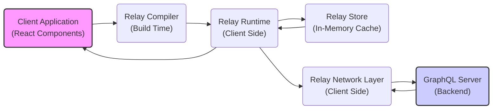
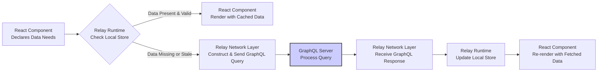
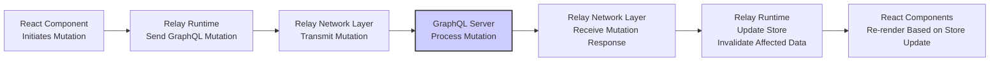

# Project Design Document: Relay

**Version:** 1.1
**Date:** October 26, 2023
**Author:** AI Software Architect

## 1. Introduction

This document provides an enhanced architectural design of the Relay framework, a JavaScript framework developed by Facebook for building efficient and data-driven React applications. This document is intended to serve as a comprehensive resource for understanding Relay's architecture and will be used as the foundation for subsequent threat modeling activities. It details the key components, data flow mechanisms, and interactions within the Relay ecosystem, with a primary focus on the client-side aspects and its interaction with a backend GraphQL server.

## 2. Goals

*   Present a clear and comprehensive overview of the Relay architecture, suitable for security analysis.
*   Precisely identify key components within the Relay framework and delineate their specific responsibilities.
*   Thoroughly describe the various data flow paths and processes within the Relay framework, including queries, mutations, and subscriptions.
*   Clearly outline the interactions and communication pathways between different components of the Relay system.
*   Establish a robust and well-defined understanding of the system architecture to facilitate effective threat modeling and security assessments.

## 3. Non-Goals

*   In-depth design specifications of individual Relay features or specific API implementations.
*   Low-level implementation details of the Relay framework's internal workings.
*   Specific configurations or implementation details of the backend GraphQL server.
*   Performance benchmarking or optimization strategies for Relay applications.
*   Detailed user interface (UI) or user experience (UX) design considerations for applications built with Relay.

## 4. Architectural Overview

Relay is a client-side JavaScript framework designed to streamline data fetching and management for React applications interacting with a GraphQL backend. It promotes a declarative approach to data fetching, where React components explicitly declare their data requirements using GraphQL fragments, and Relay autonomously handles the complexities of fetching, caching, and ensuring data consistency.

### 4.1. High-Level Architecture Diagram



### 4.2. Key Architectural Layers

*   **Client Application (React Components):** This layer comprises the user interface of the application, built using React components. These components define their data dependencies using GraphQL fragments, co-located with the component definition.
*   **Relay Compiler (Build Time):** This is a build-time tool that parses and processes GraphQL queries, mutations, and fragments defined within the application's codebase. It performs optimizations, generates runtime artifacts, and ensures type safety between the client and the GraphQL schema.
*   **Relay Runtime (Client Side):** This is the core of the Relay framework, executing within the client-side JavaScript environment. It is responsible for managing the data fetching lifecycle, interacting with the Relay Store for caching, and utilizing the Relay Network Layer for communication with the backend.
*   **Relay Store (In-Memory Cache):** This is an in-memory, normalized cache that holds data fetched from the GraphQL server. It provides mechanisms for data consistency, optimistic updates, and efficient data retrieval, minimizing redundant network requests.
*   **Relay Network Layer (Client Side):** This layer handles the communication with the backend GraphQL server. It is responsible for constructing and sending GraphQL operations (queries, mutations, subscriptions) over HTTP or WebSockets and processing the responses. This layer is often customized for specific authentication or error handling needs.
*   **GraphQL Server (Backend):** This is the backend service that exposes data and functionality through a GraphQL API. Relay interacts with this server to fetch and mutate data according to the defined GraphQL schema.

## 5. Data Flow

The data flow within a Relay application is orchestrated to efficiently manage data fetching and updates. Different flows exist for queries, mutations, and subscriptions.

1. **Component Data Requirement (Queries):** A React component declares its data requirements using the `graphql` tagged template literal to define GraphQL fragments.
2. **Compilation (Queries):** The Relay Compiler, during the build process, analyzes these fragments and generates optimized query documents.
3. **Query Execution Initiation:** When a component using a Relay Hook (e.g., `useQuery`) mounts or its variables change, the Relay Runtime initiates the data fetching process.
4. **Relay Store Check (Queries):** The Runtime first checks the Relay Store to see if the required data is already present and valid in the cache.
5. **Network Request (Queries - if needed):** If the data is not in the store or is considered stale based on configured policies, the Relay Network Layer constructs and sends a GraphQL query to the server.
6. **Server Processing (Queries):** The GraphQL server processes the incoming query, resolves the data from its data sources, and returns a GraphQL response.
7. **Store Update (Queries):** The Relay Runtime receives the response from the server and updates the Relay Store with the new data, normalizing it for efficient caching and retrieval.
8. **Component Update (Queries):** React re-renders the component with the updated data fetched from the Relay Store.
9. **Mutation Flow:** When a mutation is initiated (e.g., using `useMutation`), the Relay Runtime sends a GraphQL mutation operation to the server. Upon receiving a successful response, the Runtime updates the store based on the mutation's response and potentially invalidates cached data that might be affected by the mutation.
10. **Subscription Flow:** For subscriptions (using `useSubscription`), a persistent connection (typically WebSocket) is established with the server. The server pushes updates to the client, and the Relay Runtime updates the store in real-time as new data arrives, triggering re-renders of subscribed components.

### 5.1. Data Flow Diagram (Query)



### 5.2. Data Flow Diagram (Mutation)



## 6. Key Components and their Responsibilities

*   **`graphql` Tagged Template Literal:** This JavaScript feature, used with the Relay Compiler, allows developers to embed GraphQL queries, mutations, and fragments directly within their JavaScript or JSX code. The compiler then processes these strings.
*   **`useQuery` Hook:** A React Hook provided by Relay that facilitates fetching data for a component based on a provided GraphQL query. It manages the loading state and provides the fetched data.
*   **`useFragment` Hook:** A React Hook that enables a component to access data fetched by a parent component's query, based on a specified GraphQL fragment. This promotes data colocation and avoids over-fetching.
*   **`useMutation` Hook:** A React Hook used to execute GraphQL mutations. It provides functions to trigger the mutation and access the mutation's loading state and response data.
*   **`useSubscription` Hook:** A React Hook that allows components to subscribe to real-time data updates from the GraphQL server. It manages the subscription lifecycle and updates the component with new data.
*   **`RelayEnvironment`:** A central object that configures the Relay runtime for an application. It includes settings for the network layer, store implementation, and other runtime options.
*   **`Network` Layer Implementation:** This is a customizable module responsible for handling the underlying network requests to the GraphQL server. Developers can implement custom logic for authentication, authorization, error handling, and request batching within this layer.
*   **`Store` Implementation:** Manages the client-side cache. Relay provides a default, normalized in-memory store, but custom store implementations can be provided for different caching strategies or persistence mechanisms.
*   **`Record Source`:** The internal data structure within the Relay Store that holds the normalized GraphQL data. It allows for efficient data access and updates.
*   **`Operation Loaders`:** Mechanisms for preloading data for specific routes or components, improving the initial loading experience by fetching data before it's strictly needed.
*   **`Pagination and Connections`:** Relay provides built-in support for handling paginated data and adhering to the GraphQL Connection specification, simplifying the implementation of lists and infinite scrolling.
*   **`Optimistic Updates`:** A feature that allows the UI to update immediately when a mutation is initiated, before the server confirms the success of the mutation. This provides a more responsive user experience.

## 7. Interactions

*   **React Components and Relay Runtime:** React components interact with the Relay Runtime primarily through Relay Hooks (`useQuery`, `useFragment`, `useMutation`, `useSubscription`). These hooks allow components to declare their data dependencies and trigger data fetching or mutations in a declarative manner.
*   **Relay Compiler and Application Code:** The Relay Compiler processes the GraphQL code embedded within the application's source files. It generates optimized code and artifacts that are used by the Relay Runtime at runtime.
*   **Relay Runtime and Relay Store:** The Relay Runtime interacts with the Relay Store to manage the client-side cache. It reads data from the store to fulfill component data requirements and writes data to the store after fetching from the server or processing mutations.
*   **Relay Runtime and Relay Network Layer:** The Relay Runtime utilizes the Relay Network Layer to communicate with the backend GraphQL server. It delegates the task of sending GraphQL operations and handling responses to this layer.
*   **Relay Network Layer and GraphQL Server:** The Relay Network Layer is responsible for sending GraphQL queries, mutations, and subscriptions to the GraphQL server over the network (typically using HTTP or WebSockets) and receiving the corresponding responses.
*   **GraphQL Server and Data Sources:** The GraphQL server interacts with various backend data sources (databases, REST APIs, other services) to resolve the data requested by the client through GraphQL operations.

### 7.1. Interaction Diagram (Simplified)

```mermaid
sequenceDiagram
    participant React Component
    participant Relay Runtime
    participant Relay Network Layer
    participant GraphQL Server

    React Component->>Relay Runtime: Request Data (via useQuery/useFragment)
    Relay Runtime->>Relay Runtime: Check Relay Store
    alt Data not in Store
        Relay Runtime->>Relay Network Layer: Send GraphQL Operation
        Relay Network Layer->>GraphQL Server: Process GraphQL Operation
        GraphQL Server->>Relay Network Layer: Return GraphQL Response
        Relay Network Layer->>Relay Runtime: Receive GraphQL Response
        Relay Runtime->>Relay Runtime: Update Relay Store
    end
    Relay Runtime->>React Component: Provide Data
    style GraphQL Server fill:#ccf,stroke:#333,stroke-width:2px
```

## 8. Security Considerations (Preliminary)

This section outlines preliminary security considerations based on the Relay architecture. A more detailed threat model will be developed in subsequent stages, leveraging the information presented in this document.

*   **GraphQL Injection Vulnerabilities:** While Relay primarily uses static, pre-compiled GraphQL queries, dynamic query construction or manipulation based on user input could introduce GraphQL injection vulnerabilities. Proper input validation and sanitization are crucial if dynamic query elements are used.
*   **Authentication and Authorization Bypass:** Relay relies on the backend GraphQL server to enforce authentication and authorization rules. However, vulnerabilities in the client-side implementation (e.g., mishandling of authentication tokens in the Network Layer) could lead to bypasses. Secure storage and transmission of authentication credentials are vital.
*   **Excessive Data Exposure (Over-fetching):** While Relay's fragment colocation encourages fetching only necessary data, improper fragment design or overly broad queries can lead to the client receiving more data than required, potentially exposing sensitive information. Careful fragment design and schema awareness are important.
*   **Client-Side Data Security:** Data cached in the Relay Store resides in the client's memory. Sensitive data stored in the cache could be vulnerable if the client's device is compromised. Consider the sensitivity of data being cached and implement appropriate safeguards if necessary.
*   **Network Security (Man-in-the-Middle Attacks):** Communication between the client and the GraphQL server should always be encrypted using HTTPS to prevent eavesdropping and man-in-the-middle attacks. Ensure proper TLS/SSL configuration on both the client and server.
*   **Denial of Service (DoS) Attacks:** Maliciously crafted or excessively complex GraphQL queries could potentially overload the GraphQL server, leading to denial of service. Implementing rate limiting, query complexity analysis, and request timeouts on the server-side is crucial.
*   **Cross-Site Scripting (XSS) Vulnerabilities:** As a client-side framework, Relay applications are susceptible to XSS vulnerabilities if user-provided data is not properly sanitized before being rendered in the UI. Follow secure coding practices for React components to prevent XSS.
*   **Server-Side Vulnerabilities Impacting Relay:** Vulnerabilities in the backend GraphQL server (e.g., insecure resolvers, database injection flaws) can directly impact the security of the Relay application, as Relay relies on the server for data integrity and access control.
*   **Subscription Security:** For applications using GraphQL subscriptions, ensure that the subscription mechanism is secure and that only authorized clients can subscribe to specific data streams. Proper authentication and authorization checks should be in place for subscription connections.

## 9. Future Considerations

*   Further optimization of caching strategies and cache invalidation techniques within the Relay Store.
*   Enhanced support for more complex data fetching patterns and use cases.
*   Improved developer tooling and debugging capabilities for Relay applications.
*   Seamless integration with various GraphQL server implementations and specifications.
*   Exploration of advanced features like server-side rendering with Relay.

This enhanced design document provides a more detailed and comprehensive understanding of the Relay architecture, which is essential for conducting thorough threat modeling and identifying potential security vulnerabilities. The information presented here will serve as a valuable resource for security analysts and developers involved in building and securing Relay applications.