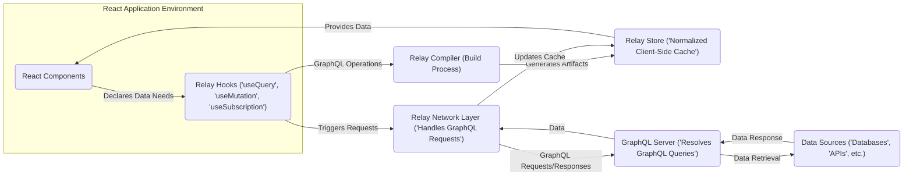
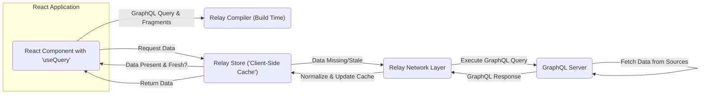
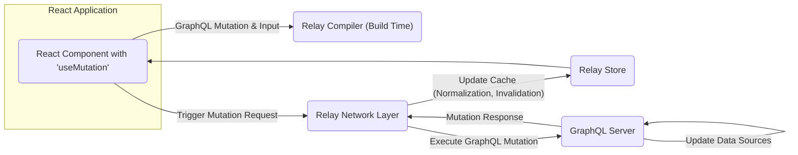
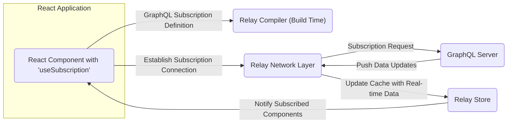

# Project Design Document: Facebook Relay

**Version:** 1.1
**Date:** October 26, 2023
**Prepared By:** Gemini (AI Model)

## 1. Introduction

This document provides an enhanced design overview of the Facebook Relay framework. Relay is a client-side JavaScript framework for building performant and data-driven React applications. It leverages GraphQL for efficient and declarative data fetching, manages a normalized client-side data cache, and facilitates optimistic updates for a smoother user experience. This document aims to deliver a clear and comprehensive understanding of Relay's architecture, serving as a solid foundation for subsequent threat modeling exercises.

## 2. Goals and Objectives

The core objectives of the Relay framework are:

* **Optimized Data Retrieval:** Fetching only the precise data required by components, minimizing over-fetching and improving performance.
* **Declarative Data Definition:** Enabling components to explicitly declare their data needs using GraphQL fragments collocated with the component logic.
* **Automated Client-Side Data Management:** Providing a robust mechanism for caching and normalizing data on the client, ensuring data consistency and reducing redundant requests.
* **Enhanced User Experience through Optimistic Updates:**  Allowing the UI to reflect changes immediately upon initiating a mutation, before server confirmation, leading to a more responsive application.
* **Support for Real-time Data:** Facilitating real-time data updates via GraphQL subscriptions, enabling dynamic and interactive applications.
* **Improved Development Workflow with Type Safety:** Utilizing GraphQL's strong type system to enhance code reliability and provide better developer tooling and feedback.

## 3. High-Level Architecture

Relay functions as a client-side data management layer tightly integrated with React, communicating with a backend GraphQL server. The key components collaborate to handle data fetching, caching, and updates within the application.

* **React Application Environment:** The context where React components are rendered and interact with Relay.
    * **React Components:** The building blocks of the user interface, responsible for rendering data and handling user interactions.
    * **Relay Hooks:** The primary API for React components to interact with Relay for data fetching (`useQuery`), mutations (`useMutation`), and subscriptions (`useSubscription`).
* **Relay Compiler:** A build-time tool that processes GraphQL queries, mutations, and subscriptions defined within the application. It optimizes these operations and generates runtime artifacts.
* **Relay Store:** The client-side, in-memory cache that stores normalized data fetched from the GraphQL server. It ensures data consistency and enables efficient retrieval without repeated network requests.
* **Relay Network Layer:** Responsible for executing GraphQL operations against the GraphQL server. It handles network communication (typically HTTP) and can be customized for authentication, authorization, and error handling.
* **GraphQL Server:** A backend server implementing the GraphQL specification, responsible for resolving GraphQL queries, mutations, and subscriptions against underlying data sources.
* **Data Sources:** The backend systems where the application's data resides, such as databases, REST APIs, or other services.

## 4. Key Components and Their Interactions

This section provides a more detailed breakdown of Relay's core components and how they interact during different data operations.

### 4.1. Data Fetching (Queries)

1. A React component utilizes the `useQuery` hook, providing a GraphQL query (often defined using GraphQL fragments) describing its data requirements.
2. During the build process, the Relay Compiler analyzes this query and generates optimized, executable query documents.
3. When the component renders, the `useQuery` hook checks the Relay Store for the requested data.
4. If the data is present and considered fresh within the Relay Store, it is immediately returned to the component for rendering.
5. If the data is missing or stale, the `useQuery` hook instructs the Relay Network Layer to execute the corresponding GraphQL query against the GraphQL Server.
6. The GraphQL Server fetches the requested data from the appropriate Data Sources.
7. The GraphQL Server responds with the data to the Relay Network Layer.
8. The Relay Network Layer receives the response and updates the Relay Store with the new data, normalizing it based on its schema and unique identifiers.
9. The `useQuery` hook receives the updated data from the Relay Store, triggering a re-render of the component with the fetched information.

### 4.2. Data Mutations

1. A React component initiates a data modification by calling a mutation function returned by the `useMutation` hook, providing the necessary input data for the mutation.
2. The Relay Compiler has previously processed the corresponding GraphQL mutation definition during the build process.
3. The `useMutation` hook triggers a request to the Relay Network Layer, sending the GraphQL mutation operation and its variables to the GraphQL Server.
4. The Relay Network Layer sends the GraphQL mutation request to the GraphQL Server.
5. The GraphQL Server processes the mutation, updating the relevant Data Sources according to the mutation logic.
6. The GraphQL Server responds with the result of the mutation, which may include updated data.
7. The Relay Network Layer receives the response and updates the Relay Store based on the mutation response and any specified update configurations (e.g., updating connections, invalidating fields).
8. Relay may automatically refetch queries that are known to be affected by the mutation to ensure the cache is up-to-date.
9. Components subscribed to the affected data via `useQuery` will re-render with the updated information from the Relay Store.

### 4.3. Real-time Updates (Subscriptions)

1. A React component establishes a real-time data stream by using the `useSubscription` hook, providing a GraphQL subscription operation.
2. The Relay Compiler has processed this subscription definition during the build.
3. The `useSubscription` hook instructs the Relay Network Layer to establish a persistent connection (e.g., via WebSockets) with the GraphQL Server.
4. The GraphQL Server, upon relevant data changes, pushes updates to the client through the established connection.
5. The Relay Network Layer receives these real-time data updates.
6. The Relay Store is updated with the new data received through the subscription, ensuring the client-side cache reflects the latest information.
7. Components actively subscribed to this data via `useSubscription` will automatically re-render to reflect the real-time updates.

### 4.4. Relay Store: Data Normalization and Caching

The Relay Store is fundamental to Relay's efficient data management. Key characteristics include:

* **Normalization based on Object Identifiers:** Relay normalizes data based on unique identifiers (typically the `id` field), creating a single, canonical representation of each object in the cache. This eliminates data duplication and ensures consistency across the application.
* **In-Memory Caching:** The store acts as an in-memory cache, storing fetched data to avoid redundant network requests for the same information.
* **Garbage Collection:** Relay implements garbage collection mechanisms to remove unused or outdated data from the store, optimizing memory usage.
* **Optimistic Updates Management:** The store facilitates optimistic updates by allowing temporary updates to the cache before server confirmation, providing immediate feedback to the user. These optimistic updates are then reconciled with the actual server response.

## 5. Security Considerations (For Threat Modeling)

This section outlines preliminary security considerations relevant to the Relay framework, intended to guide subsequent threat modeling activities.

* **GraphQL API Security:**
    * **Query Complexity and Depth Limits:**  Implement limits on the complexity and depth of GraphQL queries to prevent denial-of-service attacks by resource exhaustion.
    * **Input Sanitization and Validation:**  Thoroughly sanitize and validate all input data in GraphQL queries and mutations on the server-side to prevent injection attacks (e.g., SQL injection if resolvers directly interact with databases).
    * **Authentication and Authorization:**  Enforce robust authentication mechanisms to verify user identity and implement fine-grained authorization rules to control access to specific data and mutations. Consider using directives or dedicated authorization layers within the GraphQL server.
* **Client-Side Security:**
    * **Protection against Cross-Site Scripting (XSS):**  Employ best practices to prevent XSS vulnerabilities in the React application, as malicious scripts could potentially access sensitive data within the Relay Store.
    * **Secure Handling of Sensitive Data:** Avoid storing highly sensitive information directly within the Relay Store if not absolutely necessary. Consider encryption or alternative storage mechanisms for such data.
    * **Code Injection Vulnerabilities:**  Ensure that the application code is free from vulnerabilities that could allow for the injection of malicious code, which could compromise Relay's functionality or data.
* **Network Security:**
    * **Enforce HTTPS:**  Mandate the use of HTTPS to encrypt all communication between the client and the GraphQL server, protecting data in transit.
    * **Cross-Origin Resource Sharing (CORS) Configuration:**  Configure CORS policies carefully to restrict which origins can access the GraphQL API, preventing unauthorized access from malicious websites.
* **Server-Side Implementation Security:**
    * **Secure Resolution Logic:**  Ensure that the resolvers in the GraphQL server are implemented securely, preventing vulnerabilities in data access and manipulation logic.
    * **Rate Limiting:** Implement rate limiting on the GraphQL API endpoints to prevent abuse and denial-of-service attacks.

## 6. Technologies Used

* **JavaScript/TypeScript:**  The primary programming language for Relay and React application development.
* **React:**  The declarative JavaScript library used for building the user interface components.
* **GraphQL:**  The query language for describing data requirements and the runtime for executing queries.
* **HTTP/HTTPS:**  The standard protocols for communication between the client and the server.
* **WebSockets (Optional):**  A communication protocol providing full-duplex communication channels over a single TCP connection, often used for GraphQL subscriptions.
* **Node.js (Commonly):**  A JavaScript runtime environment frequently used for implementing GraphQL servers and build tooling.

## 7. Future Considerations

* **Enhanced Developer Experience:**  Further improvements to developer tooling, debugging capabilities, and error handling within Relay.
* **Schema Stitching and Federation Enhancements:**  Improved support for integrating data from multiple GraphQL services into a unified schema.
* **Performance Optimizations:**  Continuous efforts to optimize data fetching, caching strategies, and overall runtime performance.
* **Simplified API Evolution:**  Exploring potential simplifications and refinements to the Relay API to make it more accessible and easier to use for common patterns.

This enhanced design document provides a more detailed and structured understanding of the Facebook Relay framework's architecture and key functionalities. This information is essential for conducting thorough threat modeling activities to identify and mitigate potential security risks.
