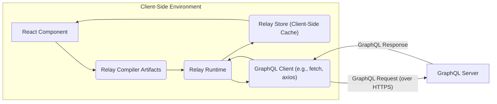
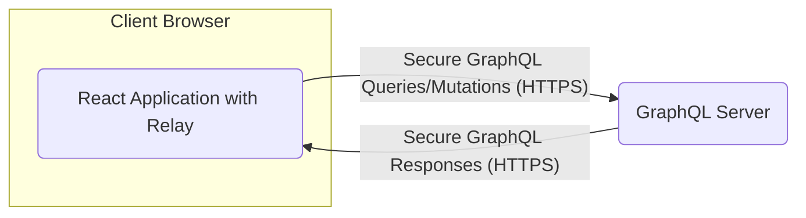
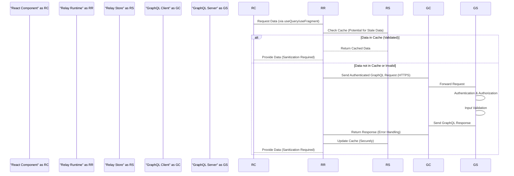

# Project Design Document: Facebook Relay

**Version:** 1.1
**Date:** October 26, 2023
**Author:** AI Software Architect

## 1. Introduction

This document provides an enhanced architectural design of the Facebook Relay framework, focusing on aspects relevant to security analysis and threat modeling. It offers a detailed understanding of Relay's components, data flow, and key functionalities, with a particular emphasis on potential security implications. This document will serve as the foundation for subsequent threat modeling activities, enabling a thorough analysis of potential security vulnerabilities within the Relay ecosystem.

## 2. Goals

The primary goals of this design document are:

*   Clearly and precisely articulate the architecture and components of the Facebook Relay framework.
*   Describe the data flow and interactions between different parts of the system, highlighting potential security touchpoints.
*   Identify key technologies and dependencies involved in Relay, noting their security characteristics.
*   Provide a structured overview specifically tailored for threat modeling and security analysis.
*   Serve as a comprehensive reference point for developers, security engineers, and auditors working with or analyzing Relay.

## 3. Overview

Relay is a JavaScript framework for building efficient and data-driven React applications using GraphQL. Its core principles revolve around declarative data fetching, colocation of data requirements with UI components, and automatic management of a client-side data store. Relay simplifies the development of complex, data-intensive user interfaces by abstracting away many of the complexities associated with manual data fetching and caching. Understanding its architecture is crucial for identifying potential security vulnerabilities.

## 4. Detailed Design

This section provides a more granular view of the core components and their interactions within the Relay framework, with a focus on security-relevant aspects.

### 4.1. Core Components

*   **Relay Compiler:** This build-time tool is critical for security. It processes GraphQL queries and fragments embedded within React components. Its functions include:
    *   Static analysis of GraphQL queries to ensure they are valid and conform to the server's schema. This can help prevent malformed queries that might cause server errors.
    *   Generation of optimized runtime artifacts, potentially reducing the attack surface by minimizing the amount of client-side code needed for data fetching.
    *   Enforcement of type safety, which can help prevent data type mismatches that could lead to unexpected behavior or vulnerabilities.
    *   Transformation of GraphQL documents into a more efficient representation for the Relay Runtime.
*   **Relay Runtime:** The core client-side library responsible for managing data fetching, caching, and updates. Key security considerations include:
    *   Handling of GraphQL responses and potential error conditions. Improper error handling could expose sensitive information or lead to unexpected application states.
    *   Management of the Relay Store and ensuring data integrity. Vulnerabilities in the store could allow for data manipulation or unauthorized access.
    *   Interaction with the GraphQL Client and ensuring secure communication with the server (e.g., using HTTPS).
    *   Implementation of features like optimistic updates, which require careful consideration to prevent data inconsistencies or race conditions that could be exploited.
*   **GraphQL Client:**  Relay relies on an external GraphQL client for network communication. Security depends heavily on the chosen client's implementation:
    *   Proper handling of authentication and authorization headers (e.g., JWT tokens).
    *   Protection against Cross-Site Request Forgery (CSRF) attacks.
    *   Secure handling of cookies and other credentials.
    *   Implementation of TLS/SSL for secure communication over HTTPS.
*   **Relay Store:** The normalized, in-memory cache on the client. Security aspects include:
    *   Protection against unauthorized access or modification of cached data.
    *   Mechanisms for invalidating and updating cached data securely.
    *   Consideration of sensitive data being stored in the client-side cache and potential risks if the device is compromised.
*   **React Integration:** Relay's integration with React introduces potential security considerations related to React itself:
    *   Protection against Cross-Site Scripting (XSS) vulnerabilities in React components that display data fetched by Relay.
    *   Ensuring that data fetched by Relay is properly sanitized before being rendered in the UI.
*   **GraphQL Schema:** The contract between the client and server is crucial for security. A well-defined schema helps prevent unexpected queries and mutations. Security considerations include:
    *   Defining clear authorization rules within the schema to control access to data and mutations.
    *   Protecting against introspection queries that could reveal sensitive information about the schema.
    *   Careful design of input types to prevent injection attacks.
*   **GraphQL Server:** The backend service is a primary focus for security. It must:
    *   Implement robust authentication and authorization mechanisms.
    *   Protect against common web application vulnerabilities like SQL injection (if a database is used), and GraphQL injection.
    *   Implement rate limiting and other measures to prevent denial-of-service attacks.
    *   Ensure proper input validation and sanitization.

### 4.2. Component Interactions

*   **React Component Data Requirement:** A React component declares its data needs using GraphQL fragments, which are processed by the Relay Compiler.
*   **Relay Compiler Optimization:** The Relay Compiler analyzes these fragments and generates optimized artifacts, potentially including security-related checks or transformations.
*   **Relay Runtime Orchestration:** At runtime, the Relay Runtime uses these compiled artifacts to manage the data fetching process.
*   **GraphQL Client Communication:** The Relay Runtime utilizes a configured GraphQL client to send GraphQL queries or mutations to the GraphQL server. The security of this communication channel (e.g., using HTTPS) is paramount.
*   **GraphQL Server Processing:** The GraphQL server receives the request, authenticates and authorizes the user, resolves the query or mutation, and returns a response.
*   **Relay Store Update:** The Relay Runtime receives the response and updates the Relay Store with the normalized data. This update process needs to be secure to prevent data corruption or manipulation.
*   **React Component Rendering:** The React component re-renders with the updated data from the Relay Store. Security here involves preventing XSS vulnerabilities when displaying the data.

### 4.3. Key Data Flows (with Security Considerations)

*   **Query Execution:**
    *   A React component requires data.
    *   Relay Runtime checks the Relay Store for cached, valid data. This caching mechanism can improve performance but also introduces considerations around data freshness and potential stale data vulnerabilities.
    *   If data is missing or stale, Relay Runtime instructs the GraphQL Client to send a query to the GraphQL Server. This communication must be secure (HTTPS).
    *   The GraphQL Server authenticates and authorizes the request before processing the query.
    *   The GraphQL Server responds with the requested data. The response should be carefully validated by the Relay Runtime to prevent unexpected data or errors.
    *   Relay Runtime updates the Relay Store. This update process should be atomic and consistent to prevent data corruption.
    *   The React component re-renders with the fetched data. Ensure proper sanitization to prevent XSS.
*   **Mutation Execution:**
    *   A user interaction or event triggers a mutation.
    *   Relay Runtime uses the GraphQL Client to send a mutation request to the GraphQL Server. This request should include necessary authentication and authorization tokens.
    *   The GraphQL Server authenticates and authorizes the mutation request and performs the requested data modification. Input validation on the server is crucial to prevent injection attacks.
    *   The GraphQL Server returns the updated data.
    *   Relay Runtime updates the Relay Store, potentially invalidating related cached data. This invalidation process needs to be secure and accurate to maintain data consistency.
    *   Components affected by the mutation re-render.
*   **Subscription Handling:**
    *   A component subscribes to real-time data updates.
    *   Relay Runtime establishes a secure connection (e.g., WebSocket over TLS) with the GraphQL Server.
    *   The GraphQL Server authenticates and authorizes the subscription request.
    *   The GraphQL Server pushes updates to the client. These updates should be validated by the Relay Runtime before being applied to the store.
    *   Relay Runtime updates the Relay Store with the received updates.
    *   Subscribed components re-render with the latest data.

## 5. Key Technologies and Dependencies (Security Implications)

*   **JavaScript (ES6+):**  Client-side scripting introduces inherent risks like XSS. Secure coding practices are essential.
*   **React:**  While React helps prevent some XSS vulnerabilities, developers must still be vigilant about sanitizing data and avoiding `dangerouslySetInnerHTML`.
*   **GraphQL:**  The flexibility of GraphQL can also introduce vulnerabilities like overly complex queries leading to DoS or information disclosure if not properly secured.
*   **Node.js:** If used for the GraphQL server, Node.js security best practices must be followed, including dependency management and vulnerability scanning.
*   **GraphQL Client Libraries (e.g., `graphql-request`, `apollo-client`):** The security of these libraries is critical. Ensure they are up-to-date and have no known vulnerabilities. Proper configuration for authentication and secure communication is essential.
*   **Build Tools (Webpack, Babel, etc.):**  Supply chain security is important. Ensure build tool dependencies are secure and regularly updated.

## 6. Deployment Considerations (Security Aspects)

Relay applications, being primarily client-side, inherit the security considerations of web applications:

*   **Content Security Policy (CSP):**  Implementing a strong CSP is crucial to mitigate XSS attacks.
*   **HTTPS:**  Serving the application over HTTPS is essential to protect data in transit.
*   **Subresource Integrity (SRI):**  Using SRI for external JavaScript dependencies helps prevent tampering.
*   **Regular Security Audits:**  Both the client-side application and the GraphQL server should undergo regular security assessments.

The GraphQL server deployment also has its own security requirements:

*   **Firewall Configuration:**  Properly configured firewalls to restrict access to the server.
*   **Intrusion Detection/Prevention Systems (IDS/IPS):**  Monitoring for malicious activity.
*   **Regular Security Updates:**  Keeping the server operating system and software up-to-date.

## 7. Security Considerations (Detailed Threat Landscape)

This section expands on the initial security considerations, providing a more detailed overview of potential threats.

*   **Client-Side Vulnerabilities:**
    *   **Cross-Site Scripting (XSS):** Malicious scripts injected into the application, potentially stealing user data or performing actions on their behalf.
    *   **Cross-Site Request Forgery (CSRF):**  Unauthorized actions performed on behalf of an authenticated user. Mitigation strategies include using anti-CSRF tokens.
    *   **Exposure of Sensitive Data:**  Accidental or intentional exposure of sensitive data stored in the Relay Store or in client-side JavaScript code.
    *   **Man-in-the-Middle (MITM) Attacks:**  Interception of communication between the client and the GraphQL server. Enforcing HTTPS is crucial for mitigation.
    *   **Client-Side Logic Tampering:**  Malicious modification of client-side code to bypass security checks or alter application behavior.
*   **GraphQL API Vulnerabilities:**
    *   **GraphQL Injection:** Exploiting vulnerabilities in GraphQL resolvers to execute arbitrary code or access unauthorized data. Proper input validation and parameterized queries are essential.
    *   **Denial of Service (DoS):**  Overloading the GraphQL server with complex or resource-intensive queries. Implementing query complexity analysis and rate limiting can help.
    *   **Unauthorized Access:**  Gaining access to data or mutations without proper authorization. Implementing fine-grained authorization rules within the GraphQL schema and resolvers is critical.
    *   **Information Disclosure:**  Exposing more data than intended through overly permissive queries or error messages. Carefully design queries and handle errors gracefully.
    *   **Batching Attacks:**  Sending a large number of operations in a single request to overwhelm the server. Implementing limits on batch sizes can mitigate this.
    *   **Introspection Abuse:**  Using introspection queries to discover the schema and potentially identify vulnerabilities. Disabling introspection in production environments is recommended.
*   **Relay-Specific Considerations:**
    *   **Vulnerabilities in Relay Compiler or Runtime:**  Although less common, vulnerabilities in the framework itself could be exploited. Keeping Relay updated is important.
    *   **Improper Error Handling:**  Revealing sensitive information in error messages or failing to handle errors gracefully can create security risks.
    *   **Security Implications of Optimistic Updates:**  Potential for data inconsistencies or race conditions if optimistic updates are not implemented carefully.
*   **Authentication and Authorization:**
    *   **Weak Authentication Mechanisms:**  Using insecure methods for verifying user identity.
    *   **Insufficient Authorization Checks:**  Failing to properly verify user permissions before granting access to data or mutations.
    *   **Session Management Vulnerabilities:**  Exploiting weaknesses in how user sessions are managed, potentially leading to session hijacking.
*   **Data Integrity:**
    *   **Data Tampering:**  Unauthorized modification of data during transmission or storage. Using HTTPS and implementing data integrity checks can help.

## 8. Diagrams

### 8.1. High-Level Architecture

### 8.2. Data Flow Diagram (Detailed with Security Focus)

## 9. Future Considerations

*   Detailed threat modeling sessions using this document as a foundation.
*   Security testing and penetration testing of Relay applications and associated GraphQL servers.
*   Analysis of specific Relay features like pagination, subscriptions, and defer/stream directives for nuanced security implications.
*   Development of secure coding guidelines specific to Relay and GraphQL.
*   Integration with security scanning tools to automate vulnerability detection.

This enhanced document provides a more comprehensive and security-focused understanding of the Facebook Relay framework's architecture. It is intended to be a valuable resource for identifying and mitigating potential security risks.