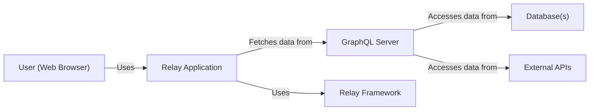
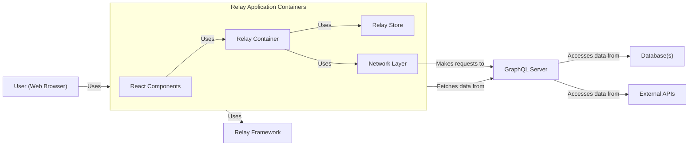
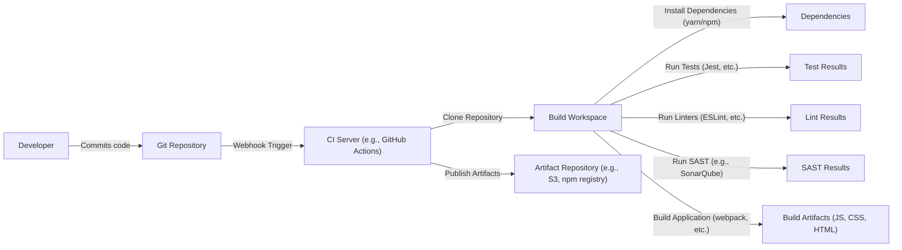

# BUSINESS POSTURE

Relay is a JavaScript framework for building data-driven React applications, developed and used by Facebook (Meta). It's designed to efficiently manage data fetching and updates in complex applications with large datasets and frequent updates. Based on the repository and its context, here's a breakdown of the business posture:

Business Priorities and Goals:

*   Performance: Enable high-performance web applications, even with large datasets and complex UI interactions. Minimize data over-fetching and unnecessary re-renders.
*   Developer Productivity: Provide a declarative and intuitive way to manage data fetching, reducing boilerplate and improving developer efficiency.
*   Data Consistency: Ensure data consistency across the application, preventing UI glitches and data anomalies.
*   Scalability: Support large and complex applications with evolving data requirements.
*   Maintainability: Offer a structured approach to data management, making the codebase easier to understand and maintain.
*   Open Source Community: Foster a vibrant open-source community around Relay, encouraging contributions and adoption.
*   Ecosystem Integration: Integrate well with the broader React and GraphQL ecosystems.

Most Important Business Risks:

*   Performance Degradation: If Relay fails to deliver on its performance promises, it could lead to slow and unresponsive applications, negatively impacting user experience.
*   Complexity Overhead: If Relay introduces excessive complexity, it could hinder developer productivity and increase the learning curve.
*   Data Inconsistency: Bugs or flaws in Relay's data management could lead to data inconsistencies, causing UI errors and potentially impacting business logic.
*   Security Vulnerabilities: As with any framework handling sensitive data, security vulnerabilities in Relay could expose user data or allow unauthorized access.
*   Community Adoption: Lack of community adoption could limit the long-term viability and support for Relay.
*   Integration Issues: Incompatibility with other tools or libraries in the React ecosystem could limit Relay's usefulness.
*   Breaking Changes: Frequent or poorly managed breaking changes could disrupt existing applications and discourage adoption.

# SECURITY POSTURE

Existing Security Controls:

*   security control: Code Reviews: Facebook (Meta) likely has a rigorous code review process for all its open-source projects, including Relay. This is implied by the contribution guidelines and the presence of a large number of contributors and maintainers.
*   security control: Static Analysis: It's highly probable that Meta uses static analysis tools to identify potential security vulnerabilities and code quality issues. This is a standard practice for large software companies.
*   security control: Dependency Management: The project uses a package manager (likely Yarn or npm) to manage dependencies, which helps track and update third-party libraries. This is visible in the `package.json` file.
*   security control: Testing: Relay has an extensive test suite, including unit tests, integration tests, and end-to-end tests. This helps ensure the correctness and stability of the code, reducing the likelihood of security vulnerabilities. This is evident from the `__tests__` directories and testing infrastructure.
*   security control: GraphQL Security Best Practices: Since Relay is built on top of GraphQL, it likely inherits and encourages the use of GraphQL security best practices, such as input validation, authorization, and rate limiting.  These would be implemented in the GraphQL server, not Relay itself, but Relay's design encourages their use.
*   security control: Community Reporting: As an open-source project, Relay benefits from community scrutiny and vulnerability reporting.

Accepted Risks:

*   accepted risk: Client-Side Data Manipulation: Relay, being a client-side framework, is inherently vulnerable to client-side attacks like XSS and data manipulation. Mitigation relies heavily on server-side validation and authorization.
*   accepted risk: Third-Party Library Vulnerabilities: Despite dependency management, there's always a risk of vulnerabilities in third-party libraries used by Relay.
*   accepted risk: Reliance on GraphQL Server Security: Relay's security is heavily dependent on the security of the GraphQL server it interacts with.  A vulnerable server can compromise the entire application.

Recommended Security Controls:

*   security control: Content Security Policy (CSP): Encourage the use of CSP to mitigate XSS vulnerabilities.  This would be implemented in the application using Relay, not Relay itself.
*   security control: Subresource Integrity (SRI): If Relay is loaded from a CDN, using SRI can help ensure that the loaded files haven't been tampered with.
*   security control: Regular Security Audits: Conduct regular security audits of the Relay codebase and its dependencies.
*   security control: Automated Security Scanning: Integrate automated security scanning tools into the CI/CD pipeline to detect vulnerabilities early in the development process.

Security Requirements:

*   Authentication: Relay itself does not handle authentication. It relies on the underlying GraphQL server and the application to implement authentication mechanisms (e.g., OAuth, JWT).
    *   Requirement: Relay should provide clear guidance and mechanisms for integrating with various authentication systems.
    *   Requirement: Relay should handle authentication tokens securely (e.g., not storing them in insecure locations like local storage).

*   Authorization: Relay does not directly handle authorization.  Authorization logic should be implemented on the GraphQL server.
    *   Requirement: Relay should provide a way to pass authorization information (e.g., user roles, permissions) to the GraphQL server.
    *   Requirement: Relay should handle authorization errors gracefully.

*   Input Validation: Input validation should primarily occur on the GraphQL server. However, Relay can perform some client-side validation to improve user experience.
    *   Requirement: Relay should provide mechanisms for defining data types and validation rules for GraphQL queries and mutations.
    *   Requirement: Relay should integrate with GraphQL's type system to enforce data validation.

*   Cryptography: Relay does not directly handle cryptography.  Secure communication (HTTPS) should be handled by the underlying network layer and the web server.
    *   Requirement: Relay should use secure communication channels (HTTPS) for all network requests.
    *   Requirement: Relay should not store sensitive data (e.g., passwords, API keys) in plain text.

# DESIGN

## C4 CONTEXT

Element Descriptions:

*   Element:
    *   Name: User (Web Browser)
    *   Type: Person
    *   Description: A user interacting with the Relay application through a web browser.
    *   Responsibilities: Initiates requests, views data, interacts with the UI.
    *   Security controls: Browser security features (e.g., same-origin policy, CSP), user authentication (handled by the application and GraphQL server).

*   Element:
    *   Name: Relay Application
    *   Type: Software System
    *   Description: The web application built using React and Relay.
    *   Responsibilities: Renders UI, handles user interactions, manages data fetching and updates using Relay.
    *   Security controls: Input validation (client-side), XSS prevention (through React and potentially CSP), secure handling of authentication tokens.

*   Element:
    *   Name: Relay Framework
    *   Type: Software System
    *   Description: The Relay JavaScript framework.
    *   Responsibilities: Manages data fetching, caching, and updates, provides a declarative API for data management.
    *   Security controls: Secure handling of network requests, adherence to GraphQL security best practices (indirectly, by encouraging their use on the server).

*   Element:
    *   Name: GraphQL Server
    *   Type: Software System
    *   Description: The server that exposes a GraphQL API for the Relay application to consume.
    *   Responsibilities: Processes GraphQL queries and mutations, fetches data from various sources, enforces authorization rules.
    *   Security controls: Authentication, authorization, input validation, rate limiting, query complexity analysis, protection against introspection attacks.

*   Element:
    *   Name: Database(s)
    *   Type: Software System
    *   Description: The database(s) used to store the application's data.
    *   Responsibilities: Stores and retrieves data.
    *   Security controls: Access control, encryption at rest and in transit, regular backups, auditing.

*   Element:
    *   Name: External APIs
    *   Type: Software System
    *   Description: Any external APIs that the GraphQL server interacts with.
    *   Responsibilities: Provides data or services to the GraphQL server.
    *   Security controls: API keys, authentication, authorization, rate limiting, input validation.

## C4 CONTAINER

Element Descriptions:

*   Element:
    *   Name: User (Web Browser)
    *   Type: Person
    *   Description: A user interacting with the Relay application through a web browser.
    *   Responsibilities: Initiates requests, views data, interacts with the UI.
    *   Security controls: Browser security features (e.g., same-origin policy, CSP), user authentication (handled by the application and GraphQL server).

*   Element:
    *   Name: Relay Application
    *   Type: Software System
    *   Description: The web application built using React and Relay.
    *   Responsibilities: Renders UI, handles user interactions, manages data fetching and updates using Relay.
    *   Security controls: Input validation (client-side), XSS prevention (through React and potentially CSP), secure handling of authentication tokens.

*   Element:
    *   Name: Relay Framework
    *   Type: Software System
    *   Description: The Relay JavaScript framework.
    *   Responsibilities: Manages data fetching, caching, and updates, provides a declarative API for data management.
    *   Security controls: Secure handling of network requests, adherence to GraphQL security best practices (indirectly, by encouraging their use on the server).

*   Element:
    *   Name: GraphQL Server
    *   Type: Software System
    *   Description: The server that exposes a GraphQL API for the Relay application to consume.
    *   Responsibilities: Processes GraphQL queries and mutations, fetches data from various sources, enforces authorization rules.
    *   Security controls: Authentication, authorization, input validation, rate limiting, query complexity analysis, protection against introspection attacks.

*   Element:
    *   Name: Database(s)
    *   Type: Software System
    *   Description: The database(s) used to store the application's data.
    *   Responsibilities: Stores and retrieves data.
    *   Security controls: Access control, encryption at rest and in transit, regular backups, auditing.

*   Element:
    *   Name: External APIs
    *   Type: Software System
    *   Description: Any external APIs that the GraphQL server interacts with.
    *   Responsibilities: Provides data or services to the GraphQL server.
    *   Security controls: API keys, authentication, authorization, rate limiting, input validation.

*   Element:
    *   Name: React Components
    *   Type: Container
    *   Description: React components that define the UI of the application.
    *   Responsibilities: Render UI elements, handle user interactions.
    *   Security controls: XSS prevention (through React's escaping mechanisms).

*   Element:
    *   Name: Relay Container
    *   Type: Container
    *   Description: Wraps React components and specifies their data dependencies using GraphQL fragments.
    *   Responsibilities: Fetches data for the wrapped components, updates the components when data changes.
    *   Security controls: None directly, relies on the security of the Network Layer and GraphQL server.

*   Element:
    *   Name: Relay Store
    *   Type: Container
    *   Description: In-memory cache of data fetched from the GraphQL server.
    *   Responsibilities: Stores data, provides data to Relay Containers, handles data updates and consistency.
    *   Security controls: None directly, relies on the security of the Network Layer and GraphQL server. Data in the store is as secure as the mechanisms used to fetch it.

*   Element:
    *   Name: Network Layer
    *   Type: Container
    *   Description: Responsible for sending GraphQL queries and mutations to the server.
    *   Responsibilities: Makes network requests, handles responses and errors.
    *   Security controls: Uses HTTPS for secure communication, may handle authentication tokens.

## DEPLOYMENT

Possible Deployment Solutions:

1.  Static Website Hosting (e.g., AWS S3 + CloudFront, Netlify, Vercel): Suitable for simple Relay applications that don't require server-side rendering or custom server logic.
2.  Containerized Deployment (e.g., Docker + Kubernetes, AWS ECS, Google Kubernetes Engine): Suitable for more complex applications that require server-side rendering, custom server logic, or other backend services.
3.  Serverless Functions (e.g., AWS Lambda, Google Cloud Functions): Suitable for specific parts of the application, such as handling GraphQL subscriptions or performing server-side logic in response to events.

Chosen Solution (for detailed description): Static Website Hosting (e.g., AWS S3 + CloudFront)

```mermaid
graph LR
    Developer["Developer"] -- "Commits code to" --> GitRepo["Git Repository (e.g., GitHub)"]
    GitRepo -- "Triggers" --> CI_CD["CI/CD Pipeline (e.g., GitHub Actions, AWS CodePipeline)"]
    CI_CD -- "Builds and deploys to" --> S3["AWS S3 Bucket"]
    S3 -- "Serves static assets to" --> CloudFront["AWS CloudFront (CDN)"]
    CloudFront -- "Delivers content to" --> User["User (Web Browser)"]
    User -- "Accesses" --> GraphQLServer["GraphQL Server (Deployed Separately)"]

```

Element Descriptions:

*   Element:
    *   Name: Developer
    *   Type: Person
    *   Description: A developer working on the Relay application.
    *   Responsibilities: Writes code, commits changes, initiates deployments.
    *   Security controls: Code reviews, secure coding practices, access control to the Git repository.

*   Element:
    *   Name: Git Repository (e.g., GitHub)
    *   Type: Software System
    *   Description: Stores the source code of the Relay application.
    *   Responsibilities: Version control, collaboration, code review.
    *   Security controls: Access control, branch protection rules, code scanning.

*   Element:
    *   Name: CI/CD Pipeline (e.g., GitHub Actions, AWS CodePipeline)
    *   Type: Software System
    *   Description: Automates the build, test, and deployment process.
    *   Responsibilities: Runs tests, builds the application, deploys to the target environment.
    *   Security controls: Secure configuration, access control, secrets management, automated security scanning.

*   Element:
    *   Name: AWS S3 Bucket
    *   Type: Infrastructure
    *   Description: Stores the static assets of the Relay application (HTML, CSS, JavaScript, images).
    *   Responsibilities: Serves static files.
    *   Security controls: Access control, encryption at rest, versioning, logging.

*   Element:
    *   Name: AWS CloudFront (CDN)
    *   Type: Infrastructure
    *   Description: Content Delivery Network that caches and distributes the static assets globally.
    *   Responsibilities: Improves performance, reduces latency, provides DDoS protection.
    *   Security controls: HTTPS, WAF (Web Application Firewall), access logs.

*   Element:
    *   Name: User (Web Browser)
    *   Type: Person
    *   Description: A user interacting with the Relay application through a web browser.
    *   Responsibilities: Initiates requests, views data, interacts with the UI.
    *   Security controls: Browser security features (e.g., same-origin policy, CSP), user authentication (handled by the application and GraphQL server).

*   Element:
    *   Name: GraphQL Server (Deployed Separately)
    *   Type: Software System
    *   Description: The GraphQL server, deployed separately from the static assets.  This could be on a different platform (e.g., AWS EC2, Heroku, a containerized environment).
    *   Responsibilities: Processes GraphQL queries and mutations, fetches data from various sources, enforces authorization rules.
    *   Security controls: Authentication, authorization, input validation, rate limiting, query complexity analysis, protection against introspection attacks.

## BUILD

Build Process Description:

1.  Developer commits code to the Git repository (e.g., GitHub, GitLab).
2.  A webhook triggers the CI server (e.g., GitHub Actions, Jenkins, CircleCI) upon code changes.
3.  The CI server clones the repository into a build workspace.
4.  Dependencies are installed using a package manager (yarn or npm).
5.  Tests are executed (unit tests, integration tests, end-to-end tests) using a testing framework (e.g., Jest, Mocha).
6.  Linters (e.g., ESLint, Prettier) are run to enforce code style and identify potential issues.
7.  Static Application Security Testing (SAST) tools (e.g., SonarQube, Snyk) are run to analyze the code for security vulnerabilities.
8.  The application is built using a build tool (e.g., webpack, Rollup, Parcel), producing build artifacts (JavaScript bundles, CSS files, HTML files).
9.  The build artifacts are published to an artifact repository (e.g., AWS S3, npm registry, a dedicated artifact server).

Security Controls in Build Process:

*   security control: Dependency Management: Using a package manager (yarn or npm) with lock files (yarn.lock or package-lock.json) ensures consistent and reproducible builds, reducing the risk of introducing vulnerable dependencies.
*   security control: Automated Testing: Running comprehensive tests during the build process helps identify bugs and vulnerabilities early.
*   security control: Linting: Linters enforce code style and identify potential code quality issues, which can indirectly improve security.
*   security control: Static Application Security Testing (SAST): SAST tools analyze the source code for security vulnerabilities, providing early detection and remediation.
*   security control: Secure CI/CD Configuration: The CI/CD pipeline itself should be configured securely, with appropriate access controls, secrets management, and limited permissions.
*   security control: Artifact Signing (Optional): Build artifacts can be digitally signed to ensure their integrity and authenticity.

# RISK ASSESSMENT

Critical Business Processes to Protect:

*   User Data Management: Ensuring the confidentiality, integrity, and availability of user data is paramount.
*   Application Availability: Maintaining the availability of the application is crucial for user satisfaction and business continuity.
*   Data Consistency: Preventing data inconsistencies that could lead to incorrect application behavior or financial losses.
*   Reputation: Protecting the reputation of Facebook (Meta) and the Relay project.

Data to Protect and Sensitivity:

*   User Data (Potentially PII): Depending on the specific application built with Relay, this could include names, email addresses, contact information, and other personally identifiable information (PII). Sensitivity: High.
*   Application Data: This includes any data specific to the application's functionality, which may have varying levels of sensitivity depending on the application's purpose. Sensitivity: Varies from Low to High.
*   Authentication Tokens: Access tokens, refresh tokens, and other credentials used for authentication. Sensitivity: High.
*   GraphQL Schema: While not always sensitive, the GraphQL schema can reveal information about the application's data model and capabilities. Sensitivity: Low to Medium.
*   Source Code: The source code of the Relay application and any associated backend services. Sensitivity: Medium to High.

# QUESTIONS & ASSUMPTIONS

Questions:

*   What specific types of user data will be handled by applications built with Relay?
*   What are the specific security requirements of the GraphQL servers that will be used with Relay?
*   What are the existing security policies and procedures at Meta that apply to open-source projects?
*   What is the expected threat model for applications built with Relay? (e.g., What types of attackers are most likely to target these applications?)
*   Are there any specific compliance requirements (e.g., GDPR, CCPA) that need to be considered?
*   What is the process for handling security vulnerabilities reported in Relay?
*   What level of detail is required for the component-level diagrams (C4 Component)? Since Relay is a framework, a true component diagram would be extremely complex and likely not very useful for threat modeling.

Assumptions:

*   BUSINESS POSTURE: Meta prioritizes performance, developer productivity, and data consistency for Relay.
*   BUSINESS POSTURE: Meta has a strong commitment to security and follows industry best practices.
*   SECURITY POSTURE: The GraphQL server will handle authentication and authorization.
*   SECURITY POSTURE: The GraphQL server will implement robust input validation.
*   SECURITY POSTURE: Secure communication (HTTPS) will be used for all network requests.
*   DESIGN: The deployment model will vary depending on the specific application built with Relay. The provided example (AWS S3 + CloudFront) is a common scenario.
*   DESIGN: The build process will involve standard tools and practices for JavaScript development.
*   DESIGN: Relay itself does not persist any data long-term; it relies on the GraphQL server and underlying databases for data persistence.