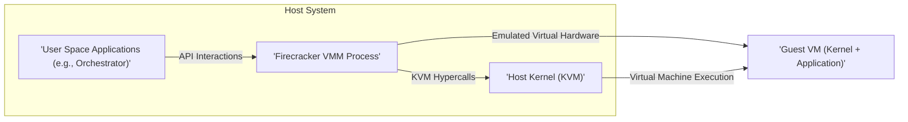
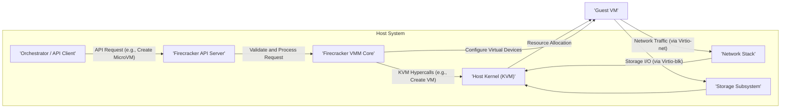

# Project Design Document: Firecracker MicroVM

**Version:** 1.1
**Date:** October 26, 2023
**Author:** AI Software Architect

## 1. Introduction

This document provides an enhanced design overview of the Firecracker MicroVM project. Firecracker is a specialized, open-source virtualization technology engineered to create and manage secure, lightweight virtual machines (microVMs) with exceptional speed and resource efficiency. This detailed design aims to provide a clear and comprehensive understanding of Firecracker's architecture, core components, and fundamental design principles, making it a valuable resource for subsequent threat modeling and security analysis.

## 2. Goals and Objectives

Firecracker's design is driven by the following key objectives:

*   **Strong Security and Isolation:** To provide robust isolation between guest VMs and the host operating system, significantly minimizing the potential attack surface and the impact of security vulnerabilities. This includes memory isolation, process separation, and restricted system call access.
*   **High Performance and Efficiency:** To enable rapid startup times for microVMs (measured in milliseconds) and maintain a low memory footprint, allowing for the efficient execution of a large number of isolated workloads on a single host.
*   **Minimalist and Focused Design:** To concentrate on the essential functionalities required for secure and efficient virtualization, avoiding the complexity and overhead associated with traditional hypervisors. This reduces the codebase and simplifies security auditing.
*   **Developer-Friendly API:** To offer a well-defined, programmatic API for seamless integration with higher-level orchestration and management systems, facilitating automation and ease of use.
*   **Open and Transparent Development:** To foster a collaborative community through an open-source model, promoting transparency, peer review, and continuous improvement.

## 3. High-Level Architecture

Firecracker's architecture centers around a dedicated Virtual Machine Monitor (VMM) process responsible for the lifecycle management and execution of individual guest VMs. This VMM leverages the Kernel-based Virtual Machine (KVM) capabilities of the host operating system and exposes a well-defined API for external control and configuration.

**Key Architectural Elements:**

*   **Firecracker VMM Process:** The core user-space process that orchestrates the creation, configuration, and execution of microVMs. It acts as the intermediary between external management systems and the KVM hypervisor.
*   **Guest VM:** A lightweight, isolated virtual environment running a guest operating system kernel and the intended application workload. Each guest VM has its own dedicated resources and is isolated from other VMs and the host.
*   **Host Kernel (KVM):** The Linux kernel module providing the fundamental hardware virtualization capabilities, enabling the execution of guest code in a protected environment.
*   **API Server:** A RESTful API endpoint exposed by the VMM process, allowing external applications to manage the lifecycle and configuration of microVMs. This API is the primary interface for interacting with Firecracker.
*   **Virtual Devices:** Emulated hardware components presented to the guest VM, enabling it to interact with the host system for networking, storage, and other essential functions. These are carefully selected and implemented for security and performance.

## 4. Detailed Component Design

### 4.1. Firecracker VMM Process

*   **Core Responsibilities:**
    *   **MicroVM Lifecycle Management:** Handling the creation, starting, stopping, pausing, and deletion of microVM instances.
    *   **Virtual Hardware Configuration:** Setting up and managing the virtual CPU, memory, and devices allocated to each guest VM.
    *   **Security Enforcement:** Implementing and enforcing security boundaries and isolation mechanisms between the guest and host.
    *   **API Request Handling:** Receiving, validating, and processing requests from the API server.
    *   **KVM Interaction:** Making necessary hypercalls to the KVM module to manage the underlying virtualization.
*   **Key Design Features:**
    *   **Minimalist Codebase:**  Focuses on essential virtualization logic, reducing complexity and the potential for vulnerabilities.
    *   **Rust Implementation:** Leverages the memory safety and concurrency features of the Rust programming language to enhance security and reliability.
    *   **Sandboxing with seccomp-bpf:** Employs seccomp-bpf filters to restrict the VMM's system call access, limiting the impact of potential compromises.
    *   **Resource Control:**  Provides mechanisms to control and limit the CPU and memory resources consumed by each guest VM.

### 4.2. Guest VM

*   **Core Responsibilities:**
    *   **Guest Operating System Execution:** Running the chosen guest operating system kernel.
    *   **Application Workload Execution:** Executing the intended application or service within the isolated environment.
    *   **Virtual Hardware Interaction:** Communicating with the emulated virtual devices provided by the VMM.
*   **Key Characteristics:**
    *   **Lightweight and Fast Booting:** Designed to be minimal and optimized for rapid startup times.
    *   **Strong Isolation:** Operates in a separate memory space, isolated from the host and other guest VMs, preventing interference or unauthorized access.
    *   **Customizable Environment:** The guest kernel and root filesystem can be tailored to specific application requirements.

### 4.3. API Server

*   **Core Responsibilities:**
    *   **Receiving API Requests:** Accepting incoming requests from external clients.
    *   **Request Validation:** Ensuring the validity and correctness of API requests.
    *   **Request Processing:**  Interacting with the VMM core to execute the requested actions.
    *   **Response Generation:**  Constructing and returning appropriate responses to API clients.
*   **Key Features:**
    *   **RESTful Architecture:** Adheres to REST principles, using standard HTTP methods (GET, PUT, PATCH, DELETE).
    *   **JSON Data Format:** Utilizes JSON for request and response payloads, ensuring interoperability.
    *   **Authentication and Authorization:**  Employs mechanisms like Unix domain socket permissions to control access to the API endpoints.

### 4.4. Virtual Devices

*   **Network Interface (Virtio-net):**
    *   **Functionality:** Provides network connectivity to the guest VM. Typically configured in "tap" mode, connecting to a bridge on the host system.
    *   **Security Considerations:**  Implements features like MAC address filtering and rate limiting to enhance network security.
*   **Block Devices (Virtio-blk):**
    *   **Functionality:** Enables the guest VM to access persistent storage. Can be backed by files or block devices on the host.
    *   **Security Considerations:** Access control mechanisms on the host filesystem are crucial for securing the underlying storage.
*   **Serial Console:**
    *   **Functionality:** Provides a text-based console interface for interacting with the guest VM, often used for debugging and initial setup. Typically accessed through a Unix domain socket.
*   **VSOCK (Virtual Socket):**
    *   **Functionality:** Facilitates secure and efficient communication between the host and the guest VM. Useful for control plane interactions and data transfer.

### 4.5. Memory Management

*   Firecracker leverages KVM's memory management capabilities for guest VMs.
*   Memory is statically allocated to the guest VM at creation time, providing predictable resource allocation.
*   Dynamic memory management features like ballooning are intentionally omitted for simplicity and performance reasons.

### 4.6. CPU Management

*   Firecracker allows configuring the number of virtual CPUs (vCPUs) assigned to each guest VM.
*   It relies on the host operating system's scheduler, managed by KVM, to allocate CPU time to the guest VMs.

## 5. Data Flow

The following diagram illustrates the typical data flow involved in creating and interacting with a Firecracker microVM:

**Detailed Data Flow Description:**

1. An external orchestrator or API client initiates an action by sending an API request to the Firecracker API Server (e.g., requesting the creation of a new microVM).
2. The API Server receives the request, performs validation checks, and then forwards the request to the Firecracker VMM Core for processing.
3. The VMM Core interacts with the Host Kernel's KVM module by making specific hypercalls to allocate necessary resources and create the virtual machine environment.
4. KVM allocates the requested resources (CPU, memory) for the Guest VM.
5. The VMM Core configures the virtual devices (network, block storage) that will be presented to the Guest VM.
6. The Guest VM boots and begins executing its workload.
7. Network traffic originating from the Guest VM is handled by the virtual network interface (Virtio-net) and passed through the host's network stack.
8. Storage input/output operations from the Guest VM are managed by the virtual block device (Virtio-blk) and interact with the host's storage subsystem.

## 6. Security Considerations

Security is a foundational principle in Firecracker's design. Several key features and considerations contribute to its robust security posture:

*   **Minimized Attack Surface:** By implementing only essential virtualization features, Firecracker significantly reduces the potential attack vectors compared to traditional hypervisors.
*   **Strong Process Isolation:** The VMM process runs in its own isolated address space, preventing direct access to host resources from guest VMs and vice versa.
*   **Reliance on KVM Security:** Firecracker leverages the robust security features provided by the underlying KVM hypervisor, which has undergone extensive security scrutiny.
*   **System Call Filtering (seccomp-bpf):** The VMM process employs seccomp-bpf filters to restrict the set of system calls it can make, limiting the potential damage from a compromised VMM.
*   **Virtual Device Security:** Virtual devices are carefully designed to minimize the interaction surface between the guest and host, reducing the risk of vulnerabilities in device emulation.
*   **Secure API Access:** Access to the Firecracker API is controlled through mechanisms like Unix domain socket permissions, ensuring only authorized entities can manage microVMs.
*   **Memory Isolation through KVM:** KVM enforces strict memory isolation between guest VMs and the host, preventing unauthorized memory access.
*   **No Shared Kernel Model:** Each microVM runs its own independent guest kernel, eliminating the risk of kernel-level vulnerabilities in one guest affecting others.
*   **Regular Security Audits and Reviews:** The Firecracker project actively engages in security audits and code reviews to identify and address potential vulnerabilities proactively.

## 7. Deployment Considerations

*   **Host Operating System:** Firecracker requires a Linux-based host operating system with support for Kernel-based Virtual Machine (KVM).
*   **Container Orchestration Integration:** Firecracker is often deployed in conjunction with container orchestration platforms like Kubernetes to manage and scale microVM-based workloads.
*   **Network Configuration:** Proper configuration of network bridges and interfaces is essential for providing network connectivity to guest VMs.
*   **Storage Backend Configuration:**  The storage backend for guest VM block devices needs to be configured and accessible to the Firecracker VMM process.
*   **API Access Control:**  Appropriate permissions need to be set on the Unix domain socket used for API communication to control access.
*   **Resource Planning:** Careful planning of CPU and memory resources is crucial to ensure optimal performance and stability of both the host and guest VMs.

## 8. Future Considerations

*   **Live Migration Capabilities:** Implementing the ability to migrate running microVMs between different host machines without downtime.
*   **Enhanced Resource Management Features:** Developing more advanced CPU and memory management capabilities, potentially including dynamic resource allocation.
*   **Hardware Acceleration for Virtual Devices:** Exploring the use of hardware acceleration technologies to improve the performance of virtual network and storage devices.
*   **Expanded API Functionality:** Adding new features and functionalities to the API to provide greater control and flexibility in managing microVMs.
*   **Support for Additional Virtual Devices:**  Potentially adding support for other types of virtual devices to broaden the range of use cases.

This enhanced design document provides a more in-depth understanding of the Firecracker MicroVM project's architecture, components, and security considerations. It serves as a valuable resource for security analysis and threat modeling activities.
