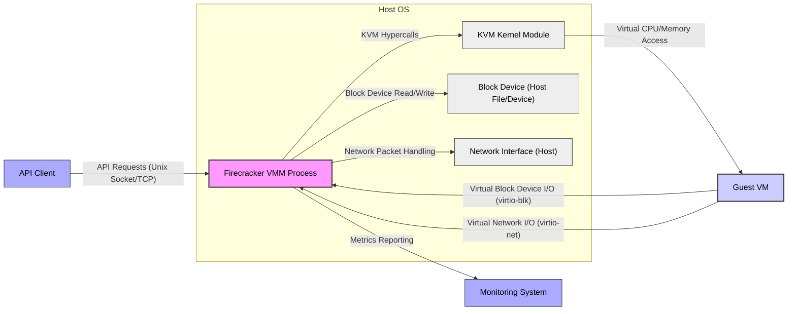

## Project Design Document: Firecracker MicroVM (Improved)

**1. Introduction**

This document provides an enhanced architectural design of the Firecracker microVM project, as found at [https://github.com/firecracker-microvm/firecracker](https://github.com/firecracker-microvm/firecracker). This iteration aims to provide a more detailed and nuanced understanding of the system's components, their interactions, and the flow of data, specifically tailored for subsequent threat modeling activities. The intended audience includes security engineers, software developers, cloud architects, and anyone involved in the security assessment, deployment, or development of systems leveraging Firecracker.

**2. Project Overview**

Firecracker is an open-source Virtual Machine Monitor (VMM) engineered for creating and managing secure, lightweight virtual machines known as microVMs. Built upon the Linux Kernel Virtual Machine (KVM) interface, its core design principles emphasize security and operational efficiency, resulting in a significantly reduced attack surface and minimal performance overhead. Firecracker's primary focus is to deliver a robust and efficient environment for running modern workloads such as containerized applications and serverless functions, where strong isolation is paramount.

**3. Architectural Components**

The Firecracker architecture is composed of distinct yet interconnected components that orchestrate the creation and operation of microVMs.

*   **Firecracker VMM Process:** This is the central user-space process responsible for the entire lifecycle management of microVMs. It directly interacts with the Linux kernel through the KVM API.
    *   Key Responsibilities:
        *   **MicroVM Lifecycle Management:**  Orchestrates the creation, initialization, starting, stopping, pausing, and destruction of individual microVM instances.
        *   **Resource Management:**  Allocates and manages CPU time, memory, and virtual device resources for each microVM.
        *   **Virtual Device Emulation:**  Provides emulated hardware devices (e.g., block devices, network interfaces, serial console) to the Guest VM, abstracting the underlying host hardware. The selection of emulated devices is deliberately minimal to reduce the attack surface.
        *   **Security Enforcement:** Enforces isolation boundaries between microVMs and the host OS through the KVM's virtualization capabilities and its own internal security mechanisms.
        *   **API Endpoint Provisioning:**  Hosts the API server, providing a programmatic interface for external control and monitoring of Firecracker and its microVMs.

*   **Guest Virtual Machine (Guest VM):** This represents the isolated execution environment where the user's application or workload resides.
    *   Key Characteristics:
        *   **Lightweight Guest OS:** Typically runs a minimal Linux distribution optimized for size and security, often built with tools like Buildroot or similar.
        *   **Resource Constraints:**  Operates within the resource limits allocated by the Firecracker VMM process.
        *   **Limited Host Access:**  Has restricted access to the host operating system and interacts primarily through the emulated virtual devices.
        *   **Application Execution:**  Executes the intended application or workload within its isolated environment.

*   **Host Operating System:** This is the underlying operating system upon which the Firecracker VMM process is executed.
    *   Key Responsibilities:
        *   **KVM Support:** Provides the necessary KVM kernel module, which is essential for hardware virtualization.
        *   **Resource Provisioning:**  Manages the physical hardware resources (CPU, memory, networking) that are then allocated to Firecracker and its microVMs.
        *   **Process Isolation:**  Provides process-level isolation for the Firecracker VMM process itself.
        *   **Backend Services:**  Offers backend services for virtual devices, such as access to block storage and network interfaces.

*   **API Server:**  Firecracker exposes a RESTful API, typically accessible over a Unix domain socket for local interactions or a TCP socket for remote management (though the latter is less common in production due to security considerations).
    *   Key Functions:
        *   **External Control:**  Allows external systems (e.g., orchestrators, management tools) to control the lifecycle and configuration of Firecracker and its microVMs.
        *   **MicroVM Configuration:**  Provides endpoints for configuring microVM parameters, such as CPU allocation, memory size, and attached devices.
        *   **Operational Commands:**  Offers endpoints for initiating actions like starting, stopping, pausing, and retrieving information about microVMs.

*   **Block Device Backend:**  Provides the storage mechanism for the Guest VM's virtual block devices.
    *   Implementation Details:
        *   **Virtual Block Device Emulation:** Firecracker emulates standard block device interfaces (e.g., virtio-blk) within the Guest VM.
        *   **Host-Side Mapping:** The VMM process maps these virtual block devices to files or block devices on the host operating system.
        *   **Supported Backends:**  Supports various backend types, including raw image files (`.img`), loop devices, and potentially direct access to block devices. The choice of backend impacts performance and security.

*   **Network Device Backend:** Enables network connectivity for the Guest VM.
    *   Implementation Details:
        *   **Virtual Network Interface Emulation:** Firecracker emulates a virtual network interface card (NIC), typically using the virtio-net standard.
        *   **Host-Side Networking:** The VMM process connects this virtual NIC to a network interface on the host OS.
        *   **Common Backend Types:**
            *   **`tap` devices:** Create a virtual Ethernet interface on the host, allowing the Guest VM to participate in the host's network.
            *   **`vsock` (Virtual Socket):** Facilitates secure, direct communication between the Guest VM and the host OS. This is often used for control plane communication.

*   **Metrics System:** Firecracker exposes a range of metrics related to the VMM process and the running Guest VMs.
    *   Purpose and Usage:
        *   **Resource Monitoring:** Tracks CPU utilization, memory usage, network traffic, and other resource-related metrics for both the VMM and individual microVMs.
        *   **Performance Analysis:** Provides data for analyzing the performance of microVMs and identifying potential bottlenecks.
        *   **Integration with Monitoring Tools:**  Metrics are typically exposed in a format suitable for ingestion by external monitoring and logging systems (e.g., Prometheus, CloudWatch).

**4. Data Flow**

The following diagram illustrates the primary data flows and interactions between the components within the Firecracker architecture.

*   **API Interaction Flow:** External clients initiate actions by sending API requests to the Firecracker VMM process over a defined communication channel (typically a Unix domain socket).
*   **MicroVM Execution Flow:** The Firecracker VMM process leverages the KVM kernel module to create and manage the isolated execution environment for the Guest VM. KVM handles the low-level virtualization of CPU and memory access.
*   **Block Device Data Flow:** When the Guest VM requires access to storage, it interacts with the emulated virtual block device. The Firecracker VMM process intercepts these I/O requests and performs the corresponding read/write operations on the configured block device backend on the host OS.
*   **Network Communication Flow:** Network traffic originating from the Guest VM is handled by the virtual network interface. The Firecracker VMM process forwards these network packets to the designated network device backend on the host OS for transmission.
*   **Metrics Reporting Flow:** The Firecracker VMM process periodically collects performance and resource utilization metrics and makes them available for consumption by external monitoring systems.

**5. Security Considerations**

Security is a paramount design principle in Firecracker. Key security features and considerations include:

*   **Hardware-Level Isolation (KVM):**  Leverages the robust isolation provided by the KVM hypervisor, ensuring strong separation between Guest VMs and the host operating system kernel, as well as between different Guest VMs.
*   **Minimized Attack Surface:**  By emulating a minimal set of virtual devices, Firecracker significantly reduces the potential attack surface compared to traditional, feature-rich VMMs. This reduces the number of code paths that could contain vulnerabilities.
*   **Secure Defaults and Configuration:** Firecracker aims for secure default configurations, minimizing the need for complex security setups. However, proper configuration of backend devices and network settings remains crucial.
*   **Resource Sandboxing and Limits:**  Enforces resource limits (CPU, memory) on each Guest VM, preventing a compromised VM from consuming excessive host resources and impacting other VMs or the host itself.
*   **API Security Mechanisms:**
    *   **Unix Domain Socket Permissions:** When using a Unix domain socket, file system permissions can restrict access to the API to authorized processes.
    *   **Network Security (for TCP):** If the API is exposed over TCP, standard network security measures (firewalls, TLS) should be employed.
*   **Memory Ballooning (Optional, but Recommended):** Allows the host OS to reclaim unused memory from the Guest VM. While primarily for resource management, it can indirectly enhance security by reducing the potential impact of memory-related vulnerabilities within the guest.
*   **Virtual Machine Introspection (Limited Scope):** While not a primary feature, the architecture allows for potential integration with VM introspection tools for security monitoring.
*   **Regular Security Audits and Vulnerability Management:** The Firecracker project undergoes regular security audits and actively manages reported vulnerabilities.

**6. Deployment Model**

Firecracker's design makes it well-suited for specific deployment scenarios demanding strong isolation and efficiency. Common use cases include:

*   **Modern Container Orchestration Platforms:**  As a secure and lightweight runtime for executing individual container workloads, offering stronger isolation compared to traditional container runtimes like `runc`. This is particularly relevant in multi-tenant environments.
*   **Serverless Function-as-a-Service (FaaS) Platforms:**  Provides an isolated and secure execution environment for individual function invocations, ensuring that functions from different users or tenants are strongly separated.
*   **Secure Multi-tenancy Infrastructure:**  Ideal for building infrastructure where strong isolation between tenants is a critical security requirement. This includes scenarios like secure sandboxing and confidential computing.
*   **Edge Computing Environments:**  Its lightweight nature and low resource footprint make it suitable for resource-constrained edge devices where isolation is still necessary.

**7. Assumptions and Constraints**

*   **Reliance on KVM:** Firecracker's functionality and security are inherently dependent on the correct implementation and security of the underlying Linux kernel's KVM module.
*   **Limited Device Emulation Trade-off:** The focus on minimal device emulation, while enhancing security, may restrict the compatibility with certain guest operating systems or applications that require a wider range of virtual hardware.
*   **User Space VMM Performance Implications:** Running the VMM in user space, while improving security by limiting the impact of potential VMM vulnerabilities, can introduce some performance overhead compared to kernel-based hypervisors.
*   **Host OS Security Posture:** The overall security of the Firecracker environment is intrinsically linked to the security posture of the underlying host operating system. A compromised host OS can potentially impact the security of the microVMs.
*   **Guest OS Responsibility:** While Firecracker provides strong isolation, the security of the applications running within the Guest VM is also dependent on the security of the Guest OS and the applications themselves.

**8. Future Considerations**

The Firecracker project is continuously evolving. Potential future developments and considerations include:

*   **Expanding Secure Device Emulation:**  Carefully adding support for additional virtual devices while maintaining a strong focus on security and minimizing the attack surface. This could involve exploring new virtualization technologies or secure device passthrough mechanisms.
*   **Enhanced Networking Capabilities:**  Investigating more advanced networking features for microVMs, such as SR-IOV support or improved virtual network device performance, while ensuring security and isolation are not compromised.
*   **Integration with Hardware Security Extensions:**  Further leveraging hardware security features like Intel SGX or AMD SEV for enhanced confidentiality and integrity of microVM workloads.
*   **Formal Verification and Security Analysis:**  Employing formal verification techniques and rigorous security analysis methodologies to further strengthen the security guarantees of the Firecracker VMM.
*   **Improved Observability and Debugging Tools:**  Developing more sophisticated tools for monitoring, debugging, and troubleshooting microVMs in production environments.

This improved design document provides a more comprehensive and detailed understanding of the Firecracker microVM project's architecture, laying a stronger foundation for subsequent threat modeling activities. The enhanced descriptions and clarifications aim to facilitate a more thorough and accurate identification of potential security risks and the development of effective mitigation strategies.
