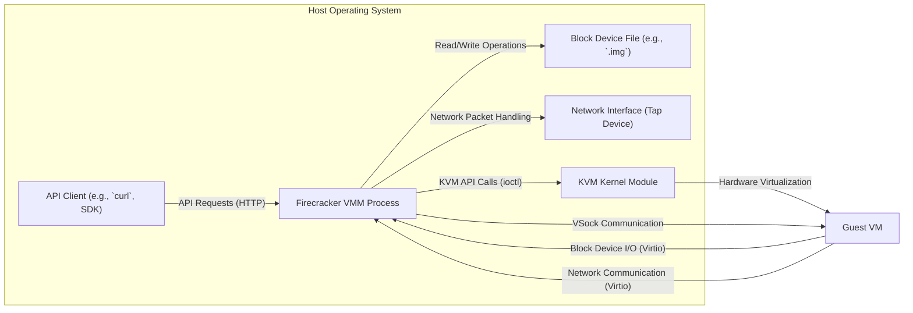
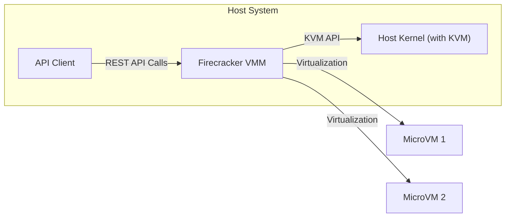
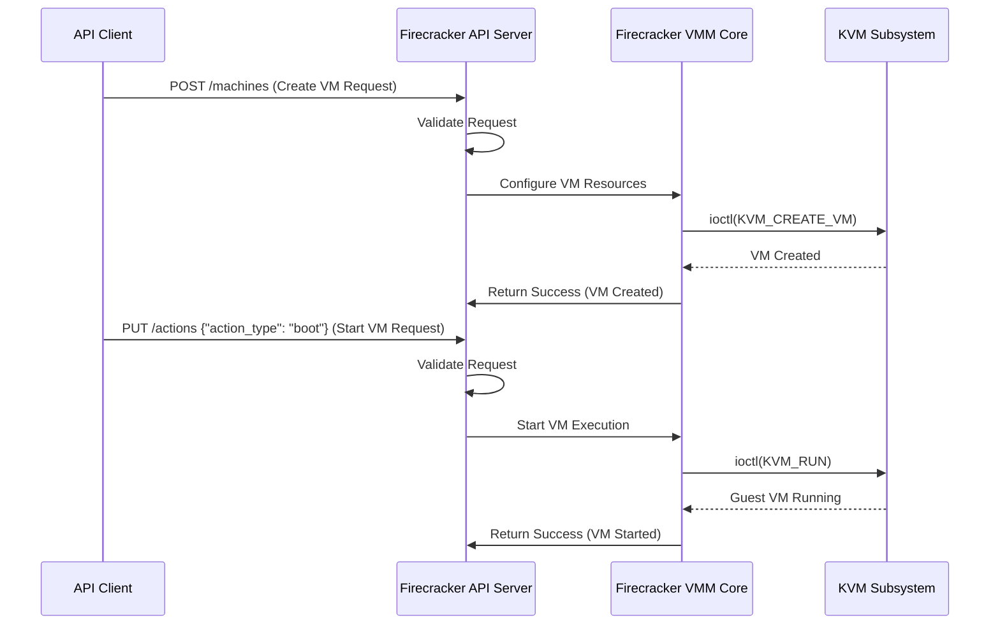

## Project Design Document: Firecracker MicroVM (Improved)

**1. Introduction**

This document provides an enhanced design overview of the Firecracker microVM project, building upon the foundational concepts to offer a more detailed and nuanced understanding. Firecracker is an open-source virtualization technology engineered to create and manage secure, lightweight virtual machines (microVMs) with a strong emphasis on workload isolation and minimal overhead. This document aims to provide a clear and comprehensive articulation of Firecracker's architecture, core components, and operational mechanisms, serving as a robust foundation for subsequent threat modeling and security analysis.

**2. Goals and Objectives**

The core design principles and objectives guiding the development of Firecracker are:

* **Enhanced Security:**  Achieve robust isolation between guest VMs and the host operating system kernel, as well as strict separation between individual guest VMs, minimizing the potential for cross-VM interference or breaches.
* **High Performance & Low Overhead:** Deliver exceptional performance with minimal resource consumption and rapid startup times for microVMs, making it suitable for latency-sensitive workloads.
* **Reduced Attack Surface:** Implement a highly streamlined Virtual Machine Monitor (VMM) with only the essential functionalities required for modern workload execution, thereby significantly reducing the potential attack surface.
* **Broad Guest OS Compatibility:** Support a range of standard Linux-based guest operating systems and adhere to common virtualization interfaces to facilitate ease of adoption.
* **Seamless Integration:** Enable straightforward integration with various container orchestration platforms (e.g., Kubernetes) and workload management systems, providing a flexible and adaptable virtualization layer.
* **Resource Efficiency:** Optimize resource utilization on the host system by minimizing the overhead associated with each microVM.

**3. System Architecture**

Firecracker's architecture is centered around a dedicated Virtual Machine Monitor (VMM) process responsible for the complete lifecycle management and resource allocation for guest VMs.

* **Key Components:**
    * **Firecracker VMM (Virtual Machine Monitor):** The core userspace process that orchestrates the creation, configuration, and execution of microVMs. It directly interfaces with the Linux Kernel-based Virtual Machine (KVM) API to leverage hardware virtualization capabilities. This process is intentionally kept minimal to reduce complexity and potential vulnerabilities.
    * **RESTful API Server:** An HTTP-based API server embedded within the VMM process. This API provides a programmatic interface for external control and management of microVMs. It handles operations such as creating new VMs, configuring virtual hardware resources (CPU, memory, devices), starting and stopping VMs, attaching and detaching devices, and retrieving VM status. Authentication and authorization mechanisms are crucial for securing this API.
    * **Guest VM (Virtual Machine):** An isolated virtual machine instance running a guest operating system. Each guest VM has its own dedicated virtual hardware resources (CPU, memory, network interface, block device).
    * **Virtual Block Device:** Represents the virtual hard disk presented to the guest VM. This is typically backed by a file on the host file system (e.g., a raw disk image or a qcow2 image). The VMM handles block device I/O requests from the guest.
    * **Virtual Network Interface (Virtio-net):** Provides network connectivity for the guest VM. Firecracker typically uses a "tap" device on the host, allowing the guest's network interface to be bridged or routed to the host's network. The VMM handles the virtualization of network packets.
    * **Virtual Socket Device (VSock):** A communication channel enabling secure, bidirectional communication between the host VMM process and the guest VM. This is often used for agent communication, health checks, and management tasks without exposing network ports.

* **Component Interactions:**

* **Data Flow:**

    * **MicroVM Initialization:** An API client sends a `PUT` request to the Firecracker API server, providing a JSON payload that defines the microVM's configuration (kernel image path, root file system image path, memory size, number of vCPUs, network interface details, etc.). The VMM validates the request and uses the KVM API to create a new virtual machine instance with the specified resources.
    * **Guest Boot Process:** The VMM loads the specified kernel image into the guest VM's memory and initiates execution at the kernel's entry point. The guest operating system then proceeds with its normal boot sequence.
    * **Block Device Access Workflow:** When the guest OS needs to read or write data to its virtual hard disk, it sends I/O requests through the Virtio block device interface. The VMM intercepts these requests and performs the corresponding read or write operations on the backing block device file on the host file system.
    * **Network Communication Path:** Network traffic originating from the guest VM is sent through the Virtio network interface. The VMM receives these packets and forwards them to the associated tap device on the host. Conversely, network packets destined for the guest VM are received by the tap device and injected into the guest's virtual network interface by the VMM.
    * **API Interaction Mechanism:** External systems interact with Firecracker by sending HTTP requests to the API server. These requests are authenticated and authorized before being processed by the VMM. Responses are typically returned in JSON format.
    * **VSock Communication Channel:** The guest VM can establish a connection to the host VMM process using the VSock device. This communication is typically initiated by the guest and allows for secure, in-band communication without relying on network infrastructure.

**4. Security Considerations**

Security is a foundational principle in Firecracker's design. Key security features and considerations include:

* **Hardware-Assisted Virtualization (KVM):**  Leveraging the hardware virtualization extensions provided by KVM ensures strong isolation between guest VMs at the hardware level, preventing one VM from directly accessing the memory or resources of another.
* **Minimalist VMM Design:** By implementing only the essential device emulation and virtualization logic, Firecracker significantly reduces the attack surface compared to traditional, feature-rich hypervisors. This minimizes the number of potential vulnerabilities within the VMM itself.
* **Seccomp-bpf System Call Filtering:** The Firecracker VMM employs seccomp-bpf to restrict the set of system calls it can make to the host kernel. This greatly limits the potential damage an attacker could inflict even if they were to compromise the VMM process.
* **Control Groups (cgroups) for Resource Isolation:**  Cgroups are used to enforce resource limits (CPU, memory, I/O) for each microVM, preventing "noisy neighbor" issues where one VM consumes excessive resources and impacts others. This also helps mitigate denial-of-service attacks.
* **Namespaces for Isolation:** Linux namespaces (PID, network, mount, UTS, IPC) are used to provide further isolation for guest VM environments, ensuring that processes within a guest VM cannot directly interact with processes or resources in other VMs or the host.
* **Secure API Design:** The Firecracker API should implement robust authentication (e.g., API keys, mutual TLS) and authorization mechanisms to prevent unauthorized access and manipulation of microVMs. Least privilege principles should be applied to API access.
* **Secure Boot Support:** Firecracker supports secure boot for guest VMs, allowing verification of the guest operating system's bootloader and kernel before execution, mitigating the risk of running compromised guest images.
* **Memory Ballooning Security Implications:** While primarily for dynamic memory management, the memory ballooning mechanism needs careful implementation to prevent potential security vulnerabilities related to memory access and manipulation.
* **Virtual Device Security:** The implementation of virtual devices (block, network, VSock) must be rigorously reviewed and tested for security vulnerabilities to prevent guest VMs from exploiting flaws in these emulated devices to gain unauthorized access or cause disruption.
* **Regular Security Audits and Vulnerability Management:** Continuous security audits, penetration testing, and a robust vulnerability management process are essential for identifying and addressing potential security weaknesses in Firecracker and its dependencies.

**5. Deployment Model**

Firecracker is designed to be embedded within a host operating system and is often integrated into larger infrastructure solutions.

* **Typical Deployment Scenarios:**
    * **Container Orchestration Platforms (e.g., Kubernetes with Kata Containers):** Firecracker can serve as the underlying virtualization technology for running containers, providing stronger isolation boundaries compared to traditional container runtimes like `runc`. Projects like Kata Containers leverage Firecracker for this purpose.
    * **Serverless Computing Environments:** Firecracker's rapid startup times and low overhead make it an ideal choice for executing serverless functions in isolated and secure environments.
    * **Secure Multi-tenancy Platforms:** Firecracker's strong isolation capabilities make it well-suited for environments where multiple untrusted tenants share the same physical hardware, ensuring that each tenant's workloads are securely separated.

* **Key Deployment Considerations:**
    * **Host Operating System Requirements:** Firecracker requires a Linux host operating system with a kernel that supports KVM and the necessary kernel modules.
    * **Resource Provisioning:** The host system must have sufficient CPU, memory, and I/O resources to accommodate the desired number of microVMs and their workloads.
    * **Networking Infrastructure:** Proper network configuration is crucial for enabling communication between guest VMs and the external network. This often involves configuring bridge interfaces, IP address management, and firewall rules.
    * **Security Hardening of the Host:** The host operating system itself should be hardened according to security best practices to minimize the risk of vulnerabilities that could compromise the Firecracker environment. This includes patching, disabling unnecessary services, and implementing appropriate access controls.

**6. Operational Aspects**

Managing and operating Firecracker involves several key tasks:

* **MicroVM Lifecycle Management via API:** Creating, starting, stopping, pausing, resuming, and deleting microVMs through programmatic interaction with the Firecracker API.
* **Resource Monitoring and Management:** Tracking the resource utilization (CPU, memory, network I/O, block I/O) of individual microVMs and the overall Firecracker process to ensure optimal performance and identify potential bottlenecks.
* **Logging and Auditing:**  Collecting and analyzing logs from the Firecracker VMM process and guest VMs for debugging, performance analysis, security auditing, and compliance purposes.
* **Security Updates and Patching:** Regularly applying security updates and patches to Firecracker, the host operating system kernel, and any dependent libraries to address known vulnerabilities.
* **Troubleshooting and Diagnostics:**  Diagnosing and resolving issues related to microVM operation, performance degradation, or unexpected behavior. This may involve examining logs, using debugging tools, and analyzing system metrics.

**7. Future Considerations**

Ongoing development and potential future enhancements for Firecracker include:

* **Expanding Guest Operating System Support:**  Adding support for a wider range of guest operating systems beyond Linux.
* **Advanced Networking Features:** Implementing more sophisticated networking capabilities, such as SR-IOV support, advanced network policy enforcement, and integration with software-defined networking (SDN) solutions.
* **Improved Live Migration Capabilities:** Enhancing the ability to migrate running microVMs between host machines with minimal downtime.
* **Confidential Computing Support:** Integrating technologies that enable the execution of guest workloads in a trusted execution environment (TEE), further enhancing security and data privacy.
* **Broader Hardware Platform Support:** Extending support to a wider range of CPU architectures and hardware platforms.

**8. Diagrams**

* **High-Level Architectural Overview:**

* **Detailed API Request Flow (Example: Create and Start MicroVM):**

This improved design document provides a more in-depth understanding of the Firecracker microVM project. It elaborates on the core components, clarifies their interactions, and provides a more comprehensive overview of the security considerations. This enhanced documentation will serve as a valuable resource for conducting detailed threat modeling and security assessments.