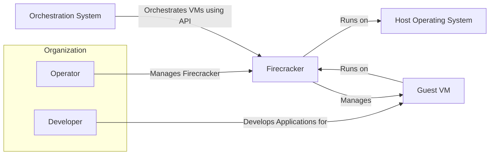
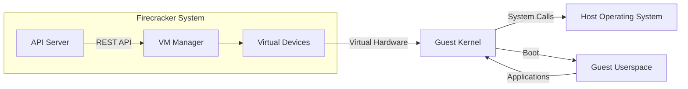
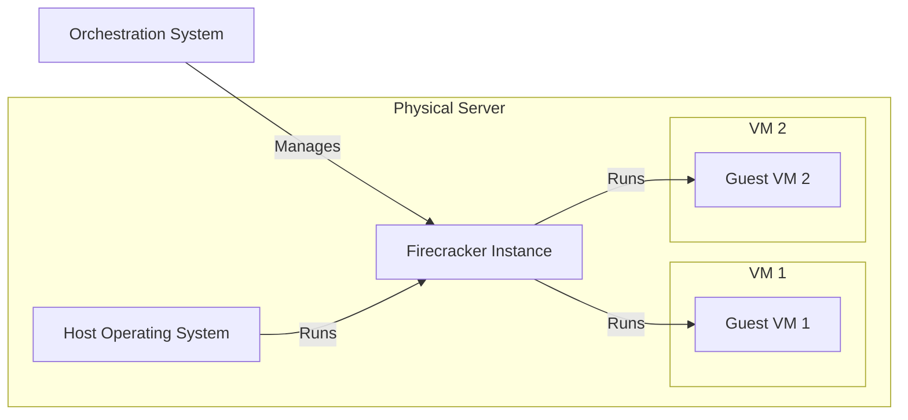

# BUSINESS POSTURE

This project, Firecracker, aims to provide a secure and fast virtualization technology based on Kernel-based Virtual Machine (KVM). It is designed to create and manage secure multi-tenant container and function-based services. The primary business priorities and goals are:

- Security: Provide strong isolation between virtual machines (VMs) and the host, as well as between different VMs. Minimize the attack surface of the hypervisor.
- Performance: Offer low overhead and fast startup times for VMs, enabling efficient resource utilization and responsiveness.
- Resource Efficiency: Optimize resource consumption to allow for high density of VMs on a single host.
- Simplicity: Maintain a minimal and focused codebase to reduce complexity and improve maintainability and security.

The most important business risks that need to be addressed based on these priorities and goals are:

- Security Vulnerabilities: Exploitable flaws in the Firecracker codebase or its dependencies could compromise the isolation and security of VMs and the host.
- Performance Degradation: Security measures or architectural choices could negatively impact the performance and startup times of VMs, undermining the efficiency goals.
- Operational Complexity: Managing and deploying Firecracker in production environments could introduce operational complexities and risks if not properly designed and documented.
- Supply Chain Risks: Dependencies on external libraries and tools could introduce vulnerabilities or malicious components into the Firecracker build and deployment process.

# SECURITY POSTURE

Existing security controls for the Firecracker project, as observed from the repository and project documentation, include:

- security control: Memory Safety: Firecracker is primarily written in Rust, a memory-safe language, which mitigates many common memory-related vulnerabilities like buffer overflows and use-after-free errors. Implemented throughout the codebase.
- security control: Minimal Attack Surface: Firecracker is designed with a minimal set of features and emulated devices to reduce the potential attack surface. Described in project documentation and design principles.
- security control: KVM Isolation: Firecracker leverages the hardware-enforced isolation provided by KVM to separate VMs from each other and the host kernel. Implemented by design, relying on Linux kernel and KVM.
- security control: API Security: Firecracker provides a RESTful API for management, which allows for controlled access and integration with orchestration systems. Described in API documentation.
- security control: Input Validation: API requests and VM configurations are validated to prevent injection attacks and ensure data integrity. Implemented in API server and configuration parsing logic.
- security control: Security Audits: The project undergoes security audits and vulnerability assessments to identify and address potential security weaknesses. Mentioned in project documentation and security advisories.

Accepted risks for the project, based on common knowledge of virtualization and security trade-offs, might include:

- accepted risk: Performance Overhead: Security features and isolation mechanisms can introduce some performance overhead compared to less secure solutions.
- accepted risk: Complexity of Secure Configuration: Properly configuring Firecracker for optimal security requires expertise and careful consideration of various settings.
- accepted risk: Reliance on Host Kernel Security: Firecracker's security is dependent on the security of the underlying Linux kernel and KVM.

Recommended security controls to implement, which might not be explicitly mentioned in the input but are high priority:

- security control: Secure Boot: Implement secure boot mechanisms for VMs to ensure the integrity of the guest operating system and prevent unauthorized modifications.
- security control: Attestation: Integrate attestation mechanisms to verify the integrity and configuration of Firecracker instances and VMs before and during runtime.
- security control: Runtime Monitoring: Implement runtime monitoring and intrusion detection systems to detect and respond to malicious activities within VMs and the hypervisor.
- security control: Vulnerability Management: Establish a robust vulnerability management process for Firecracker and its dependencies, including regular scanning, patching, and security updates.
- security control: Supply Chain Security: Implement measures to secure the build and release pipeline, including dependency scanning, code signing, and provenance tracking.

Security requirements for the Firecracker project, covering key security topics:

- Authentication:
    - Requirement: Securely authenticate API requests to prevent unauthorized access to Firecracker management functions.
    - Details: Implement API authentication using mechanisms like API keys, TLS client certificates, or integration with identity providers.
- Authorization:
    - Requirement: Implement fine-grained authorization controls to manage access to Firecracker resources and operations based on user roles and permissions.
    - Details: Define roles and permissions for different API operations and resources (e.g., VM creation, management, deletion). Enforce authorization policies based on authenticated user identity.
- Input Validation:
    - Requirement: Thoroughly validate all inputs to the Firecracker API and VM configurations to prevent injection attacks and ensure data integrity.
    - Details: Validate API request parameters, VM configuration files, and guest VM inputs. Use input sanitization and encoding techniques to mitigate injection risks.
- Cryptography:
    - Requirement: Use cryptography to protect sensitive data at rest and in transit, and to ensure the integrity and authenticity of communications.
    - Details: Encrypt sensitive data stored by Firecracker (e.g., secrets, VM images). Use TLS/HTTPS for secure communication with the API. Consider using cryptographic signatures for VM images and configurations.

# DESIGN

## C4 CONTEXT



Context Diagram Elements:

- Element:
    - Name: Operator
    - Type: Person
    - Description: System administrator or operations engineer responsible for managing and operating the Firecracker infrastructure.
    - Responsibilities: Deploying, configuring, monitoring, and maintaining Firecracker instances. Managing the lifecycle of VMs.
    - Security controls: Role-Based Access Control (RBAC) for Firecracker management API access. Multi-Factor Authentication (MFA) for operator accounts. Audit logging of operator actions.

- Element:
    - Name: Developer
    - Type: Person
    - Description: Software developer who creates applications that run inside Guest VMs managed by Firecracker.
    - Responsibilities: Developing, testing, and deploying applications within the constraints of the Guest VM environment.
    - Security controls: Secure coding practices for applications running in Guest VMs. Input validation and output encoding within applications. Least privilege principles for application permissions.

- Element:
    - Name: Firecracker
    - Type: Software System
    - Description: Secure and fast microVM hypervisor. Provides an API to manage lightweight virtual machines.
    - Responsibilities: Creating, running, and managing lightweight VMs. Enforcing isolation between VMs and the host. Providing a minimal and secure execution environment for guest workloads.
    - Security controls: Memory safety (Rust). Minimal attack surface. KVM isolation. API authentication and authorization. Input validation. Security audits.

- Element:
    - Name: Orchestration System
    - Type: Software System
    - Description: System responsible for automating the deployment, scaling, and management of applications and services, often using containers or VMs. Examples include Kubernetes, Nomad.
    - Responsibilities: Orchestrating the lifecycle of VMs managed by Firecracker. Scheduling VMs onto hosts. Monitoring VM health and resource utilization.
    - Security controls: Secure communication with Firecracker API (TLS). Authentication and authorization for API access. Role-Based Access Control (RBAC) within the orchestration system.

- Element:
    - Name: Guest VM
    - Type: Software System
    - Description: Lightweight virtual machine instance managed by Firecracker. Runs a guest operating system and applications.
    - Responsibilities: Executing application workloads in an isolated environment. Providing a runtime environment for applications.
    - Security controls: Guest OS hardening. Application-level security controls. Resource limits enforced by Firecracker.

- Element:
    - Name: Host Operating System
    - Type: Software System
    - Description: Underlying operating system running on the physical or virtual machine that hosts Firecracker. Typically Linux-based.
    - Responsibilities: Providing the kernel and system services required by Firecracker and KVM. Managing hardware resources.
    - Security controls: Host OS hardening. Kernel security updates. Security monitoring and intrusion detection on the host.

## C4 CONTAINER



Container Diagram Elements:

- Element:
    - Name: API Server
    - Type: Container
    - Description: RESTful API endpoint for managing Firecracker instances and VMs. Handles API requests from operators and orchestration systems.
    - Responsibilities: API request handling. Authentication and authorization. Input validation. Communication with VM Manager.
    - Security controls: API authentication (API keys, TLS client certificates). Authorization checks. Input validation. Rate limiting. TLS/HTTPS for API communication.

- Element:
    - Name: VM Manager
    - Type: Container
    - Description: Core component responsible for managing the lifecycle of VMs. Interacts with the Host OS and Virtual Devices.
    - Responsibilities: VM creation, startup, shutdown, and deletion. Resource allocation and management. Interaction with KVM.
    - Security controls: Secure interaction with KVM. Resource isolation enforcement. Process isolation.

- Element:
    - Name: Virtual Devices
    - Type: Container
    - Description: Emulates virtual hardware devices (e.g., network interface, block devices) for Guest VMs. Provides a minimal set of devices to reduce attack surface.
    - Responsibilities: Emulating virtual hardware. Handling device interactions between Guest VM and Host OS.
    - Security controls: Minimal device emulation. Input validation for device interactions. Secure device drivers.

- Element:
    - Name: Host Operating System
    - Type: Container
    - Description: Underlying operating system (Linux) providing kernel and system services.
    - Responsibilities: Providing KVM virtualization capabilities. Managing hardware resources. Handling system calls from Guest Kernel.
    - Security controls: Kernel security features (e.g., SELinux, AppArmor). Kernel security updates. System call filtering.

- Element:
    - Name: Guest Kernel
    - Type: Container
    - Description: Kernel of the Guest Operating System running inside the VM.
    - Responsibilities: Managing Guest VM resources. Handling system calls from Guest Userspace. Interacting with Virtual Devices.
    - Security controls: Guest kernel hardening. Minimal kernel configuration. Security updates for guest kernel.

- Element:
    - Name: Guest Userspace
    - Type: Container
    - Description: Userspace environment within the Guest VM where applications run.
    - Responsibilities: Running application workloads. Interacting with Guest Kernel via system calls.
    - Security controls: Application-level security controls. Least privilege principles within guest userspace. Input validation and output encoding in applications.

## DEPLOYMENT

Deployment Architecture Option: Bare Metal Deployment



Deployment Diagram Elements (Bare Metal Deployment):

- Element:
    - Name: Physical Server
    - Type: Infrastructure
    - Description: Physical hardware server hosting the Firecracker environment.
    - Responsibilities: Providing physical resources (CPU, memory, network, storage) for the Host OS and Firecracker.
    - Security controls: Physical security of the data center. Hardware security features (e.g., TPM, Secure Boot). BIOS/UEFI security.

- Element:
    - Name: Host Operating System
    - Type: Software
    - Description: Operating system installed on the physical server, running Firecracker and KVM.
    - Responsibilities: Providing the kernel and system services for Firecracker. Managing hardware resources.
    - Security controls: Host OS hardening. Kernel security updates. Security monitoring and intrusion detection. Access control to the host OS.

- Element:
    - Name: Firecracker Instance
    - Type: Software
    - Description: Running instance of the Firecracker hypervisor on the Host OS.
    - Responsibilities: Managing and running Guest VMs. Enforcing isolation. Providing API for management.
    - Security controls: Firecracker security features (memory safety, minimal attack surface, etc.). Secure configuration of Firecracker. API security.

- Element:
    - Name: Guest VM 1, Guest VM 2
    - Type: Software
    - Description: Instances of Guest VMs running on Firecracker.
    - Responsibilities: Running application workloads. Providing isolated environments for applications.
    - Security controls: Guest OS hardening. Application-level security controls within VMs. Resource limits enforced by Firecracker.

- Element:
    - Name: Orchestration System
    - Type: Software System
    - Description: External system managing Firecracker instances and VMs.
    - Responsibilities: Orchestrating VM lifecycle. Scheduling VMs. Monitoring.
    - Security controls: Secure communication with Firecracker API. Authentication and authorization for API access.

## BUILD

```mermaid
graph LR
    Dev[Developer] -->|Code Changes| VCS[Version Control System (GitHub)]
    VCS -->|Webhook, Scheduled Trigger| CI[CI System (GitHub Actions)]
    CI -->|Build, Test, Scan| BuildArtifacts[Build Artifacts (Container Images, Binaries)]
    BuildArtifacts -->|Publish| Registry[Artifact Registry (Container Registry)]
```

Build Process Diagram Elements:

- Element:
    - Name: Developer
    - Type: Person
    - Description: Software developer contributing code to the Firecracker project.
    - Responsibilities: Writing, testing, and committing code changes. Adhering to secure coding practices.
    - Security controls: Code reviews. Static code analysis (SAST) on developer workstations. Developer training on secure coding.

- Element:
    - Name: Version Control System (GitHub)
    - Type: Software System
    - Description: Central repository for source code, managing code changes and history.
    - Responsibilities: Storing and managing source code. Tracking code changes. Access control to the codebase.
    - Security controls: Access control (authentication and authorization) to the repository. Branch protection rules. Audit logging of code changes.

- Element:
    - Name: CI System (GitHub Actions)
    - Type: Software System
    - Description: Automated Continuous Integration system that builds, tests, and scans the code upon changes.
    - Responsibilities: Automated building of Firecracker binaries and container images. Running unit and integration tests. Performing security scans (SAST, dependency scanning).
    - Security controls: Secure CI/CD pipeline configuration. Secrets management within CI/CD. Build environment hardening. Security scanning tools integration (e.g., linters, SAST scanners, dependency vulnerability scanners).

- Element:
    - Name: Build Artifacts (Container Images, Binaries)
    - Type: Data
    - Description: Output of the build process, including Firecracker binaries and container images.
    - Responsibilities: Packaging and distributing Firecracker software.
    - Security controls: Code signing of binaries and container images. Provenance tracking of build artifacts.

- Element:
    - Name: Artifact Registry (Container Registry)
    - Type: Software System
    - Description: Repository for storing and distributing build artifacts, such as container images.
    - Responsibilities: Securely storing and distributing Firecracker artifacts. Access control to artifacts.
    - Security controls: Access control (authentication and authorization) to the registry. Vulnerability scanning of container images in the registry. Content trust and image signing.

# RISK ASSESSMENT

Critical business process we are trying to protect:

- Secure and efficient execution of workloads in isolated virtual machines. This includes ensuring the confidentiality, integrity, and availability of workloads running within Firecracker VMs. Maintaining the isolation between VMs and the host, as well as between different VMs, is paramount.

Data we are trying to protect and their sensitivity:

- Guest VM Data: This is the most sensitive data, as it includes the applications and data running within the VMs. Sensitivity depends on the specific workloads, but can range from public data to highly confidential and regulated data (e.g., PII, financial data, health records).
- Host OS Data: Data on the host operating system, including configuration files, logs, and potentially sensitive system information. This data is less sensitive than guest VM data but still needs protection to prevent host compromise.
- Firecracker Configuration Data: Configuration settings for Firecracker instances and VMs. This data needs to be protected to prevent unauthorized modifications that could weaken security.
- API Credentials: API keys, TLS certificates, and other credentials used to authenticate and authorize access to the Firecracker API. These are highly sensitive and must be protected to prevent unauthorized management of Firecracker.

# QUESTIONS & ASSUMPTIONS

Questions:

- BUSINESS POSTURE:
    - What are the primary use cases for Firecracker in the target environment? (e.g., serverless functions, container orchestration, secure sandboxing)
    - What is the expected scale of Firecracker deployment? (number of instances, VMs)
    - What are the specific compliance requirements that need to be met? (e.g., PCI DSS, HIPAA, GDPR)

- SECURITY POSTURE:
    - What existing security infrastructure and tools are in place? (e.g., vulnerability scanners, intrusion detection systems, SIEM)
    - What is the organization's risk tolerance for virtualization security?
    - Are there specific security policies or standards that Firecracker deployment must adhere to?

- DESIGN:
    - What are the specific deployment environments for Firecracker? (e.g., bare metal, cloud providers, containerized environments)
    - What orchestration system will be used with Firecracker? (e.g., Kubernetes, Nomad, custom solution)
    - What are the performance requirements for VMs? (latency, throughput, resource utilization)

Assumptions:

- BUSINESS POSTURE:
    - The primary goal is to provide a secure and efficient virtualization platform for cloud-native workloads.
    - Security and performance are equally important business priorities.
    - The target environment is security-conscious and requires robust isolation and protection mechanisms.

- SECURITY POSTURE:
    - The organization has a proactive security approach and is willing to invest in security controls.
    - Secure software development lifecycle (SSDLC) practices are followed.
    - Security is a shared responsibility between the Firecracker project and its users/operators.

- DESIGN:
    - Firecracker will be deployed in a managed environment with an orchestration system.
    - The deployment environment has network connectivity and infrastructure services available.
    - Performance requirements are demanding, requiring low overhead and fast startup times.