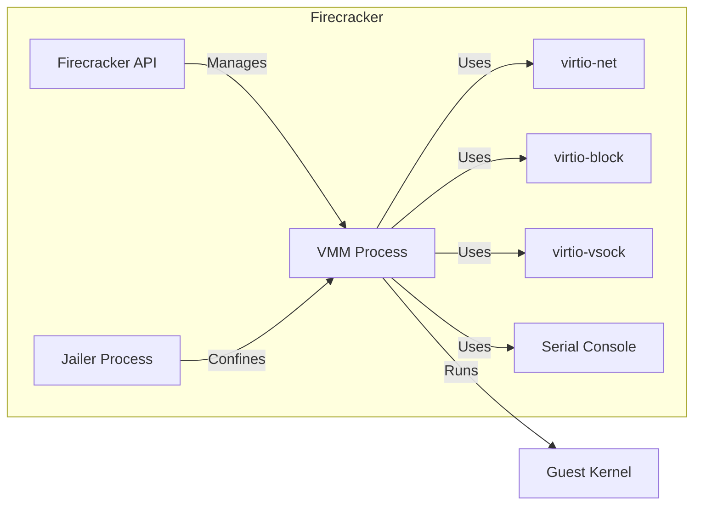

# BUSINESS POSTURE

Business Priorities and Goals:

*   Provide a Virtual Machine Monitor (VMM) alternative to QEMU, optimized for security and minimal overhead.
*   Enable the creation of lightweight microVMs for serverless computing and container workloads.
*   Offer fast boot times and minimal memory footprint to maximize resource utilization.
*   Ensure strong isolation between microVMs and the host system.
*   Support a high density of microVMs per host.
*   Provide a simple and easy-to-use API for managing microVMs.
*   Maintain compatibility with existing container tooling and workflows.
*   Be open source and community-driven.

Business Risks:

*   Vulnerabilities in the VMM could lead to VM escapes, compromising the host system and other microVMs. This is the most critical risk.
*   Performance bottlenecks could limit the density of microVMs and impact application performance.
*   Compatibility issues with specific kernels or container runtimes could limit adoption.
*   Lack of features compared to more mature VMMs could hinder adoption in certain use cases.
*   Complexity of the codebase could make it difficult to maintain and contribute to.
*   Insufficient security auditing and penetration testing could leave undiscovered vulnerabilities.

# SECURITY POSTURE

Existing Security Controls:

*   security control: Minimal attack surface: Firecracker is designed with a minimal feature set, reducing the potential attack surface. (Described in Firecracker's design philosophy and documentation).
*   security control: Seccomp filtering: Firecracker uses seccomp filters to restrict the system calls that can be made by the guest kernel. (Described in Firecracker's documentation and source code).
*   security control: KVM isolation: Firecracker leverages the Linux Kernel Virtual Machine (KVM) for hardware-assisted virtualization, providing strong isolation between the guest and host. (Described in Firecracker's documentation and source code).
*   security control: Jailer: Firecracker uses a jailer process to further confine the VMM process, limiting its access to system resources. (Described in Firecracker's documentation and source code).
*   security control: Static linking: Firecracker is statically linked, reducing dependencies and potential vulnerabilities from shared libraries. (Described in Firecracker's build process).
*   security control: Regular security audits: Firecracker undergoes regular security audits and penetration testing. (Mentioned in community discussions and documentation).
*   security control: Minimal device emulation: Only a minimal set of devices (virtio-net, virtio-block, virtio-vsock, serial console) are emulated, reducing the attack surface related to device drivers. (Described in Firecracker's documentation and source code).

Accepted Risks:

*   accepted risk: Reliance on KVM: Firecracker's security is inherently tied to the security of the KVM hypervisor. Any vulnerabilities in KVM could potentially impact Firecracker.
*   accepted risk: Limited feature set: The focus on minimalism means that some features available in other VMMs are not present in Firecracker. This is a trade-off for security and performance.
*   accepted risk: Potential for unknown vulnerabilities: As with any software, there is always the potential for undiscovered vulnerabilities.

Recommended Security Controls:

*   security control: Implement a comprehensive fuzzing framework to continuously test Firecracker for vulnerabilities.
*   security control: Integrate with a vulnerability management system to track and remediate identified vulnerabilities.
*   security control: Provide detailed documentation on security best practices for using Firecracker, including network configuration and guest image security.
*   security control: Explore the use of memory-safe languages (e.g., Rust) for future development to reduce the risk of memory corruption vulnerabilities.

Security Requirements:

*   Authentication:
    *   Firecracker API should support authentication mechanisms to restrict access to authorized users and services.
    *   Consider using API keys or other token-based authentication.

*   Authorization:
    *   Firecracker API should implement role-based access control (RBAC) to limit the actions that users and services can perform.
    *   Define granular permissions for managing microVMs, networks, and storage.

*   Input Validation:
    *   All input to the Firecracker API should be strictly validated to prevent injection attacks and other vulnerabilities.
    *   Validate parameters such as kernel image paths, root filesystem paths, network configurations, and device specifications.

*   Cryptography:
    *   If sensitive data is transmitted between the host and guest, use secure communication channels (e.g., TLS).
    *   Consider using encrypted disk images for guest VMs to protect data at rest.

# DESIGN

## C4 CONTEXT

```mermaid
graph LR
    subgraph "External Systems"
        A[Container Runtime]
        B[Orchestrator]
        C[User]
    end
    D[Firecracker]
    A -- "Manages microVMs" --> D
    B -- "Schedules microVMs" --> D
    C -- "Manages Firecracker" --> D
    D -- "Uses" --> E[Host OS (Linux)]
    D -- "Uses" --> F[KVM]

```

Element Descriptions:

*   1.  Name: Container Runtime
    *   Type: External System
    *   Description: A container runtime, such as containerd or Docker, that manages the lifecycle of containers.
    *   Responsibilities: Creating, starting, stopping, and deleting containers.
    *   Security controls: Container runtime security features, such as image signing and vulnerability scanning.

*   2.  Name: Orchestrator
    *   Type: External System
    *   Description: A container orchestrator, such as Kubernetes or Nomad, that schedules and manages containers across a cluster of machines.
    *   Responsibilities: Scheduling containers, managing resources, and ensuring high availability.
    *   Security controls: Orchestrator security features, such as RBAC and network policies.

*   3.  Name: User
    *   Type: External System
    *   Description: A user or service that interacts with the Firecracker API to manage microVMs.
    *   Responsibilities: Creating, starting, stopping, and deleting microVMs.
    *   Security controls: Authentication and authorization mechanisms for the Firecracker API.

*   4.  Name: Firecracker
    *   Type: System
    *   Description: The Firecracker Virtual Machine Monitor.
    *   Responsibilities: Creating and managing microVMs, providing a minimal and secure virtualization environment.
    *   Security controls: Seccomp filtering, KVM isolation, jailer, minimal device emulation, static linking.

*   5.  Name: Host OS (Linux)
    *   Type: External System
    *   Description: The host operating system, which must be Linux.
    *   Responsibilities: Providing the underlying infrastructure for Firecracker, including KVM.
    *   Security controls: Host OS security features, such as kernel hardening and security updates.

*   6.  Name: KVM
    *   Type: External System
    *   Description: The Linux Kernel Virtual Machine, a hardware-assisted virtualization technology.
    *   Responsibilities: Providing hardware virtualization support for Firecracker.
    *   Security controls: KVM security features and updates.

## C4 CONTAINER



Element Descriptions:

*   1.  Name: Firecracker API
    *   Type: Container
    *   Description: The API endpoint for managing Firecracker microVMs.
    *   Responsibilities: Receiving and processing requests to create, start, stop, and delete microVMs.
    *   Security controls: Authentication, authorization, and input validation.

*   2.  Name: VMM Process
    *   Type: Container
    *   Description: The main Firecracker process that manages the lifecycle of a microVM.
    *   Responsibilities: Creating and managing the virtual hardware, interacting with the guest kernel, and handling I/O.
    *   Security controls: Seccomp filtering, KVM isolation.

*   3.  Name: Jailer Process
    *   Type: Container
    *   Description: A process that confines the VMM process, limiting its access to system resources.
    *   Responsibilities: Restricting the VMM process's capabilities and access to the file system.
    *   Security controls: Chroot, capability dropping, resource limits.

*   4.  Name: virtio-net
    *   Type: Container
    *   Description: The virtual network device.
    *   Responsibilities: Providing network connectivity to the microVM.
    *   Security controls: Network filtering and isolation.

*   5.  Name: virtio-block
    *   Type: Container
    *   Description: The virtual block device.
    *   Responsibilities: Providing storage to the microVM.
    *   Security controls: Data encryption and access control.

*   6.  Name: virtio-vsock
    *   Type: Container
    *   Description: The virtual socket device.
    *   Responsibilities: Providing a communication channel between the host and the guest.
    *   Security controls: Secure communication protocols.

*   7.  Name: Serial Console
    *   Type: Container
    *   Description: The serial console for interacting with the guest.
    *   Responsibilities: Providing a basic input/output interface for the guest.
    *   Security controls: Access control.

*   8.  Name: Guest Kernel
    *   Type: External
    *   Description: The guest operating system kernel.
    *   Responsibilities: Running the guest operating system and applications.
    *   Security controls: Guest OS security features.

## DEPLOYMENT

Possible deployment solutions:

1.  Standalone host: Firecracker can be deployed directly on a physical server or a virtual machine running a supported Linux distribution.
2.  Containerized deployment: Firecracker can be deployed within a container, using a container runtime like Docker or containerd.
3.  Orchestrated deployment: Firecracker can be deployed and managed by a container orchestrator like Kubernetes.

Chosen deployment solution (Orchestrated deployment with Kubernetes):

```mermaid
graph LR
    subgraph Kubernetes Cluster
        subgraph Node 1
            A[Firecracker MicroVM]
            B[Firecracker VMM Process]
            C[Jailer]
            D[KVM]
            E[Host OS (Linux)]
            B -- "Confined by" --> C
            B -- "Runs on" --> D
            B -- "Runs on" --> E
            A -- "Managed by" --> B
        end
        subgraph Node 2
            F[Firecracker MicroVM]
            G[Firecracker VMM Process]
            H[Jailer]
            I[KVM]
            J[Host OS (Linux)]
            G -- "Confined by" --> H
            G -- "Runs on" --> I
            G -- "Runs on" --> J
            F -- "Managed by" --> G
        end
    end
    K[Kubernetes API Server]
    L[etcd]
    M[Scheduler]
    N[Controller Manager]
    O[Kubelet]
    K -- "Stores state" --> L
    K -- "Schedules pods" --> M
    K -- "Manages resources" --> N
    O -- "Manages pods on node" --> A
    O -- "Manages pods on node" --> F
    K -- "Manages nodes" --> O

```

Element Descriptions:

*   1.  Name: Firecracker MicroVM
    *   Type: Node
    *   Description: An instance of a running microVM.
    *   Responsibilities: Running the guest operating system and applications.
    *   Security controls: Guest OS security features, isolation provided by KVM and Firecracker.

*   2.  Name: Firecracker VMM Process
    *   Type: Node
    *   Description: The Firecracker process managing the microVM.
    *   Responsibilities: Creating and managing the virtual hardware, interacting with the guest kernel.
    *   Security controls: Seccomp filtering, KVM isolation.

*   3.  Name: Jailer
    *   Type: Node
    *   Description: The process that confines the VMM process.
    *   Responsibilities: Restricting the VMM process's capabilities and access.
    *   Security controls: Chroot, capability dropping, resource limits.

*   4.  Name: KVM
    *   Type: Node
    *   Description: The Linux Kernel Virtual Machine.
    *   Responsibilities: Providing hardware virtualization support.
    *   Security controls: KVM security features and updates.

*   5.  Name: Host OS (Linux)
    *   Type: Node
    *   Description: The host operating system.
    *   Responsibilities: Providing the underlying infrastructure.
    *   Security controls: Host OS security features, kernel hardening.

*   6.  Name: Kubernetes API Server
    *   Type: Node
    *   Description: The central control plane component for Kubernetes.
    *   Responsibilities: Exposing the Kubernetes API, handling authentication and authorization.
    *   Security controls: TLS encryption, RBAC, authentication mechanisms.

*   7.  Name: etcd
    *   Type: Node
    *   Description: The distributed key-value store used by Kubernetes.
    *   Responsibilities: Storing the cluster state and configuration.
    *   Security controls: Data encryption, access control.

*   8.  Name: Scheduler
    *   Type: Node
    *   Description: The Kubernetes component that schedules pods onto nodes.
    *   Responsibilities: Selecting the best node for a pod based on resource availability and constraints.
    *   Security controls: None specific, relies on overall Kubernetes security.

*   9.  Name: Controller Manager
    *   Type: Node
    *   Description: The Kubernetes component that manages various controllers.
    *   Responsibilities: Ensuring the desired state of the cluster is maintained.
    *   Security controls: None specific, relies on overall Kubernetes security.

*   10. Name: Kubelet
    *   Type: Node
    *   Description: The Kubernetes agent that runs on each node.
    *   Responsibilities: Managing pods and containers on the node.
    *   Security controls: Communication with the API server is secured via TLS.

## BUILD

Build Process:

1.  Developer commits code to the Firecracker GitHub repository.
2.  A GitHub Actions workflow is triggered.
3.  The workflow checks out the code.
4.  The workflow builds Firecracker using the provided build scripts (Cargo for Rust code).
5.  Static analysis tools (linters, clippy) are run to check for code quality and potential issues.
6.  Unit tests and integration tests are executed.
7.  If all tests pass, the build artifacts (statically linked Firecracker binary) are created.
8.  The artifacts can be optionally published to a release.
9.  Security scanners (e.g., for known vulnerabilities in dependencies) can be integrated into the workflow.

```mermaid
graph LR
    A[Developer] -- "Commits code" --> B[GitHub Repository]
    B -- "Triggers" --> C[GitHub Actions Workflow]
    C -- "Checks out code" --> D[Code Checkout]
    D -- "Builds Firecracker" --> E[Build Process (Cargo)]
    E -- "Runs static analysis" --> F[Static Analysis (Linters, Clippy)]
    E -- "Runs tests" --> G[Unit & Integration Tests]
    G -- "If tests pass" --> H[Create Artifacts]
    H -- "Optionally publish" --> I[Release]
    C -- "Runs security scanners" --> J[Security Scanners]

```

# RISK ASSESSMENT

Critical Business Processes:

*   Providing secure and isolated execution environments for customer workloads.
*   Ensuring the availability and performance of the Firecracker service.
*   Maintaining the integrity and confidentiality of customer data.

Data to Protect and Sensitivity:

*   Guest OS images: Potentially contain sensitive customer data. Sensitivity: High.
*   Guest application data: Contains customer data, potentially highly sensitive. Sensitivity: High.
*   Firecracker configuration: Contains settings that could be exploited if compromised. Sensitivity: Medium.
*   API keys and credentials: Used to access the Firecracker API. Sensitivity: High.

# QUESTIONS & ASSUMPTIONS

Questions:

*   What specific compliance requirements (e.g., PCI DSS, HIPAA) must Firecracker adhere to?
*   What are the expected performance requirements (e.g., microVM density, boot time)?
*   What are the specific threat models that have been considered for Firecracker?
*   What is the process for reporting and handling security vulnerabilities?
*   Are there any plans to support live migration of microVMs?
*   What level of support is provided for different guest operating systems?
*   What are the plans for future development and feature enhancements?

Assumptions:

*   BUSINESS POSTURE: The primary business goal is to provide a secure and efficient virtualization solution for serverless and container workloads.
*   SECURITY POSTURE: The development team prioritizes security and follows secure coding practices. Regular security audits are conducted.
*   DESIGN: The host operating system is a secure and up-to-date Linux distribution. The Kubernetes cluster is configured securely, following best practices. The network is configured to isolate microVMs from each other and from the host network.