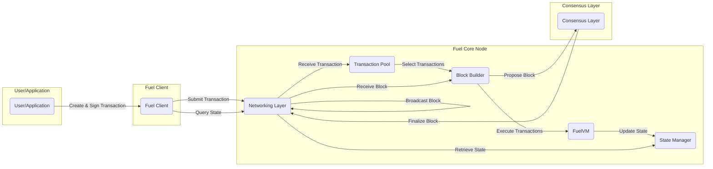

## Project Design Document: Fuel Core (Improved)

**1. Introduction**

This document provides an enhanced architectural design of Fuel Core, a modular blockchain execution layer engineered for high throughput and a developer-centric smart contract experience. This detailed description serves as a crucial foundation for subsequent threat modeling exercises, meticulously outlining the key components, data flows, and interactions within the system to facilitate comprehensive security analysis.

**1.1. Purpose**

The primary objective of this document is to furnish a clear, comprehensive, and up-to-date description of the Fuel Core architecture. This detailed architectural blueprint will serve as the definitive input for upcoming threat modeling activities, enabling the identification of potential security vulnerabilities and the design of effective mitigation strategies.

**1.2. Scope**

This document encompasses the core architectural components of Fuel Core, including the intricacies of the FuelVM, the functionalities of the node client, the mechanisms of the networking layer, and the structure of key data elements. The focus is on the functional aspects directly relevant to security analysis, providing a granular view of the system's workings. This document does not delve into the specifics of individual smart contracts or the detailed implementation of the consensus mechanism, which is assumed to be provided by a separate, interacting layer.

**1.3. Audience**

This document is specifically intended for:

* Security engineers and architects tasked with performing threat modeling on Fuel Core.
* Developers actively contributing to or interacting with the Fuel Core codebase.
* Security auditors responsible for evaluating the security posture of the Fuel Core system.

**2. Overview**

Fuel Core is architected as a highly efficient execution layer for blockchain applications. It is designed to overcome the inherent scalability limitations of existing smart contract platforms by implementing a parallel transaction execution model and leveraging a UTXO-based accounting system. Key architectural features include:

* **FuelVM (Virtual Machine):** A custom-built, high-performance virtual machine specifically optimized for blockchain execution.
* **UTXO Model:** Employs an Unspent Transaction Output (UTXO) model for managing blockchain state, inherently enabling parallel transaction processing capabilities.
* **Modular Design:**  Constructed from distinct, loosely coupled components, facilitating independent development, testing, and maintenance.
* **Client-Server Architecture:**  Comprises a core node responsible for network participation and client libraries enabling external interaction with the network.

**3. Architectural Components**

The Fuel Core architecture is composed of the following essential components:

* **FuelVM (Virtual Machine):**
    * **Functionality:** Executes smart contract bytecode in a secure and deterministic manner.
    * **Security Features:** Operates within a rigorously sandboxed environment to prevent malicious code from affecting the host system or other contracts. Ensures deterministic execution to maintain consensus across the network.
    * **Resource Management:** Manages memory allocation, gas consumption, and other resources during contract execution to prevent resource exhaustion attacks.
* **Fuel Client:**
    * **Purpose:** Provides a user-friendly interface for users and applications to interact with the Fuel Core network.
    * **Transaction Handling:** Facilitates the creation, signing (using private keys), and submission of transactions to the network.
    * **Data Retrieval:** Enables querying the network for current state information, transaction details, and block data.
    * **Implementation:** Can be implemented as a command-line interface (CLI), a software development kit (SDK) for various programming languages, or a web-based interface.
* **Transaction Pool (Tx Pool):**
    * **Role:**  Temporarily stores pending transactions that have been submitted to the network but have not yet been included in a finalized block.
    * **Ordering and Prioritization:** Implements sophisticated logic for ordering and prioritizing transactions based on factors such as transaction fees (gas price) and arrival time.
    * **Resource Management:** Manages the size of the transaction pool to prevent memory exhaustion and denial-of-service attacks.
    * **Validation:** Performs preliminary validation checks on incoming transactions before adding them to the pool.
* **Block Builder:**
    * **Responsibility:** Selects and orders valid transactions from the transaction pool to construct new blocks to be added to the blockchain.
    * **Consensus Interaction:** Interacts with the external consensus layer to propose newly formed blocks and participate in the block finalization process.
    * **Reward Handling:**  Manages the distribution of block rewards and transaction fees to block proposers (depending on the consensus mechanism).
* **State Manager:**
    * **Core Function:** Maintains the current, authoritative state of the Fuel Core blockchain, including account balances, smart contract data, and other relevant information.
    * **Persistence:** Persists the blockchain state to a durable storage mechanism (e.g., a database or a key-value store).
    * **Efficient Access:** Provides optimized mechanisms for accessing and updating state data during transaction execution and client queries.
    * **State Transitions:**  Applies state transitions resulting from the execution of transactions within finalized blocks.
* **Networking Layer (P2P Network):**
    * **Communication:** Enables secure and reliable communication between different Fuel Core nodes participating in the network.
    * **Transaction and Block Propagation:** Responsible for efficiently broadcasting newly submitted transactions and finalized blocks across the network.
    * **Peer Discovery and Management:** Implements protocols for discovering and managing connections with other peers in the network.
    * **Security Features:** Employs encryption and authentication mechanisms to protect network communication from eavesdropping and tampering.
* **Indexer:**
    * **Optional Component:** An optional service that indexes blockchain data to facilitate efficient querying and analysis of historical and current information.
    * **Query Optimization:** Allows clients to retrieve specific data points without needing to scan the entire blockchain, improving query performance.
    * **Data Storage:** Stores indexed data in a separate database optimized for querying.
* **GraphQL API:**
    * **Interface:** Provides a standardized and flexible interface for querying blockchain data using the GraphQL query language.
    * **Data Access:** Allows developers to easily retrieve specific information about transactions, blocks, accounts, and smart contract state.
    * **Security:** Implements authorization and rate-limiting mechanisms to protect against abuse.

**4. Data Flow**

The following describes the typical data flow for a transaction within the Fuel Core system:

* **Transaction Submission:**
    * A user or application initiates a transaction by creating it using the Fuel Client.
    * The Fuel Client cryptographically signs the transaction using the user's private key, ensuring authenticity and non-repudiation.
    * The signed transaction is then submitted to a Fuel Core node, typically via the networking layer or through a direct API call to a node.
* **Transaction Reception and Validation:**
    * The receiving Fuel Core node validates the transaction's cryptographic signature, verifies its format against predefined rules, and performs basic validity checks (e.g., sufficient funds).
    * If the transaction is deemed valid, it is added to the node's local Transaction Pool, awaiting inclusion in a block.
* **Block Proposal:**
    * The Block Builder component on a designated node (determined by the consensus mechanism) selects a set of valid transactions from its Transaction Pool. Selection criteria may include transaction fees, priority, and other factors.
    * The Block Builder constructs a new block containing the selected transactions, along with metadata such as a timestamp and a reference to the previous block.
    * The newly proposed block is then submitted to the external Consensus Layer for validation and agreement among network participants.
* **Block Finalization (External to Fuel Core):**
    * The Consensus Layer (e.g., a Proof-of-Stake or Proof-of-Work system) performs its designated process to validate the proposed block and reach a consensus agreement on its validity and order within the blockchain. This process is external to the core Fuel Core logic.
* **Block Propagation:**
    * Once the Consensus Layer finalizes a block, the finalized block is broadcast to all other nodes in the Fuel Core network via the Networking Layer's peer-to-peer communication protocols.
* **Transaction Execution:**
    * Upon receiving a finalized block, each Fuel Core node independently executes the transactions contained within the block using the FuelVM.
    * The FuelVM interprets and executes the smart contract bytecode associated with each transaction, performing the intended state changes.
* **State Update:**
    * Based on the successful execution of transactions within a block, the State Manager updates the blockchain's state, reflecting changes to account balances, smart contract data, and other relevant information. These state updates are persisted to the underlying storage mechanism.
* **Querying State:**
    * Clients can query the current state of the blockchain through the Fuel Client or by directly interacting with the GraphQL API exposed by Fuel Core nodes.
    * The State Manager efficiently retrieves the requested information from the persistent storage layer and returns it to the client.

**5. Security Considerations (Detailed)**

This section provides a more detailed overview of potential security considerations for each component, serving as a starting point for in-depth threat modeling.

* **FuelVM:**
    * **Threat:** Exploitation of vulnerabilities in the VM's bytecode interpreter could lead to arbitrary code execution within the VM's sandbox, potentially allowing attackers to manipulate contract state or cause denial-of-service.
    * **Threat:** Non-deterministic execution due to VM bugs could lead to consensus failures, where different nodes arrive at different state outcomes for the same set of transactions.
    * **Threat:**  Gas limit vulnerabilities could allow malicious contracts to consume excessive resources, leading to block processing delays or node crashes.
* **Fuel Client:**
    * **Threat:** Compromise of user private keys could allow attackers to impersonate users and submit unauthorized transactions, leading to theft of funds or manipulation of smart contracts.
    * **Threat:**  Vulnerabilities in the client software itself could be exploited to steal private keys or manipulate transaction data before signing.
    * **Threat:**  Phishing attacks targeting users to obtain their private keys remain a significant risk.
* **Transaction Pool:**
    * **Threat:** Denial-of-service attacks by flooding the pool with a large number of invalid or low-fee transactions, potentially overwhelming node resources and preventing legitimate transactions from being processed.
    * **Threat:**  Censorship attacks where malicious nodes selectively drop or delay certain transactions from being included in blocks.
    * **Threat:**  Transaction replacement attacks where an attacker replaces a legitimate transaction with their own, potentially with a higher fee.
* **Block Builder:**
    * **Threat:**  Censorship by block proposers who selectively include or exclude transactions based on their own interests, potentially hindering certain users or applications.
    * **Threat:**  Front-running attacks where block proposers insert their own transactions ahead of others to profit from pending actions.
    * **Threat:**  Vulnerabilities in the block building logic could lead to the creation of invalid blocks, potentially causing chain forks or consensus issues.
* **State Manager:**
    * **Threat:**  Data corruption or unauthorized modification of the state database could lead to inconsistencies in the blockchain's state and potentially catastrophic failures.
    * **Threat:**  Unauthorized access to the state database could allow attackers to steal sensitive information or manipulate account balances.
    * **Threat:**  Replay attacks where historical state data is used to revert the blockchain to a previous state.
* **Networking Layer:**
    * **Threat:**  Sybil attacks where an attacker creates a large number of fake nodes to gain control over the network and potentially disrupt consensus or censor transactions.
    * **Threat:**  Eclipse attacks where an attacker isolates a node from the rest of the network, allowing them to feed it false information.
    * **Threat:**  Man-in-the-middle attacks where an attacker intercepts and potentially modifies communication between nodes.
    * **Threat:**  Denial-of-service attacks targeting the network infrastructure, preventing nodes from communicating with each other.
* **Indexer:**
    * **Threat:**  Data injection or manipulation in the indexed data could lead to users receiving incorrect or misleading information about the blockchain.
    * **Threat:**  Denial-of-service attacks targeting the indexer service, preventing users from accessing indexed data.
    * **Threat:**  Unauthorized access to the indexer's data store could expose sensitive information.
* **GraphQL API:**
    * **Threat:**  Exposure of sensitive data through poorly designed or overly permissive queries.
    * **Threat:**  Denial-of-service attacks by sending a large number of complex or resource-intensive queries.
    * **Threat:**  Authorization bypass vulnerabilities allowing unauthorized users to access restricted data or perform administrative actions.

**6. Assumptions and Constraints**

The following assumptions and constraints are important to consider when evaluating the security of Fuel Core:

* **Consensus Mechanism Security:** The security and reliability of the underlying consensus mechanism are assumed. This document focuses on the execution layer and its interactions with the consensus layer.
* **Cryptographic Primitives:** The security of the underlying cryptographic primitives used for signing, hashing, and encryption is assumed.
* **Operating Environment Security:** The security of the operating systems and hardware on which Fuel Core nodes are deployed is assumed to be adequately maintained.
* **Smart Contract Security:** The security of individual smart contracts deployed on Fuel Core is the responsibility of the contract developers and is outside the direct scope of this document. However, the Fuel Core architecture aims to provide a secure environment for contract execution.

**7. Future Considerations**

Potential future developments and architectural changes that may impact the security landscape of Fuel Core include:

* **Integration with diverse consensus mechanisms:** Adapting to different consensus protocols may introduce new security considerations.
* **Enhancements to the FuelVM:**  Optimizations and new features in the VM may require careful security review.
* **Improvements to the networking layer:**  Changes to peer discovery or communication protocols could introduce new attack vectors.
* **Introduction of new features and functionalities:**  Each new feature will require thorough security analysis and design considerations.

This document will be periodically reviewed and updated to reflect the evolving architecture of Fuel Core and to incorporate new security insights.