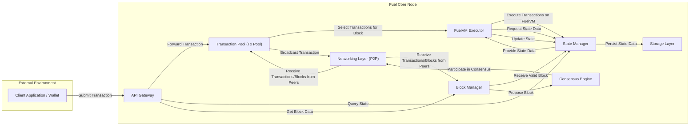
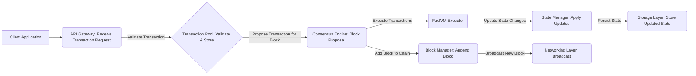
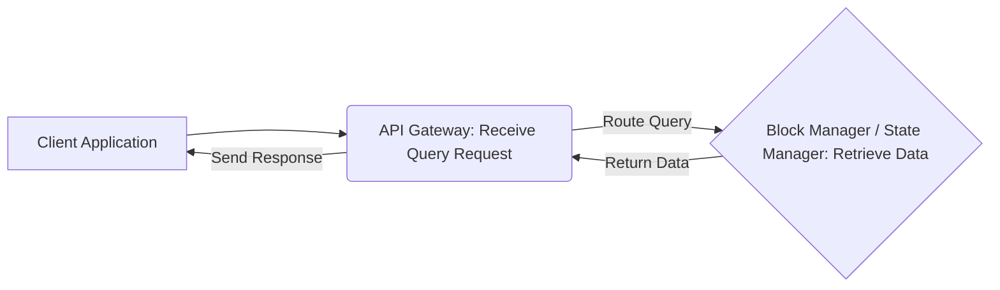
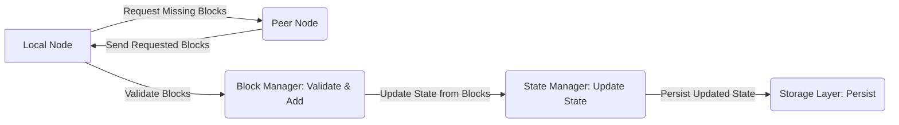

# Project Design Document: Fuel Core

**Version:** 1.1
**Date:** October 26, 2023
**Prepared By:** Gemini (AI Language Model)

## 1. Introduction

This document provides a detailed design overview of the Fuel Core project, a Rust implementation of the FuelVM, an extremely fast modular execution layer for blockchains. This document aims to provide a comprehensive understanding of the system's architecture, components, and data flow, which will be crucial for subsequent threat modeling activities. This revision incorporates feedback to enhance clarity and detail, particularly concerning security aspects.

### 1.1. Project Overview

Fuel Core serves as the foundational node software for the Fuel network. Its core responsibilities include:

*   Processing and executing transactions on the FuelVM.
*   Participating in the network's consensus mechanism to validate and order transactions.
*   Maintaining the current state of the Fuel blockchain, including accounts and contracts.
*   Providing secure and reliable APIs for external interaction with the network and node.

### 1.2. Goals

*   Provide a clear and detailed description of the Fuel Core architecture and its key interactions.
*   Identify core components, their functionalities, and their relationships within the system.
*   Illustrate the flow of data through the system for various operations.
*   Serve as a robust foundation for conducting thorough threat modeling and security analysis.

### 1.3. Scope

This document focuses on the core architectural components and data flows within a single Fuel Core node. While it touches upon interactions with the broader Fuel network, it does not delve into the intricate details of the FuelVM instruction set or the specifics of the consensus mechanism's algorithms. The emphasis is on the software architecture of the Fuel Core implementation.

## 2. High-Level Architecture

### 2.1. Component Descriptions

*   **Client Application / Wallet:** External software used by users to interact with the Fuel network. This includes submitting transactions, querying account balances, and interacting with smart contracts.
*   **API Gateway:** The entry point for external interactions with the Fuel Core node. It provides a well-defined interface (e.g., JSON-RPC) for clients. Key responsibilities include request routing, input validation, and potentially authentication and authorization.
*   **Transaction Pool (Tx Pool):**  A temporary in-memory storage for valid, pending transactions that have been received by the node but not yet included in a finalized block. It manages prioritization (often based on transaction fees) and prevents resource exhaustion from excessive transaction submissions.
*   **FuelVM Executor:** The core component responsible for executing transaction bytecode within the isolated environment of the Fuel Virtual Machine. It interacts with the State Manager to read the current blockchain state and apply state changes resulting from transaction execution.
*   **Consensus Engine:** Implements the logic for the Fuel network's consensus mechanism. This involves communication with other nodes to agree on the order of transactions and the validity of new blocks. It handles block proposal, voting, and finalization.
*   **Block Manager:** Responsible for managing the blockchain's structure. This includes receiving and validating new blocks, storing finalized blocks, and handling chain synchronization with other peers. It ensures the integrity and chronological order of the blockchain.
*   **State Manager:** Manages the current state of the Fuel blockchain, which includes account balances, smart contract data, and other relevant information. It provides efficient read and write access to this state and ensures its persistence. Often utilizes data structures like Merkle trees for efficient state verification and updates.
*   **Networking Layer (P2P):**  Handles all communication with other Fuel Core nodes in the network. This includes broadcasting new transactions and blocks, participating in consensus messaging, and discovering new peers. It is crucial for maintaining network connectivity and data propagation.
*   **Storage Layer:** The persistent storage mechanism used by the Fuel Core node to store the blockchain data, including finalized blocks and the current state. This could involve various database technologies or file-based storage. Data integrity and durability are key concerns for this layer.

## 3. Detailed Component Breakdown

### 3.1. API Gateway

*   **Functionality:**
    *   Receives and processes incoming API requests from external clients.
    *   Performs input validation to prevent malformed or malicious requests from reaching internal components.
    *   May implement authentication and authorization mechanisms to control access to sensitive APIs.
    *   Routes valid requests to the appropriate internal components for processing.
    *   Implements rate limiting and request throttling to protect against denial-of-service attacks.
    *   Formats and sends responses back to the client.
*   **Security Considerations:**
    *   Primary target for external attacks, including injection vulnerabilities (e.g., SQL injection if interacting with a database directly, though less likely here), authentication bypass, and authorization flaws.
    *   Requires robust input sanitization and validation to prevent exploitation of vulnerabilities in internal components.
    *   Needs protection against common web application vulnerabilities (e.g., cross-site scripting if serving web content, though less likely for a blockchain node API).
    *   Properly configured CORS (Cross-Origin Resource Sharing) policies are essential if the API is accessed from web browsers.

### 3.2. Transaction Pool (Tx Pool)

*   **Functionality:**
    *   Receives and temporarily stores newly submitted transactions.
    *   Performs initial validation of transactions (e.g., signature verification, sufficient fees).
    *   Manages transaction prioritization, typically based on the gas price offered by the sender.
    *   Implements mechanisms to prevent the pool from being flooded with invalid or low-fee transactions (DoS protection).
    *   Provides a set of candidate transactions to the Consensus Engine for inclusion in the next block.
*   **Security Considerations:**
    *   Vulnerable to denial-of-service attacks by flooding the pool with a large number of invalid or low-fee transactions, consuming memory and processing resources.
    *   Potential for manipulation of transaction ordering if the prioritization logic is flawed or exploitable.
    *   Needs protection against "griefing" attacks where malicious actors submit transactions that consume resources but are unlikely to be included in a block.

### 3.3. FuelVM Executor

*   **Functionality:**
    *   Loads and executes the bytecode of transactions within the isolated Fuel Virtual Machine environment.
    *   Manages the execution context, including memory, stack, and registers.
    *   Interacts with the State Manager to read the current state and apply state changes resulting from transaction execution.
    *   Enforces gas limits to prevent transactions from consuming excessive computational resources.
    *   Ensures deterministic execution of transactions across different nodes.
*   **Security Considerations:**
    *   Relies heavily on the security of the FuelVM itself. Vulnerabilities in the VM could allow malicious code to escape the sandbox or compromise the node.
    *   Requires robust sandboxing to prevent transaction execution from affecting the host system or other node components.
    *   Proper gas accounting is crucial to prevent resource exhaustion attacks through computationally expensive transactions.
    *   The interface between the Executor and the State Manager must be secure to prevent unauthorized state modifications.

### 3.4. Consensus Engine

*   **Functionality:**
    *   Implements the specific consensus algorithm used by the Fuel network (implementation details are external to this document but the interaction is key).
    *   Communicates with other Fuel Core nodes via the Networking Layer to exchange consensus-related messages.
    *   Participates in block proposal, voting, and finalization processes.
    *   Ensures agreement among nodes on the canonical blockchain history.
    *   Handles fork resolution in case of temporary disagreements in the network.
*   **Security Considerations:**
    *   The most critical component for the security and liveness of the network. Vulnerabilities here can lead to network-wide failures or security breaches.
    *   Susceptible to various consensus-specific attacks, such as Sybil attacks (where an attacker controls a large number of nodes), Byzantine fault tolerance issues, and denial-of-service attacks targeting the consensus process.
    *   Requires secure and authenticated communication channels with other nodes to prevent malicious actors from disrupting the consensus process.

### 3.5. Block Manager

*   **Functionality:**
    *   Receives newly proposed blocks from other nodes or the local Consensus Engine.
    *   Performs rigorous validation of incoming blocks, including checking transaction validity, block signatures, and adherence to consensus rules.
    *   Stores finalized blocks in the Storage Layer, maintaining the blockchain's structure.
    *   Handles blockchain synchronization with other peers, downloading missing blocks and verifying the chain's integrity.
    *   Provides block data to other components, such as the API Gateway for query requests.
*   **Security Considerations:**
    *   Robust block validation is paramount to prevent invalid or malicious blocks from being added to the chain.
    *   Vulnerable to attacks that attempt to manipulate the blockchain history, such as reorg attacks or attacks on the chain synchronization process.
    *   Secure peer-to-peer communication is essential to prevent attackers from injecting malicious blocks or disrupting synchronization.

### 3.6. State Manager

*   **Functionality:**
    *   Manages the current state of the Fuel blockchain, representing the latest agreed-upon state of accounts, contracts, and other data.
    *   Provides efficient mechanisms for reading and writing state data, often utilizing in-memory caching for performance.
    *   Implements state transition logic based on the execution of transactions in finalized blocks.
    *   Persists the state to the Storage Layer, ensuring durability and consistency.
    *   May employ data structures like Merkle trees to enable efficient state verification and updates.
*   **Security Considerations:**
    *   Critical for maintaining the integrity and consistency of the blockchain's data.
    *   Requires strict access control to prevent unauthorized modifications to the state.
    *   Vulnerable to data corruption or loss if the persistence mechanisms are flawed or the underlying Storage Layer is compromised.
    *   The security of the data structures used (e.g., Merkle trees) is important for ensuring the integrity and verifiability of the state.

### 3.7. Networking Layer (P2P)

*   **Functionality:**
    *   Handles all network communication with other Fuel Core nodes.
    *   Implements peer discovery mechanisms to find and connect to other nodes in the network.
    *   Transports various types of messages, including transactions, blocks, and consensus-related messages.
    *   May implement encryption and authentication to secure communication channels.
    *   Manages network topology and connections to ensure reliable communication.
*   **Security Considerations:**
    *   Susceptible to various network-level attacks, including eavesdropping, man-in-the-middle attacks, and denial-of-service attacks.
    *   Requires secure communication protocols (e.g., TLS) to protect the confidentiality and integrity of transmitted data.
    *   Needs robust peer authentication and authorization mechanisms to prevent malicious nodes from joining the network or impersonating legitimate peers.
    *   Vulnerable to Sybil attacks where an attacker creates a large number of fake identities to gain control over the network.

### 3.8. Storage Layer

*   **Functionality:**
    *   Provides persistent storage for the blockchain's data, including finalized blocks and the current state.
    *   Ensures data durability and availability, even in the event of node failures.
    *   May involve various database technologies (e.g., key-value stores, relational databases) or file systems.
    *   Performance characteristics (read/write speeds) can significantly impact the overall performance of the Fuel Core node.
*   **Security Considerations:**
    *   Critical for data confidentiality, integrity, and availability.
    *   Requires appropriate access controls to prevent unauthorized access and modification of stored data.
    *   Encryption at rest is essential to protect sensitive data from unauthorized disclosure if the storage medium is compromised.
    *   Needs robust backup and recovery mechanisms to prevent data loss in case of hardware failures or other disasters.

## 4. Data Flow

This section outlines the typical data flow for key operations within the Fuel Core node, providing a visual representation of how data moves between components.

### 4.1. Transaction Submission and Processing

*   A client application initiates a transaction submission, sending the request to the API Gateway.
*   The API Gateway performs initial validation of the transaction.
*   The validated transaction is then stored in the Transaction Pool.
*   The Consensus Engine selects transactions from the pool to propose a new block.
*   The FuelVM Executor executes the transactions within the proposed block.
*   The State Manager applies the state changes resulting from the transaction executions.
*   The Storage Layer persists the updated blockchain state.
*   The Block Manager adds the newly finalized block to the blockchain.
*   The Networking Layer broadcasts the new block to other nodes in the network.

### 4.2. Querying Blockchain Data

*   A client application sends a request to query blockchain data to the API Gateway.
*   The API Gateway routes the query to the appropriate component (either the Block Manager for block-related data or the State Manager for state-related data).
*   The relevant component retrieves the requested data from the Storage Layer or its cache.
*   The data is returned to the API Gateway.
*   The API Gateway formats the response and sends it back to the client application.

### 4.3. Block Synchronization

*   A local node detects that it is out of sync with the network and requests missing blocks from a peer node.
*   The peer node sends the requested blocks to the local node.
*   The Block Manager on the local node validates the received blocks.
*   The State Manager updates the local blockchain state based on the newly received and validated blocks.
*   The Storage Layer persists the updated blockchain data.

## 5. Security Considerations (Summary)

This section provides a consolidated summary of the key security considerations for each component, highlighting potential vulnerabilities and necessary security measures. This serves as a starting point for more in-depth threat modeling.

*   **API Gateway:** Input validation, authentication, authorization, rate limiting, protection against injection attacks, CORS configuration.
*   **Transaction Pool:** DoS prevention, transaction prioritization integrity, memory management, prevention of griefing attacks.
*   **FuelVM Executor:** VM security and sandboxing, gas limit enforcement, secure interaction with State Manager, deterministic execution.
*   **Consensus Engine:** Resistance to Sybil attacks, Byzantine fault tolerance, secure communication, protection against consensus manipulation.
*   **Block Manager:** Robust block validation, protection against chain manipulation (e.g., reorgs), secure synchronization protocols.
*   **State Manager:** Data integrity and consistency, access control, security of underlying data structures, protection against data corruption.
*   **Networking Layer:** Secure communication protocols (TLS), peer authentication and authorization, DoS prevention, Sybil resistance.
*   **Storage Layer:** Data confidentiality (encryption at rest), integrity, availability, access control, backup and recovery mechanisms.

## 6. Assumptions and Dependencies

*   The underlying operating system and hardware infrastructure are assumed to be adequately secured and maintained.
*   Cryptographic libraries used within Fuel Core are assumed to be correctly implemented and free from known vulnerabilities.
*   The design and implementation of the FuelVM itself are assumed to adhere to security best practices, although vulnerabilities may still be discovered.
*   The specific details of the consensus algorithm's implementation and its security properties are outside the scope of this document but are critical for overall network security.

## 7. Future Considerations

*   Integration with Hardware Security Modules (HSMs) for enhanced key management and protection of sensitive cryptographic keys.
*   Implementation of more advanced monitoring and alerting systems to detect and respond to security incidents.
*   Further hardening of the Networking Layer against sophisticated network attacks and privacy concerns.
*   Regular security audits, penetration testing, and vulnerability assessments to identify and address potential weaknesses.
*   Development and implementation of comprehensive incident response plans to handle security breaches effectively.

This revised document provides a more detailed and security-focused overview of the Fuel Core architecture, making it a more effective foundation for subsequent threat modeling activities.