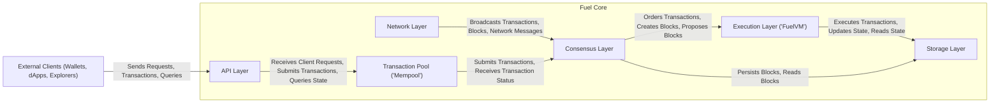
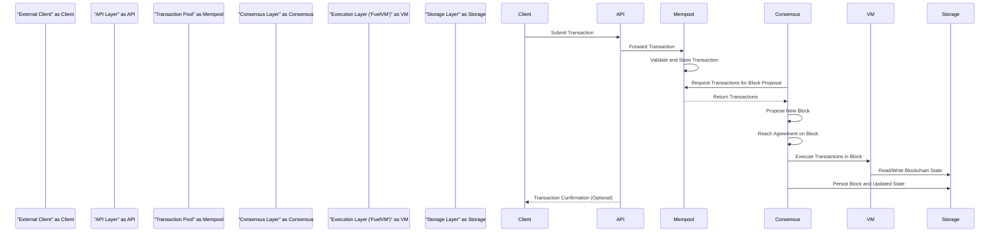

# Project Design Document: Fuel Core

**Version:** 1.1
**Date:** October 26, 2023
**Author:** AI Software Architect

## 1. Project Overview

This document provides an enhanced architectural overview of Fuel Core, a modular and highly efficient blockchain execution layer. Fuel Core is engineered to serve as a high-throughput execution environment for smart contracts and decentralized applications. This document aims to provide a comprehensive understanding of the system's architecture, serving as a crucial input for subsequent threat modeling and security analysis.

## 2. Goals

* Deliver a refined and more detailed architectural overview of Fuel Core.
* Clearly define the responsibilities and interactions of key components.
* Provide a more granular description of the data flow within the system.
* Elaborate on initial security considerations with specific examples.
* Serve as a robust and informative foundation for threat modeling and security analysis activities.

## 3. Target Audience

* Security engineers and architects tasked with assessing Fuel Core's security posture.
* Developers actively contributing to or integrating their applications with Fuel Core.
* DevOps engineers responsible for the deployment, configuration, and maintenance of Fuel Core instances.
* Individuals seeking a deeper understanding of the internal mechanisms and architecture of Fuel Core.

## 4. Scope

This document encompasses the core architectural components of Fuel Core and their intricate interactions. The focus remains on the logical structure, data flow, and key functionalities within the system. The following aspects are within the scope:

* Detailed descriptions of the major components of Fuel Core.
* Comprehensive explanation of the communication pathways between components.
* In-depth analysis of the data flow during transaction processing.
* Identification of key data storage mechanisms and their purpose.
* High-level description of network interactions and protocols.

The following aspects are explicitly outside the scope of this document:

* Fine-grained implementation details of individual modules and their internal logic.
* Quantitative performance benchmarks and specific optimization techniques employed.
* Specific syntax and semantics of the smart contract language (Sway).
* Low-level implementation details of the consensus mechanism (beyond identifying the functional layer).
* Highly specific details of the underlying networking protocol implementation.

## 5. Architecture Overview

Fuel Core is built upon a modular architecture, carefully separating concerns into distinct layers and components. This design promotes enhanced maintainability, improved testability, and facilitates independent development and evolution of different parts of the system.

The following list outlines the key components and their relationships:

* **Network Layer:** Manages peer discovery, communication, and network-level security.
* **Consensus Layer:** Responsible for transaction ordering, block creation, and achieving network agreement.
* **Execution Layer ("FuelVM"):** The virtual machine environment for executing smart contracts.
* **Storage Layer:** Handles persistent storage of blockchain state, blocks, and related data.
* **API Layer:** Provides interfaces for external clients to interact with Fuel Core functionalities.
* **Transaction Pool ("Mempool"):** Holds and manages pending transactions before block inclusion.

## 6. Component Details

This section provides a more detailed breakdown of each major component within Fuel Core, outlining their specific responsibilities and key functions.

### 6.1. Network Layer

* **Responsibilities:**
    * Discovering and managing peer nodes within the network.
    * Establishing, maintaining, and securing communication channels with peers.
    * Broadcasting and receiving various network messages, including transactions and blocks.
    * Implementing network-level security measures such as encryption and authentication.
* **Key Functions:**
    * Implementing peer discovery mechanisms (e.g., using a Distributed Hash Table or predefined seed nodes).
    * Serializing and deserializing network messages for efficient transmission.
    * Handling network events, such as nodes joining or leaving the network, and message reception.
    * Implementing and managing network protocols, potentially including a gossip protocol for message propagation.

### 6.2. Consensus Layer

* **Responsibilities:**
    * Ordering transactions into a canonical sequence within blocks.
    * Reaching a distributed agreement on the next block to be appended to the blockchain.
    * Ensuring fault tolerance and resilience against malicious or faulty nodes.
* **Key Functions:**
    * Implementing block proposal and voting mechanisms to achieve consensus.
    * Managing leader election processes if the consensus algorithm requires a leader.
    * Handling potential forks in the blockchain and managing chain reorganizations.
    * Enforcing the safety and liveness properties inherent to the chosen consensus algorithm.

### 6.3. Execution Layer ("FuelVM")

* **Responsibilities:**
    * Executing smart contracts written in languages compatible with the FuelVM.
    * Managing the execution environment, including resource allocation and sandboxing.
    * Updating the global blockchain state based on the outcomes of transaction execution.
* **Key Functions:**
    * Interpreting or compiling smart contract bytecode into executable instructions.
    * Managing memory allocation, gas metering, and other resource constraints during execution.
    * Interacting with the Storage Layer to read and write the current blockchain state.
    * Handling transaction execution results, including successful execution, failures, and state reverts.

### 6.4. Storage Layer

* **Responsibilities:**
    * Providing persistent storage for all relevant blockchain data, including blocks, transactions, and the current state.
    * Ensuring efficient and reliable access to stored data for other components.
    * Maintaining data integrity and durability against potential data loss or corruption.
* **Key Functions:**
    * Storing and retrieving blocks and their associated metadata.
    * Managing the storage and retrieval of the current blockchain state, potentially using a key-value store or a more complex database.
    * Implementing indexing and querying capabilities to facilitate efficient data retrieval.
    * Implementing mechanisms for data backup and recovery to ensure data safety.

### 6.5. API Layer

* **Responsibilities:**
    * Providing well-defined interfaces for external clients to interact with Fuel Core's functionalities.
    * Handling incoming client requests, such as submitting transactions or querying the blockchain state.
    * Enforcing access control policies and authenticating authorized clients.
* **Key Functions:**
    * Defining and managing API endpoints, potentially using RESTful principles or gRPC.
    * Handling the parsing and validation of incoming client requests.
    * Interacting with other internal components to fulfill client requests.
    * Formatting and returning responses to clients in a structured manner.

### 6.6. Transaction Pool ("Mempool")

* **Responsibilities:**
    * Temporarily storing valid transactions received from clients before they are included in a block.
    * Prioritizing transactions for inclusion in the next block based on predefined criteria.
    * Implementing mechanisms to prevent spam and denial-of-service attacks targeting transaction submission.
* **Key Functions:**
    * Performing initial validation of incoming transactions (e.g., signature verification, fee checks).
    * Ordering and prioritizing transactions, often based on transaction fees or other metrics.
    * Handling transaction replacements (e.g., "replace-by-fee") and cancellations.
    * Implementing logic to evict stale, invalid, or low-priority transactions to manage resource usage.

## 7. Data Flow

The following steps describe the typical data flow involved in processing a transaction within Fuel Core:

1. **Transaction Submission:** An external client (e.g., a wallet application) submits a new transaction to the Fuel Core node via the API Layer.
2. **API Processing and Validation:** The API Layer receives the transaction, performs initial validation checks (e.g., format, signature), and then forwards the transaction to the Transaction Pool.
3. **Mempool Storage and Validation:** The Transaction Pool receives the transaction, performs more comprehensive validation (e.g., ensuring sufficient funds, nonce checks), and stores the pending transaction.
4. **Consensus Integration and Block Proposal:** The Consensus Layer selects a set of valid transactions from the Mempool to include in a new block proposal.
5. **Block Creation and Agreement:** The Consensus Layer proposes a new block containing the ordered transactions. Network nodes participate in the consensus process to reach agreement on the validity and ordering of this block.
6. **Transaction Execution:** Once a block is finalized (agreed upon by the network), the transactions within the block are passed to the Execution Layer ("FuelVM").
7. **State Update:** The FuelVM executes each transaction sequentially, potentially modifying the blockchain's state (e.g., updating account balances, contract storage).
8. **Storage Persistence:** The updated blockchain state and the newly finalized block are persisted in the Storage Layer.
9. **Client Notification (Optional):** The API Layer may optionally notify the originating client about the transaction's successful inclusion in a block.

## 8. Security Considerations

This section expands upon the initial security considerations for Fuel Core, providing more specific examples of potential threats and areas of concern. A dedicated threat model will further elaborate on these points.

* **Network Security:**
    * **Denial-of-Service (DoS) Attacks:** Mitigation strategies are needed to prevent malicious actors from overwhelming the network with traffic, hindering legitimate operations.
    * **Man-in-the-Middle (MitM) Attacks:** Secure communication channels using encryption (e.g., TLS) are crucial to protect data in transit between nodes.
    * **Sybil Attacks:** Mechanisms to limit the ability of a single attacker to control a large portion of the network's identity space are necessary.
* **Consensus Security:**
    * **Byzantine Fault Tolerance:** The consensus mechanism must be resilient to nodes acting maliciously or failing unpredictably.
    * **Double-Spending Prevention:** The consensus mechanism must guarantee that the same unit of digital currency cannot be spent more than once.
    * **Long-Range Attacks:**  Consideration of vulnerabilities where attackers with historical knowledge could compromise the chain.
* **Execution Security ("FuelVM"):**
    * **Smart Contract Vulnerabilities:**  The FuelVM needs to provide a secure execution environment that minimizes the impact of vulnerabilities in smart contracts (e.g., reentrancy attacks, integer overflows).
    * **Resource Exhaustion:** Mechanisms to prevent smart contracts from consuming excessive resources (e.g., gas limits) are essential.
    * **Sandboxing:**  Ensuring that smart contracts operate within isolated environments and cannot interfere with the underlying system or other contracts.
* **Storage Security:**
    * **Data Tampering:** Measures to ensure the integrity of stored blockchain data and prevent unauthorized modifications.
    * **Unauthorized Access:** Access controls and encryption mechanisms to protect sensitive data at rest.
    * **Key Management:** Secure generation, storage, and management of cryptographic keys used for signing and encryption.
* **API Security:**
    * **Authentication and Authorization:** Robust mechanisms to verify the identity of API clients and control their access to specific functionalities.
    * **Input Validation:** Rigorous validation of all data received through the API to prevent injection attacks (e.g., SQL injection).
    * **Rate Limiting:** Implementing rate limits to prevent abuse and denial-of-service attacks targeting the API.
* **Transaction Pool Security:**
    * **Spam Prevention:** Mechanisms to discourage the submission of a large number of low-value transactions.
    * **Transaction Manipulation:** Protection against attempts to manipulate transactions in the mempool before they are included in a block.

## 9. Deployment Considerations

Fuel Core can be deployed in various configurations, each with its own implications for security and resource requirements:

* **Standalone Node:** A single instance of Fuel Core participating in the network, potentially suitable for developers or light users. Requires careful configuration of network access and security settings.
* **Validator Node:** A node specifically configured to participate in the consensus process, requiring robust security measures and reliable infrastructure. Key management for validator nodes is critical.
* **Light Client:** A client application that interacts with the Fuel Core network without storing the entire blockchain, relying on full nodes for data. Security considerations focus on the trust relationship with the connected full nodes.
* **Integration with Existing Infrastructure:** Deploying Fuel Core within an existing cloud or on-premise infrastructure requires careful consideration of network segmentation, access control, and integration with existing security tools.

Deployment procedures should include detailed steps for secure key generation and management, network configuration, and monitoring.

## 10. Future Considerations

This design document represents the current understanding of Fuel Core's architecture. Ongoing development and research may lead to future enhancements and modifications, including:

* **Performance Optimizations:** Continuous efforts to improve the performance and scalability of various components.
* **New Feature Development:**  Adding new functionalities and capabilities to the Fuel Core platform.
* **Enhanced Modularity:** Further decoupling of components to improve flexibility and maintainability.
* **Formal Security Audits:** Regular independent security assessments to identify and address potential vulnerabilities.
* **Integration with Layer-3 Solutions:** Exploring integrations with other technologies to enhance functionality and scalability.

This document will be periodically reviewed and updated to reflect the evolving architecture of the Fuel Core project.