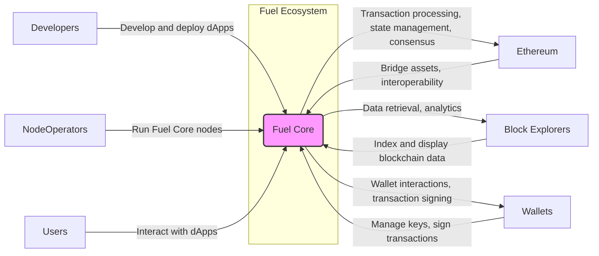
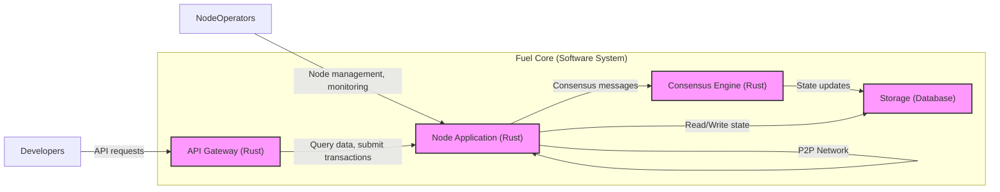
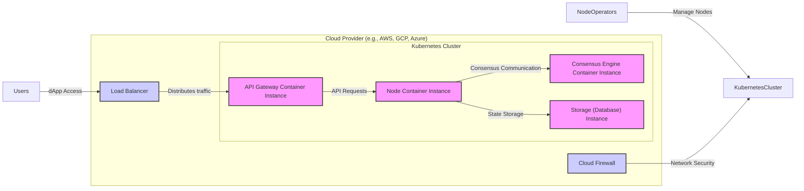
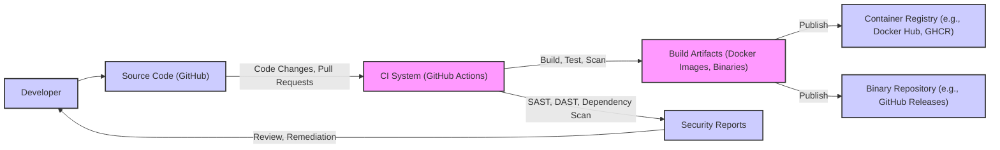

# BUSINESS POSTURE

This project, fuel-core, aims to provide a high-performance execution layer for blockchain technology. It focuses on speed, efficiency, and scalability, targeting developers and users who require fast and reliable decentralized applications.

*   Business priorities:
    *   High performance and low latency transaction processing.
    *   Robustness and reliability of the execution layer.
    *   Developer-friendly platform for building decentralized applications.
    *   Scalability to handle increasing transaction volumes.
    *   Security to protect user assets and maintain network integrity.
*   Business goals:
    *   Become a leading execution layer for blockchain ecosystems.
    *   Enable new classes of high-performance decentralized applications.
    *   Attract developers and users to the Fuel ecosystem.
    *   Foster innovation in the decentralized space.
*   Most important business risks:
    *   Security vulnerabilities in the core execution layer leading to loss of funds or network disruption.
    *   Performance bottlenecks hindering adoption and user experience.
    *   Lack of developer adoption due to complexity or insufficient tooling.
    *   Competition from other high-performance blockchain solutions.
    *   Regulatory uncertainty surrounding blockchain technology.

# SECURITY POSTURE

*   Existing security controls:
    *   security control: Code reviews are likely performed by the development team (Inferred from standard software development practices).
    *   security control: Unit and integration testing are likely implemented to ensure code correctness and identify bugs (Inferred from standard software development practices).
    *   security control: Fuzzing might be used to discover potential vulnerabilities (Inferred from security best practices for critical infrastructure).
    *   security control: Static analysis security tools might be integrated into the development process (Inferred from security best practices for software development).
    *   security control: Dependency scanning to identify vulnerabilities in third-party libraries (Inferred from supply chain security best practices).
*   Accepted risks:
    *   accepted risk: Potential vulnerabilities might exist due to the complexity of the codebase and rapid development cycles typical of blockchain projects.
    *   accepted risk: Reliance on community contributions might introduce security risks if contributions are not thoroughly vetted.
    *   accepted risk: Emerging attack vectors against new blockchain technologies might not be fully understood or mitigated.
*   Recommended security controls:
    *   security control: Implement formal security audits by reputable third-party security firms.
    *   security control: Establish a bug bounty program to incentivize external security researchers to find and report vulnerabilities.
    *   security control: Implement penetration testing to simulate real-world attacks and identify weaknesses in the system.
    *   security control: Enhance monitoring and logging capabilities to detect and respond to security incidents effectively.
    *   security control: Develop and implement an incident response plan to handle security breaches and vulnerabilities.
    *   security control: Secure software development lifecycle (SSDLC) should be formally defined and implemented.
*   Security requirements:
    *   Authentication:
        *   Requirement: Secure node-to-node authentication to prevent unauthorized nodes from joining the network.
        *   Requirement: Client authentication for API access to ensure only authorized users can interact with the node.
        *   Requirement: Consider mutual TLS for secure communication channels.
    *   Authorization:
        *   Requirement: Role-based access control (RBAC) for administrative functions to restrict access to sensitive operations.
        *   Requirement: Fine-grained authorization for transaction execution and data access based on user roles and permissions.
        *   Requirement: Policy enforcement to ensure adherence to network rules and security policies.
    *   Input validation:
        *   Requirement: Strict input validation for all external inputs, including transaction data, API requests, and network messages, to prevent injection attacks and other input-related vulnerabilities.
        *   Requirement: Input sanitization to neutralize potentially harmful data before processing.
        *   Requirement: Use of well-defined data schemas and protocols to enforce data integrity.
    *   Cryptography:
        *   Requirement: Use strong cryptographic algorithms and libraries for all security-sensitive operations, including transaction signing, data encryption, and secure communication.
        *   Requirement: Secure key management practices to protect private keys and prevent unauthorized access.
        *   Requirement: Implement cryptographic protocols to ensure data confidentiality, integrity, and authenticity.
        *   Requirement: Regular review and updates of cryptographic libraries and algorithms to address known vulnerabilities.

# DESIGN

## C4 CONTEXT

*   Context Diagram Elements:
    *   Element:
        *   Name: Fuel Core
        *   Type: Software System
        *   Description: The core execution layer of the Fuel blockchain, responsible for processing transactions, managing state, and participating in consensus.
        *   Responsibilities:
            *   Transaction processing and execution.
            *   State management and storage.
            *   Consensus mechanism participation.
            *   Network communication and peer management.
            *   API for client interactions.
        *   Security controls:
            *   Input validation on transaction data and API requests.
            *   Authentication and authorization for API access and node communication.
            *   Cryptography for transaction signing and secure communication.
            *   Consensus mechanism to ensure network integrity and prevent double-spending.
    *   Element:
        *   Name: Developers
        *   Type: Person
        *   Description: Software developers who build and deploy decentralized applications (dApps) on the Fuel platform.
        *   Responsibilities:
            *   Developing and deploying dApps using Fuel Core APIs and SDKs.
            *   Testing and debugging dApps.
            *   Interacting with the Fuel Core network through client libraries.
        *   Security controls:
            *   Secure development practices for dApp development.
            *   Input validation and output encoding in dApps to prevent vulnerabilities.
            *   Secure storage of API keys and credentials.
    *   Element:
        *   Name: Node Operators
        *   Type: Person
        *   Description: Individuals or organizations that run Fuel Core nodes to support the network and participate in consensus.
        *   Responsibilities:
            *   Running and maintaining Fuel Core nodes.
            *   Ensuring node availability and performance.
            *   Participating in the consensus process.
            *   Securing node infrastructure.
        *   Security controls:
            *   Secure node infrastructure and operating system hardening.
            *   Firewall configuration and network security.
            *   Regular security updates and patching.
            *   Secure key management for node identities.
    *   Element:
        *   Name: Users
        *   Type: Person
        *   Description: End-users who interact with decentralized applications built on Fuel.
        *   Responsibilities:
            *   Using dApps to access services and interact with the Fuel network.
            *   Managing their accounts and assets.
            *   Signing transactions using wallets.
        *   Security controls:
            *   Using secure wallets to manage private keys.
            *   Being aware of phishing and social engineering attacks.
            *   Practicing safe browsing habits.
    *   Element:
        *   Name: Ethereum
        *   Type: Software System
        *   Description: The Ethereum blockchain, which Fuel interacts with for bridging assets and interoperability.
        *   Responsibilities:
            *   Providing a bridge for transferring assets between Ethereum and Fuel.
            *   Enabling interoperability between the two blockchains.
        *   Security controls:
            *   Security of the bridge contract on Ethereum.
            *   Secure communication between Fuel Core and the Ethereum bridge.
            *   Monitoring of bridge transactions for anomalies.
    *   Element:
        *   Name: Block Explorers
        *   Type: Software System
        *   Description: Services that index and display blockchain data, allowing users to view transactions, blocks, and other network information.
        *   Responsibilities:
            *   Indexing and storing Fuel blockchain data.
            *   Providing APIs for accessing blockchain data.
            *   Displaying blockchain information in a user-friendly format.
        *   Security controls:
            *   Data integrity and accuracy of indexed blockchain data.
            *   Protection against data breaches and unauthorized access to blockchain data.
            *   Rate limiting and access controls for public APIs.
    *   Element:
        *   Name: Wallets
        *   Type: Software System
        *   Description: Software applications that allow users to manage their private keys, sign transactions, and interact with dApps.
        *   Responsibilities:
            *   Securely storing user private keys.
            *   Generating and signing transactions.
            *   Interacting with dApps and the Fuel network.
        *   Security controls:
            *   Secure key generation and storage.
            *   Protection against malware and phishing attacks.
            *   User authentication and authorization.
            *   Transaction confirmation and verification.

## C4 CONTAINER

*   Container Diagram Elements:
    *   Element:
        *   Name: Node Application
        *   Type: Container - Application
        *   Description: The core Fuel Core node application written in Rust. It handles P2P networking, transaction processing, and interacts with other containers.
        *   Responsibilities:
            *   P2P network management and communication.
            *   Transaction pool management.
            *   Transaction execution and state updates.
            *   Communication with the Consensus Engine and Storage.
            *   Exposing APIs for internal components.
        *   Security controls:
            *   Input validation for network messages and internal API calls.
            *   Rate limiting and denial-of-service (DoS) protection.
            *   Secure P2P communication protocols.
            *   Resource management to prevent resource exhaustion attacks.
    *   Element:
        *   Name: API Gateway
        *   Type: Container - Application
        *   Description: An API gateway written in Rust that provides external APIs for developers and clients to interact with the Fuel Core node.
        *   Responsibilities:
            *   Handling external API requests from developers and clients.
            *   Authentication and authorization of API requests.
            *   Rate limiting and request throttling.
            *   Routing requests to the Node Application.
            *   API documentation and versioning.
        *   Security controls:
            *   Authentication and authorization for API access.
            *   Input validation for API requests.
            *   Output encoding to prevent injection attacks.
            *   API security best practices (e.g., rate limiting, input validation, output encoding).
    *   Element:
        *   Name: Consensus Engine
        *   Type: Container - Application
        *   Description: The consensus engine responsible for block production and agreement on the state of the blockchain. Implemented in Rust.
        *   Responsibilities:
            *   Block proposal and validation.
            *   Consensus algorithm implementation (e.g., Proof-of-Stake, Proof-of-Authority).
            *   Communication with Node Application for state updates.
            *   Ensuring network agreement and finality.
        *   Security controls:
            *   Byzantine Fault Tolerance (BFT) consensus algorithm.
            *   Protection against consensus manipulation attacks.
            *   Secure communication between consensus participants.
            *   Robustness and fault tolerance of the consensus mechanism.
    *   Element:
        *   Name: Storage
        *   Type: Container - Database
        *   Description: A database system used to store the blockchain state, including accounts, balances, and smart contract data.
        *   Responsibilities:
            *   Persistent storage of blockchain state data.
            *   Efficient data retrieval and querying.
            *   Data integrity and consistency.
            *   Backup and recovery of blockchain data.
        *   Security controls:
            *   Access control to the database to restrict unauthorized access.
            *   Data encryption at rest and in transit.
            *   Database hardening and security configuration.
            *   Regular backups and disaster recovery plan.

## DEPLOYMENT

Deployment Solution: Cloud-based deployment using container orchestration (e.g., Kubernetes) for scalability and resilience.

*   Deployment Diagram Elements:
    *   Element:
        *   Name: Kubernetes Cluster
        *   Type: Infrastructure - Container Orchestration
        *   Description: A Kubernetes cluster deployed on a cloud provider to manage and orchestrate Fuel Core containers.
        *   Responsibilities:
            *   Container deployment and management.
            *   Service discovery and load balancing within the cluster.
            *   Scaling and auto-scaling of container instances.
            *   Health monitoring and self-healing of containers.
        *   Security controls:
            *   Kubernetes RBAC for access control to the cluster.
            *   Network policies to isolate containers and services.
            *   Secrets management for storing sensitive data.
            *   Regular security updates and patching of Kubernetes components.
    *   Element:
        *   Name: Node Container Instance
        *   Type: Infrastructure - Container
        *   Description: A container instance running the Fuel Core Node Application. Multiple instances can be deployed for redundancy and scalability.
        *   Responsibilities:
            *   Running the Fuel Core Node Application.
            *   Participating in the P2P network.
            *   Processing transactions and updating state.
        *   Security controls:
            *   Container image security scanning for vulnerabilities.
            *   Principle of least privilege for container runtime.
            *   Resource limits to prevent resource exhaustion.
            *   Regular container image updates.
    *   Element:
        *   Name: API Gateway Container Instance
        *   Type: Infrastructure - Container
        *   Description: A container instance running the API Gateway. Multiple instances can be deployed behind a load balancer for scalability and high availability.
        *   Responsibilities:
            *   Handling external API requests.
            *   Load balancing API traffic.
            *   API request authentication and authorization.
        *   Security controls:
            *   Container image security scanning.
            *   Web Application Firewall (WAF) to protect against web attacks.
            *   Rate limiting and request throttling.
            *   TLS/SSL encryption for API communication.
    *   Element:
        *   Name: Consensus Engine Container Instance
        *   Type: Infrastructure - Container
        *   Description: A container instance running the Consensus Engine. The number of instances depends on the chosen consensus mechanism and network requirements.
        *   Responsibilities:
            *   Running the Consensus Engine.
            *   Participating in block production and consensus.
            *   Maintaining network agreement.
        *   Security controls:
            *   Container image security scanning.
            *   Secure communication channels between consensus instances.
            *   Fault tolerance and redundancy.
    *   Element:
        *   Name: Storage (Database) Instance
        *   Type: Infrastructure - Database Instance
        *   Description: A managed database service provided by the cloud provider, used for storing the blockchain state.
        *   Responsibilities:
            *   Persistent storage of blockchain data.
            *   Database performance and availability.
            *   Data backups and recovery.
        *   Security controls:
            *   Database access control and authentication.
            *   Data encryption at rest and in transit.
            *   Database security hardening.
            *   Regular database backups.
    *   Element:
        *   Name: Load Balancer
        *   Type: Infrastructure - Load Balancer
        *   Description: A cloud load balancer distributing incoming traffic across multiple API Gateway instances.
        *   Responsibilities:
            *   Distributing API traffic.
            *   Ensuring high availability of the API Gateway.
            *   TLS termination.
        *   Security controls:
            *   DDoS protection.
            *   TLS/SSL encryption.
            *   Load balancer security configuration.
    *   Element:
        *   Name: Cloud Firewall
        *   Type: Infrastructure - Firewall
        *   Description: A cloud firewall protecting the Kubernetes cluster from external network threats.
        *   Responsibilities:
            *   Network traffic filtering.
            *   Blocking malicious traffic.
            *   Controlling access to the Kubernetes cluster.
        *   Security controls:
            *   Network access control lists (ACLs).
            *   Intrusion detection and prevention system (IDS/IPS).
            *   Firewall rule management and auditing.

## BUILD

*   Build Process Elements:
    *   Element:
        *   Name: Developer
        *   Type: Person
        *   Description: Software developers who write and contribute code to the fuel-core project.
        *   Responsibilities:
            *   Writing and testing code.
            *   Submitting code changes via pull requests.
            *   Reviewing and addressing security findings.
        *   Security controls:
            *   Secure coding practices.
            *   Code review participation.
            *   Security awareness training.
    *   Element:
        *   Name: Source Code (GitHub)
        *   Type: Software System - Source Code Repository
        *   Description: The GitHub repository hosting the fuel-core source code.
        *   Responsibilities:
            *   Version control of source code.
            *   Code collaboration and pull request management.
            *   Triggering CI pipelines on code changes.
        *   Security controls:
            *   Access control to the repository (authentication and authorization).
            *   Branch protection rules.
            *   Audit logging of repository activities.
    *   Element:
        *   Name: CI System (GitHub Actions)
        *   Type: Software System - CI/CD
        *   Description: GitHub Actions is used for continuous integration and continuous delivery. It automates the build, test, and security scanning processes.
        *   Responsibilities:
            *   Automated building of the project.
            *   Running unit and integration tests.
            *   Performing static analysis security testing (SAST).
            *   Performing dependency scanning.
            *   Building and publishing build artifacts (Docker images, binaries).
        *   Security controls:
            *   Secure CI/CD pipeline configuration.
            *   Secrets management for CI/CD credentials.
            *   SAST and dependency scanning tools integration.
            *   Code signing of build artifacts.
    *   Element:
        *   Name: Build Artifacts (Docker Images, Binaries)
        *   Type: Data - Software Artifacts
        *   Description: The output of the build process, including Docker images and binaries.
        *   Responsibilities:
            *   Packaging the software for deployment.
            *   Providing distributable artifacts.
        *   Security controls:
            *   Vulnerability scanning of Docker images.
            *   Code signing of binaries.
            *   Integrity checks of build artifacts.
    *   Element:
        *   Name: Container Registry (e.g., Docker Hub, GHCR)
        *   Type: Software System - Artifact Repository
        *   Description: A container registry used to store and distribute Docker images of fuel-core components.
        *   Responsibilities:
            *   Storing Docker images.
            *   Providing access to Docker images for deployment.
        *   Security controls:
            *   Access control to the container registry.
            *   Vulnerability scanning of stored images.
            *   Image signing and verification.
    *   Element:
        *   Name: Binary Repository (e.g., GitHub Releases)
        *   Type: Software System - Artifact Repository
        *   Description: A binary repository used to store and distribute binary releases of fuel-core.
        *   Responsibilities:
            *   Storing binary releases.
            *   Providing access to binaries for download.
        *   Security controls:
            *   Access control to the binary repository.
            *   Integrity checks of stored binaries (e.g., checksums).
            *   Signing of binaries.
    *   Element:
        *   Name: Security Reports
        *   Type: Data - Security Scan Reports
        *   Description: Reports generated by security scanning tools (SAST, dependency scanners) during the CI process.
        *   Responsibilities:
            *   Providing security vulnerability information.
            *   Enabling developers to remediate vulnerabilities.
        *   Security controls:
            *   Secure storage of security reports.
            *   Access control to security reports.
            *   Automated analysis and reporting of security findings.

# RISK ASSESSMENT

*   Critical business processes we are trying to protect:
    *   Transaction processing: Ensuring transactions are processed accurately, reliably, and without manipulation.
    *   Consensus mechanism: Maintaining network agreement and preventing forks or disruptions to the blockchain.
    *   State management: Protecting the integrity and consistency of the blockchain state, including accounts and balances.
    *   API availability: Ensuring the API gateway is available for developers and clients to interact with the network.
*   Data we are trying to protect and their sensitivity:
    *   Transaction data: Contains information about transfers of value and smart contract interactions. Sensitivity: Confidentiality and integrity are critical to prevent unauthorized transactions and manipulation of financial records.
    *   Blockchain state data: Includes account balances, smart contract code and data. Sensitivity: Integrity is paramount to maintain the correctness of the blockchain ledger and prevent financial losses. Confidentiality might be relevant for certain types of smart contract data.
    *   Private keys: Used to sign transactions and control access to accounts. Sensitivity: Extremely high. Loss or compromise of private keys can lead to complete loss of funds.
    *   Node configuration and operational data: Includes node settings, logs, and monitoring data. Sensitivity: Moderate. Can reveal information about network topology and potential vulnerabilities if exposed.

# QUESTIONS & ASSUMPTIONS

*   BUSINESS POSTURE:
    *   Question: What is the target market for fuel-core? Is it primarily focused on DeFi, gaming, or other specific use cases?
    *   Assumption: Fuel-core aims to be a general-purpose, high-performance execution layer applicable to a wide range of decentralized applications.
    *   Question: What is the expected transaction throughput and latency for fuel-core?
    *   Assumption: Fuel-core is designed for significantly higher throughput and lower latency compared to existing blockchain execution layers.
*   SECURITY POSTURE:
    *   Question: What specific security audits have been performed on fuel-core?
    *   Assumption: Security audits are planned or have been conducted, but details are not publicly available in the provided repository.
    *   Question: What is the incident response plan for fuel-core in case of a security breach?
    *   Assumption: An incident response plan is being developed or exists internally, but is not publicly documented.
    *   Question: What specific SAST/DAST tools and dependency scanning tools are used in the CI pipeline?
    *   Assumption: Standard industry-recognized tools are used, but the specific tools are not explicitly mentioned in the repository.
*   DESIGN:
    *   Question: What database system is used for the Storage container?
    *   Assumption: A scalable and reliable database system suitable for blockchain state storage is used (e.g., RocksDB, LevelDB, or a cloud-managed database).
    *   Question: What consensus algorithm is implemented in the Consensus Engine?
    *   Assumption: A modern, BFT-based consensus algorithm is used to ensure security and performance.
    *   Question: What P2P networking protocol is used for node communication?
    *   Assumption: A secure and efficient P2P protocol suitable for blockchain networks is used (e.g., libp2p).
    *   Question: What are the detailed API specifications for the API Gateway?
    *   Assumption: API documentation is available separately or will be provided as the project matures.