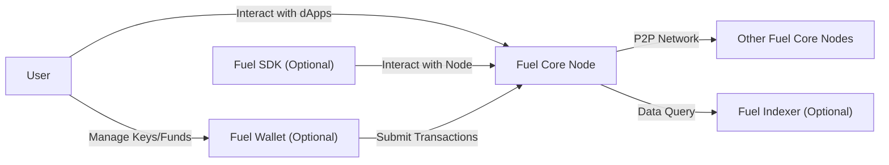
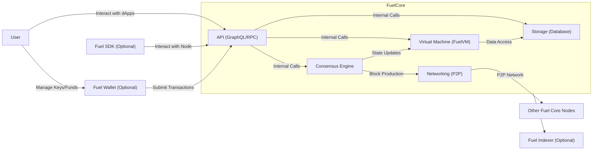
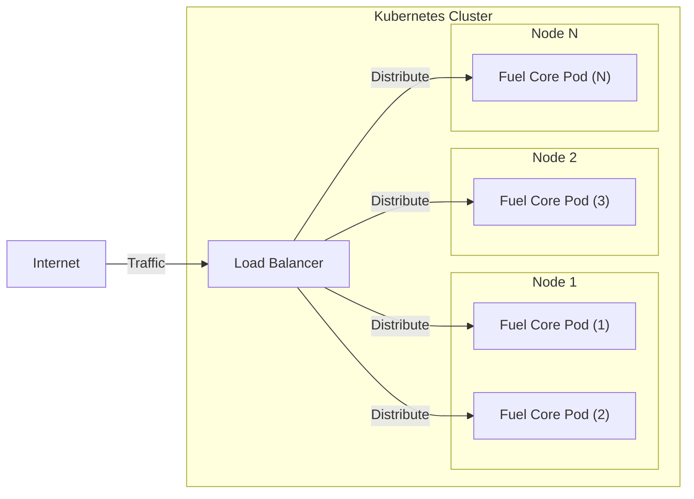
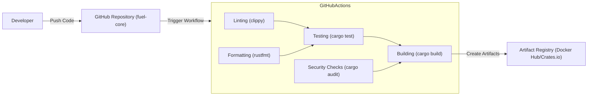

Okay, let's dive into designing a comprehensive project document for the Fuel-Core project, keeping security and threat modeling in mind.

# BUSINESS POSTURE

Fuel-Core is the core node implementation of the Fuel Network, a modular execution layer designed for high throughput and security. The primary business goal is to provide a fast, secure, and scalable blockchain infrastructure. This infrastructure aims to attract developers and users to build and interact with decentralized applications (dApps) on the Fuel Network.

Business Priorities:

*   High Transaction Throughput: The network must be able to process a significantly higher number of transactions per second compared to existing blockchains like Ethereum.
*   Security: The network must be resistant to attacks and ensure the integrity of transactions and user assets.
*   Scalability: The network must be able to handle increasing demand without compromising performance or security.
*   Developer Adoption: The network must be easy for developers to build on, with good tooling and documentation.
*   User Experience: The network must provide a smooth and user-friendly experience for end-users interacting with dApps.

Business Risks:

*   Smart Contract Vulnerabilities: Vulnerabilities in smart contracts deployed on the Fuel Network could lead to loss of funds or disruption of services.
*   Consensus Mechanism Failure: A failure in the consensus mechanism could lead to chain splits, double-spending, or network downtime.
*   Network Attacks: The network could be targeted by various attacks, such as denial-of-service (DoS) attacks, 51% attacks, or eclipse attacks.
*   Key Management Issues: Compromise of private keys could lead to unauthorized access to funds or control over network components.
*   Regulatory Uncertainty: The evolving regulatory landscape for cryptocurrencies could pose challenges to the project's long-term viability.
*   Competition: Other high-performance blockchains could compete for market share and developer adoption.

# SECURITY POSTURE

Existing Security Controls:

*   security control: Rust Programming Language: The use of Rust, a memory-safe language, helps prevent common vulnerabilities like buffer overflows and use-after-free errors. (Implemented in the codebase)
*   security control: Code Audits: Regular security audits of the codebase are conducted to identify and address potential vulnerabilities. (Described in project documentation and security reports)
*   security control: Testing: Extensive testing, including unit tests, integration tests, and fuzz tests, is performed to ensure the correctness and robustness of the code. (Implemented in the CI/CD pipeline)
*   security control: Formal Verification: Some parts of the codebase may be subject to formal verification to mathematically prove their correctness. (Mentioned in project documentation, specific implementation details may vary)
*   security control: Access Control: Access to critical infrastructure and resources is restricted based on the principle of least privilege. (Implemented in deployment and operational procedures)

Accepted Risks:

*   accepted risk: Complexity: The inherent complexity of blockchain technology introduces a larger attack surface and increases the risk of unforeseen vulnerabilities.
*   accepted risk: Emerging Technology: Fuel is a relatively new technology, and there may be undiscovered vulnerabilities or limitations.
*   accepted risk: Third-Party Dependencies: The project relies on external libraries and dependencies, which could introduce vulnerabilities.

Recommended Security Controls:

*   security control: Bug Bounty Program: Implement a bug bounty program to incentivize security researchers to find and report vulnerabilities.
*   security control: Threat Modeling: Conduct regular threat modeling exercises to identify and mitigate potential threats.
*   security control: Intrusion Detection System (IDS): Deploy an IDS to monitor network traffic and detect malicious activity.
*   security control: Incident Response Plan: Develop and maintain a comprehensive incident response plan to handle security incidents effectively.
*   security control: Supply Chain Security: Implement measures to secure the software supply chain, such as code signing and dependency verification.

Security Requirements:

*   Authentication:
    *   Users authenticate with the network using cryptographic key pairs.
    *   Nodes authenticate with each other using mutually authenticated TLS connections.
*   Authorization:
    *   Access to network resources is controlled based on roles and permissions.
    *   Smart contracts define their own authorization rules for interacting with their functions.
*   Input Validation:
    *   All inputs to the system, including transactions and smart contract calls, are rigorously validated to prevent malformed data from causing errors or vulnerabilities.
    *   Input validation is performed at multiple layers, including the network layer, the consensus layer, and the smart contract execution layer.
*   Cryptography:
    *   Strong cryptographic algorithms are used for hashing, encryption, and digital signatures.
    *   Key management practices follow industry best practices.

# DESIGN

## C4 CONTEXT

Element Descriptions:

*   Element:
    *   Name: User
    *   Type: Person
    *   Description: Represents an end-user interacting with decentralized applications (dApps) on the Fuel Network.
    *   Responsibilities: Interacting with dApps, managing keys and funds, submitting transactions.
    *   Security controls: Key management best practices, secure wallet software.

*   Element:
    *   Name: Fuel Core Node
    *   Type: Software System
    *   Description: The core node implementation of the Fuel Network.
    *   Responsibilities: Processing transactions, validating blocks, participating in consensus, storing blockchain data.
    *   Security controls: Rust programming language, code audits, testing, access control.

*   Element:
    *   Name: Other Fuel Core Nodes
    *   Type: Software System
    *   Description: Other instances of the Fuel Core Node software.
    *   Responsibilities: Same as Fuel Core Node.
    *   Security controls: Same as Fuel Core Node.

*   Element:
    *   Name: Fuel Indexer (Optional)
    *   Type: Software System
    *   Description: An optional service that indexes blockchain data for faster querying.
    *   Responsibilities: Indexing blockchain data, providing query APIs.
    *   Security controls: Access control, input validation.

*   Element:
    *   Name: Fuel Wallet (Optional)
    *   Type: Software System
    *   Description: A software application that allows users to manage their keys and funds.
    *   Responsibilities: Generating keys, storing private keys securely, signing transactions.
    *   Security controls: Secure key storage, strong encryption, multi-factor authentication (optional).

*   Element:
    *   Name: Fuel SDK (Optional)
    *   Type: Software Library
    *   Description: A software development kit that provides tools and libraries for building dApps on the Fuel Network.
    *   Responsibilities: Providing APIs for interacting with the Fuel Core Node, simplifying dApp development.
    *   Security controls: Secure coding practices, regular updates.

## C4 CONTAINER

Element Descriptions:

*   Element:
    *   Name: Networking (P2P)
    *   Type: Container
    *   Description: Handles peer-to-peer communication with other Fuel Core Nodes.
    *   Responsibilities: Discovering peers, exchanging blocks and transactions, maintaining network connectivity.
    *   Security controls: TLS encryption, peer authentication, DoS protection.

*   Element:
    *   Name: Consensus Engine
    *   Type: Container
    *   Description: Implements the consensus algorithm for the Fuel Network.
    *   Responsibilities: Validating blocks, reaching consensus on the state of the blockchain, preventing double-spending.
    *   Security controls: Robust consensus algorithm, Byzantine fault tolerance.

*   Element:
    *   Name: Virtual Machine (FuelVM)
    *   Type: Container
    *   Description: Executes smart contracts on the Fuel Network.
    *   Responsibilities: Running smart contract code, managing state transitions, ensuring deterministic execution.
    *   Security controls: Sandboxing, resource limits, gas metering.

*   Element:
    *   Name: Storage (Database)
    *   Type: Container
    *   Description: Stores the blockchain data.
    *   Responsibilities: Persisting blocks, transactions, and state data, providing efficient data access.
    *   Security controls: Data integrity checks, access control.

*   Element:
    *   Name: API (GraphQL/RPC)
    *   Type: Container
    *   Description: Provides an interface for external clients to interact with the Fuel Core Node.
    *   Responsibilities: Handling API requests, validating inputs, returning data.
    *   Security controls: Input validation, rate limiting, authentication (optional).

## DEPLOYMENT

Possible Deployment Solutions:

1.  Manual Deployment: Manually compiling and running the Fuel Core Node software on a server.
2.  Docker Containerization: Packaging the Fuel Core Node software into a Docker container for easier deployment and management.
3.  Kubernetes Orchestration: Deploying multiple Fuel Core Nodes using Kubernetes for high availability and scalability.
4.  Cloud Provider Services: Utilizing managed blockchain services offered by cloud providers like AWS, Azure, or GCP.

Chosen Solution (Kubernetes Orchestration):

Element Descriptions:

*   Element:
    *   Name: Kubernetes Cluster
    *   Type: Infrastructure
    *   Description: A cluster of machines managed by Kubernetes.
    *   Responsibilities: Orchestrating the deployment and management of Fuel Core Nodes.
    *   Security controls: Network policies, role-based access control (RBAC), pod security policies.

*   Element:
    *   Name: Node 1, Node 2, Node N
    *   Type: Infrastructure
    *   Description: Physical or virtual machines within the Kubernetes cluster.
    *   Responsibilities: Running Fuel Core Pods.
    *   Security controls: Operating system hardening, firewall rules.

*   Element:
    *   Name: Fuel Core Pod (1, 2, 3, N)
    *   Type: Container Instance
    *   Description: Instances of the Fuel Core Node software running within Docker containers.
    *   Responsibilities: Same as Fuel Core Node.
    *   Security controls: Same as Fuel Core Node, container image security scanning.

*   Element:
    *   Name: Load Balancer
    *   Type: Infrastructure
    *   Description: Distributes incoming traffic across multiple Fuel Core Pods.
    *   Responsibilities: Ensuring high availability and fault tolerance.
    *   Security controls: SSL termination, DDoS protection.
* Element:
    *   Name: Internet
    *   Type: Infrastructure
    *   Description: External network.
    *   Responsibilities: Provides access to Fuel network.
    *   Security controls: Firewall.

## BUILD

The Fuel Core project utilizes a robust build process centered around Rust's `cargo` build system and integrated with GitHub Actions for continuous integration and continuous delivery (CI/CD).

Build Process Description:

1.  Developer pushes code changes to the `fuel-core` GitHub repository.
2.  GitHub Actions automatically triggers a workflow based on the defined configuration.
3.  The workflow performs the following steps:
    *   Linting: Uses `clippy` to check for code style and potential errors.
    *   Formatting: Uses `rustfmt` to ensure consistent code formatting.
    *   Testing: Runs unit tests, integration tests, and other tests using `cargo test`.
    *   Building: Compiles the code using `cargo build`, creating the Fuel Core Node executable.
    *   Security Checks: Performs security checks using tools like `cargo audit` to identify vulnerabilities in dependencies.
4.  If all steps are successful, the build artifacts (e.g., the Fuel Core Node executable, Docker images) are created and published to an artifact registry (e.g., Docker Hub, Crates.io).

Security Controls:

*   security control: Automated Build Process: GitHub Actions ensures a consistent and automated build process, reducing the risk of manual errors.
*   security control: Linting and Formatting: `clippy` and `rustfmt` help maintain code quality and prevent common coding mistakes.
*   security control: Automated Testing: Extensive testing helps identify bugs and vulnerabilities early in the development cycle.
*   security control: Dependency Security Checks: `cargo audit` helps identify and mitigate vulnerabilities in project dependencies.
*   security control: Code Signing (Optional): Build artifacts can be digitally signed to ensure their integrity and authenticity.

# RISK ASSESSMENT

Critical Business Processes:

*   Transaction Processing: Ensuring that transactions are processed quickly, securely, and reliably.
*   Consensus: Maintaining the integrity and stability of the blockchain through a robust consensus mechanism.
*   Smart Contract Execution: Providing a secure and reliable environment for executing smart contracts.
*   Network Security: Protecting the network from attacks and ensuring the availability of services.

Data Sensitivity:

*   Transaction Data: Contains information about transactions, including sender, receiver, amount, and potentially other metadata. Sensitivity: Medium (publicly visible on the blockchain, but privacy-preserving techniques may be used).
*   Private Keys: Used to authorize transactions and access funds. Sensitivity: Extremely High (compromise leads to loss of funds).
*   Blockchain State: Represents the current state of the network, including account balances and smart contract data. Sensitivity: High (corruption or loss of data could disrupt the network).
*   Node Configuration Data: Contains settings and parameters for configuring the Fuel Core Node. Sensitivity: Medium (compromise could lead to misconfiguration or denial of service).

# QUESTIONS & ASSUMPTIONS

Questions:

*   What specific consensus algorithm is used by Fuel Core, and what are its security properties?
*   What are the specific gas limits and resource constraints for smart contract execution on FuelVM?
*   What are the plans for handling future upgrades and hard forks of the Fuel Network?
*   What are the specific monitoring and alerting mechanisms in place for detecting and responding to security incidents?
*   What is the process for onboarding new validators or nodes to the network?
*   What level of decentralization is targeted for the network?
*   Are there any plans for implementing privacy-enhancing technologies on the Fuel Network?

Assumptions:

*   BUSINESS POSTURE: The project prioritizes security and scalability over other factors.
*   BUSINESS POSTURE: The project has a long-term vision and is committed to ongoing development and maintenance.
*   SECURITY POSTURE: The development team follows secure coding practices and is responsive to security reports.
*   SECURITY POSTURE: The project will undergo regular security audits by reputable third-party firms.
*   DESIGN: The Fuel Network will operate as a permissionless, decentralized network.
*   DESIGN: The Fuel Core Node software will be open-source and available for public review.
*   DESIGN: The project will provide adequate documentation and support for developers and users.
*   DESIGN: The deployment will use Kubernetes.
*   DESIGN: The build system will use GitHub Actions.