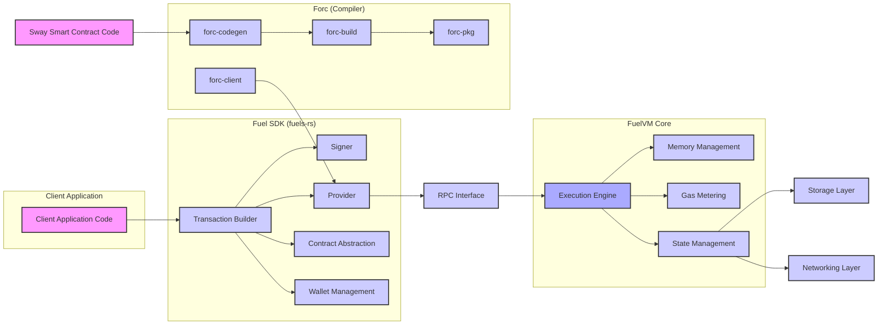
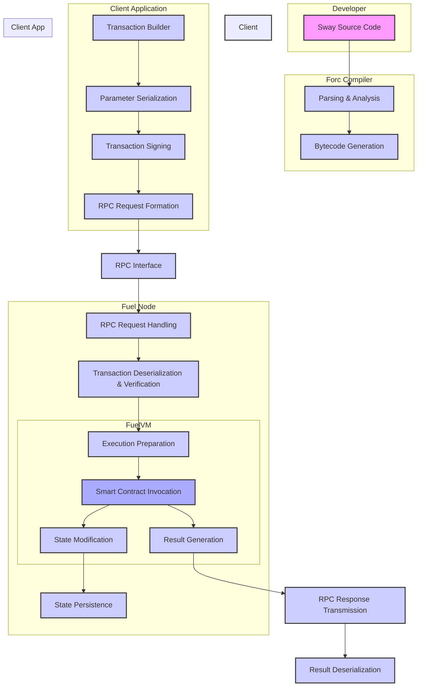

## Project Design Document: Fuels-rs (Improved)

**1. Introduction**

This document provides an enhanced and more detailed design overview of the Fuels-rs project, a Rust implementation of the Fuel Virtual Machine (FuelVM) and its associated tooling. This document is specifically tailored to serve as a robust foundation for subsequent threat modeling activities. It meticulously outlines the key components, their intricate interactions, and the comprehensive architecture of the system, with a strong focus on security-relevant aspects.

**1.1. Purpose**

The primary purpose of this document is to furnish a highly detailed and unambiguous description of the Fuels-rs project's design. This level of detail is crucial for enabling security professionals and developers to thoroughly understand the system's architecture, data flow pathways, and potential attack surfaces. This deep understanding is essential for conducting effective and comprehensive threat modeling and security analysis.

**1.2. Scope**

This document encompasses the core components of the Fuels-rs project with a greater level of granularity, including:

*   The FuelVM implementation, detailing key sub-modules.
*   The Software Development Kit (SDK) for interacting with the FuelVM, including its internal structure.
*   The `forc` toolchain (compiler, build tools, package manager), with a focus on its security-relevant operations.
*   The Rust implementation of the Fuel client, outlining its communication mechanisms.
*   Key data structures and communication protocols, with specific attention to their security properties.

This document explicitly excludes:

*   The specifics of individual smart contracts written for the FuelVM.
*   Fine-grained implementation details within specific modules that are not directly relevant to security architecture.
*   The broader Fuel ecosystem beyond the immediate scope of the `fuels-rs` repository.

**1.3. Target Audience**

This document is primarily intended for:

*   Security engineers and architects tasked with performing detailed threat modeling, security assessments, and penetration testing.
*   Developers actively contributing to the Fuels-rs project, requiring a deep understanding of the system's security architecture.
*   Auditors and researchers seeking a comprehensive understanding of the Fuels-rs architecture and its security implications.

**2. System Overview**

Fuels-rs provides the fundamental building blocks for interacting with the Fuel blockchain. It encompasses the core execution environment (FuelVM), essential tools for compiling smart contracts written in the Sway language (`forc`), and comprehensive libraries for constructing client applications capable of interacting with the blockchain.

The core objectives of Fuels-rs are:

*   **High Performance:** To deliver a highly performant execution environment optimized for smart contract execution.
*   **Robust Security:** To implement strong security measures safeguarding the integrity of the blockchain and the secure execution of smart contracts.
*   **Developer Usability:** To offer a user-friendly SDK and intuitive tooling that simplifies the process of building and deploying applications on the Fuel platform.

**3. Architectural Design**

The Fuels-rs project is logically structured into the following key components, with a more detailed breakdown:

*   **FuelVM Core:** The central execution engine, further divisible into:
    *   **Execution Engine:** Responsible for interpreting and executing bytecode.
    *   **Memory Management:** Handles memory allocation and deallocation for smart contracts.
    *   **Gas Metering:** Enforces gas limits and tracks resource consumption.
    *   **State Management:** Manages the VM's internal state during execution.
*   **Forc (Fuel Orchestrator):** The command-line toolchain, comprising:
    *   **Compiler (`forc-codegen`):** Translates Sway code into FuelVM bytecode, including optimization passes.
    *   **Build System (`forc-build`):** Manages the compilation process, including dependency resolution and linking.
    *   **Package Manager (`forc-pkg`):** Handles fetching, managing, and verifying smart contract dependencies.
    *   **Interaction Interface (`forc-client`):** Provides commands for interacting with Fuel networks (e.g., deploying contracts, sending transactions).
*   **Fuel SDK (fuels-rs):** The Rust library for client interaction, including:
    *   **Transaction Builder:** Constructs transaction objects with specified parameters.
    *   **Signer:** Handles transaction signing using provided private keys.
    *   **Provider:** Manages communication with Fuel nodes via the RPC interface.
    *   **Contract Abstraction:** Provides a higher-level interface for interacting with deployed smart contracts.
    *   **Wallet Management:** Facilitates the management of cryptographic keys and addresses.
*   **RPC Interface:** The communication layer, typically using:
    *   **gRPC Server (within Fuel Node):**  Handles incoming requests from clients.
    *   **Protocol Buffers:** Defines the structure of messages exchanged over the RPC interface.
*   **Storage Layer:** The mechanism for persistent storage:
    *   **Database (e.g., RocksDB):** Stores blockchain state, including accounts, contracts, and storage.
    *   **Merkle Tree Implementation:** Used for efficient state commitment and verification.
*   **Networking Layer:** Handles inter-node communication:
    *   **Peer-to-Peer Protocol:** Manages connections and communication between Fuel nodes.
    *   **Transaction Propagation Mechanism:** Ensures transactions are broadcasted across the network.
    *   **Block Synchronization Protocol:** Enables nodes to stay synchronized with the latest blockchain state.

**3.1. Component Descriptions (Detailed)**

*   **FuelVM Core:**
    *   **Execution Engine:** Interprets FuelVM bytecode, executing instructions within a sandboxed environment. Potential threats include bytecode vulnerabilities leading to unexpected behavior or resource exhaustion.
    *   **Memory Management:** Allocates and manages memory for smart contract execution. Vulnerabilities here could lead to memory corruption or information leaks.
    *   **Gas Metering:** Tracks and enforces gas limits to prevent denial-of-service attacks. Incorrect metering could lead to either DoS or unexpected transaction failures.
    *   **State Management:** Manages the VM's internal state, including registers and stack. Improper state management could lead to inconsistencies or security breaches.

*   **Forc (Fuel Orchestrator):**
    *   **Compiler (`forc-codegen`):** Translates Sway code to bytecode. Compiler vulnerabilities could introduce malicious code into compiled contracts.
    *   **Build System (`forc-build`):** Manages the build process. Supply chain attacks targeting build dependencies are a potential threat.
    *   **Package Manager (`forc-pkg`):** Handles external dependencies. Security risks include dependency confusion and malicious packages.
    *   **Interaction Interface (`forc-client`):** Allows interaction with Fuel networks. Improper input validation could lead to vulnerabilities.

*   **Fuel SDK (fuels-rs):**
    *   **Transaction Builder:** Constructs transactions. Vulnerabilities could allow for the creation of malformed or invalid transactions.
    *   **Signer:** Signs transactions using private keys. Secure key management within the SDK is critical.
    *   **Provider:** Communicates with Fuel nodes. Vulnerabilities in the provider could expose client applications to attacks.
    *   **Contract Abstraction:** Simplifies interaction with contracts. Incorrectly implemented abstractions could introduce vulnerabilities.
    *   **Wallet Management:** Manages private keys. Secure storage and handling of keys are paramount.

*   **RPC Interface:**
    *   **gRPC Server:** Handles client requests. Vulnerabilities in the gRPC implementation or exposed endpoints could be exploited.
    *   **Protocol Buffers:** Defines message structures. Improperly defined messages could lead to parsing vulnerabilities.

*   **Storage Layer:**
    *   **Database (e.g., RocksDB):** Stores blockchain data. Security threats include unauthorized access and data corruption.
    *   **Merkle Tree Implementation:** Provides data integrity. Vulnerabilities in the implementation could compromise the integrity of the blockchain state.

*   **Networking Layer:**
    *   **Peer-to-Peer Protocol:** Manages network communication. Vulnerabilities could lead to network partitioning or Sybil attacks.
    *   **Transaction Propagation Mechanism:** Broadcasts transactions. Security concerns include transaction censorship or manipulation.
    *   **Block Synchronization Protocol:** Ensures nodes are synchronized. Attacks could aim to disrupt synchronization or introduce invalid blocks.

**4. Data Flow (Detailed)**

A more granular view of a typical interaction with the Fuels-rs system reveals the following data flow:

1. **Smart Contract Development:** A developer authors a smart contract in the Sway language, creating source code files.
2. **Compilation Initiation:** The developer invokes the `forc` compiler, specifying the Sway source code.
3. **Parsing and Semantic Analysis:** The `forc` compiler parses the Sway code and performs semantic analysis to ensure correctness.
4. **Bytecode Generation:** The compiler generates FuelVM bytecode representing the smart contract logic.
5. **Client Application Development:** A developer creates a client application, incorporating the `fuels-rs` SDK.
6. **Transaction Construction:** The client application utilizes the SDK's transaction builder to create a transaction object, specifying the target contract, function selector, and input parameters.
7. **Parameter Serialization:** The SDK serializes the transaction parameters into a format suitable for transmission.
8. **Transaction Signing:** The SDK's signer uses the client's private key to generate a digital signature for the transaction.
9. **RPC Request Formation:** The SDK's provider constructs an RPC request containing the signed transaction data.
10. **Transaction Submission via RPC:** The client application sends the RPC request to a Fuel node.
11. **RPC Request Handling:** The Fuel node's RPC interface receives and processes the request.
12. **Transaction Deserialization and Verification:** The Fuel node deserializes the transaction and verifies the signature.
13. **Transaction Execution Preparation:** The FuelVM prepares for execution, allocating resources and setting up the execution environment.
14. **Smart Contract Invocation:** The FuelVM executes the target smart contract's bytecode.
15. **State Modification:** The smart contract's execution may result in modifications to the blockchain state, such as updating account balances or contract storage.
16. **State Persistence:** The Fuel node's storage layer persists the updated blockchain state.
17. **Transaction Result Generation:** The FuelVM generates a result indicating the outcome of the transaction execution.
18. **RPC Response Transmission:** The Fuel node sends an RPC response back to the client application, including the transaction result.
19. **Result Deserialization:** The client application's SDK deserializes the RPC response.

**5. Security Considerations (Expanded)**

The security of the Fuels-rs project hinges on addressing potential vulnerabilities across all its components:

*   **Smart Contract Security:**
    *   **Reentrancy Attacks:** Ensure the FuelVM prevents or mitigates reentrancy vulnerabilities in smart contracts.
    *   **Integer Overflow/Underflow:** The VM must handle arithmetic operations securely to prevent overflows or underflows.
    *   **Gas Limit Exploitation:** Prevent malicious contracts from consuming excessive gas to cause denial of service.
    *   **Code Injection:** The VM must prevent any possibility of injecting malicious code during execution.

*   **Transaction Integrity:**
    *   **Signature Forgery:** Robust cryptographic signatures are essential to prevent transaction forgery.
    *   **Transaction Replay:** Mechanisms to prevent the replay of valid transactions are necessary.
    *   **Transaction Malleability:** Transactions should be resistant to malleability attacks where the transaction hash is altered without invalidating the signature.

*   **Access Control:**
    *   **RPC Endpoint Security:** Secure access to RPC endpoints to prevent unauthorized access to blockchain data or functionality.
    *   **Smart Contract Permissions:** Implement a robust permission system for smart contracts to control access to resources and data.
    *   **Node Access Control:** Restrict access to Fuel nodes to authorized entities.

*   **Network Security:**
    *   **Eavesdropping:** Encrypt network communication between nodes and between clients and nodes.
    *   **Man-in-the-Middle Attacks:** Implement authentication and integrity checks to prevent MITM attacks.
    *   **Sybil Attacks:** Implement mechanisms to mitigate Sybil attacks where a single attacker controls multiple nodes.
    *   **Denial of Service (DoS):** Protect the network layer from DoS attacks targeting node communication.

*   **Cryptography:**
    *   **Algorithm Strength:** Utilize strong and well-vetted cryptographic algorithms.
    *   **Key Management Security:** Implement secure key generation, storage, and handling practices.
    *   **Random Number Generation:** Ensure the use of cryptographically secure random number generators.

*   **Dependency Management:**
    *   **Vulnerability Scanning:** Regularly scan dependencies for known vulnerabilities.
    *   **Supply Chain Security:** Implement measures to verify the integrity and authenticity of dependencies.
    *   **Dependency Pinning:** Pin dependency versions to prevent unexpected changes.

*   **Input Validation:**
    *   **SDK Input Validation:** Validate inputs within the SDK to prevent malformed requests.
    *   **RPC Input Validation:** Thoroughly validate all data received via the RPC interface.
    *   **FuelVM Input Validation:** Validate inputs to smart contracts to prevent unexpected behavior.

*   **Denial of Service (DoS) Prevention:**
    *   **Rate Limiting:** Implement rate limiting on RPC endpoints and other critical components.
    *   **Resource Limits:** Enforce resource limits on smart contract execution and other operations.
    *   **Network-Level DoS Protection:** Employ network-level defenses against DoS attacks.

*   **Key Management:**
    *   **Secure Key Generation:** Use secure methods for generating cryptographic keys.
    *   **Secure Key Storage:** Store private keys securely, potentially using hardware security modules or secure enclaves.
    *   **Key Rotation:** Implement key rotation policies to reduce the impact of compromised keys.

**6. Dependencies (Detailed)**

The Fuels-rs project relies on a range of external libraries and components, categorized by their function:

*   **Core Rust Libraries:**
    *   `std`: The Rust standard library providing fundamental data structures and functionalities.
    *   `core`, `alloc`, `collections`: Core Rust libraries for low-level operations, memory allocation, and collections.

*   **Cryptography Libraries:**
    *   `ring`: Provides low-level cryptographic primitives.
    *   `k256`: Implements the secp256k1 elliptic curve used in криптография.
    *   `sha2`: Implements SHA-2 hashing algorithms.
    *   `rand`: Provides random number generation capabilities.

*   **Networking and Communication Libraries:**
    *   `tokio`: An asynchronous runtime for building network applications.
    *   `tonic`: A gRPC implementation for building RPC services.
    *   `prost`: A Protocol Buffers implementation for Rust.
    *   `libp2p`: A modular networking stack for building peer-to-peer applications.

*   **Serialization and Deserialization Libraries:**
    *   `serde`: A framework for serializing and deserializing data structures.
    *   `bincode`: A binary serialization format.

*   **Data Storage Libraries:**
    *   `rocksdb`: An embedded key-value store.

*   **Utility and Other Libraries:**
    *   `anyhow`, `thiserror`: Libraries for error handling.
    *   `tracing`: A framework for application-level tracing.
    *   `clap`: A library for parsing command-line arguments.

**7. Deployment Considerations (Expanded)**

Deploying Fuels-rs components requires careful consideration of security implications for different deployment scenarios:

*   **Fuel Nodes (Full Nodes, Validators):**
    *   **Bare Metal/Virtual Machines:** Requires careful OS hardening, firewall configuration, and secure key management practices.
    *   **Containerized Environments (Docker, Kubernetes):**  Focus on secure container image builds, network policies, and secrets management.
    *   **Cloud Environments (AWS, Azure, GCP):** Leverage cloud-specific security features like security groups, IAM roles, and managed key vaults.

*   **Forc (Developer Tool):**
    *   **Local Installation:** Ensure the tool is downloaded from trusted sources and regularly updated.
    *   **CI/CD Pipelines:** Secure the CI/CD environment to prevent tampering with the build process.

*   **Fuel SDK (Integrated into Client Applications):**
    *   **Desktop Applications:** Secure storage of private keys within the application.
    *   **Web Applications:** Secure handling of private keys on the client-side or secure backend integration.
    *   **Mobile Applications:** Utilize secure storage mechanisms provided by the mobile OS.

Security best practices during deployment include:

*   **Principle of Least Privilege:** Grant only necessary permissions to users and processes.
*   **Regular Security Audits:** Conduct periodic security audits of deployed infrastructure and applications.
*   **Intrusion Detection and Prevention Systems (IDPS):** Implement IDPS to detect and respond to malicious activity.
*   **Security Monitoring and Logging:** Enable comprehensive security monitoring and logging to track events and identify potential incidents.

**8. Future Considerations (Expanded)**

Ongoing development and future enhancements to Fuels-rs may introduce new security considerations:

*   **Formal Verification of FuelVM:** Applying formal methods to verify the correctness and security of the FuelVM implementation.
*   **Advanced Cryptographic Primitives:** Integrating new cryptographic techniques like zero-knowledge proofs or homomorphic encryption.
*   **Hardware Wallet Integration:** Enhancing support for hardware wallets for improved key security.
*   **Decentralized Identity Solutions:** Integrating with decentralized identity systems for enhanced authentication and authorization.
*   **Improved Monitoring and Auditing Tools:** Developing more sophisticated tools for monitoring network activity, transaction flow, and potential security breaches.
*   **Smart Contract Security Auditing Tools:** Creating tools to assist developers in identifying potential vulnerabilities in their Sway smart contracts.

This enhanced document provides a more in-depth understanding of the Fuels-rs project's design, offering a stronger foundation for comprehensive threat modeling and security analysis. The added detail in component descriptions, data flow, and security considerations aims to facilitate a more thorough assessment of potential risks and vulnerabilities.