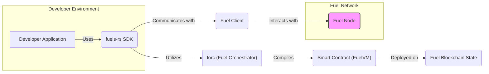

## Project Design Document: fuels-rs

**Version:** 1.1
**Date:** October 26, 2023
**Prepared By:** AI Software Architect

### 1. Introduction

This document provides a detailed design overview of the `fuels-rs` project, a robust Rust SDK designed to facilitate seamless interaction with the Fuel blockchain. This document outlines the project's architecture, dissects its key components, and meticulously maps the data flow within the system. The primary purpose of this document is to serve as a comprehensive resource for subsequent threat modeling exercises.

### 2. Goals and Objectives

The core objectives driving the development of the `fuels-rs` project are:

* **Developer Empowerment:** To provide Rust developers with an intuitive and powerful library for building applications on the Fuel blockchain.
* **Abstraction of Complexity:** To shield developers from the intricate details of interacting with the Fuel network, focusing on ease of use and developer experience. This includes managing transaction construction, signing, and broadcasting.
* **Smart Contract Interaction:** To offer a complete toolkit for interacting with smart contracts deployed on the Fuel network. This encompasses ABI generation from contract definitions and the creation of strongly-typed contract instances within Rust code.
* **dApp Development Catalyst:** To accelerate the development of decentralized applications (dApps) on the Fuel network, leveraging the safety and performance of the Rust programming language.
* **Performance and Efficiency:** To ensure high performance and minimal overhead when interacting with the Fuel blockchain, crucial for responsive dApps.

### 3. System Architecture

The `fuels-rs` project is structured into distinct layers and components that work in concert. The following diagram illustrates the high-level architecture, highlighting the key interactions:



**Detailed Breakdown of Architectural Layers and Components:**

* **Developer Application:** This represents the software built by developers utilizing the `fuels-rs` SDK. This could range from simple command-line tools to sophisticated web applications that leverage the Fuel blockchain's capabilities.
* **fuels-rs SDK:** This is the central Rust library that provides the API and functionalities for interacting with the Fuel network. Its responsibilities include:
    * **Transaction Management:** Creating, signing, and broadcasting transactions to the Fuel network.
    * **Account Abstraction:** Managing user accounts, including key generation, secure storage (potentially through integrations), and address derivation.
    * **Smart Contract Interaction:** Providing mechanisms to interact with deployed smart contracts, including function calls, state reads, and event subscriptions.
    * **Event Handling:**  Facilitating the consumption of events emitted by smart contracts.
    * **Data Handling:**  Serializing and deserializing data to and from the formats required by the Fuel network and smart contracts.
* **Fuel Client:**  A module within the `fuels-rs` SDK responsible for low-level communication with a Fuel Node. Its key functions are:
    * **Request Handling:** Packaging and sending requests to the Fuel Node's API (e.g., submitting transactions, querying account balances, fetching block data).
    * **Response Processing:** Receiving and parsing responses from the Fuel Node.
    * **Connection Management:** Establishing and maintaining network connections with Fuel Nodes.
* **Fuel Node:** A single instance within the distributed Fuel Network responsible for:
    * **Transaction Processing:** Validating and executing transactions.
    * **State Management:** Maintaining the current state of the Fuel blockchain.
    * **Consensus Participation:** Participating in the consensus mechanism to agree on the order of transactions.
    * **API Provision:** Offering an API for clients like `fuels-rs` to interact with the network.
* **Fuel Network:** The decentralized and permissionless network composed of multiple Fuel Nodes that collectively maintain the integrity and availability of the Fuel blockchain.
* **Smart Contract (FuelVM):** Programs written in the Sway programming language that are compiled and deployed onto the Fuel blockchain. These contracts define the business logic and state of decentralized applications. They execute within the Fuel Virtual Machine (FuelVM).
* **Fuel Blockchain State:** The persistent and immutable record of the Fuel blockchain, containing information about accounts, deployed contracts, transaction history, and other relevant data.
* **forc (Fuel Orchestrator):** A separate command-line interface (CLI) tool, typically used alongside `fuels-rs`, that provides essential development functionalities:
    * **Smart Contract Compilation:** Compiling Sway smart contract code into bytecode that can be executed on the FuelVM.
    * **ABI Generation:** Generating Application Binary Interface (ABI) files from Sway contract definitions, which are crucial for `fuels-rs` to interact with the contracts.
    * **Contract Deployment:** Facilitating the deployment of compiled smart contracts to the Fuel network.

### 4. Key Components Breakdown

This section delves deeper into the functionalities of the core modules within the `fuels-rs` SDK.

* **`core` Module:**
    * Provides foundational data structures and utility functions essential for interacting with the Fuel blockchain.
        * `Address`: Represents Fuel account addresses.
        * `Transaction`: Defines the structure for creating and manipulating transactions, including inputs, outputs, and scripts.
        * `Signature`: Handles the creation and verification of cryptographic signatures for transactions.
        * `Block`: Represents a block in the Fuel blockchain, containing transaction data and metadata.
        * Cryptographic Primitives: Implements or wraps cryptographic functions needed for key generation, signing, and verification.
* **`client` Module:**
    * Manages the communication layer between the SDK and Fuel Nodes.
        * Transaction Submission: Functions for sending signed transactions to the Fuel network.
        * State Querying: Methods for retrieving information about accounts (balances, nonces), blocks, and transaction status.
        * Event Subscription: Enables subscribing to and receiving real-time events emitted by smart contracts.
        * Network Configuration: Allows users to configure the target Fuel Node's endpoint and other network settings.
* **`contract` Module:**
    * Provides a high-level interface for interacting with deployed smart contracts.
        * ABI Loading: Functionality to load contract ABIs, typically generated by `forc`.
        * Contract Instance Creation: Allows developers to create Rust objects representing deployed contracts, providing type-safe access to contract functions.
        * Function Call Encoding and Decoding: Handles the serialization of function arguments and the deserialization of return values based on the contract's ABI.
        * Contract Method Invocation: Provides methods to call functions on deployed contracts.
        * Contract State Reading: Enables reading the storage variables of a contract (where supported by the contract).
        * Event Handling: Facilitates the processing of events emitted by contracts.
* **`accounts` Module:**
    * Manages user accounts and their associated cryptographic keys.
        * Key Generation: Functions for generating new private keys.
        * Public Key and Address Derivation: Methods to derive public keys and Fuel addresses from private keys.
        * Transaction Signing:  Provides mechanisms to sign transactions using managed private keys.
        * Wallet Management (Potential): May include features for managing multiple accounts or integrating with secure key storage solutions.
* **`tx` Module:**
    * Focuses specifically on the construction and management of transactions.
        * Transaction Builders: Provides a fluent interface for constructing different types of transactions (e.g., transfer, contract call).
        * Gas Estimation: Functionality to estimate the gas cost of a transaction before submission.
        * Transaction Signing Logic: Encapsulates the logic for signing transactions with different types of signers.
* **`signers` Module:**
    * Abstracts the process of signing transactions, supporting various signing methods.
        * Software Signer: Implements signing using private keys held in memory (for development or testing).
        * Hardware Wallet Integration (Future):  Potentially integrates with hardware wallets for enhanced security.
        * Custom Signer Interface: Allows developers to implement their own signing logic.
* **`types` Module:**
    * Defines common data types used throughout the SDK, ensuring consistency and interoperability.
* **`abi_encoder` and `abi_decoder` Modules:**
    * Implement the logic for encoding Rust data structures into the byte format expected by the FuelVM (based on the ABI) and decoding the response data back into Rust types.

### 5. Data Flow

The following diagram illustrates a typical data flow when a developer uses `fuels-rs` to interact with a smart contract on the Fuel network:

```mermaid
graph LR
    A["Developer Application"] -- "1. Initiates Contract Interaction" --> B{Create Transaction Request};
    B -- "2. Provides Request Details" --> C("fuels-rs SDK");
    C -- "3. Encodes Function Call" --> D{Encode Function Call Data (ABI)};
    D -- "4. Constructs Transaction" --> E{Construct Transaction Object};
    E -- "5. Signs Transaction" --> F{Sign Transaction};
    F -- "6. Sends Transaction" --> G("Fuel Client");
    G -- "7. Transmits to Node" --> H{Send Transaction to Fuel Node};
    H -- "8. Receives Transaction" --> I("Fuel Node");
    I -- "9. Processes Transaction" --> J{Process Transaction};
    J -- "10. Updates State" --> K{Update Fuel Blockchain State};
    K -- "11. Acknowledges Processing" --> I;
    I -- "12. Returns Receipt" --> L{Return Transaction Receipt};
    L -- "13. Receives Receipt" --> G;
    G -- "14. Passes Receipt" --> M("fuels-rs SDK");
    M -- "15. Decodes Receipt/Events" --> N{Decode Transaction Receipt/Events};
    N -- "16. Returns Result" --> A;
    style I fill:#f9f,stroke:#333,stroke-width:2px
```

**Step-by-Step Data Flow Description:**

1. **Developer Application initiates Contract Interaction:** The developer application intends to invoke a function on a deployed smart contract.
2. **Create Transaction Request:** The application utilizes the `fuels-rs` SDK to specify the target contract, the function to be called, and any necessary input parameters.
3. **fuels-rs SDK receives the request:** The SDK takes over the process of preparing the transaction for submission.
4. **Encode Function Call Data (ABI):** The SDK uses the loaded contract's ABI to serialize the function name and input parameters into the byte format expected by the FuelVM. This ensures the data is correctly interpreted by the smart contract.
5. **Construct Transaction Object:** The SDK creates a `Transaction` object. This object includes crucial details such as the recipient contract address, the encoded function call data, gas limit, and gas price.
6. **Sign Transaction:** The SDK employs the appropriate signer (based on the user's configured account and key management strategy) to cryptographically sign the transaction. This signature proves the authenticity and integrity of the transaction.
7. **Fuel Client sends the transaction:** The `Fuel Client` module within the SDK takes the signed transaction and prepares it for transmission to a connected Fuel Node.
8. **Send Transaction to Fuel Node:** The `Fuel Client` sends the transaction data to the designated Fuel Node's API endpoint.
9. **Fuel Node receives the transaction:** The Fuel Node receives the transaction for processing.
10. **Process Transaction:** The Fuel Node validates the transaction (e.g., checks signatures, sufficient funds), executes the smart contract code within the FuelVM, and determines the resulting state changes.
11. **Update Fuel Blockchain State:** If the transaction is valid, the Fuel Node updates the Fuel blockchain's state to reflect the changes caused by the transaction.
12. **Return Transaction Receipt:** The Fuel Node generates a transaction receipt containing information about the transaction's execution status (success or failure), gas used, emitted events, and other relevant details. This receipt is sent back to the `Fuel Client`.
13. **fuels-rs SDK receives the receipt:** The `Fuel Client` module receives the transaction receipt from the Fuel Node.
14. **Decode Transaction Receipt/Events:** The SDK decodes the transaction receipt and any associated events, converting the raw data into structured Rust objects that are easier for the developer application to understand and process.
15. **Developer Application receives the result:** The developer application receives the outcome of the transaction, including any data returned by the smart contract function or information about events that were triggered during execution.

### 6. Security Considerations (High-Level)

This section highlights potential security considerations for the `fuels-rs` project, which will be further analyzed during threat modeling.

* **Dependency Vulnerabilities:**  The risk of using third-party libraries with known security vulnerabilities. Malicious or compromised dependencies could be exploited to compromise the SDK or applications using it.
* **Private Key Management:** Secure generation, storage, and handling of private keys are paramount. Weak key generation or insecure storage can lead to unauthorized access to user accounts and funds.
* **Transaction Signing Process:** Ensuring the integrity and security of the transaction signing process to prevent unauthorized or manipulated transactions from being submitted.
* **Input Validation and Sanitization:**  The SDK must rigorously validate and sanitize user inputs and data received from the Fuel Node to prevent injection attacks or unexpected behavior.
* **Data Serialization and Deserialization Flaws:** Vulnerabilities in the serialization and deserialization logic could lead to data corruption, manipulation, or denial-of-service attacks.
* **Network Communication Security:** Ensuring secure communication between the `Fuel Client` and `Fuel Node` using protocols like HTTPS to prevent eavesdropping and man-in-the-middle attacks.
* **Error Handling and Information Disclosure:**  Carefully handling errors to prevent sensitive information from being leaked to attackers.
* **Code Injection Vulnerabilities:** Preventing vulnerabilities that could allow malicious code injection, especially when constructing transaction data or interacting with smart contracts.
* **Gas Limit and Fee Manipulation:**  Ensuring proper handling of gas limits and fees to prevent denial-of-service attacks or unexpected cost burdens on users.
* **ABI Handling Security:** Securely parsing and handling contract ABIs to prevent malicious contracts from exploiting vulnerabilities in the SDK's ABI processing logic.
* **Random Number Generation:** Using cryptographically secure random number generators for key generation and other security-sensitive operations.
* **Denial of Service (DoS) Attacks:** Considering potential vulnerabilities that could allow an attacker to overwhelm the SDK or connected Fuel Nodes with requests.

### 7. Dependencies

The `fuels-rs` project relies on a variety of Rust crates to provide its functionality. Some key dependencies include:

* **`tokio`:** Provides an asynchronous runtime environment, essential for handling network operations efficiently.
* **`reqwest` or `isahc`:** Used for making HTTP requests to interact with the Fuel Node's API.
* **`secp256k1`:** A widely used crate for elliptic curve cryptography, specifically for signing and verifying transactions on the Fuel blockchain.
* **`serde` and `serde_json` or `parity-scale-codec`:** For serializing and deserializing data into various formats (JSON, SCALE), necessary for interacting with the Fuel Node and smart contracts.
* **`rand`:** Provides utilities for generating cryptographically secure random numbers.
* **`thiserror` or `anyhow`:**  Used for defining and handling custom error types within the SDK.
* **`bech32`:** For encoding and decoding Bech32 addresses used in the Fuel ecosystem.
* **`abigen` (potentially internal or as a separate crate):**  For generating Rust code from contract ABIs.

A complete and up-to-date list of dependencies can be found in the project's `Cargo.toml` file.

### 8. Deployment

The `fuels-rs` SDK is distributed as a Rust crate and is primarily intended to be integrated as a dependency into other Rust projects. The deployment process typically involves:

* **Adding `fuels-rs` as a dependency:** Developers add `fuels-rs` to the `[dependencies]` section of their project's `Cargo.toml` file.
* **Building the dependent project:** When the developer's project is built using `cargo build`, `cargo` will automatically download and compile the `fuels-rs` crate and link it with the project.
* **Distribution through Crates.io:** The `fuels-rs` library itself is published and distributed through crates.io, the official package registry for Rust.

There is no separate deployment process for the `fuels-rs` library itself beyond its publication to crates.io.

### 9. Future Considerations

The `fuels-rs` project is continuously evolving. Potential future enhancements and considerations include:

* **Enhanced Hardware Wallet Integration:** Providing more robust and seamless integration with various hardware wallets for improved key security.
* **Support for Advanced Transaction Features:** Implementing support for more complex transaction types and features introduced by the Fuel blockchain protocol.
* **Improved Error Handling and Debugging Tools:** Developing more informative error messages and debugging tools to aid developers in troubleshooting issues.
* **WASM Support:** Exploring the possibility of compiling `fuels-rs` to WebAssembly to enable its use in web browser environments.
* **Cross-Platform Compatibility Enhancements:** Ensuring seamless compatibility and consistent behavior across different operating systems and architectures.
* **Performance Optimizations:** Continuously profiling and optimizing the SDK's performance to minimize overhead and improve efficiency.
* **More Comprehensive Documentation and Examples:** Expanding the documentation and providing more practical examples to help developers get started and effectively use the SDK.
* **Integration with Other Tooling:**  Exploring integrations with other development tools and frameworks within the Fuel ecosystem.

This detailed design document provides a comprehensive overview of the `fuels-rs` project's architecture, components, and data flow. This information will be invaluable for conducting a thorough threat model and identifying potential security vulnerabilities that need to be addressed.
