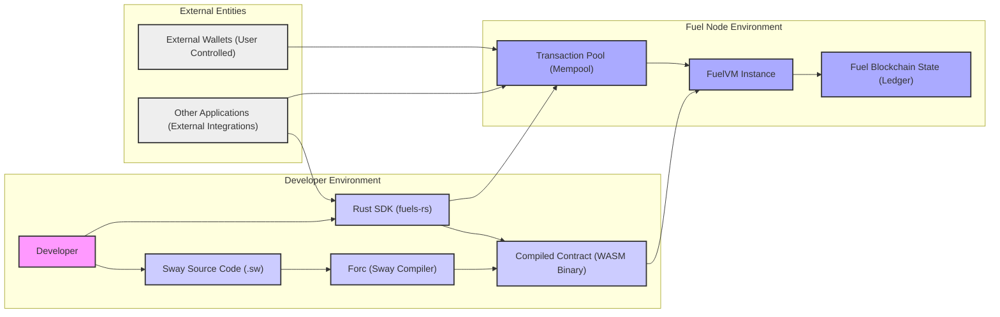

# Project Design Document: fuels-rs

**Version:** 1.1
**Date:** October 26, 2023
**Prepared By:** Gemini (AI Language Model)

## 1. Introduction

This document provides an enhanced design overview of the `fuels-rs` project, a Rust implementation of the FuelVM and its associated tooling. This document is specifically tailored to facilitate subsequent threat modeling activities by providing a clear understanding of the system's architecture and components.

### 1.1. Project Overview

The `fuels-rs` project delivers a comprehensive Rust-based ecosystem for developing and interacting with the Fuel blockchain. This includes the core Fuel Virtual Machine (FuelVM) implementation, the Sway smart contract language compiler (`forc`), various Software Development Kits (SDKs), and other essential utilities.

### 1.2. Goals

* To offer a secure, performant, and reliable Rust implementation of the FuelVM.
* To provide a developer-friendly compiler (`forc`) for the Sway smart contract language, ensuring secure compilation practices.
* To empower developers to build and deploy secure and efficient decentralized applications (dApps) on the Fuel network.
* To enable seamless and secure interaction with the Fuel blockchain through well-defined and secure SDKs.

### 1.3. Scope

This design document focuses on the core architectural elements of the `fuels-rs` project relevant for security analysis, including:

* The Fuel Virtual Machine (FuelVM) and its execution environment.
* The Sway compiler (`forc`) and its compilation pipeline.
* The primary Rust SDK (`fuels-rs`) and its interaction with the Fuel network.
* The fundamental interactions with the Fuel blockchain.

### 1.4. Target Audience

This document is primarily intended for:

* Security engineers tasked with performing threat modeling and security assessments.
* Developers actively contributing to the `fuels-rs` project, requiring a security-focused architectural understanding.
* Architects seeking a detailed yet accessible overview of the system's design from a security perspective.

## 2. High-Level Architecture

**Description:**

* **Developer:** Writes Sway smart contracts and utilizes the Rust SDK for interaction.
* **Sway Source Code (.sw):** Smart contracts authored in the Sway programming language.
* **Forc (Sway Compiler):** Translates Sway source code into WASM bytecode for FuelVM execution.
* **Rust SDK (fuels-rs):** Provides Rust libraries for building, testing, deploying, and interacting with contracts on the Fuel blockchain.
* **Compiled Contract (WASM Binary):** The WebAssembly bytecode representation of the smart contract, ready for execution on the FuelVM.
* **FuelVM Instance:** The virtual machine within a Fuel node responsible for executing smart contracts.
* **Fuel Blockchain State (Ledger):** The distributed, immutable record of all transactions and contract states on the Fuel network.
* **Transaction Pool (Mempool):** Holds pending transactions awaiting inclusion in a block on the Fuel blockchain.
* **External Wallets (User Controlled):** Software or hardware used by users to manage private keys and sign transactions.
* **Other Applications (External Integrations):** External systems that interact with the Fuel blockchain through the SDK or other interfaces.

## 3. Key Components

This section provides a more detailed breakdown of the core components within the `fuels-rs` project, highlighting aspects relevant to security.

### 3.1. Fuel Virtual Machine (FuelVM)

* **Purpose:** To securely and efficiently execute smart contracts on the Fuel blockchain.
* **Key Security Features and Considerations:**
    * **Sandboxed Execution Environment:** Isolates contract execution to prevent interference and malicious behavior.
    * **WASM Execution Engine:** Executes WebAssembly bytecode, requiring careful attention to WASM security vulnerabilities.
    * **Deterministic Execution:** Ensures consistent execution of contracts across different nodes.
    * **Gas Metering and Limits:**  Tracks and restricts resource consumption to prevent denial-of-service attacks.
    * **State Management and Persistence:** Securely manages and persists the state of smart contracts.
* **Internal Modules (Examples):**
    * **Execution Engine:** Interprets and executes WASM instructions, a critical area for security vulnerabilities.
    * **Memory Management:** Handles memory allocation and access for contracts, requiring robust bounds checking.
    * **Contract Storage:** Manages persistent storage, with access control and data integrity considerations.
    * **Cryptography Primitives:** Provides cryptographic functions for contracts, requiring secure and audited implementations.
    * **Networking (Internal Node Communication):** Secure communication channels within the Fuel node.

### 3.2. Forc (Fuel Orchestrator) - The Sway Compiler

* **Purpose:** To compile Sway smart contract code into secure and efficient WASM bytecode.
* **Key Security Features and Considerations:**
    * **Secure Compilation Pipeline:**  Minimizing the risk of introducing vulnerabilities during the compilation process.
    * **Input Validation and Sanitization:**  Ensuring that the compiler properly handles and validates Sway source code to prevent malicious input from leading to exploitable WASM.
    * **Static Analysis and Security Checks:**  Potential for incorporating static analysis tools to identify potential vulnerabilities in Sway code.
    * **Dependency Management Security:**  Securely managing and verifying dependencies used by the compiler.
* **Internal Modules (Examples):**
    * **Lexer and Parser:**  Transforms Sway code into an Abstract Syntax Tree (AST), a stage where vulnerabilities could be introduced if not handled carefully.
    * **Type Checker:** Enforces the Sway language's type system, crucial for preventing type-related errors that could lead to vulnerabilities.
    * **Intermediate Representation (IR) Generator:**  Transforms the AST into an intermediate representation, requiring careful design to avoid introducing flaws.
    * **WASM Backend:** Generates WASM bytecode, a critical component where vulnerabilities could be introduced if the translation is not secure.
    * **Package Manager:** Manages dependencies, requiring mechanisms to prevent dependency confusion and supply chain attacks.

### 3.3. Rust SDK (fuels-rs)

* **Purpose:** To provide a secure and reliable interface for interacting with the Fuel blockchain from Rust applications.
* **Key Security Features and Considerations:**
    * **Secure Key Management:**  Providing mechanisms for secure storage and handling of private keys.
    * **Transaction Construction and Signing:**  Ensuring transactions are constructed correctly and securely signed to prevent manipulation.
    * **Input Validation and Sanitization:**  Validating user inputs to prevent injection attacks when interacting with the blockchain.
    * **Secure Communication with Fuel Nodes:**  Establishing secure connections with Fuel nodes (e.g., using TLS).
    * **Error Handling and Security Audits:**  Robust error handling to prevent information leaks and regular security audits of the SDK codebase.
* **Internal Modules (Examples):**
    * **Provider:** Handles communication with Fuel nodes, requiring secure communication protocols.
    * **Contract Interface:** Provides a type-safe way to interact with deployed contracts, minimizing the risk of errors.
    * **Transaction Builder:** Constructs transaction objects, requiring careful implementation to prevent malleability issues.
    * **Signer:** Handles transaction signing, a critical component for security.
    * **Types:** Defines data structures for interacting with the blockchain, requiring careful design to prevent vulnerabilities.

## 4. Data Flow

This section illustrates the typical data flow within the `fuels-rs` ecosystem, highlighting potential security touchpoints.

```mermaid
graph LR
    subgraph "Development & Compilation Phase"
        A["Developer writes Sway code"]
        B["Forc compiles .sw to WASM"]
    end

    subgraph "Deployment & Interaction Phase"
        C["Developer uses Rust SDK to initiate contract deployment"]
        D["Rust SDK constructs and signs deployment transaction"]
        E["Rust SDK sends deployment transaction to Fuel Node"]
        F["Fuel Node receives and validates deployment transaction"]
        G["FuelVM executes contract deployment code"]
        H["Contract deployed on Fuel Blockchain"]
        I["Developer uses Rust SDK to initiate contract function call"]
        J["Rust SDK constructs and signs function call transaction"]
        K["Rust SDK sends function call transaction to Fuel Node"]
        L["Fuel Node receives and validates function call transaction"]
        M["FuelVM executes contract function"]
        N["FuelVM updates blockchain state"]
        O["Rust SDK receives response from Fuel Node"]
    end

    direction TB
    A --> B
    B --> C
    C --> D
    D --> E
    E --> F
    F --> G
    G --> H
    H --> I
    I --> J
    J --> K
    K --> L
    L --> M
    M --> N
    N --> O

    style A fill:#ccf,stroke:#333,stroke-width:2px
    style B fill:#ccf,stroke:#333,stroke-width:2px
    style C fill:#ccf,stroke:#333,stroke-width:2px
    style D fill:#aaf,stroke:#333,stroke-width:2px
    style E fill:#aaf,stroke:#333,stroke-width:2px
    style F fill:#aaf,stroke:#333,stroke-width:2px
    style G fill:#aaf,stroke:#333,stroke-width:2px
    style H fill:#aaf,stroke:#333,stroke-width:2px
    style I fill:#ccf,stroke:#333,stroke-width:2px
    style J fill:#aaf,stroke:#333,stroke-width:2px
    style K fill:#aaf,stroke:#333,stroke-width:2px
    style L fill:#aaf,stroke:#333,stroke-width:2px
    style M fill:#aaf,stroke:#333,stroke-width:2px
    style N fill:#aaf,stroke:#333,stroke-width:2px
    style O fill:#ccf,stroke:#333,stroke-width:2px
```

**Description:**

1. **Development & Compilation Phase:**
    * A developer writes a smart contract in the Sway language.
    * The `forc` compiler compiles the Sway source code into WASM bytecode, a critical stage for ensuring code integrity and security.

2. **Deployment & Interaction Phase:**
    * The developer uses the Rust SDK to initiate contract deployment.
    * The Rust SDK constructs and securely signs the deployment transaction using the developer's private key.
    * The Rust SDK sends the deployment transaction to a Fuel node.
    * The Fuel node receives and validates the deployment transaction, checking signatures and other validity criteria.
    * The FuelVM, running within the Fuel node, executes the deployment code.
    * Upon successful execution, the contract is deployed, and its state is recorded on the Fuel blockchain.
    * To call a function on a deployed contract, the developer uses the Rust SDK.
    * The Rust SDK constructs and securely signs the function call transaction.
    * The Rust SDK sends the function call transaction to the Fuel node.
    * The Fuel node receives and validates the function call transaction.
    * The FuelVM executes the specified function of the contract within its sandboxed environment.
    * The FuelVM updates the blockchain state based on the contract's execution.
    * The Rust SDK receives a response from the Fuel node indicating the outcome of the transaction.

## 5. Security Considerations for Threat Modeling

This section provides a more structured overview of security considerations, categorized by component, to aid in threat modeling.

* **FuelVM Security Considerations:**
    * **WASM Execution Vulnerabilities:** Exploits related to the WASM specification or the specific WASM execution engine used.
    * **Sandbox Escapes:** Vulnerabilities allowing contracts to break out of the VM's isolation.
    * **Gas Limit Exploitation:**  Circumventing gas limits to perform excessive computations.
    * **Reentrancy Vulnerabilities:**  Flaws in contract logic allowing recursive calls to exploit state changes.
    * **Integer Overflow and Underflow:**  Arithmetic errors leading to unexpected behavior.
    * **Denial of Service (DoS) within the VM:**  Contracts designed to consume excessive resources.
* **Forc (Compiler) Security Considerations:**
    * **Compiler Bugs Leading to Vulnerable WASM:**  Flaws in the compiler introducing security weaknesses in the compiled code.
    * **Supply Chain Attacks on Compiler Dependencies:**  Compromised dependencies introducing malicious code into the compiler.
    * **Insufficient Input Validation:**  Failure to properly validate Sway code, allowing malicious code injection.
    * **Information Disclosure during Compilation:**  Potential leaks of sensitive information during the compilation process.
* **Rust SDK Security Considerations:**
    * **Private Key Management Vulnerabilities:**  Insecure storage or handling of private keys.
    * **Transaction Malleability:**  The ability to alter transactions without invalidating signatures.
    * **Replay Attacks:**  Reusing valid transactions to perform unauthorized actions.
    * **Dependency Vulnerabilities in the SDK:**  Security flaws in libraries used by the SDK.
    * **Insecure Communication with Fuel Nodes:**  Lack of encryption or proper authentication when communicating with nodes.
    * **Client-Side Input Validation Issues:**  Insufficient validation of user inputs before sending them to the blockchain.
* **Fuel Blockchain Interaction Security Considerations:**
    * **Transaction Pool Manipulation:**  Attempts to flood or manipulate the transaction pool.
    * **Sybil Attacks on the Network:**  Malicious actors controlling a large number of nodes.
    * **Consensus Mechanism Vulnerabilities:**  Potential flaws in the consensus algorithm.

## 6. Technologies Used

* **Primary Programming Languages:**
    * Rust (for the FuelVM, Forc compiler, and the Rust SDK)
    * Sway (the smart contract language compiled by Forc)
* **Key Libraries and Frameworks:**
    * WebAssembly (WASM) for smart contract bytecode.
    * Tokio for asynchronous runtime operations in Rust components.
    * Various Rust crates for:
        * Networking (e.g., `tokio::net`, `reqwest`).
        * Cryptography (e.g., `ring`, `k256`).
        * Data Serialization (e.g., `serde`).
        * WASM manipulation and execution (e.g., `wasmtime`).

## 7. Future Considerations

* **Formal Verification of Core Components:** Applying formal methods to verify the correctness and security of the FuelVM and compiler.
* **Enhanced Security Audits and Penetration Testing:**  Regular and thorough security assessments by external experts.
* **Improved Hardware Wallet Integration:**  Strengthening support for hardware wallets to enhance private key security for users.
* **Static Analysis Integration into the Compilation Pipeline:**  Automating the detection of potential vulnerabilities in Sway code during compilation.
* **Further Development of Security Best Practices and Tools for Developers:**  Providing resources and tools to help developers write secure smart contracts.

This enhanced document provides a more detailed and security-focused overview of the `fuels-rs` project's architecture and components. It is intended to serve as a valuable resource for conducting thorough threat modeling and identifying potential security vulnerabilities.