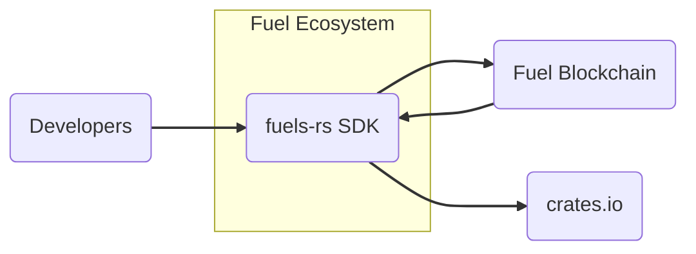
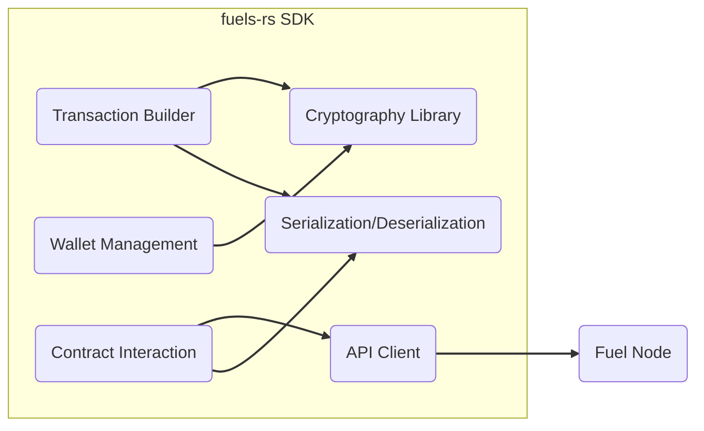
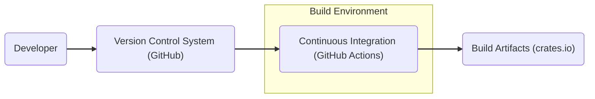

# BUSINESS POSTURE

The fuels-rs project is a Rust SDK for interacting with the Fuel blockchain. Its primary business goal is to facilitate and encourage the development of applications on the Fuel network by providing a robust, user-friendly, and efficient interface for developers.

Business Priorities and Goals:
- Enable developers to easily build and deploy applications on the Fuel blockchain.
- Provide a high-performance and reliable SDK that leverages the speed and efficiency of the Fuel network.
- Foster a thriving developer ecosystem around Fuel by offering comprehensive and well-documented tools.
- Ensure the SDK is secure and minimizes potential vulnerabilities in applications built using it.
- Promote the adoption of the Fuel blockchain through a positive developer experience.

Most Important Business Risks:
- Low developer adoption due to SDK complexity, lack of features, or poor performance.
- Security vulnerabilities in the SDK leading to compromised applications and damage to the Fuel ecosystem's reputation.
- Instability or lack of reliability in the SDK causing development delays and frustration for developers.
- Insufficient documentation and support hindering developer onboarding and effective SDK utilization.
- Competition from other blockchain platforms and SDKs.

# SECURITY POSTURE

Existing Security Controls:
- security control: Publicly accessible source code repository on GitHub, enabling community review and scrutiny. (Implemented: GitHub Repository)
- security control: Issue tracking system on GitHub for reporting and managing bugs and potential security vulnerabilities. (Implemented: GitHub Issues)
- security control: Code review process via pull requests, ensuring multiple developers review code changes before merging. (Implemented: GitHub Pull Requests)
- security control: Continuous Integration (CI) using GitHub Actions for automated building, testing, and potentially linting of the codebase. (Implemented: GitHub Actions - observed in repository workflows)

Accepted Risks:
- accepted risk: Reliance on open-source community for security contributions and vulnerability reporting.
- accepted risk: Potential for vulnerabilities to be present in dependencies.
- accepted risk: Security of developer environments using the SDK is outside the scope of the SDK project itself.

Recommended Security Controls:
- recommended security control: Implement automated Static Application Security Testing (SAST) tools in the CI pipeline to detect potential code-level vulnerabilities.
- recommended security control: Implement automated Dependency Scanning to identify and manage vulnerabilities in third-party dependencies.
- recommended security control: Conduct regular security audits and penetration testing of the SDK by external security experts.
- recommended security control: Establish a clear vulnerability disclosure and response process.
- recommended security control: Provide security guidelines and best practices for developers using the SDK to build secure applications.

Security Requirements:
- Authentication: Not directly applicable to the SDK itself, as it's a client-side library. Authentication mechanisms are expected to be handled by the applications built using the SDK and the Fuel blockchain.
- Authorization: Not directly applicable to the SDK itself. Authorization logic resides within the applications and the Fuel blockchain. The SDK should provide functionalities to interact with authorization mechanisms if needed by the Fuel blockchain.
- Input Validation: security requirement: The SDK must perform robust input validation on all data received from users and external systems to prevent injection attacks and other input-related vulnerabilities. This is crucial for functions that construct transactions or interact with the blockchain.
- Cryptography: security requirement: The SDK must utilize secure cryptographic libraries and practices for all cryptographic operations, such as signing transactions, generating keys, and handling sensitive data. Ensure proper key management and avoid insecure cryptographic algorithms or implementations.

# DESIGN

## C4 CONTEXT



Context Diagram Elements:

- Element:
    - Name: Developers
    - Type: Person
    - Description: Software developers who use the fuels-rs SDK to build applications that interact with the Fuel blockchain.
    - Responsibilities: Develop applications, integrate fuels-rs SDK, deploy applications to Fuel.
    - Security controls: security control: Secure development practices in their own environments, security control: Key management for their applications (outside SDK scope).

- Element:
    - Name: fuels-rs SDK
    - Type: Software System
    - Description: Rust SDK providing libraries and tools for interacting with the Fuel blockchain.
    - Responsibilities: Transaction creation, signing, and submission, contract interaction, wallet management, data serialization/deserialization, communication with Fuel nodes.
    - Security controls: security control: Input validation, security control: Secure cryptographic operations, security control: Dependency management, security control: Code review, security control: Automated testing, security control: SAST (recommended), security control: Dependency scanning (recommended).

- Element:
    - Name: Fuel Blockchain
    - Type: Software System
    - Description: The Fuel blockchain network, providing the execution layer for decentralized applications.
    - Responsibilities: Processing transactions, managing state, executing smart contracts, providing network consensus.
    - Security controls: security control: Blockchain consensus mechanisms, security control: Network security protocols, security control: Smart contract security (separate concern but interacts with SDK).

- Element:
    - Name: crates.io
    - Type: Software System
    - Description: The public package registry for Rust crates, used for distributing the fuels-rs SDK.
    - Responsibilities: Hosting and distributing the fuels-rs SDK crate, managing versions and dependencies.
    - Security controls: security control: Package integrity checks, security control: Vulnerability scanning of hosted packages (crates.io responsibility).

## C4 CONTAINER



Container Diagram Elements:

- Element:
    - Name: API Client
    - Type: Library
    - Description: Handles communication with Fuel nodes over RPC or other protocols.
    - Responsibilities: Sending requests to Fuel nodes, receiving responses, handling network communication.
    - Security controls: security control: Secure communication protocols (e.g., HTTPS), security control: Input validation of responses from Fuel nodes, security control: Rate limiting and error handling to prevent abuse.

- Element:
    - Name: Transaction Builder
    - Type: Library
    - Description: Provides functionalities to construct and format Fuel transactions.
    - Responsibilities: Creating transaction objects, adding inputs and outputs, setting transaction parameters, preparing transactions for signing.
    - Security controls: security control: Input validation of transaction parameters, security control: Secure usage of cryptography library for transaction signing, security control:防禦 against transaction malleability.

- Element:
    - Name: Wallet Management
    - Type: Library
    - Description: Manages private keys and addresses for interacting with Fuel accounts.
    - Responsibilities: Key generation, key storage (in memory or via interfaces to secure storage - SDK itself likely doesn't store keys persistently), address derivation, transaction signing.
    - Security controls: security control: Secure key generation using strong random number generators, security control: Secure interfaces for key storage (applications using SDK are responsible for secure key storage), security control: Protection of private keys in memory.

- Element:
    - Name: Contract Interaction
    - Type: Library
    - Description: Provides tools for interacting with smart contracts deployed on the Fuel blockchain.
    - Responsibilities: Encoding function calls, decoding contract data, interacting with contract ABIs, handling contract deployments.
    - Security controls: security control: Input validation of contract function arguments, security control: Proper handling of contract ABI definitions, security control:防禦 against reentrancy vulnerabilities (indirectly, by providing safe API).

- Element:
    - Name: Cryptography Library
    - Type: Library
    - Description: Provides cryptographic functionalities used throughout the SDK.
    - Responsibilities: Signing transactions, generating keys, hashing, encryption/decryption (if needed).
    - Security controls: security control: Use of well-vetted and secure cryptographic libraries (e.g., RustCrypto crates), security control: Proper implementation of cryptographic algorithms, security control: Regular updates to cryptographic libraries to address known vulnerabilities.

- Element:
    - Name: Serialization/Deserialization
    - Type: Library
    - Description: Handles serialization and deserialization of data structures used in the SDK and for communication with the Fuel blockchain.
    - Responsibilities: Converting data between different formats (e.g., Rust structs to byte arrays, JSON), ensuring data integrity during serialization/deserialization.
    - Security controls: security control:防禦 against deserialization vulnerabilities, security control: Input validation during deserialization, security control: Use of safe serialization libraries.

## DEPLOYMENT

Deployment Architecture: Developer Workstation and crates.io

```mermaid
graph LR
    DEV_ENV("Developer Workstation")
    CRATES_REGISTRY("crates.io Registry")
    DEV_APP("Developer Application")

    DEV_ENV --> CRATES_REGISTRY: "Publishes"
    DEV_APP --> DEV_ENV: "Uses SDK"
    DEV_APP --> FUEL_NETWORK("Fuel Network"): "Interacts with"

    subgraph "Deployment Environment"
        DEV_APP
    end

    linkStyle 0,1,2 stroke:#333,stroke-width:2px;
```

Deployment Diagram Elements:

- Element:
    - Name: Developer Workstation
    - Type: Environment
    - Description: The local development environment of a developer using fuels-rs.
    - Responsibilities: Development of applications using fuels-rs, building and testing applications, publishing SDK crates to crates.io (for SDK developers).
    - Security controls: security control: Secure coding practices, security control: Local security measures on developer machines (OS security, firewalls, etc.), security control: Key management for publishing to crates.io (if SDK developer).

- Element:
    - Name: crates.io Registry
    - Type: Environment
    - Description: The Rust package registry where fuels-rs SDK is published and distributed.
    - Responsibilities: Hosting and distributing the fuels-rs SDK crate, making it available for download by developers.
    - Security controls: security control: Package integrity verification, security control: Infrastructure security of crates.io platform, security control: Vulnerability scanning of hosted packages (crates.io responsibility).

- Element:
    - Name: Developer Application
    - Type: Software
    - Description: Applications built by developers using the fuels-rs SDK.
    - Responsibilities: Utilizing fuels-rs SDK to interact with the Fuel blockchain, implementing application logic, managing user interactions.
    - Security controls: security control: Application-level security controls (authentication, authorization, input validation, etc.), security control: Secure usage of fuels-rs SDK, security control: Secure key management within the application.

## BUILD

Build Process Diagram:



Build Diagram Elements:

- Element:
    - Name: Developer
    - Type: Person
    - Description: Software developer contributing to the fuels-rs project.
    - Responsibilities: Writing code, committing code to VCS, creating pull requests.
    - Security controls: security control: Secure coding practices, security control: Code review participation.

- Element:
    - Name: Version Control System (GitHub)
    - Type: System
    - Description: GitHub repository hosting the fuels-rs source code.
    - Responsibilities: Source code management, version control, collaboration platform.
    - Security controls: security control: Access control to repository, security control: Branch protection, security control: Audit logging.

- Element:
    - Name: Continuous Integration (GitHub Actions)
    - Type: System
    - Description: Automated build and test system using GitHub Actions.
    - Responsibilities: Automated building, testing, linting, and potentially security scanning of the code, publishing build artifacts to crates.io.
    - Security controls: security control: Secure CI/CD pipeline configuration, security control: секреты management for publishing credentials, security control: Automated testing, security control: SAST (recommended), security control: Dependency scanning (recommended), security control: Build reproducibility.

- Element:
    - Name: Build Artifacts (crates.io)
    - Type: System
    - Description: crates.io package registry hosting the compiled fuels-rs crate.
    - Responsibilities: Distribution of the fuels-rs SDK crate to developers.
    - Security controls: security control: Package integrity verification (crates.io), security control: Vulnerability scanning (crates.io).

# RISK ASSESSMENT

Critical Business Processes:
- Development and maintenance of the fuels-rs SDK.
- Adoption and usage of the fuels-rs SDK by developers to build applications on Fuel.
- Reliable and secure operation of applications built using fuels-rs on the Fuel blockchain.

Data to Protect and Sensitivity:
- Source code of fuels-rs SDK: Publicly available, but integrity and confidentiality of development process are important. Sensitivity: Low (public), Integrity: Medium.
- Build process and artifacts: Integrity of build artifacts is crucial to prevent supply chain attacks. Sensitivity: Medium, Integrity: High.
- Developer contributions: Ensuring contributions are legitimate and not malicious. Sensitivity: Low, Integrity: Medium.
- Potential vulnerabilities in SDK: Confidentiality of vulnerability information until patched, integrity of patch process. Sensitivity: High, Integrity: High.

# QUESTIONS & ASSUMPTIONS

Questions:
- What is the intended key storage mechanism for wallets managed by fuels-rs? Is it expected to be in-memory only, or are there plans for integration with secure key storage solutions?
- Are there specific security certifications or compliance requirements that the fuels-rs SDK needs to meet?
- What is the process for reporting and handling security vulnerabilities in fuels-rs? Is there a security contact or a dedicated security policy?
- Are there plans for formal security audits or penetration testing of the fuels-rs SDK?
- What are the performance requirements for the SDK, and how are security considerations balanced with performance optimization?

Assumptions:
- Assumption: Developers using fuels-rs are responsible for the security of their own applications and the secure storage of private keys used within their applications.
- Assumption: The fuels-rs SDK is intended to be used in a variety of environments, including potentially security-sensitive contexts.
- Assumption: The Fuel blockchain itself provides a secure foundation for applications built using fuels-rs.
- Assumption: The open-source nature of fuels-rs is considered a security benefit through increased transparency and community review.
- Assumption: The Rust programming language provides inherent security advantages due to its memory safety features.