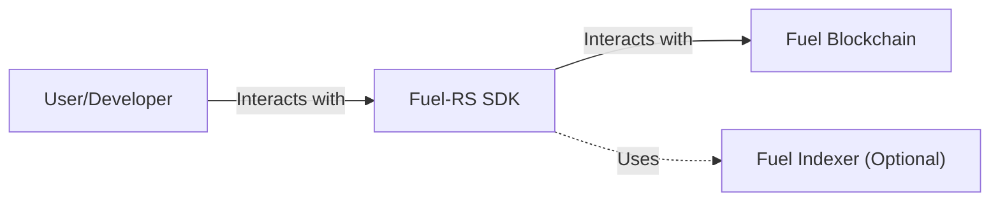
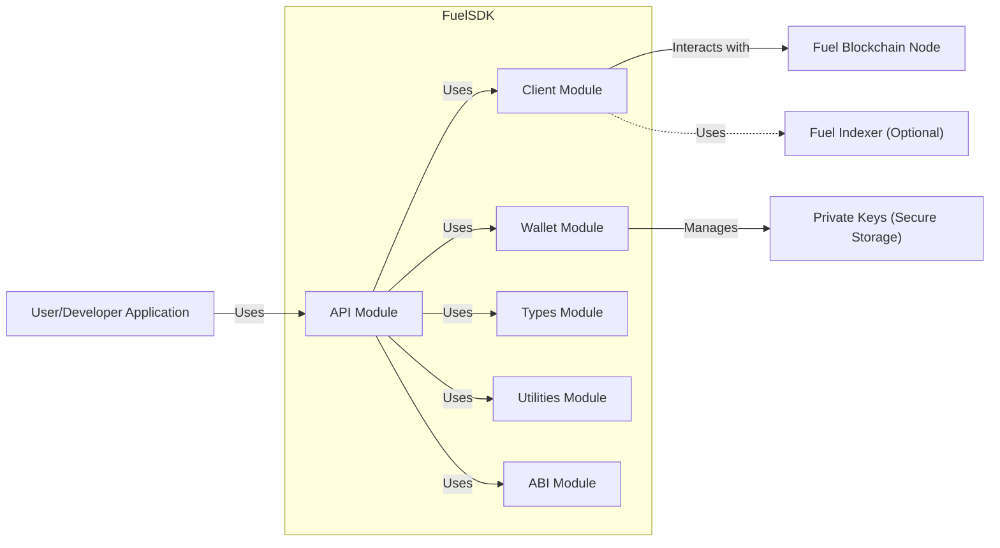
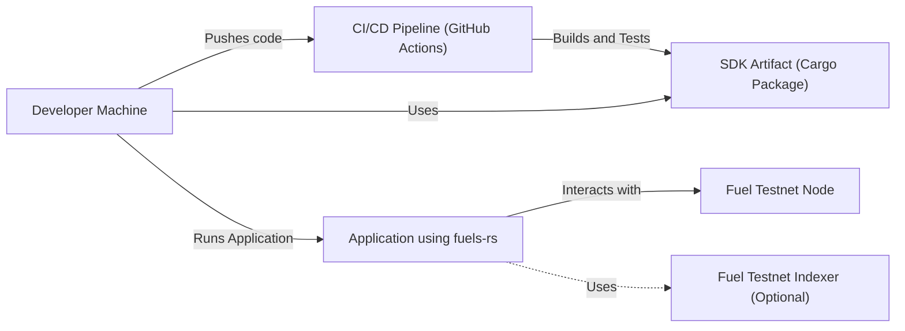
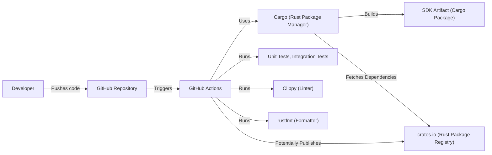

Okay, let's create a design document for the `fuels-rs` project, a Rust SDK for the Fuel blockchain.

# BUSINESS POSTURE

Business Priorities and Goals:

*   Provide a robust and efficient Rust SDK for interacting with the Fuel blockchain.
*   Enable developers to easily build applications on Fuel.
*   Ensure the SDK is well-documented and easy to use.
*   Maintain high performance and reliability.
*   Foster a strong developer community around the SDK.
*   Support the growth and adoption of the Fuel blockchain.

Business Risks:

*   Security vulnerabilities in the SDK could lead to financial losses for users and damage the reputation of Fuel.
*   Poor performance or reliability of the SDK could hinder the development of applications on Fuel.
*   Lack of features or poor documentation could limit the adoption of the SDK.
*   Inability to keep up with changes in the Fuel blockchain could make the SDK obsolete.
*   Competition from other SDKs or platforms could reduce the adoption of Fuel.

# SECURITY POSTURE

Existing Security Controls:

*   security control: The project uses Rust, a memory-safe language, which helps prevent common vulnerabilities like buffer overflows and use-after-free errors. (Described in the repository's README and inherent to the language choice).
*   security control: The project includes unit tests and integration tests to verify the correctness of the code. (Visible in the repository's `tests` directory).
*   security control: The project uses GitHub Actions for continuous integration, which helps ensure that new code changes don't introduce regressions. (Visible in the `.github/workflows` directory).
*   security control: The project has a Code of Conduct to foster a welcoming and inclusive community. (Visible in the `CODE_OF_CONDUCT.md` file).
*   security control: The project uses Cargo, Rust's package manager, which helps manage dependencies and ensure their integrity. (Inherent to the Rust ecosystem).
*   security control: The project appears to follow secure coding practices, such as avoiding unsafe code blocks where possible. (Observed in the codebase).
*   security control: Regular dependency updates to address known vulnerabilities. (Observed in commit history).

Accepted Risks:

*   accepted risk: The project is under active development, and there may be undiscovered vulnerabilities.
*   accepted risk: The project depends on external libraries, which may have their own vulnerabilities.
*   accepted risk: The Fuel blockchain itself is under development and may have vulnerabilities that affect the SDK.

Recommended Security Controls:

*   security control: Implement fuzzing to test the SDK with unexpected inputs and identify potential vulnerabilities.
*   security control: Conduct regular security audits of the SDK and its dependencies.
*   security control: Establish a vulnerability disclosure program to encourage responsible reporting of security issues.
*   security control: Implement static analysis tools (e.g., Clippy) to identify potential code quality and security issues.
*   security control: Consider using a Software Bill of Materials (SBOM) to track dependencies and their vulnerabilities.
*   security control: Implement dynamic analysis tools (e.g., sanitizers) during testing.

Security Requirements:

*   Authentication:
    *   The SDK must securely handle private keys and other credentials.
    *   The SDK should support different authentication methods as required by the Fuel blockchain.
    *   The SDK should protect against replay attacks.

*   Authorization:
    *   The SDK must correctly implement the authorization mechanisms of the Fuel blockchain.
    *   The SDK should ensure that users can only perform actions they are authorized to do.

*   Input Validation:
    *   The SDK must validate all inputs from users and external sources.
    *   The SDK must handle invalid inputs gracefully and securely.
    *   The SDK should protect against common injection attacks (e.g., command injection).

*   Cryptography:
    *   The SDK must use strong, well-vetted cryptographic algorithms and libraries.
    *   The SDK must correctly implement cryptographic protocols (e.g., key exchange, signing).
    *   The SDK must securely manage cryptographic keys.
    *   The SDK must protect against known cryptographic attacks (e.g., side-channel attacks).

# DESIGN

## C4 CONTEXT

Element Descriptions:

*   Element:
    *   Name: User/Developer
    *   Type: Person
    *   Description: A developer building applications on the Fuel blockchain using the `fuels-rs` SDK.
    *   Responsibilities: Writing code that uses the SDK to interact with the Fuel blockchain, managing their own application's security, and handling user data.
    *   Security controls: Implements application-level security controls, securely manages credentials, follows secure coding practices.

*   Element:
    *   Name: Fuel-RS SDK
    *   Type: Software System
    *   Description: The Rust SDK provided by `fuels-rs` for interacting with the Fuel blockchain.
    *   Responsibilities: Providing a high-level API for interacting with the Fuel blockchain, handling communication with Fuel nodes, managing cryptographic operations, and providing utilities for developers.
    *   Security controls: Uses memory-safe language (Rust), includes unit and integration tests, uses continuous integration, follows secure coding practices, manages dependencies securely.

*   Element:
    *   Name: Fuel Blockchain
    *   Type: Software System
    *   Description: The Fuel blockchain itself, a distributed ledger.
    *   Responsibilities: Maintaining the state of the blockchain, executing transactions, and providing data to clients.
    *   Security controls: Implements consensus mechanisms, cryptographic protocols, and access control mechanisms. (Security controls are external to the SDK).

*   Element:
    *   Name: Fuel Indexer (Optional)
    *   Type: Software System
    *   Description: An optional service that provides indexed data from the Fuel blockchain for faster querying.
    *   Responsibilities: Indexing data from the Fuel blockchain and providing a query API.
    *   Security controls: Implements access control and data validation. (Security controls are external to the SDK).

## C4 CONTAINER

Element Descriptions:

*   Element:
    *   Name: User/Developer Application
    *   Type: Software System
    *   Description: An application built by a developer using the `fuels-rs` SDK.
    *   Responsibilities: Implementing the application's logic, interacting with the Fuel blockchain via the SDK, and handling user interactions.
    *   Security controls: Implements application-level security controls, securely manages credentials, follows secure coding practices.

*   Element:
    *   Name: Fuel-RS SDK
    *   Type: Library
    *   Description: The Rust SDK provided by `fuels-rs`.
    *   Responsibilities: Providing a high-level API for interacting with the Fuel blockchain.
    *   Security controls: Uses memory-safe language (Rust), includes unit and integration tests, uses continuous integration, follows secure coding practices, manages dependencies securely.

*   Element:
    *   Name: API Module
    *   Type: Module
    *   Description: The high-level API for interacting with the Fuel blockchain.
    *   Responsibilities: Providing a user-friendly interface for common tasks, such as sending transactions, querying data, and deploying contracts.
    *   Security controls: Input validation, error handling.

*   Element:
    *   Name: Client Module
    *   Type: Module
    *   Description: Handles communication with Fuel nodes.
    *   Responsibilities: Sending requests to Fuel nodes, receiving responses, and handling network errors.
    *   Security controls: TLS (if applicable), input validation, error handling.

*   Element:
    *   Name: Wallet Module
    *   Type: Module
    *   Description: Manages private keys and signing transactions.
    *   Responsibilities: Generating and storing private keys, signing transactions, and managing accounts.
    *   Security controls: Secure key storage, cryptographic operations.

*   Element:
    *   Name: Types Module
    *   Type: Module
    *   Description: Defines data types used by the SDK.
    *   Responsibilities: Providing data structures for representing Fuel blockchain entities, such as transactions, blocks, and accounts.
    *   Security controls: Data validation.

*   Element:
    *   Name: Utilities Module
    *   Type: Module
    *   Description: Provides utility functions for developers.
    *   Responsibilities: Providing helper functions for common tasks, such as converting between data types and encoding/decoding data.
    *   Security controls: Input validation, error handling.

*   Element:
    *   Name: ABI Module
    *   Type: Module
    *   Description: Handles contract ABI (Application Binary Interface) encoding and decoding.
    *   Responsibilities: Encoding and decoding data for interacting with smart contracts.
    *   Security controls: Input validation, error handling.

*   Element:
    *   Name: Fuel Blockchain Node
    *   Type: Software System
    *   Description: A node in the Fuel blockchain network.
    *   Responsibilities: Maintaining the state of the blockchain, executing transactions, and providing data to clients.
    *   Security controls: Implements consensus mechanisms, cryptographic protocols, and access control mechanisms.

*   Element:
    *   Name: Fuel Indexer (Optional)
    *   Type: Software System
    *   Description: An optional service that provides indexed data from the Fuel blockchain.
    *   Responsibilities: Indexing data from the Fuel blockchain and providing a query API.
    *   Security controls: Implements access control and data validation.

*   Element:
    *   Name: Private Keys (Secure Storage)
    *   Type: Data
    *   Description: Securely stored private keys managed by the Wallet Module.
    *   Responsibilities: N/A - Data storage.
    *   Security controls: Encryption, access control.

## DEPLOYMENT

Possible Deployment Solutions:

1.  **Local Development:** Developers run a local Fuel node (e.g., `fuel-core`) for testing and development. The `fuels-rs` SDK connects to this local node.
2.  **Testnet:** Developers deploy their applications to a public Fuel testnet. The `fuels-rs` SDK connects to a testnet node.
3.  **Mainnet:** Developers deploy their applications to the Fuel mainnet. The `fuels-rs` SDK connects to a mainnet node.

Chosen Solution (Testnet Deployment):

Element Descriptions:

*   Element:
    *   Name: Developer Machine
    *   Type: Infrastructure
    *   Description: The developer's local machine.
    *   Responsibilities: Writing code, running tests, and deploying applications.
    *   Security controls: Operating system security, secure development environment.

*   Element:
    *   Name: Fuel Testnet Node
    *   Type: Infrastructure
    *   Description: A node in the Fuel testnet network.
    *   Responsibilities: Maintaining the state of the testnet blockchain, executing transactions, and providing data to clients.
    *   Security controls: Implements consensus mechanisms, cryptographic protocols, and access control mechanisms.

*   Element:
    *   Name: Fuel Testnet Indexer (Optional)
    *   Type: Infrastructure
    *   Description: An optional service that provides indexed data from the Fuel testnet blockchain.
    *   Responsibilities: Indexing data from the Fuel testnet blockchain and providing a query API.
    *   Security controls: Implements access control and data validation.

*   Element:
    *   Name: CI/CD Pipeline (GitHub Actions)
    *   Type: Software System
    *   Description: The continuous integration and continuous deployment pipeline.
    *   Responsibilities: Building, testing, and potentially deploying the `fuels-rs` SDK.
    *   Security controls: Secure configuration, access control, vulnerability scanning.

*   Element:
    *   Name: SDK Artifact (Cargo Package)
    *   Type: Data
    *   Description: The built `fuels-rs` SDK package.
    *   Responsibilities: N/A - Data storage.
    *   Security controls: Code signing (if applicable).

*   Element:
    *   Name: Application using fuels-rs
    *   Type: Software System
    *   Description: The developer's application that uses the `fuels-rs` SDK.
    *   Responsibilities: Interacting with the Fuel blockchain via the SDK.
    *   Security controls: Application-level security controls.

## BUILD

Build Process Description:

1.  **Code Push:** A developer pushes code changes to the `fuels-rs` GitHub repository.
2.  **CI Trigger:** GitHub Actions is triggered by the code push.
3.  **Build:** The CI pipeline uses Cargo, the Rust package manager, to build the SDK. Cargo fetches dependencies from `crates.io`, the Rust package registry.
4.  **Testing:** The CI pipeline runs unit tests and integration tests to verify the correctness of the code.
5.  **Linting and Formatting:** The CI pipeline runs Clippy (a linter) to identify potential code quality and security issues, and `rustfmt` (a formatter) to ensure consistent code style.
6.  **Artifact Creation:** Cargo creates a build artifact, which is a Cargo package.
7.  **Publishing (Optional):** The CI pipeline can be configured to publish the SDK to `crates.io`.

Security Controls:

*   security control: **Dependency Management:** Cargo manages dependencies and their versions, helping to ensure that known vulnerable versions are not used.
*   security control: **Continuous Integration:** GitHub Actions provides continuous integration, which helps ensure that new code changes don't introduce regressions or security vulnerabilities.
*   security control: **Automated Testing:** Unit tests and integration tests help verify the correctness of the code and prevent security vulnerabilities.
*   security control: **Linting:** Clippy helps identify potential code quality and security issues.
*   security control: **Code Review:** Pull requests on GitHub facilitate code review, which can help identify security vulnerabilities before they are merged into the main branch.

# RISK ASSESSMENT

Critical Business Processes:

*   **Secure interaction with the Fuel blockchain:** The SDK must provide a secure way for developers to interact with the Fuel blockchain, protecting users' funds and data.
*   **Reliable operation:** The SDK must be reliable and performant to enable the development of robust applications on Fuel.
*   **Maintaining developer trust:** The SDK must be well-maintained and secure to maintain the trust of developers and the wider Fuel community.

Data Sensitivity:

*   **Private Keys:** Highest sensitivity. These keys control access to users' funds and must be protected with the utmost care. The SDK must provide secure mechanisms for managing private keys.
*   **Transaction Data:** High sensitivity. Transaction data may contain sensitive information about users' activities and financial transactions. The SDK must ensure the confidentiality and integrity of transaction data.
*   **Blockchain Data:** Medium sensitivity. Public blockchain data is generally not confidential, but its integrity is crucial. The SDK must ensure that it retrieves and processes blockchain data correctly.
*   **User Data (Application-Specific):** Variable sensitivity. The sensitivity of user data handled by applications built using the SDK depends on the specific application. The SDK should provide tools and guidance to help developers protect user data.

# QUESTIONS & ASSUMPTIONS

Questions:

*   What specific cryptographic libraries are used by the SDK and the Fuel blockchain?
*   What are the specific threat models considered for the Fuel blockchain itself?
*   What are the plans for auditing the SDK and its dependencies?
*   What is the expected deployment environment for applications using the SDK (e.g., cloud, on-premises)?
*   Are there any specific regulatory requirements that the SDK must comply with?
*   What level of support is provided for different authentication methods (e.g., hardware wallets)?
*   How are updates to the SDK distributed and installed?
*   What is the process for reporting and handling security vulnerabilities in the SDK?

Assumptions:

*   BUSINESS POSTURE: The primary goal is to provide a secure and reliable SDK for interacting with the Fuel blockchain.
*   SECURITY POSTURE: The Fuel blockchain itself is secure, and the SDK's security relies on the security of the underlying blockchain.
*   SECURITY POSTURE: Developers using the SDK are responsible for the security of their own applications.
*   DESIGN: The SDK will primarily be used by developers building applications on the Fuel blockchain.
*   DESIGN: The SDK will be distributed as a Cargo package.
*   DESIGN: The SDK will connect to Fuel nodes over a network connection (likely using TLS).
*   DESIGN: The development team is following secure coding practices.
*   DESIGN: The project will continue to evolve, and new features and security controls will be added over time.