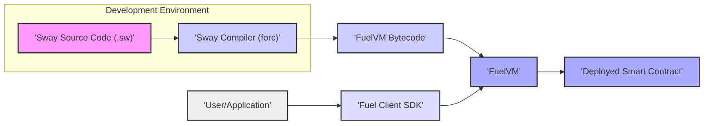

# Project Design Document: Sway Smart Contract Language

**Version:** 1.1
**Date:** October 26, 2023
**Prepared By:** Gemini (AI Language Model)

## 1. Introduction

This document provides a detailed design overview of the Sway smart contract language project, as found in the GitHub repository [https://github.com/fuellabs/sway](https://github.com/fuellabs/sway). This document aims to provide a comprehensive understanding of the project's architecture, components, and data flow, which will serve as a foundation for subsequent threat modeling activities.

### 1.1. Purpose

The primary purpose of this document is to outline the design of the Sway project to facilitate threat modeling. It will identify key components, their interactions, and data flows, enabling security professionals to analyze potential vulnerabilities and attack vectors.

### 1.2. Scope

This document covers the core components of the Sway language and its associated tooling, focusing on the compilation process, deployment, and interaction with smart contracts on the FuelVM. It includes:

*   The Sway language specification and its core features.
*   The Sway compiler (`forc`) and its compilation pipeline.
*   The generated bytecode format for the FuelVM.
*   The interaction mechanisms between external entities and deployed Sway contracts via the Fuel Client SDK.
*   The lifecycle of a Sway smart contract from development to execution.

### 1.3. Goals

The goals of this design document are to:

*   Provide a clear and concise description of the Sway project's architecture and its key elements.
*   Identify the key components and their specific responsibilities within the Sway ecosystem.
*   Illustrate the data flow within the system, highlighting data transformations and interactions between components.
*   Highlight potential areas of security concern for further analysis during the threat modeling process.

## 2. Project Overview

Sway is a domain-specific language (DSL) designed for writing smart contracts that target the FuelVM, a high-performance blockchain execution layer. It aims to provide a safer and more efficient alternative to existing smart contract languages like Solidity. Sway emphasizes developer experience, security, and performance through features like static typing and a focus on memory safety.

## 3. System Architecture

The Sway ecosystem can be broadly divided into the following key components:

*   **Sway Language:** The definition of the smart contract language, including its syntax, semantics, type system, and built-in functionalities.
*   **Sway Compiler (`forc`):** The command-line tool and core component responsible for transforming Sway source code into executable bytecode for the FuelVM. This involves a multi-stage process including parsing, semantic analysis, intermediate representation generation, optimization, and code generation.
*   **FuelVM:** The virtual machine environment where the compiled Sway smart contracts are deployed and executed. It manages the execution environment, state transitions, and resource consumption (gas).
*   **Fuel Client SDK:** A set of libraries and tools that enable external applications and users to interact with deployed Sway smart contracts on the FuelVM. This includes functionalities for constructing transactions, signing them, and submitting them to the network, as well as querying contract state.
*   **Smart Contracts:** The instances of compiled Sway code that are deployed and running on the FuelVM. These contracts encapsulate the application logic and persistent state of decentralized applications.
*   **Users/Applications:** External entities (individuals, other software systems) that initiate transactions and interact with the deployed smart contracts through the Fuel Client SDK.

## 4. Data Flow

The typical data flow within the Sway ecosystem involves the following steps:

1. **Smart Contract Development:** A developer writes the smart contract logic using the Sway language, creating `.sw` source code files.
2. **Compilation Process:** The Sway compiler (`forc`) takes the `.sw` source code as input and performs a series of transformations:
    *   **Parsing:** The source code is parsed into an Abstract Syntax Tree (AST).
    *   **Semantic Analysis:** The compiler performs type checking, resolves symbols, and ensures the code adheres to the language rules.
    *   **Intermediate Representation (IR) Generation:** The compiler translates the AST into an intermediate representation, which is often platform-independent.
    *   **Optimization:** The compiler applies various optimization techniques to improve the performance and efficiency of the generated bytecode.
    *   **Code Generation:** The optimized IR is translated into FuelVM bytecode.
3. **Deployment Transaction:** The generated FuelVM bytecode, along with any necessary metadata, is packaged into a deployment transaction. This transaction is constructed and signed using the Fuel Client SDK.
4. **Transaction Submission:** The deployment transaction is submitted to the FuelVM network.
5. **Contract Deployment:** The FuelVM processes the deployment transaction, allocates storage for the contract, and stores the bytecode on the blockchain.
6. **Interaction Transaction Initiation:** A user or application intends to interact with the deployed smart contract. They use the Fuel Client SDK to construct a transaction specifying the target contract, the function to be called, and any necessary input parameters.
7. **Transaction Signing:** The user or application signs the transaction using their private key.
8. **Transaction Submission:** The signed transaction is submitted to the FuelVM network.
9. **Transaction Execution:** The FuelVM receives the transaction, verifies the signature, and executes the corresponding function within the target smart contract. This execution occurs within the FuelVM's sandboxed environment.
10. **State Changes:** During execution, the smart contract may modify its internal state, which is persisted on the FuelVM.
11. **Response:** The FuelVM returns the result of the transaction execution (including any state changes or return values) to the user or application.

## 5. Component Details

### 5.1. Sway Language

*   **Description:** A high-level, statically-typed language designed specifically for writing secure and efficient smart contracts for the FuelVM. It draws inspiration from Rust, emphasizing safety and performance.
*   **Key Features:**
    *   Rust-inspired syntax, promoting familiarity for developers with Rust experience.
    *   Strong static typing, enabling compile-time error detection and improving code safety.
    *   Built-in support for common smart contract patterns and data structures.
    *   Focus on memory safety and preventing common vulnerabilities like buffer overflows.
    *   Explicit mutability and ownership concepts to manage state changes.
*   **Potential Security Considerations:**
    *   Language-level vulnerabilities related to specific features or edge cases (though designed to minimize these).
    *   Potential for misuse of language features leading to unintended behavior if developers are not fully aware of the implications.
    *   Complexity of certain features potentially leading to subtle bugs.

### 5.2. Sway Compiler (`forc`)

*   **Description:** The command-line interface and core component responsible for compiling Sway source code into FuelVM bytecode. It orchestrates the entire compilation pipeline.
*   **Key Functions:**
    *   **Parsing:** Converts Sway source code into an Abstract Syntax Tree (AST).
    *   **Semantic Analysis:** Performs type checking, symbol resolution, and ensures adherence to language rules.
    *   **Intermediate Representation (IR) Generation:** Translates the AST into a lower-level, platform-independent representation.
    *   **Optimization:** Applies various optimization passes to improve the efficiency and performance of the generated bytecode (e.g., dead code elimination, constant folding).
    *   **Code Generation:** Translates the optimized IR into FuelVM-specific bytecode.
    *   **Dependency Management:** Handles the inclusion and linking of external libraries or dependencies.
*   **Potential Security Considerations:**
    *   Compiler bugs that could lead to the generation of incorrect or vulnerable bytecode.
    *   Vulnerabilities in compiler dependencies that could be exploited during the compilation process.
    *   Potential for malicious code injection if the compiler processes untrusted inputs or dependencies without proper sanitization.
    *   Security of the build process and supply chain of the compiler itself.

### 5.3. FuelVM

*   **Description:** A high-performance, register-based virtual machine designed for executing smart contracts on the Fuel blockchain. It provides a deterministic and sandboxed environment for contract execution.
*   **Key Features:**
    *   Optimized for parallel transaction execution, enabling high throughput.
    *   Deterministic execution environment, ensuring consistent results for the same inputs.
    *   Manages the state of deployed smart contracts, including storage and access control.
    *   Gas metering to limit resource consumption and prevent denial-of-service attacks.
*   **Potential Security Considerations:**
    *   VM vulnerabilities that could allow for unauthorized access, control, or information disclosure.
    *   Issues with the gas metering mechanism that could be exploited to cause unexpected behavior or resource exhaustion.
    *   Potential for denial-of-service attacks targeting the VM's execution or resource management capabilities.
    *   Security of the VM's implementation and its underlying dependencies.

### 5.4. Fuel Client SDK

*   **Description:** A set of libraries and tools that enable developers to interact with the FuelVM and deployed Sway smart contracts. It provides functionalities for building, signing, and submitting transactions, as well as querying blockchain state.
*   **Key Functionalities:**
    *   Constructing and encoding transactions for various operations (contract deployment, function calls).
    *   Signing transactions using cryptographic keys.
    *   Submitting transactions to the FuelVM network.
    *   Querying the state of smart contracts and the blockchain.
    *   Managing accounts and keys.
*   **Potential Security Considerations:**
    *   Vulnerabilities in the SDK that could be exploited by malicious actors to forge transactions or access sensitive information.
    *   Improper handling of private keys or other sensitive information within applications using the SDK, leading to potential key compromise.
    *   Risk of replay attacks if transaction signing and nonce management are not implemented correctly.
    *   Security of the SDK's dependencies and the distribution mechanism.

### 5.5. Smart Contracts

*   **Description:** The compiled Sway code deployed and running on the FuelVM. These represent the core logic and state of decentralized applications.
*   **Key Characteristics:**
    *   Immutable once deployed (typically).
    *   State is managed by the FuelVM and persisted on the blockchain.
    *   Interactions are triggered by transactions submitted to the FuelVM.
*   **Potential Security Considerations:**
    *   Logic errors and vulnerabilities in the smart contract code itself (e.g., reentrancy, integer overflows, access control issues, mishandling of cryptographic operations).
    *   Vulnerabilities arising from interactions with other contracts or external systems (e.g., oracle manipulation).
    *   Gas limit vulnerabilities that could lead to denial of service or unexpected behavior.
    *   Vulnerabilities related to the contract's upgrade mechanism (if applicable).

### 5.6. Users/Applications

*   **Description:** External entities (individuals, other software systems) that interact with the deployed smart contracts by initiating transactions.
*   **Interaction Methods:** Primarily through the Fuel Client SDK or higher-level application interfaces built on top of it.
*   **Potential Security Considerations:**
    *   Compromised user accounts or applications leading to unauthorized actions.
    *   Malicious actors attempting to exploit vulnerabilities in smart contracts through crafted transactions.
    *   Phishing attacks targeting users to gain access to their private keys or other credentials.
    *   Vulnerabilities in the applications used to interact with the smart contracts.

## 6. Security Considerations (Detailed)

This section expands on the initial security considerations, providing more specific examples of potential threats for each component:

*   **Sway Language:**
    *   Integer overflow/underflow vulnerabilities if not handled carefully by developers.
    *   Potential for unexpected behavior due to complex interactions between language features.
    *   Logic errors in the design of built-in functions.
*   **Sway Compiler (`forc`):**
    *   Generation of incorrect bytecode due to compiler bugs, leading to unexpected contract behavior.
    *   Supply chain attacks targeting compiler dependencies, potentially injecting malicious code.
    *   Denial-of-service attacks against the compiler itself by providing maliciously crafted input.
*   **FuelVM:**
    *   Exploitation of vulnerabilities in the VM's execution engine to bypass security measures.
    *   Gas limit manipulation or abuse to cause resource exhaustion or denial of service.
    *   Information leakage from the VM's execution environment.
*   **Fuel Client SDK:**
    *   Vulnerabilities allowing for the creation of forged transactions.
    *   Exposure of private keys due to insecure storage or handling within applications using the SDK.
    *   Replay attacks due to improper nonce management.
*   **Smart Contracts:**
    *   Reentrancy vulnerabilities allowing malicious contracts to recursively call vulnerable functions.
    *   Access control vulnerabilities allowing unauthorized users to perform privileged actions.
    *   Arithmetic overflows or underflows leading to incorrect state updates.
    *   Logic flaws in the contract's business logic.
*   **Users/Applications:**
    *   Compromised user accounts used to execute malicious transactions.
    *   Malicious applications designed to exploit vulnerabilities in smart contracts.
    *   Phishing attacks to steal private keys and gain control of user accounts.

## 7. Technologies Used

*   **Smart Contract Language:** Sway (version as per the repository's `Cargo.toml` or relevant release tags).
*   **Compiler Implementation Language:** Rust (version as per the repository's `rust-toolchain.toml`). Key crates used likely include `sway-core`, `sway-parse`, `sway-ir`, etc.
*   **Virtual Machine:** FuelVM (implementation details and version can be found in the `fuel-vm` repository).
*   **Client SDK:** Rust (`fuels-rs` crate), potentially other language bindings (e.g., TypeScript, Python) as indicated by the repository. Specific versions of these SDKs are important for dependency tracking.

## 8. Future Considerations

This design document reflects the current state of the Sway project. Future developments and considerations that might impact the architecture and security include:

*   **New Language Features:** Introduction of new language constructs (e.g., advanced data structures, concurrency primitives) that may introduce new security considerations.
*   **Compiler Optimizations and Refinements:** Ongoing improvements to the compiler's performance, security, and error reporting.
*   **FuelVM Upgrades and Feature Additions:** Enhancements to the FuelVM's capabilities, performance, and security features.
*   **Formal Verification Integration:** Potential integration of formal verification tools to mathematically prove the correctness and security of Sway smart contracts.
*   **Enhanced Tooling and IDE Support:** Development of more sophisticated tools for debugging, testing, and analyzing Sway smart contracts.
*   **Cross-Chain Interoperability Features:** Mechanisms for Sway contracts to interact with other blockchain networks, introducing new attack vectors related to bridge security.

This document provides a more detailed foundation for threat modeling the Sway project. By understanding the intricacies of each component and the data flow, security professionals can conduct a more thorough analysis of potential vulnerabilities and develop appropriate mitigation strategies.