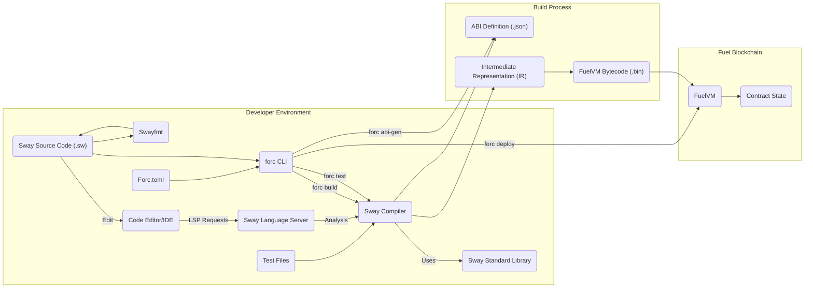

# Project Design Document: Sway Smart Contract Language and Toolchain

**Version:** 1.1
**Date:** October 26, 2023
**Prepared By:** [Your Name/Team Name]

## 1. Introduction

This document provides an enhanced architectural design of the Sway smart contract language and its associated toolchain, as represented by the project hosted at [https://github.com/fuellabs/sway](https://github.com/fuellabs/sway). This document builds upon the previous version, offering greater detail and clarity regarding the system's components, their interactions, and the overall architecture. It remains a foundational resource for subsequent threat modeling activities.

## 2. Goals and Objectives

The primary goals of the Sway project are to:

* Provide a memory-safe and efficient language specifically designed for writing smart contracts on the Fuel blockchain.
* Offer a comprehensive and user-friendly toolchain for every stage of Sway smart contract development, including compiling, testing, formatting, deploying, and interacting.
* Enhance the developer experience through features such as a robust type system, expressive syntax, and informative error messages.
* Ensure seamless interoperability and optimal performance when executing compiled Sway code on the FuelVM (Fuel Virtual Machine).

## 3. System Overview

Sway is structured as a modular system with several key components that interact to facilitate smart contract development on the Fuel blockchain. The core of the system is a pipeline that transforms human-readable Sway source code into executable bytecode for the FuelVM.

## 4. Detailed Design

This section provides an in-depth look at the core components of the Sway project.

### 4.1. Sway Compiler (`sway-core`)

* **Description:** The central component responsible for translating Sway source code into executable FuelVM bytecode. It performs a series of complex operations to ensure code correctness and efficiency.
* **Functionality:**
    * **Lexical Analysis (Lexing):** Breaks down the raw Sway source code into a stream of tokens.
    * **Syntactic Analysis (Parsing):** Organizes the tokens into a hierarchical Abstract Syntax Tree (AST), representing the grammatical structure of the code.
    * **Semantic Analysis:** Performs in-depth analysis of the AST, including:
        * **Type Checking:** Verifies that all expressions and operations use compatible data types.
        * **Name Resolution:** Matches identifiers to their declarations in the code's scope.
        * **Borrow Checking:** (Potentially, depending on language features) Ensures memory safety by tracking ownership and borrowing of data.
    * **Intermediate Representation (IR) Generation:** Converts the semantically analyzed AST into a lower-level, platform-agnostic Intermediate Representation (IR). This simplifies subsequent optimization and code generation.
    * **Optimization Passes:** Applies various optimization techniques to the IR to improve performance and reduce gas consumption. These may include:
        * **Dead Code Elimination:** Removing unused code.
        * **Constant Folding:** Evaluating constant expressions at compile time.
        * **Inlining:** Replacing function calls with the function's body.
    * **FuelVM Bytecode Generation:** Translates the optimized IR into FuelVM bytecode, the executable format for the Fuel blockchain.
    * **Abstract Binary Interface (ABI) Generation:** Creates a JSON file describing the public functions and data structures of the smart contract, enabling external interaction.
    * **Diagnostic Reporting:** Generates comprehensive error and warning messages to guide developers during the compilation process.
* **Inputs:** Sway source code files (`.sw`).
* **Outputs:**
    * FuelVM bytecode files (`.bin`).
    * Abstract Binary Interface (ABI) definition files (`.json`).
    * Potentially intermediate representation files for debugging and analysis.
* **Interactions:**
    * Reads Sway source files from the file system.
    * Utilizes the Sway Standard Library for built-in functionalities.
    * May interact with external dependencies or libraries.
    * Writes compiled bytecode and ABI definitions to the file system.

### 4.2. Sway Standard Library (`sway-lib-std`)

* **Description:** A curated collection of essential modules and functions that provide foundational building blocks for Sway smart contracts. It aims to offer secure and efficient implementations of common functionalities.
* **Functionality:**
    * **Data Structures:** Provides fundamental data structures like vectors, maps, and strings.
    * **Utility Functions:** Offers a range of utility functions, including:
        * **Cryptographic Primitives:** Hashing algorithms, signature verification.
        * **String Manipulation:** Functions for working with text.
        * **Mathematical Operations:** Arithmetic and logical functions.
    * **FuelVM Environment Interaction:** Encapsulates interactions with the FuelVM execution environment, such as:
        * **Accessing Block Information:** Retrieving details about the current block.
        * **Contract Storage Management:** Reading and writing data to the contract's persistent storage.
        * **Inter-Contract Communication:** Sending messages and interacting with other deployed contracts.
        * **Cryptographic Functions Specific to the Chain:**  Like verifying signatures using the chain's specific curve.
* **Inputs:** Used implicitly by the Sway compiler during the compilation of user code.
* **Outputs:** Contributes to the final FuelVM bytecode of the compiled contract.
* **Interactions:** The Sway compiler resolves references to standard library items during semantic analysis and code generation.

### 4.3. FuelVM (`fuel-vm`)

* **Description:** The virtual machine that executes the compiled Sway bytecode within the Fuel blockchain environment. It's responsible for managing contract state, handling transactions, and enforcing the rules of the blockchain. While not part of the `sway` project's codebase, its architecture heavily influences Sway's design.
* **Functionality:**
    * **Bytecode Execution:** Interprets and executes FuelVM bytecode instructions.
    * **State Management:** Manages the persistent storage associated with each smart contract.
    * **Transaction Processing:** Handles the execution of transactions that invoke smart contract functions.
    * **Security Enforcement:** Enforces security mechanisms like gas limits and access control.
    * **Resource Management:** Controls the consumption of computational resources during contract execution.
    * **Inter-Contract Communication Handling:** Facilitates message passing between different contracts.
* **Inputs:** FuelVM bytecode, transaction data.
* **Outputs:** Changes to the blockchain state, return values from contract calls, transaction receipts.
* **Interactions:** Receives bytecode from deployed contracts, interacts with the underlying Fuel blockchain infrastructure.

### 4.4. Sway Language Server (`sway-lsp`)

* **Description:** A background process that provides language-specific intelligence to code editors and IDEs, significantly improving the developer experience.
* **Functionality:**
    * **Syntax Highlighting:** Colors code elements for better readability.
    * **Code Completion (IntelliSense):** Suggests code completions based on context.
    * **Go to Definition:** Allows navigating to the definition of symbols.
    * **Find All References:** Locates all usages of a symbol.
    * **Real-time Error Checking and Diagnostics (Linting):** Highlights potential errors and warnings as the developer types.
    * **Code Formatting:** Automatically formats code according to defined style guidelines.
    * **Signature Help:** Displays information about function parameters.
    * **Rename Refactoring:**  Allows renaming symbols across the project.
* **Inputs:** Sway source code being edited in a supported editor.
* **Outputs:** Language features and diagnostic information sent to the editor via the Language Server Protocol (LSP).
* **Interactions:** Communicates with code editors via the Language Server Protocol (LSP). Leverages the Sway compiler for code analysis and semantic information.

### 4.5. `forc` (Fuel Orchestrator)

* **Description:** The command-line interface (CLI) tool that serves as the primary entry point for interacting with the Sway toolchain. It provides a comprehensive set of commands for managing Sway projects.
* **Functionality:**
    * **Project Management:** Creating new projects, managing dependencies (`Forc.toml`).
    * **Compilation (`forc build`):** Invokes the Sway compiler to build the project.
    * **Testing (`forc test`):** Runs unit tests defined for Sway contracts.
    * **Formatting (`forc fmt`):**  Utilizes Swayfmt to format code.
    * **Deployment (`forc deploy`):** Deploys compiled contracts to a Fuel network.
    * **ABI Generation (`forc abi-gen`):**  Explicitly generates ABI definitions.
    * **Dependency Management:**  Manages external dependencies declared in `Forc.toml`, potentially interacting with package registries.
    * **Code Generation/Scaffolding:**  May provide commands for generating boilerplate code.
    * **Interaction with Deployed Contracts:**  Potentially includes functionality to interact with deployed contracts on the Fuel network.
* **Inputs:** User commands entered in the terminal, project configuration files (`Forc.toml`).
* **Outputs:** Results of the executed commands (e.g., compiled bytecode, test results, deployment status).
* **Interactions:**
    * Invokes the Sway compiler (`sway-core`).
    * Interacts with the Fuel blockchain (or a local node) for deployment and interaction.
    * Reads and writes project files and build artifacts.
    * Potentially interacts with package registries to download dependencies.

### 4.6. Swayfmt

* **Description:** An opinionated code formatter specifically designed for Sway, ensuring consistent code style and improving code readability across projects.
* **Functionality:** Automatically reformats Sway code according to a predefined set of style rules, covering aspects like indentation, spacing, and line breaks.
* **Inputs:** Sway source code files.
* **Outputs:** Reformatted Sway source code files.
* **Interactions:** Can be invoked directly from the command line or through the `forc fmt` command. Integrated into the Sway Language Server for on-the-fly formatting.

### 4.7. Sway Documentation Generator (`sway-doc`)

* **Description:** A tool for automatically generating API documentation from specially formatted comments within Sway source code.
* **Functionality:** Parses Sway code, extracts documentation comments (following a specific syntax), and generates documentation in various formats (e.g., HTML, Markdown). This helps in creating and maintaining up-to-date API references.
* **Inputs:** Sway source code files containing documentation comments.
* **Outputs:** Documentation files in the chosen format (e.g., HTML, Markdown).
* **Interactions:** Reads Sway source files to extract documentation.

## 5. Data Flow

The following diagram illustrates the typical data flow within the Sway development lifecycle, highlighting the interactions between different components:

**Data Flow Description:**

1. **Development:** Developers write Sway source code (`.sw`) in their chosen code editor/IDE. The Sway Language Server provides real-time feedback and assistance. Project dependencies are managed in `Forc.toml`.
2. **Formatting:** Developers can use `swayfmt` (via `forc fmt` or editor integration) to ensure code style consistency.
3. **Compilation:** When the developer runs `forc build`, the `forc` CLI invokes the Sway Compiler.
4. **Dependency Resolution:** The compiler utilizes the Sway Standard Library and any other dependencies specified in `Forc.toml`.
5. **Compilation Stages:** The compiler performs lexical analysis, syntactic analysis, semantic analysis, and generates an Intermediate Representation (IR).
6. **Optimization:** The compiler applies optimization passes to the IR.
7. **Bytecode and ABI Generation:** The optimized IR is translated into FuelVM bytecode (`.bin`), and an ABI definition (`.json`) is generated.
8. **Testing:**  `forc test` compiles the code and executes unit tests defined in separate test files.
9. **Deployment:** The `forc deploy` command sends the compiled bytecode to a Fuel blockchain node for deployment.
10. **Execution:** The FuelVM on the Fuel blockchain executes the deployed bytecode, interacting with the contract's state.
11. **ABI Usage:** The generated ABI is used by external applications or other contracts to interact with the deployed Sway contract.

## 6. Security Considerations

This section expands on the security considerations for the Sway project, providing more specific examples and potential mitigation strategies.

* **Compiler Vulnerabilities:** Security flaws in the Sway compiler could lead to the generation of exploitable bytecode, undermining the security of contracts deployed on the FuelVM.
    * **Input Validation:** Rigorous validation of input source code is crucial to prevent malicious code injection or unexpected behavior. Fuzzing techniques can be employed to test the compiler's robustness.
    * **Code Generation Logic:**  Careful review and testing of the bytecode generation logic are necessary to prevent the introduction of vulnerabilities like stack overflows or incorrect instruction sequences.
    * **Dependency Management:** Securely managing and verifying the integrity of dependencies used by the compiler build process is essential to prevent supply chain attacks. Using checksums and signed packages can help.
* **Standard Library Vulnerabilities:**  Flaws in the Sway Standard Library could introduce vulnerabilities that are easily accessible to smart contract developers.
    * **Formal Verification:** Applying formal verification methods to critical parts of the standard library can provide a high degree of assurance about their correctness and security.
    * **Security Audits:** Regular security audits by independent experts are necessary to identify potential weaknesses.
    * **Secure Defaults:**  Prioritize secure defaults for cryptographic primitives and other security-sensitive functions.
* **Language Design Flaws:**  Inherent weaknesses or ambiguities in the Sway language design could make it easier for developers to write insecure contracts unintentionally.
    * **Memory Safety:** Sway's design should prioritize memory safety to prevent common vulnerabilities like buffer overflows and use-after-free errors. This might involve features like borrow checking or garbage collection.
    * **Integer Overflow/Underflow Protection:**  The language should provide mechanisms or clear guidelines to prevent and handle integer overflow and underflow issues, potentially through checked arithmetic operations.
    * **Reentrancy Prevention:**  Language features or recommended programming patterns should help developers mitigate reentrancy attacks, a common vulnerability in smart contracts.
* **FuelVM Interaction:** The interface between Sway contracts and the FuelVM must be carefully designed and implemented to prevent security breaches.
    * **Gas Accounting:**  Precise and reliable gas metering is essential to prevent denial-of-service attacks by limiting the computational resources a contract can consume.
    * **State Management Security:**  The FuelVM must enforce strict access control to contract state to prevent unauthorized modifications.
    * **Secure Inter-Contract Calls:** Mechanisms for secure inter-contract communication are crucial to prevent malicious contracts from exploiting others.
* **Toolchain Security:**  The security of the development tools is vital to ensure the integrity of the entire development and deployment pipeline.
    * **Dependency Management:**  `forc` should employ secure dependency management practices, including verifying package integrity and using secure protocols.
    * **Protection Against Code Injection:**  The toolchain should be designed to prevent vulnerabilities that could allow for the injection of malicious code during build or deployment processes.
* **Supply Chain Security:**  The security of the entire supply chain, including all dependencies of the Sway project and its tools, needs to be considered. This includes using trusted sources for dependencies and verifying their integrity.

## 7. Deployment Architecture (Conceptual)

The Sway toolchain is primarily utilized in a local development environment. The resulting compiled artifacts are then deployed onto the Fuel blockchain.

* **Developer Workstation:**  Developers install and run the Sway compiler, `forc`, Swayfmt, Sway Language Server, and other tools on their local machines.
* **Fuel Blockchain Node:** Compiled Sway contracts (FuelVM bytecode and ABI) are deployed to and executed on nodes within the Fuel blockchain network.
* **Deployment Process:** Developers use the `forc deploy` command, which interacts with a Fuel blockchain node (either a local development node or a public testnet/mainnet) to deploy the compiled contract. This typically involves submitting a transaction containing the bytecode.
* **Interaction with Deployed Contracts:**  External applications or other contracts can interact with deployed Sway contracts by sending transactions to the contract's address, using the generated ABI to encode function calls and data.

## 8. Assumptions and Dependencies

* **Stable FuelVM API:** The design assumes a stable and well-defined API for the FuelVM, ensuring that compiled Sway bytecode remains compatible.
* **Rust Toolchain:** The Sway project heavily relies on the Rust programming language and its associated toolchain (Cargo). Developers contributing to the project need to have a working Rust environment.
* **Language Server Protocol (LSP) Standard:** The Sway Language Server adheres to the Language Server Protocol for communication with code editors.
* **External Crates (Rust Packages):** The project depends on various external libraries (crates) within the Rust ecosystem for functionalities like parsing, compilation, and networking. These dependencies need to be carefully managed and their security implications considered.

## 9. Future Considerations

* **Formal Verification Integration:**  Exploring deeper integration of formal verification tools and techniques into the Sway development workflow to enable more rigorous security analysis.
* **Advanced Static Analysis Tools:** Developing and integrating more sophisticated static analysis tools into the compiler and `forc` to automatically detect potential vulnerabilities and coding errors.
* **Improved Error Reporting and Debugging:** Continuously enhancing the clarity, detail, and helpfulness of compiler error messages and developing more powerful debugging tools for Sway smart contracts.
* **Cross-Language Interoperability:** Investigating mechanisms for seamless interaction between Sway contracts and contracts written in other languages that target the FuelVM or other compatible platforms.
* **Enhanced Documentation and Learning Resources:**  Expanding the official documentation and creating more learning resources to help developers write secure and efficient Sway contracts.

This revised document provides a more detailed and comprehensive architectural overview of the Sway project. It serves as an improved foundation for understanding the system's intricacies and will be valuable for conducting thorough threat modeling activities to identify and mitigate potential security risks.