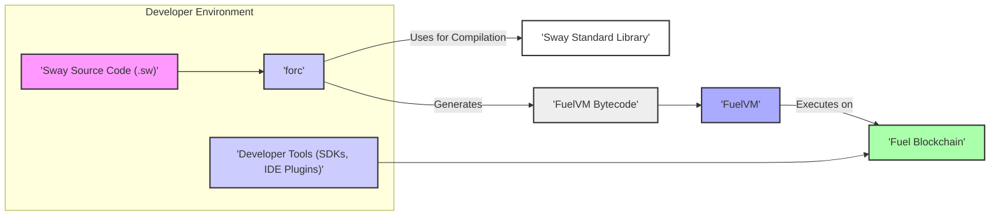
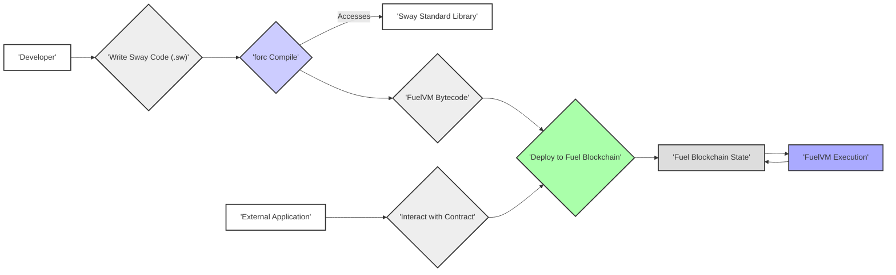

## Project Design Document: Sway Programming Language (Improved)

**1. Introduction**

This document provides an enhanced design overview of the Sway programming language project, as represented by the repository at [https://github.com/fuellabs/sway](https://github.com/fuellabs/sway). This iteration aims to provide a more granular understanding of the system's architecture, components, and data flows, specifically tailored for subsequent threat modeling activities.

**1.1. Purpose**

The primary purpose of this document is to offer a refined and more detailed design description of the Sway programming language and its associated ecosystem. This enhanced description will empower security professionals to more effectively pinpoint potential vulnerabilities and threats within the system.

**1.2. Scope**

This document expands on the core components of the Sway project, providing more detail on:

* The nuances of the Sway language, including its safety features and limitations.
* The functionalities of the `forc` build tool and compiler, including its dependency management and code generation processes.
* The structure and key modules within the standard library, highlighting potentially sensitive areas.
* The interaction of Sway with the FuelVM (Fuel Virtual Machine), focusing on the interface and data exchange.
* High-level interactions with the Fuel blockchain, including deployment and transaction execution.
* Developer tooling (SDKs, IDE integrations), with a focus on their potential security implications.

As before, this document does not delve into the internal implementation details of the FuelVM or the Fuel blockchain itself, maintaining focus on Sway's role and interactions within that ecosystem.

**1.3. Goals**

The goals of this enhanced design document are to:

* Provide a clearer and more detailed description of the Sway project's architecture, emphasizing security-relevant aspects.
* Identify the key components and their relationships with greater specificity.
* Describe the data flow within the system with more granularity, highlighting potential points of compromise.
* Highlight potential areas of security concern from a design perspective with more concrete examples.
* Serve as a more robust and informative reference point for future threat modeling exercises.

**2. System Overview**

Sway is a purpose-built language for crafting smart contracts that execute on the FuelVM. Its design prioritizes developer experience while incorporating strong safety features. The project's core elements are the Sway language itself, the `forc` compiler, and their seamless integration with the Fuel ecosystem.

**3. Architectural Design**

The Sway project comprises several interconnected components, each with distinct responsibilities. The following list details these components with added context for security considerations:

* **Sway Language:**  This encompasses the language's syntax, semantics, and type system. Key security-relevant aspects include:
    * Memory safety features designed to prevent common vulnerabilities.
    * Built-in mechanisms for handling errors and exceptions.
    * Limitations on certain operations to enhance security.
* **`forc` (Fuel Orchestrator):** This command-line tool is central to the Sway development lifecycle. Its security-relevant functions include:
    * Compilation of Sway code into FuelVM bytecode, a critical stage where vulnerabilities could be introduced.
    * Dependency management, which requires secure handling of external libraries to prevent supply chain attacks.
    * Project building and management, potentially involving sensitive configuration data.
    * Interaction with the Fuel blockchain for deployment, requiring secure key management and transaction signing.
* **Sway Standard Library:** This library provides essential functionalities for Sway developers. Security considerations include:
    * The presence of cryptographic primitives, which must be implemented and used correctly to avoid vulnerabilities.
    * Modules for interacting with the FuelVM, which must be secure to prevent unauthorized access or manipulation.
    * Data structures and utilities, which should be designed to prevent common programming errors that could lead to security issues.
* **FuelVM (Fuel Virtual Machine):** This is the runtime environment for compiled Sway contracts. While not directly part of the Sway project, its security is paramount:
    * It interprets the bytecode generated by `forc`.
    * It enforces the security rules of the Fuel platform.
    * It manages the execution environment and resource allocation for smart contracts.
* **Fuel Blockchain:** The underlying distributed ledger provides immutability and consensus. Security considerations from Sway's perspective include:
    * The target environment for deployed Sway contracts.
    * The mechanism for storing and retrieving contract state.
    * The transaction model used to interact with contracts.
* **Developer Tools:** These tools enhance the developer experience and can have security implications:
    * **SDKs (Software Development Kits):** Allow external applications to interact with deployed Sway contracts. Secure design is crucial to prevent vulnerabilities in interacting applications.
    * **IDE Plugins:** Provide features like syntax highlighting and code completion. While generally less critical, vulnerabilities in plugins could potentially expose developer environments.

**3.1. Component Diagram**

**4. Data Flow**

The following list provides a more detailed breakdown of the data flow within the Sway ecosystem, highlighting potential security implications at each stage:

* **Development:** A developer creates Sway source code (`.sw` files). This stage introduces the potential for human error and the inclusion of vulnerabilities in the code itself.
* **Compilation:** The developer invokes the `forc` tool to compile the Sway source code.
    * `forc` reads the source code and any specified dependencies. Malicious dependencies could be introduced at this stage.
    * `forc` utilizes the Sway standard library. Vulnerabilities in the standard library could be incorporated into the compiled output.
    * `forc` performs static analysis and code transformations. Errors in this process could lead to unexpected or insecure bytecode.
* **Bytecode Generation:** `forc` generates FuelVM bytecode. This bytecode represents the executable form of the smart contract. Any flaws in the compilation process can directly translate to vulnerabilities in the bytecode.
* **Deployment:** The generated bytecode is deployed to the Fuel Blockchain.
    * This typically involves a transaction signed by the developer's private key. Secure key management is crucial here.
    * The deployment transaction includes the bytecode and potentially initialization data. Malicious data could be injected at this point.
* **Execution:** When a transaction invokes a deployed Sway smart contract, the FuelVM executes the corresponding bytecode.
    * The FuelVM interprets the bytecode and interacts with the blockchain's state. Vulnerabilities in the VM could be exploited during execution.
    * Input data from the invoking transaction is processed by the contract. Improper input validation can lead to vulnerabilities.
* **State Interaction:** The FuelVM interacts with the Fuel Blockchain's state to read and write data as defined by the smart contract's logic. Access control mechanisms within the contract and the FuelVM are critical here.
* **External Interaction:** External applications interact with deployed Sway contracts on the Fuel Blockchain using SDKs.
    * SDKs must be designed securely to prevent vulnerabilities in interacting applications from being exploited through the contract.
    * Communication between external applications and the blockchain needs to be secure to prevent tampering or eavesdropping.

**4.1. Data Flow Diagram**

**5. Security Considerations (Detailed)**

This section expands on the initial security considerations, providing more specific examples of potential threats:

* **Compiler Security (`forc`):**
    * **Threat:** Maliciously crafted Sway code could exploit vulnerabilities in the compiler to generate unintended or malicious bytecode.
    * **Threat:** Supply chain attacks targeting `forc` dependencies could introduce vulnerabilities into the compiler itself.
    * **Threat:** Bugs in the compiler's optimization passes could inadvertently introduce security flaws.
* **Standard Library Security:**
    * **Threat:** Vulnerabilities in cryptographic primitives within the standard library could lead to weaknesses in signature verification or encryption.
    * **Threat:** Bugs in modules interacting with the FuelVM could allow for unauthorized access or manipulation of contract state.
    * **Threat:** Integer overflows or underflows in standard library functions could be exploited by smart contracts.
* **FuelVM Security:**
    * **Threat:** While outside the direct scope of Sway, vulnerabilities in the FuelVM's bytecode interpreter could allow for sandbox escapes or other critical exploits.
    * **Threat:** Issues with the FuelVM's resource management could lead to denial-of-service attacks against smart contracts.
* **Smart Contract Logic:**
    * **Threat:** Reentrancy vulnerabilities could allow attackers to drain contract funds.
    * **Threat:** Integer overflows or underflows in contract logic could lead to unexpected behavior and potential exploits.
    * **Threat:** Incorrect access control implementations could allow unauthorized users to perform privileged actions.
    * **Threat:** Logic errors in handling user input could lead to vulnerabilities like cross-site scripting (if the contract interacts with external systems) or data corruption.
* **Dependency Management:**
    * **Threat:** Using vulnerable or malicious external libraries could introduce security flaws into Sway projects.
    * **Threat:** Compromised package repositories could distribute malicious dependencies.
* **Deployment Process:**
    * **Threat:** Compromised developer private keys could allow attackers to deploy malicious contracts or update existing ones.
    * **Threat:** Vulnerabilities in deployment tools could be exploited to inject malicious code during deployment.
* **Access Control:**
    * **Threat:** Flawed access control mechanisms within smart contracts could allow unauthorized access to sensitive functions or data.
    * **Threat:** Incorrect use of authentication and authorization patterns could lead to security breaches.
* **Data Privacy:**
    * **Threat:** Sensitive data stored on the public Fuel Blockchain is inherently visible. Sway contracts need to be designed to handle sensitive information appropriately, potentially using encryption.
    * **Threat:** Improper handling of private data within contract logic could lead to unintended disclosure.

**6. Future Considerations**

The ongoing development of the Sway project may introduce new security considerations:

* **New Language Features:**  The introduction of new language features could create new avenues for vulnerabilities if not carefully designed and implemented.
* **Tooling Enhancements:**  New features in `forc` or other developer tools might introduce new attack surfaces or complexities that require careful security analysis.
* **Integration with other Fuel Ecosystem Components:** As the Fuel ecosystem expands, new integration points between Sway and other components will need to be assessed for potential security risks.
* **Formal Verification:** Future efforts to formally verify Sway contracts could significantly enhance security guarantees.

**7. Conclusion**

This enhanced design document provides a more detailed and security-focused overview of the Sway programming language project. By elaborating on the components, data flows, and potential threats, this document serves as a more robust foundation for comprehensive threat modeling activities. Understanding the nuances of Sway's design is crucial for identifying and mitigating potential security risks within the Fuel ecosystem.