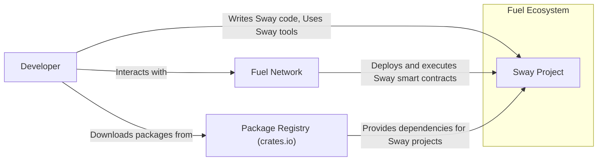
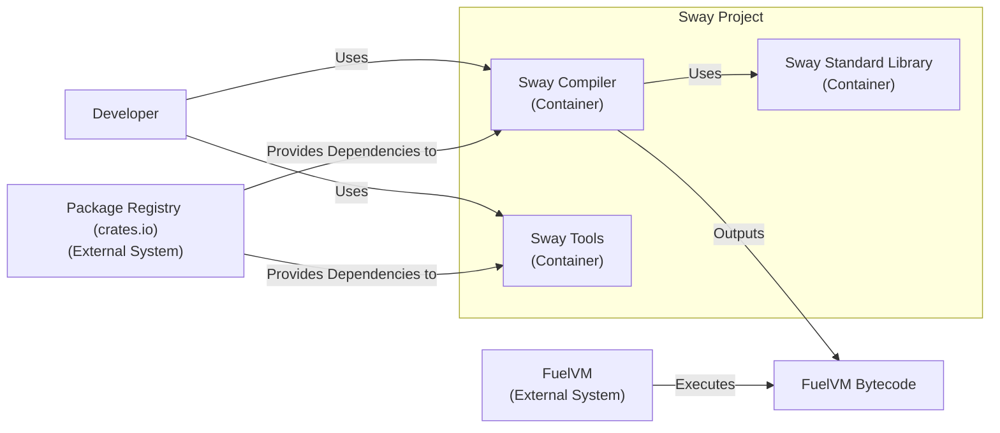
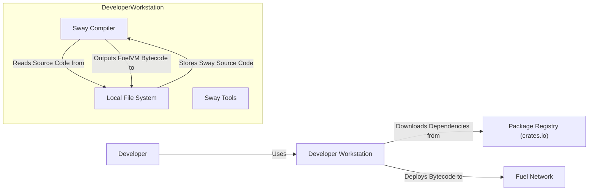
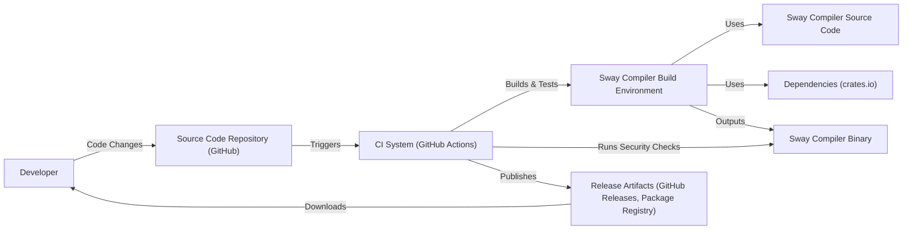

# BUSINESS POSTURE

- Business Priorities and Goals:
  - Enable developers to build secure and efficient smart contracts and decentralized applications (dApps) on the Fuel Network.
  - Foster a thriving ecosystem around the Sway programming language and FuelVM.
  - Provide a developer-friendly language with strong security features to minimize vulnerabilities in smart contracts.
  - Promote the adoption of Fuel Network by offering a robust and secure development platform.
- Business Risks:
  - Security vulnerabilities in the Sway language or compiler could lead to exploits in smart contracts deployed on Fuel Network, damaging the reputation and security of the ecosystem.
  - Lack of developer adoption due to complexity, poor documentation, or competition from other smart contract languages.
  - Performance issues or limitations in the Sway language or FuelVM hindering the development of complex and efficient dApps.
  - Supply chain attacks targeting Sway dependencies or build tools could compromise the security of the entire ecosystem.
  - Regulatory uncertainty surrounding blockchain and smart contract technologies could impact the adoption and long-term viability of Sway and Fuel Network.

# SECURITY POSTURE

- Existing Security Controls:
  - security control: Code review process for Sway compiler and standard library (location: GitHub repository - pull request reviews).
  - security control: Fuzzing and automated testing of the Sway compiler (location: GitHub repository - CI workflows and testing infrastructure).
  - security control: Static analysis tools used in development (location: potentially integrated into development workflows, but details not explicitly provided in the repository).
  - security control: Dependency management using `cargo` and `crates.io` (location: `Cargo.toml` files in the repository).
  - security control: Open source nature of the project allowing for community security audits and contributions (location: GitHub repository).
- Accepted Risks:
  - accepted risk: Potential for undiscovered vulnerabilities in the Sway language or compiler due to the complexity of language design and compiler implementation.
  - accepted risk: Reliance on third-party dependencies from `crates.io` which may contain vulnerabilities.
  - accepted risk: Security of developer environments and build pipelines is the responsibility of individual developers and projects using Sway.
- Recommended Security Controls:
  - security control: Implement regular security audits by external security experts focusing on the Sway language, compiler, and core libraries.
  - security control: Establish a vulnerability disclosure program to encourage responsible reporting of security issues.
  - security control: Integrate automated security scanning tools (SAST, DAST, dependency scanning) into the CI/CD pipeline for Sway projects.
  - security control: Provide secure coding guidelines and best practices for Sway developers to minimize common smart contract vulnerabilities.
  - security control: Implement supply chain security measures, such as dependency pinning and verification, to mitigate risks from compromised dependencies.
- Security Requirements:
  - Authentication: Not directly applicable to the Sway language itself, but relevant for related tools and services like package registries or developer platforms. Authentication mechanisms should be robust and follow industry best practices (e.g., OAuth 2.0, API keys).
  - Authorization: Authorization is crucial for smart contracts written in Sway. The language and runtime environment should provide mechanisms for defining and enforcing access control policies within smart contracts. This is likely handled by the FuelVM and smart contract logic.
  - Input Validation: Sway and its standard library must provide robust mechanisms for input validation to prevent common smart contract vulnerabilities like injection attacks and unexpected behavior due to malformed inputs. This should be a core focus of the language design and developer tooling.
  - Cryptography: Sway needs to provide secure and easy-to-use cryptographic libraries for developers to implement cryptographic operations within smart contracts. These libraries should be well-vetted and resistant to common cryptographic vulnerabilities. The standard library should include secure implementations of necessary cryptographic primitives.

# DESIGN

## C4 CONTEXT

- Elements of Context Diagram:
  - - Name: Developer
    - Type: Person
    - Description: Software developers who use the Sway programming language to build smart contracts and decentralized applications.
    - Responsibilities: Writes Sway code, uses Sway tools (compiler, formatter, etc.), deploys and interacts with smart contracts on the Fuel Network.
    - Security controls: Security of developer environment, secure coding practices, key management for deployment.
  - - Name: Sway Project
    - Type: Software System
    - Description: The Sway programming language, compiler, standard library, and associated tools.
    - Responsibilities: Compiling Sway code into bytecode for FuelVM, providing language features and standard libraries, enabling developers to build secure and efficient smart contracts.
    - Security controls: Secure development lifecycle, code review, automated testing, vulnerability scanning, supply chain security for dependencies.
  - - Name: Fuel Network
    - Type: Software System
    - Description: The decentralized execution environment for Sway smart contracts. A blockchain network optimized for speed and scalability.
    - Responsibilities: Executing Sway bytecode, managing smart contract state, providing consensus and security for the network.
    - Security controls: Consensus mechanism, network security, smart contract execution environment security, access control, monitoring and incident response.
  - - Name: Package Registry (crates.io)
    - Type: External System
    - Description: A public registry for Rust and Sway packages (crates). Used to manage dependencies for Sway projects.
    - Responsibilities: Hosting and distributing software packages, providing package management tools.
    - Security controls: Package integrity verification, vulnerability scanning of packages, access control for publishing packages.

## C4 CONTAINER

- Elements of Container Diagram:
  - - Name: Sway Compiler
    - Type: Container
    - Description: The Sway compiler is responsible for compiling Sway source code into FuelVM bytecode. It includes the parser, type checker, code generator, and optimizer.
    - Responsibilities: Compiling Sway code, performing static analysis, optimizing bytecode, managing dependencies.
    - Security controls: Input validation of source code, secure compilation process, prevention of compiler vulnerabilities, supply chain security for compiler dependencies, output validation of bytecode.
  - - Name: Sway Standard Library
    - Type: Container
    - Description: A collection of pre-built modules and functions that provide essential functionalities for Sway developers, such as data structures, cryptographic primitives, and utility functions.
    - Responsibilities: Providing secure and efficient implementations of common functionalities, reducing development effort, promoting code reuse.
    - Security controls: Code review, security audits of standard library modules, vulnerability scanning, input validation for library functions, secure implementation of cryptographic primitives.
  - - Name: Sway Tools
    - Type: Container
    - Description: A set of command-line tools and utilities that enhance the Sway development experience, such as a formatter, language server, and package manager integration.
    - Responsibilities: Improving developer productivity, providing code formatting and analysis, managing Sway projects and dependencies.
    - Security controls: Input validation for tool commands and arguments, secure handling of project files and dependencies, protection against tool vulnerabilities.
  - - Name: FuelVM Bytecode
    - Type: Data Store / Artifact
    - Description: The compiled output of the Sway compiler, which is the executable code for the FuelVM.
    - Responsibilities: Representing the compiled smart contract logic in a format that can be executed by the FuelVM.
    - Security controls: Integrity checks to ensure bytecode is not tampered with after compilation, secure storage and transmission of bytecode.
  - - Name: FuelVM
    - Type: External System
    - Description: The Fuel Virtual Machine, a high-performance virtual machine designed for executing smart contracts on the Fuel Network.
    - Responsibilities: Executing FuelVM bytecode, managing smart contract state, providing a secure and deterministic execution environment.
    - Security controls: VM isolation, sandboxing, secure execution environment, resource management, vulnerability patching.
  - - Name: Package Registry (crates.io)
    - Type: External System
    - Description: A public registry for Rust and Sway packages (crates). Used to manage dependencies for Sway projects.
    - Responsibilities: Hosting and distributing software packages, providing package management tools.
    - Security controls: Package integrity verification, vulnerability scanning of packages, access control for publishing packages.

## DEPLOYMENT

- Possible Deployment Architectures:
  - Developer Workstation: Sway compiler and tools are installed on developer machines for local development and testing.
  - CI/CD Pipeline: Sway compiler and tools are used in CI/CD pipelines to build and test Sway projects automatically.
  - Fuel Network Nodes: Sway smart contracts (compiled bytecode) are deployed and executed on Fuel Network nodes.

- Detailed Deployment Architecture (Developer Workstation):

- Elements of Deployment Diagram (Developer Workstation):
  - - Name: Developer Workstation
    - Type: Infrastructure
    - Description: The local computer used by a developer to write, compile, and test Sway code.
    - Responsibilities: Hosting the Sway compiler and tools, providing a development environment, storing source code and build artifacts.
    - Security controls: Operating system security, endpoint security software, access control, secure configuration of development tools.
  - - Name: Sway Compiler
    - Type: Software
    - Description: Instance of the Sway compiler running on the developer workstation.
    - Responsibilities: Compiling Sway code into FuelVM bytecode.
    - Security controls: Input validation, secure compilation process, protection against vulnerabilities.
  - - Name: Sway Tools
    - Type: Software
    - Description: Instance of Sway development tools running on the developer workstation.
    - Responsibilities: Providing utilities for development, such as formatting, testing, and package management.
    - Security controls: Input validation, secure tool execution, protection against vulnerabilities.
  - - Name: Local File System
    - Type: Data Store
    - Description: The file system on the developer workstation used to store Sway source code, project files, and build artifacts.
    - Responsibilities: Persisting project data, providing access to files for development tools.
    - Security controls: File system permissions, access control, data encryption (optional).
  - - Name: Package Registry (crates.io)
    - Type: External Service
    - Description: The public package registry accessed by the developer workstation to download Sway and Rust dependencies.
    - Responsibilities: Providing software packages, managing package versions.
    - Security controls: HTTPS for communication, package integrity verification (handled by package manager).
  - - Name: Fuel Network
    - Type: External System
    - Description: The Fuel Network where compiled Sway smart contracts are deployed.
    - Responsibilities: Executing deployed smart contracts.
    - Security controls: Network security, smart contract execution environment security.

## BUILD

- Elements of Build Diagram:
  - - Name: Developer
    - Type: Person
    - Description: Software developers contributing to the Sway project.
    - Responsibilities: Writing code, submitting code changes, participating in code reviews.
    - Security controls: Secure development practices, code review, access control to source code repository.
  - - Name: Source Code Repository (GitHub)
    - Type: Code Repository
    - Description: GitHub repository hosting the Sway project source code.
    - Responsibilities: Version control, code collaboration, change tracking.
    - Security controls: Access control, branch protection, audit logging, vulnerability scanning of repository.
  - - Name: CI System (GitHub Actions)
    - Type: Automation System
    - Description: GitHub Actions used for continuous integration and continuous delivery of the Sway project.
    - Responsibilities: Automating build, test, and release processes, running security checks.
    - Security controls: Secure CI/CD pipeline configuration, access control to CI/CD workflows, secret management, build environment security.
  - - Name: Sway Compiler Build Environment
    - Type: Build Environment
    - Description: The environment where the Sway compiler is built, typically a containerized or virtualized environment.
    - Responsibilities: Providing a consistent and reproducible build environment, isolating the build process.
    - Security controls: Hardened build environment, minimal software installed, access control, regular patching.
  - - Name: Sway Compiler Source Code
    - Type: Data Store
    - Description: The source code of the Sway compiler retrieved from the source code repository.
    - Responsibilities: Providing the code to be compiled.
    - Security controls: Integrity checks to ensure source code is not tampered with.
  - - Name: Dependencies (crates.io)
    - Type: External Service
    - Description: Package registry providing dependencies required to build the Sway compiler.
    - Responsibilities: Providing necessary libraries and tools for the build process.
    - Security controls: Dependency pinning, vulnerability scanning of dependencies, integrity verification of downloaded packages.
  - - Name: Sway Compiler Binary
    - Type: Artifact
    - Description: The compiled binary of the Sway compiler.
    - Responsibilities: Executing compilation of Sway code.
    - Security controls: Integrity checks of the binary, code signing (optional).
  - - Name: Security Checks
    - Type: Process
    - Description: Automated security checks performed on the Sway compiler binary and codebase during the CI/CD pipeline, such as SAST, linters, and dependency scanning.
    - Responsibilities: Identifying potential security vulnerabilities and code quality issues.
    - Security controls: Configuration of security scanning tools, vulnerability reporting and management.
  - - Name: Release Artifacts (GitHub Releases, Package Registry)
    - Type: Artifact Store
    - Description: Location where release artifacts, including the Sway compiler binary, are published.
    - Responsibilities: Distributing release artifacts to developers.
    - Security controls: Access control, integrity checks of release artifacts, secure distribution channels.

# RISK ASSESSMENT

- Critical Business Processes:
  - Development and release of the Sway compiler and tools.
  - Adoption and usage of Sway for building smart contracts on Fuel Network.
  - Maintaining the security and integrity of the Sway ecosystem.
- Data to Protect and Sensitivity:
  - Sway compiler source code: High sensitivity - compromise could lead to malicious compiler versions.
  - Sway compiler binaries: High sensitivity - compromise could lead to distribution of backdoored compilers.
  - Developer private keys: High sensitivity - compromise could lead to unauthorized deployments and control of smart contracts.
  - Smart contract source code: Medium to High sensitivity - depending on the contract's functionality and data it manages.
  - Fuel Network transaction data: Medium sensitivity - contains information about smart contract interactions and value transfers.

# QUESTIONS & ASSUMPTIONS

- Questions:
  - What specific static analysis tools are currently used in the Sway development process?
  - Is there a formal vulnerability disclosure program in place for the Sway project?
  - Are there any plans for external security audits of the Sway language and compiler?
  - What are the specific security mechanisms implemented in the FuelVM to protect against malicious smart contracts?
  - What are the performance considerations for cryptographic operations within Sway smart contracts?
- Assumptions:
  - BUSINESS POSTURE: The primary business goal is to enable secure and efficient smart contract development on the Fuel Network. Security is a high priority for the Sway project.
  - SECURITY POSTURE: The Sway project follows secure software development practices, including code review and automated testing. Security is an ongoing concern and requires continuous improvement.
  - DESIGN: The C4 model accurately represents the high-level architecture of the Sway project and its ecosystem. The deployment scenario described is a typical developer workstation setup. The build process utilizes standard CI/CD practices.