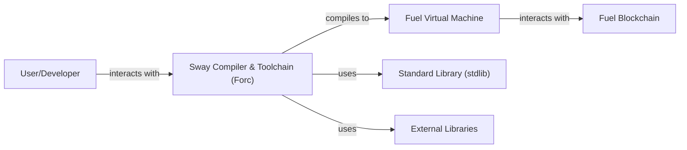
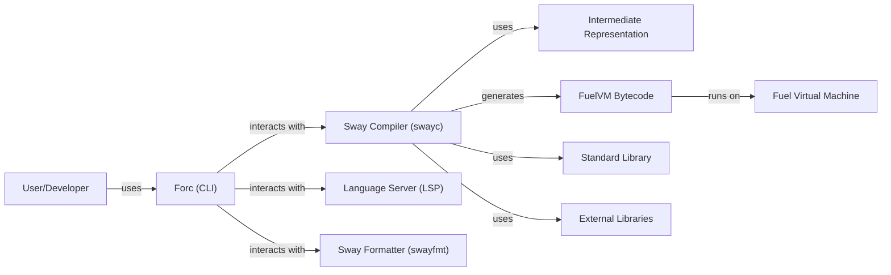
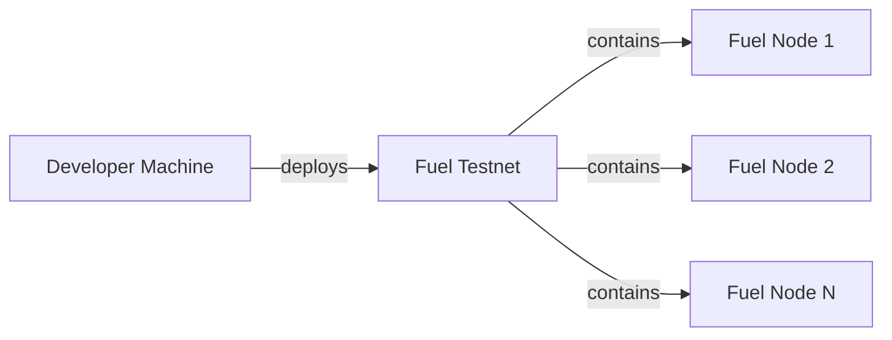
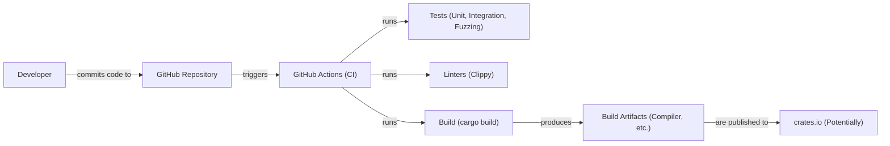

Okay, let's create a design document for the Sway project from Fuel Labs.

# BUSINESS POSTURE

Business Priorities and Goals:

*   Provide a performant and secure language (Sway) and toolchain (Forc) for writing smart contracts on the Fuel blockchain.
*   Enable developers to easily create and deploy decentralized applications (dApps) on Fuel.
*   Foster a vibrant ecosystem around the Fuel blockchain by providing best-in-class developer tooling.
*   Establish Sway as a leading language for smart contract development, emphasizing safety and efficiency.
*   Attract developers from other blockchain ecosystems (e.g., Solidity/Ethereum, Rust/Solana).

Most Important Business Risks:

*   Critical vulnerabilities in the Sway compiler or virtual machine could lead to exploits and loss of funds for users of dApps built with Sway.
*   Poor performance or usability of the Sway language and toolchain could hinder developer adoption and limit the growth of the Fuel ecosystem.
*   Failure to keep up with evolving blockchain technology and developer needs could make Sway obsolete.
*   Competition from other smart contract languages and platforms could limit Sway's market share.
*   Lack of comprehensive documentation and educational resources could make it difficult for developers to learn and use Sway effectively.

# SECURITY POSTURE

Existing Security Controls:

*   security control: The Sway language is designed with security in mind, drawing inspiration from Rust's strong type system and memory safety features. (Described in Sway documentation and source code).
*   security control: The project uses fuzzing (specifically `cargo fuzz`) to test for potential vulnerabilities. (Visible in the project's build and test scripts).
*   security control: The project includes unit tests and integration tests to ensure the correctness of the compiler and related tools. (Visible in the project's directory structure and test files).
*   security control: The project uses linters (e.g., `clippy`) to enforce code style and identify potential issues. (Visible in the project's configuration files).
*   security control: The project has a Security Policy. (Visible in SECURITY.md file).
*   security control: The project uses GitHub Actions for continuous integration. (Visible in .github/workflows directory).

Accepted Risks:

*   accepted risk: The Sway language and toolchain are still under heavy development, and there may be undiscovered vulnerabilities.
*   accepted risk: The FuelVM is a relatively new virtual machine, and its security has not been as extensively battle-tested as more established VMs like the EVM.
*   accepted risk: Dependencies on external libraries could introduce vulnerabilities.

Recommended Security Controls:

*   security control: Implement a comprehensive static analysis tool specifically designed for Sway, going beyond basic linting to detect more complex security vulnerabilities.
*   security control: Establish a bug bounty program to incentivize external security researchers to find and report vulnerabilities.
*   security control: Conduct regular independent security audits of the Sway compiler, FuelVM, and related tooling.
*   security control: Develop a formal specification for the Sway language and FuelVM to facilitate formal verification efforts.
*   security control: Implement runtime checks in the FuelVM to mitigate potential exploits, even if the Sway compiler has vulnerabilities.
*   security control: Integrate Software Composition Analysis (SCA) tools to identify and manage vulnerabilities in third-party dependencies.

Security Requirements:

*   Authentication:
    *   Not directly applicable to the Sway compiler itself. Authentication is handled at the FuelVM and application levels. The compiler should ensure that compiled code correctly interacts with the authentication mechanisms provided by the FuelVM.

*   Authorization:
    *   Similar to authentication, authorization is primarily handled at the FuelVM and application levels. The Sway compiler should provide mechanisms (e.g., access control modifiers) to support secure authorization patterns within smart contracts.

*   Input Validation:
    *   The Sway compiler should encourage and facilitate secure input validation practices. This includes providing built-in types and functions that make it easy to validate data, and potentially warning about potentially unsafe input handling patterns.

*   Cryptography:
    *   The Sway standard library should provide access to well-vetted cryptographic primitives (hashing, digital signatures, etc.) that are appropriate for use in smart contracts. The compiler should ensure that these primitives are used correctly and efficiently.

# DESIGN

## C4 CONTEXT

Element Descriptions:

*   Element:
    *   Name: User/Developer
    *   Type: Person
    *   Description: A person who writes, compiles, tests, and deploys Sway smart contracts.
    *   Responsibilities: Writing Sway code, using Forc to build and manage projects, interacting with the Fuel blockchain.
    *   Security controls: Uses secure coding practices, manages their private keys securely.

*   Element:
    *   Name: Sway Compiler & Toolchain (Forc)
    *   Type: Software System
    *   Description: The core of the project. It includes the Sway compiler, package manager, and other tools for building and deploying Sway smart contracts.
    *   Responsibilities: Compiling Sway code into FuelVM bytecode, managing project dependencies, providing build and testing tools.
    *   Security controls: Fuzzing, unit testing, integration testing, linting, static analysis (recommended), security audits (recommended).

*   Element:
    *   Name: Fuel Virtual Machine
    *   Type: Software System
    *   Description: The runtime environment for executing Sway smart contracts on the Fuel blockchain.
    *   Responsibilities: Executing bytecode, managing state, interacting with the Fuel blockchain.
    *   Security controls: Runtime checks (recommended), formal verification (recommended), security audits (recommended).

*   Element:
    *   Name: Fuel Blockchain
    *   Type: Software System
    *   Description: The underlying blockchain platform that Sway and the FuelVM are designed for.
    *   Responsibilities: Maintaining the distributed ledger, validating transactions, providing consensus.
    *   Security controls: Consensus mechanisms, cryptographic protocols, node security.

*   Element:
    *   Name: Standard Library (stdlib)
    *   Type: Software Library
    *   Description: A collection of pre-built modules and functions that provide common functionality for Sway programs.
    *   Responsibilities: Providing reusable code for common tasks, ensuring consistency and efficiency.
    *   Security controls: Thoroughly tested and reviewed, security audits (recommended).

*   Element:
    *   Name: External Libraries
    *   Type: Software Library
    *   Description: Third-party libraries that Sway projects may depend on.
    *   Responsibilities: Providing additional functionality not included in the standard library.
    *   Security controls: Software Composition Analysis (SCA) (recommended), careful selection and vetting of dependencies.

## C4 CONTAINER

Element Descriptions:

*   Element:
    *   Name: Forc (CLI)
    *   Type: Command-Line Interface
    *   Description: The primary command-line tool for interacting with Sway projects.
    *   Responsibilities: Managing projects, building, testing, deploying.
    *   Security controls: Input validation, secure handling of configuration files.

*   Element:
    *   Name: Sway Compiler (swayc)
    *   Type: Compiler
    *   Description: The core compiler that translates Sway source code into FuelVM bytecode.
    *   Responsibilities: Lexing, parsing, type checking, code generation.
    *   Security controls: Fuzzing, unit testing, integration testing, static analysis (recommended).

*   Element:
    *   Name: Language Server (LSP)
    *   Type: Server
    *   Description: Provides language support features for IDEs and text editors (e.g., autocompletion, diagnostics).
    *   Responsibilities: Providing real-time feedback to developers.
    *   Security controls: Input validation, sandboxing (recommended).

*   Element:
    *   Name: Sway Formatter (swayfmt)
    *   Type: Tool
    *   Description: Automatically formats Sway code according to a consistent style.
    *   Responsibilities: Enforcing code style, improving readability.
    *   Security controls: Input validation.

*   Element:
    *   Name: Intermediate Representation (IR)
    *   Type: Data Structure
    *   Description: An internal representation of the Sway code used by the compiler during optimization and code generation.
    *   Responsibilities: Facilitating compiler optimizations.
    *   Security controls: Internal consistency checks.

*   Element:
    *   Name: FuelVM Bytecode
    *   Type: Data
    *   Description: The compiled output of the Sway compiler, ready to be executed on the FuelVM.
    *   Responsibilities: Representing the executable logic of the smart contract.
    *   Security controls: Code signing (recommended).

*   Element:
    *   Name: Fuel Virtual Machine
    *   Type: Software System
    *   Description: The runtime environment for executing Sway smart contracts.
    *   Responsibilities: Executing bytecode, managing state.
    *   Security controls: Runtime checks (recommended), formal verification (recommended).

*   Element:
    *   Name: Standard Library
    *   Type: Software Library
    *   Description: Pre-built Sway modules.
    *   Responsibilities: Providing common functionality.
    *   Security controls: Thorough testing, security audits (recommended).

*   Element:
    *   Name: External Libraries
    *   Type: Software Library
    *   Description: Third-party Sway libraries.
    *   Responsibilities: Providing additional functionality.
    *   Security controls: SCA (recommended), vetting.

## DEPLOYMENT

Possible Deployment Solutions:

1.  Local Fuel Node: For development and testing, developers can run a local instance of a Fuel node.
2.  Testnet: Fuel Labs provides a public testnet for testing applications in a more realistic environment.
3.  Mainnet: Once thoroughly tested, applications can be deployed to the Fuel mainnet.

Chosen Solution (Testnet Deployment):

Element Descriptions:

*   Element:
    *   Name: Developer Machine
    *   Type: Infrastructure
    *   Description: The developer's local machine where they write and build Sway code.
    *   Responsibilities: Running Forc, compiling code, initiating deployments.
    *   Security controls: Secure development environment, secure key management.

*   Element:
    *   Name: Fuel Testnet
    *   Type: Network
    *   Description: A publicly accessible network of Fuel nodes used for testing.
    *   Responsibilities: Simulating the mainnet environment.
    *   Security controls: Network security, node security.

*   Element:
    *   Name: Fuel Node 1, Fuel Node 2, Fuel Node N
    *   Type: Server
    *   Description: Individual nodes in the Fuel Testnet.
    *   Responsibilities: Running the FuelVM, validating transactions, participating in consensus.
    *   Security controls: Node security, network security, regular updates.

## BUILD

Build Process Description:

1.  Developers write Sway code and commit it to the GitHub repository.
2.  GitHub Actions, configured in the `.github/workflows` directory, are triggered by commits and pull requests.
3.  The CI workflow performs several checks:
    *   Runs unit tests and integration tests using `cargo test`.
    *   Runs fuzzing tests using `cargo fuzz`.
    *   Runs linters like `clippy` to enforce code style and identify potential issues.
    *   Builds the project using `cargo build`.
4.  If all checks pass, build artifacts (the compiler, tools, etc.) are produced.
5.  Potentially, these artifacts could be published to `crates.io` (the Rust package registry) or another repository.

Security Controls:

*   security control: Continuous Integration (GitHub Actions): Automates the build and testing process, ensuring that all code changes are thoroughly checked before being merged.
*   security control: Automated Testing: Unit tests, integration tests, and fuzzing tests help to identify vulnerabilities early in the development lifecycle.
*   security control: Linting (Clippy): Enforces code style and identifies potential code quality and security issues.
*   security control: Dependency Management (Cargo): Manages project dependencies, allowing for tracking and updating of external libraries. (SCA tools are recommended to enhance this).

# RISK ASSESSMENT

Critical Business Processes to Protect:

*   The compilation process: Ensuring that the Sway compiler correctly translates source code into secure and efficient bytecode.
*   The execution of smart contracts: Protecting the FuelVM from vulnerabilities that could lead to exploits.
*   The integrity of the Fuel blockchain: Preventing attacks that could compromise the consensus mechanism or the validity of transactions.

Data to Protect and Sensitivity:

*   Sway source code (Medium Sensitivity): While often public, source code may contain intellectual property or reveal potential vulnerabilities before they are patched.
*   FuelVM bytecode (High Sensitivity): Maliciously crafted bytecode could exploit vulnerabilities in the VM.
*   Smart contract state (High Sensitivity): This data represents the state of dApps and often includes user funds and sensitive information.
*   Private keys (Extremely High Sensitivity): Private keys control access to funds and must be protected with the utmost care. (This is primarily a concern for users and developers, not the Sway compiler itself, but the compiler should facilitate secure key management practices).

# QUESTIONS & ASSUMPTIONS

Questions:

*   What is the specific threat model used by Fuel Labs for the Sway project?
*   Are there any existing security audits or formal verification efforts for Sway or the FuelVM?
*   What is the process for reporting and handling security vulnerabilities?
*   What are the plans for long-term maintenance and support of Sway?
*   Are there plans to integrate with specific hardware security modules (HSMs) or other secure enclaves?

Assumptions:

*   BUSINESS POSTURE: Fuel Labs prioritizes security and is willing to invest in the necessary resources to ensure the safety of the Sway language and toolchain.
*   SECURITY POSTURE: The existing security controls (fuzzing, testing, linting) are implemented effectively and regularly maintained.
*   DESIGN: The design of Sway and the FuelVM is fundamentally sound and does not contain any inherent security flaws. The provided GitHub repository is the main, up-to-date source of truth for the project.