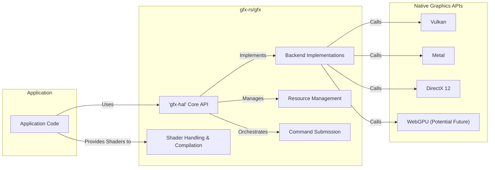
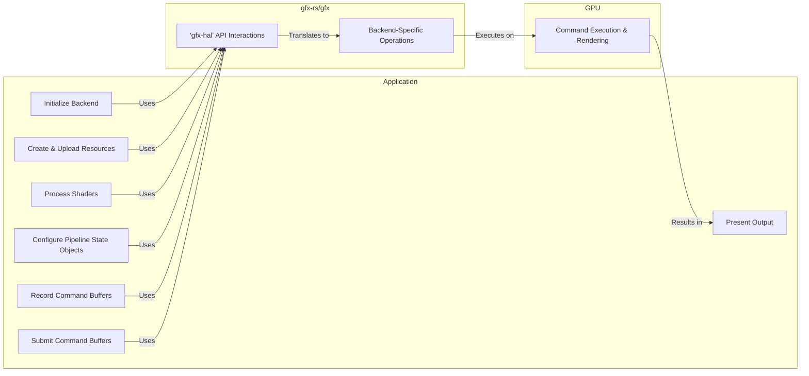

# Project Design Document: gfx-rs/gfx

**Version:** 1.1
**Date:** October 26, 2023
**Author:** Gemini (AI Language Model)

## 1. Introduction

This document provides a detailed design overview of the `gfx-rs/gfx` project, intended to facilitate threat modeling. It describes the system's architecture, key components, and data flow, highlighting security considerations relevant for identifying potential vulnerabilities.

### 1.1. Purpose

The primary goal of this document is to provide a comprehensive architectural understanding of `gfx-rs/gfx` for effective threat modeling. This understanding is crucial for security engineers to identify potential attack surfaces and design appropriate mitigations.

### 1.2. Scope

This document details the high-level architecture and core components of the `gfx-rs/gfx` library, focusing on aspects relevant to graphics rendering and resource management. While it touches upon backend implementations (Vulkan, Metal, DirectX), it primarily focuses on their interaction with the core `gfx-hal` API rather than their internal specifics.

### 1.3. Audience

This document is intended for:

* Security engineers and architects performing threat modeling on `gfx-rs/gfx`.
* Developers contributing to or utilizing the `gfx-rs/gfx` library.
* Anyone requiring a detailed understanding of the project's architecture from a security perspective.

## 2. System Overview

`gfx-rs/gfx` is a low-level, cross-platform graphics abstraction layer written in Rust. Its primary function is to provide a unified API (`gfx-hal`) that allows developers to interact with diverse native graphics APIs (like Vulkan, Metal, and DirectX 12) without writing platform-specific code. This abstraction simplifies cross-platform graphics development while aiming for performance close to native implementations. The library leverages Rust's memory safety features to enhance the security and robustness of graphics applications.

## 3. System Architecture

The `gfx-rs/gfx` architecture comprises the following key components:

* **Core Abstraction Layer (`gfx-hal`):** This is the heart of `gfx-rs`, defining a platform-agnostic API for interacting with graphics hardware. It exposes traits and structures representing fundamental graphics concepts such as:
    * **Devices and Adapters:** Representing physical and logical graphics devices.
    * **Queues:**  For submitting command buffers to the GPU.
    * **Command Allocators and Buffers:** Used to record and submit sequences of graphics commands.
    * **Resources (Buffers, Textures, Images):** Representing data used in rendering.
    * **Render Passes and Framebuffers:** Defining the rendering process and its targets.
    * **Pipeline State Objects (PSOs):** Encapsulating the configuration of the graphics pipeline.
* **Backend Implementations:** These are separate crates that implement the `gfx-hal` traits for specific graphics APIs. Each backend acts as a translator, converting the generic `gfx-hal` calls into the native API calls of the target platform. Examples include:
    * `gfx-backend-vulkan`: Implements `gfx-hal` for the Vulkan API.
    * `gfx-backend-metal`: Implements `gfx-hal` for Apple's Metal API.
    * `gfx-backend-dx12`: Implements `gfx-hal` for Microsoft's DirectX 12 API.
* **Shader Handling:** While not a distinct component within `gfx-hal`, the process of loading, compiling, and managing shaders is crucial. `gfx-rs` often relies on external tools or libraries for shader compilation (e.g., `shaderc`, `glslang`). The compiled shader bytecode is then loaded and used to create PSOs.
* **Resource Management System:** This encompasses the mechanisms for creating, allocating, tracking, and destroying graphics resources. `gfx-hal` provides interfaces for managing the lifecycle of buffers, textures, and other GPU-resident data. Proper resource management is critical for preventing memory leaks and ensuring efficient GPU utilization.
* **Command Submission System:** This part of the architecture deals with the process of recording commands into command buffers and submitting them to the GPU for execution. It involves synchronization primitives to manage dependencies between different command buffers and ensure correct execution order.

## 4. Data Flow

The typical data flow within a `gfx-rs` application follows these steps:

1. **Initialization:** The application selects and initializes a specific graphics backend through the `gfx-hal` API. This involves choosing a GPU adapter and creating a logical device instance.
2. **Resource Creation & Upload:** The application creates graphics resources (textures, buffers, etc.) using `gfx-hal` API calls. This often involves providing initial data that needs to be uploaded to the GPU's memory.
3. **Shader Processing:** Shader source code (e.g., GLSL, HLSL) is loaded and compiled, potentially using external tools. The resulting shader bytecode is then used to create shader modules within `gfx-hal`.
4. **Pipeline State Object (PSO) Configuration:** The application defines the rendering pipeline by creating PSOs. This involves specifying shader stages, vertex input formats, rasterization settings, blending modes, and other rendering parameters.
5. **Command Buffer Recording:** The application records sequences of graphics commands into command buffers. These commands instruct the GPU on how to perform rendering operations, such as binding resources, setting pipeline states, and issuing draw calls.
6. **Command Buffer Submission:** The recorded command buffers are submitted to a queue associated with the graphics device. This initiates the execution of the commands on the GPU.
7. **GPU Execution:** The GPU processes the commands in the submitted command buffers, performing the actual rendering tasks. This involves fetching data from resources, executing shaders, and writing the results to render targets.
8. **Presentation:** The rendered output (typically an image in a framebuffer) is presented to the display. This involves synchronizing with the display system to avoid tearing and ensure smooth visual output.

## 5. Security Considerations

Several security aspects are crucial when considering the `gfx-rs/gfx` project:

* **Input Validation and Sanitization:**
    * **Shader Code:** Malicious or crafted shader code could exploit vulnerabilities in the shader compiler or the graphics driver. Proper validation and, where possible, sanitization of shader inputs are essential.
    * **Resource Data:** Data provided for textures, buffers, and other resources should be validated to prevent buffer overflows or other memory corruption issues on the GPU.
* **Memory Safety within `gfx-rs`:** While Rust's memory safety features provide a strong foundation, unsafe code blocks within `gfx-rs` or its backend implementations could introduce vulnerabilities. Auditing these sections is important.
* **Resource Management Vulnerabilities:**
    * **Resource Exhaustion:**  An attacker might try to exhaust GPU memory or other resources by creating a large number of objects without proper cleanup, leading to denial of service.
    * **Use-After-Free:** Improper handling of resource lifetimes could lead to use-after-free vulnerabilities if resources are accessed after being deallocated.
* **Shader Vulnerabilities Exploitable via `gfx-rs`:** Even if `gfx-rs` itself is memory-safe, vulnerabilities in the underlying graphics drivers or hardware could be triggered by specific shader code patterns passed through `gfx-rs`.
* **Backend-Specific Security Issues:** Security vulnerabilities present in the native graphics APIs (Vulkan, Metal, DirectX) or their drivers could potentially be exposed or amplified through the `gfx-rs` abstraction layer.
* **Dependency Chain Security:** The security of `gfx-rs` is also dependent on the security of its dependencies, including the backend implementations, shader compilation tools, and the Rust ecosystem itself. Supply chain attacks targeting these dependencies are a concern.
* **Privilege Separation:**  While `gfx-rs` operates within the user-space of an application, vulnerabilities could potentially be chained with other exploits to escalate privileges if the underlying graphics driver has vulnerabilities.
* **Information Disclosure:**  Careless handling of GPU memory or synchronization primitives could potentially lead to information disclosure vulnerabilities, where sensitive data might be leaked.

## 6. Dependencies

`gfx-rs/gfx` relies on the following categories of dependencies:

* **Rust Standard Library:** Provides fundamental language features and utilities.
* **Backend Implementation Crates (e.g., `gfx-backend-vulkan`, `gfx-backend-metal`, `gfx-backend-dx12`):** These are essential for providing platform-specific implementations of the `gfx-hal` API. Their security is crucial.
* **Shader Compilation Libraries (e.g., `shaderc`, `glslang` bindings):** Used for compiling shader code. Vulnerabilities in these tools could be a risk.
* **System Libraries and SDKs:** The underlying native graphics APIs (Vulkan SDK, Metal framework, DirectX SDK) are required for the backend implementations to function. The security of these system components is outside the direct control of `gfx-rs`.
* **Build Tools and Dependencies (e.g., `cargo`):**  Used for building and managing the project. Security vulnerabilities in the build chain are a potential concern.

## 7. Deployment

`gfx-rs/gfx` is deployed as a library that is integrated into other Rust applications. Developers include the `gfx-hal` crate and the desired backend implementation crate as dependencies in their `Cargo.toml` file. When the application is built, these libraries are linked in. The application then uses the `gfx-hal` API to interact with the chosen graphics backend at runtime.

## 8. Future Considerations

Future development efforts for `gfx-rs/gfx` might include:

* **Expanding Backend Support:** Adding support for newer graphics APIs like WebGPU or refining existing backend implementations. Security considerations for these new APIs will need to be addressed.
* **Improved Error Handling and Security Audits:**  Focusing on more robust error handling and conducting regular security audits of the codebase, especially unsafe code sections.
* **Enhanced Validation and Sanitization:** Implementing more rigorous input validation and sanitization mechanisms for shader code and resource data.
* **Exploring Security Hardening Techniques:** Investigating techniques like sandboxing or memory isolation within the graphics context to further mitigate potential vulnerabilities.
* **Formal Security Reviews:**  Engaging external security experts to conduct formal reviews and penetration testing of the library.

This document provides a detailed architectural overview of `gfx-rs/gfx`, emphasizing aspects relevant to security. This information is intended to be a valuable resource for conducting thorough threat modeling and identifying potential security vulnerabilities within the project.