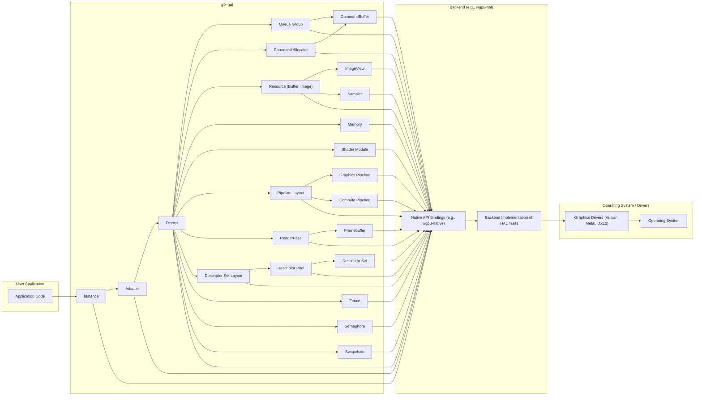

## Project Design Document: gfx-rs/gfx

**1. Introduction**

This document provides a detailed architectural overview of the `gfx-rs/gfx` project, a low-overhead, hardware-accelerated graphics API written in Rust. `gfx-rs/gfx` aims to offer a portable and performant abstraction layer over various native graphics APIs, including Vulkan, Metal, and DirectX 12. This design document details the key components, their interactions, and the data flow within the `gfx-rs/gfx` ecosystem, serving as a foundation for subsequent threat modeling activities.

**2. Goals and Objectives**

*   To provide a memory-safe and efficient Rust interface for interacting with modern GPUs.
*   To abstract the complexities and platform-specific nuances of different underlying graphics APIs.
*   To enable cross-platform graphics development, minimizing the need for platform-specific code.
*   To offer low-level control over the graphics pipeline, catering to performance-sensitive applications and libraries.
*   To facilitate the development of higher-level graphics libraries, engines, and applications within the Rust ecosystem.

**3. Overall Architecture**

`gfx-rs/gfx` employs a layered architecture, centralizing around the `gfx-hal` crate. This design promotes portability by defining a common interface that backend crates can implement for specific graphics APIs.

*   **`gfx-hal` (Hardware Abstraction Layer):** This is the core of the project. It defines a set of platform-agnostic traits and structures representing fundamental graphics concepts. This includes interfaces for managing devices, command queues, memory, and the graphics pipeline.
*   **Backends:** These are individual crates that provide concrete implementations of the `gfx-hal` traits for specific native graphics APIs. Each backend translates the generic `gfx-hal` calls into the corresponding API calls of the underlying system. Examples include:
    *   `wgpu-hal`: A backend leveraging `wgpu-native`, which itself wraps native graphics APIs.
    *   `vulkano-hal`: A backend that directly interfaces with the Vulkan API.
    *   `metal-rs-hal`: A backend for interacting with Apple's Metal API.
    *   `dx12-rs-hal`: A backend for Microsoft's DirectX 12 API.
*   **User Application:** This represents the Rust code developed by users that utilizes the `gfx-rs/gfx` API to perform graphics-related tasks. Applications primarily interact with the `gfx-hal` layer, remaining largely independent of the specific backend in use.

**4. Key Components and Their Interactions**

**Component Descriptions:**

*   **Application Code:** The user-written Rust code that orchestrates graphics operations by interacting with the `gfx-hal` API.
*   **Instance:** Represents an instance of the underlying graphics API. It's the initial entry point for interacting with the graphics system, used for enumerating available adapters.
*   **Adapter:** Represents a specific graphics processing unit (GPU), either physical or virtual, available on the system.
*   **Device:** Represents an open, logical connection to a specific `Adapter`. It's the primary interface for creating resources, command queues, and other graphics objects.
*   **Queue Group:** A collection of command queues of different types (e.g., graphics, compute, transfer) available on a `Device`.
*   **Command Allocator:** Responsible for allocating memory for command buffers.
*   **CommandBuffer:** Records a sequence of commands to be executed on a `Queue`. These commands define rendering or computation tasks.
*   **Resource (Buffer, Image):** Represents memory managed by the GPU.
    *   **Buffer:** A linear allocation of memory used for storing vertex data, indices, uniform data, and other arbitrary data.
    *   **Image:** Represents multi-dimensional arrays of pixel data, used for textures, render targets, and other image-based data.
*   **Memory:** Represents a memory allocation on the GPU, which can be bound to `Buffer` or `Image` resources.
*   **ImageView:** A view into an `Image`, defining how the image data is interpreted (format, dimensions, subresource range).
*   **Sampler:** Defines how textures are sampled, controlling filtering, addressing modes, and other sampling parameters.
*   **Shader Module:** Contains compiled shader code (e.g., SPIR-V) that will be executed on the GPU.
*   **Pipeline Layout:** Defines the interface between shaders and application-provided data, specifying the layout of descriptor sets and push constants.
*   **Graphics Pipeline:** Defines the fixed-function stages and state for rendering geometry, including vertex input, rasterization, and fragment processing.
*   **Compute Pipeline:** Defines the configuration for general-purpose computations executed on the GPU.
*   **RenderPass:** Defines the rendering targets (color and depth/stencil attachments) and the sequence of rendering operations performed.
*   **Framebuffer:** Associates specific `ImageView` objects with the attachments defined in a `RenderPass`.
*   **Descriptor Set Layout:** Specifies the types and number of resources (textures, buffers, samplers) that can be bound to a descriptor set.
*   **Descriptor Pool:** Manages the allocation of `Descriptor Set` objects.
*   **Descriptor Set:** A collection of resource bindings (e.g., textures, buffers) that can be accessed by shaders.
*   **Fence:** A synchronization primitive used to signal the completion of GPU commands on the host CPU.
*   **Semaphore:** A synchronization primitive used to signal dependencies between GPU command submissions, ensuring commands are executed in the correct order.
*   **Swapchain:** Manages a collection of framebuffers used for presenting rendered images to the display.
*   **Native API Bindings:** Rust bindings to the underlying native graphics APIs (e.g., Vulkan, Metal, DirectX 12). These are often generated using tools like `bindgen`.
*   **Backend Implementation of HAL Traits:** The code within each backend crate that provides the concrete implementation of the `gfx-hal` traits, translating the generic API calls into the specific commands of the underlying graphics API.
*   **Graphics Drivers:** Software provided by GPU vendors that translate high-level API calls into hardware instructions that the GPU can understand and execute.
*   **Operating System:** The underlying operating system that manages system resources and provides access to hardware, including the GPU.

**5. Data Flow**

The typical data flow for rendering a frame using `gfx-rs/gfx` involves the following key stages:

1. **Initialization:** The application initializes the graphics system by creating an `Instance`, selecting an appropriate `Adapter`, and opening a `Device`.
2. **Resource Creation and Management:** The application creates `Buffer` and `Image` resources to store data like vertex attributes, textures, and intermediate rendering results. This often involves allocating `Memory` and binding it to the resources. `ImageView` and `Sampler` objects are created to define how image data is accessed.
3. **Pipeline Setup:** The application creates `Shader Module` objects from compiled shader code. `Pipeline Layout` objects are created to define how resources will be bound to shaders. Finally, `Graphics Pipeline` or `Compute Pipeline` objects are created, configuring the rendering or computation stages.
4. **Descriptor Set Management:** The application allocates `Descriptor Set` objects from a `Descriptor Pool` according to a `Descriptor Set Layout`. These descriptor sets are then updated with bindings to the created `Resource` objects, making them accessible to shaders.
5. **Command Buffer Recording:** The application allocates a `Command Allocator` and then a `CommandBuffer` from a `Queue Group`. Rendering or computation commands are recorded into the command buffer. These commands include:
    *   Beginning and ending `RenderPass` instances.
    *   Binding the active `Pipeline`.
    *   Binding `Descriptor Set` objects.
    *   Binding vertex and index `Buffer` objects.
    *   Setting viewport and scissor rectangles to define the rendering area.
    *   Issuing draw calls to render primitives (triangles, lines, etc.) or dispatching compute shaders.
    *   Performing resource state transitions (e.g., transitioning a texture from a read-only to a writeable state).
6. **Command Buffer Submission:** The application submits the recorded `CommandBuffer` to a `Queue` for execution on the GPU. `Fence` and `Semaphore` objects can be used to manage synchronization and dependencies between command submissions.
7. **GPU Execution:** The graphics driver receives the command buffer and translates the commands into instructions for the GPU to execute.
8. **Synchronization:** The application can use `Fence` objects to wait for the GPU to complete the execution of submitted commands. `Semaphore` objects ensure that command buffers are executed in the correct order, especially when there are dependencies between them.
9. **Presentation (for Rendering):** For displaying rendered images, the application interacts with a `Swapchain` to acquire an image, render to it, and then present it to the display.

**Flowchart of a Typical Render Pass:**

```mermaid
graph LR
    A["Application"] --> B{"Create/Update Resources"};
    B --> C{"Create Shader Modules"};
    C --> D{"Create Pipeline Layout"};
    D --> E{"Create Graphics Pipeline"};
    E --> F{"Allocate Descriptor Sets"};
    F --> G{"Update Descriptor Sets with Resource Bindings"};
    G --> H{"Allocate Command Allocator"};
    H --> I{"Allocate Command Buffer"};
    I --> J{"Begin Command Buffer"};
    J --> K{"Begin Render Pass"};
    K --> L{"Bind Pipeline"};
    L --> M{"Bind Descriptor Sets"};
    M --> N{"Bind Vertex Buffers"};
    N --> O{"Bind Index Buffer (optional)"};
    O --> P{"Set Viewport/Scissor"};
    P --> Q{"Draw Commands"};
    Q --> R{"End Render Pass"};
    R --> S{"End Command Buffer"};
    S --> T{"Submit Command Buffer to Queue"};
    T --> U{"GPU Processing"};
    U --> V{"Signal Fence/Semaphore"};
```

**6. Security Considerations (Detailed for Threat Modeling)**

This section elaborates on potential security concerns, categorized for clarity during threat modeling.

*   **Application-Level Vulnerabilities (Misuse of the API):**
    *   **Incorrect Resource Handling:** Failure to properly manage resource lifetimes (e.g., using a resource after it's been destroyed) can lead to crashes or undefined behavior.
    *   **Synchronization Errors:** Incorrect use of fences and semaphores can result in race conditions, data corruption, or deadlocks.
    *   **Invalid API Usage:** Passing incorrect parameters or violating API usage rules can trigger driver bugs or unexpected behavior.
    *   **Shader Upload Vulnerabilities:** While `gfx-hal` doesn't directly handle shader compilation, vulnerabilities might exist in how applications manage and upload shader bytecode, potentially leading to the injection of malicious shaders.
*   **`gfx-hal` Level Vulnerabilities (Abstraction Layer Issues):**
    *   **Abstraction Leaks:** If the abstraction layer fails to properly hide the underlying API details, vulnerabilities in the native APIs might become exploitable through `gfx-hal`.
    *   **Incorrect Trait Implementations:** Bugs or vulnerabilities in the backend implementations of `gfx-hal` traits could lead to security issues specific to certain graphics APIs.
    *   **State Management Errors:** Issues in how `gfx-hal` manages the internal state of graphics objects could lead to inconsistencies or exploitable conditions.
*   **Backend-Level Vulnerabilities (Native API Interaction):**
    *   **Vulnerabilities in Native Bindings:** Security flaws in the generated or hand-written bindings to native graphics APIs could be exploited.
    *   **Incorrect API Usage in Backends:** Bugs in how backend crates interact with the underlying native APIs can lead to driver crashes or security vulnerabilities.
*   **Driver and Operating System Level Vulnerabilities:**
    *   **Driver Bugs:**  `gfx-rs/gfx` relies on the correctness and security of the underlying graphics drivers. Bugs in these drivers can be triggered by specific sequences of API calls.
    *   **Operating System Vulnerabilities:**  Security flaws in the operating system's graphics subsystem could potentially be exploited through the graphics API.
*   **Resource Exhaustion and Denial of Service:**
    *   **Excessive Resource Allocation:** Malicious applications could attempt to exhaust GPU memory or other resources by allocating an excessive number of objects.
    *   **Command Buffer Bombing:** Submitting extremely large or complex command buffers could potentially overwhelm the driver or GPU.
*   **Information Disclosure:**
    *   **Reading Uninitialized Memory:**  Bugs in resource management or API usage could potentially allow shaders or applications to read uninitialized GPU memory.
    *   **Side-Channel Attacks:** Although less likely at this level, potential side-channel attacks exploiting timing variations in GPU operations could be considered.
*   **Dependency Chain Vulnerabilities:**
    *   **Vulnerabilities in `wgpu-native` or other dependencies:** If the backend relies on other libraries, vulnerabilities in those dependencies could impact the security of `gfx-rs/gfx`.

**7. Deployment Considerations**

*   `gfx-rs/gfx` is primarily distributed as a set of Rust crates on crates.io.
*   Applications using `gfx-rs/gfx` must include the core `gfx-hal` crate and a specific backend crate (e.g., `wgpu-hal`, `vulkano-hal`) as dependencies in their `Cargo.toml` file.
*   The choice of backend depends on the target platform and the desired underlying graphics API.
*   Deployment requires ensuring that the appropriate graphics drivers are installed on the target system.
*   Cross-compilation and platform-specific build configurations might be necessary for targeting different operating systems and architectures.

**8. Future Considerations**

*   Ongoing development and refinement of the `gfx-hal` API to improve functionality and address identified issues.
*   Adding support for new features and extensions of underlying graphics APIs.
*   Performance optimization and reduction of API overhead.
*   Improvements to documentation, examples, and tooling to enhance developer experience.
*   Exploration of new backend implementations to support a wider range of platforms and graphics APIs.
*   Formal security audits and vulnerability assessments to proactively identify and address potential security concerns.

This improved design document provides a more detailed and comprehensive overview of the `gfx-rs/gfx` project, enhancing its utility for threat modeling and security analysis.
