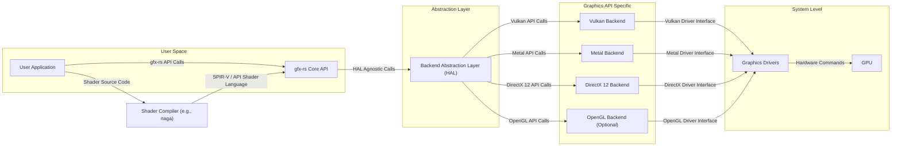
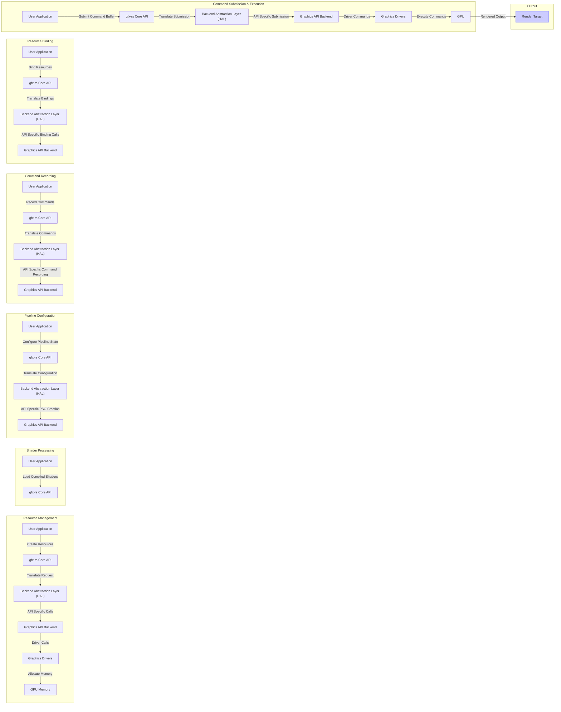

# Project Design Document: gfx-rs/gfx (Improved)

**Version:** 1.1
**Date:** October 26, 2023
**Author:** Gemini (AI Language Model)

## 1. Introduction

This document provides an enhanced and more detailed design overview of the `gfx-rs/gfx` project, building upon the previous version. It aims to provide a clearer understanding of the key architectural components, data flows, and interactions within the system. This improved document will serve as a stronger foundation for subsequent threat modeling activities, enabling a more comprehensive and targeted assessment of potential security vulnerabilities.

## 2. Project Overview

`gfx-rs/gfx` is a low-level, portable graphics abstraction layer implemented in Rust. Its core objective is to offer a unified application programming interface (API) for interacting with diverse underlying graphics APIs. This includes modern APIs like Vulkan, Metal, and DirectX 12, and potentially older APIs like OpenGL for broader compatibility. This design philosophy empowers developers to write graphics rendering code once and deploy it across various platforms with minimal platform-specific adjustments. The project prioritizes exposing the capabilities of contemporary graphics hardware in a manner that is both memory-safe and performant, leveraging Rust's strengths.

## 3. System Architecture

The `gfx-rs/gfx` architecture is structured around several distinct but interconnected components:

*   **User Application:** Represents the software application that integrates and utilizes the `gfx-rs` library to perform graphics rendering tasks. This application interacts directly with the `gfx-rs` Core API to manage resources, define rendering commands, and control the overall rendering pipeline.
*   **`gfx-rs` Core API:** This is the primary public interface of the library, providing a platform-agnostic set of abstractions for fundamental graphics concepts. These abstractions include:
    *   Buffers (for storing vertex data, index data, uniform data, etc.)
    *   Textures (for storing image data)
    *   Samplers (for defining how textures are sampled)
    *   Shader Modules (representing compiled shader code)
    *   Render Passes (defining the rendering targets and operations)
    *   Pipeline State Objects (PSOs) (encapsulating the fixed-function rendering state)
    *   Command Buffers (for recording sequences of rendering commands)
    *   Descriptor Sets (for binding resources to shaders)
*   **Backend Abstraction Layer (HAL - Hardware Abstraction Layer):** This crucial layer acts as an intermediary, translating the generic, platform-independent calls from the `gfx-rs` Core API into the specific commands and data structures required by the chosen underlying graphics API. A prominent implementation of this layer is often provided by crates like `wgpu-hal`.
*   **Graphics API Backends:** These are the concrete, platform-specific implementations that interface directly with the underlying graphics APIs. Each backend handles the translation from the HAL to the specific API. Examples include:
    *   Vulkan Backend (utilizing the Vulkan API)
    *   Metal Backend (utilizing the Metal API on Apple platforms)
    *   DirectX 12 Backend (utilizing the DirectX 12 API on Windows)
    *   OpenGL Backend (potentially for legacy support, though focus is on modern APIs)
*   **Graphics Drivers:** These are vendor-provided, system-level software components that provide the interface between the operating system and the graphics hardware (GPU). `gfx-rs`, through its backends, interacts with these drivers via the respective graphics APIs.
*   **GPU (Graphics Processing Unit):** The dedicated hardware responsible for the actual execution of graphics rendering commands and computations.
*   **Shader Compiler (e.g., `naga`):** While not a runtime component of `gfx-rs` itself, a shader compiler is an essential part of the development workflow. It translates shader source code written in languages like GLSL or HLSL into a platform-agnostic intermediate representation (like SPIR-V) or directly into the target API's specific shader language (e.g., MSL for Metal).

## 4. Data Flow

The typical flow of data and commands within a `gfx-rs` application during the rendering process involves these key stages:

*   **Resource Creation and Management:** The user application initiates the creation of graphics resources (buffers, textures, etc.) through the `gfx-rs` Core API. This involves specifying properties like size, format, and usage. The HAL translates these requests into backend-specific resource creation calls.
    *   Example Data: Vertex data for a mesh, image data for a texture.
*   **Shader Compilation and Loading:** Shader source code is compiled (often offline) into an intermediate representation or the target API's shader language. The application then loads these compiled shaders through the `gfx-rs` API.
    *   Example Data: GLSL or HLSL shader source code, SPIR-V bytecode, MSL source code.
*   **Pipeline State Object (PSO) Configuration:** The user application defines the rendering pipeline by configuring various states (shaders to use, vertex input format, rasterization rules, depth/stencil testing, blending). This configuration is used to create a PSO, which is a largely immutable object representing the fixed-function pipeline state.
    *   Example Data: Shader module handles, vertex attribute descriptions, rasterization state parameters.
*   **Command Buffer Recording:** The user application records sequences of rendering commands into command buffers. These commands specify the actions to be performed by the GPU, such as setting the active PSO, binding resources (textures, buffers), and issuing draw calls.
    *   Example Data: Indices for drawing primitives, offsets and sizes for buffer bindings, texture sampler information.
*   **Resource Binding:** Before issuing draw calls, the application binds the necessary resources (textures, buffers containing vertex data, uniform buffers containing parameters) to the rendering pipeline via descriptor sets.
    *   Example Data: Handles to texture objects, buffer offsets, sampler handles.
*   **Command Buffer Submission:** Once a command buffer is recorded, it is submitted to a graphics queue for execution. The HAL and the active backend translate these commands into API-specific calls that the graphics driver understands.
*   **GPU Execution:** The graphics driver receives the API calls and schedules the commands for execution on the GPU. The GPU fetches the necessary data from memory and performs the rendering operations as specified in the command buffer and PSO.
*   **Rendering Output:** The final rendered output is written to a designated render target, such as a swapchain image for displaying on the screen or an offscreen texture for further processing.
    *   Example Data: Pixel color data written to the framebuffer.

## 5. Security Considerations

Analyzing the architecture and data flow reveals several key areas for security consideration:

*   **Input Validation at the `gfx-rs` Core API:** The `gfx-rs` API must rigorously validate all input parameters from the user application. This includes:
    *   **Resource Creation Parameters:**  Preventing excessively large buffer or texture allocations that could lead to denial-of-service. Validating format compatibility and preventing invalid combinations.
    *   **Shader Input:** While direct shader compilation is often external, `gfx-rs` needs to handle compiled shader modules safely, preventing injection of malicious code or unexpected behavior.
    *   **Command Buffer Parameters:** Validating indices, offsets, and sizes used in draw calls and resource bindings to prevent out-of-bounds access and potential crashes.
*   **Security within the Backend Abstraction Layer (HAL):** The HAL plays a critical role in translating generic calls to API-specific ones. Potential vulnerabilities could arise from:
    *   **Incorrect Translation:** Bugs in the HAL could lead to the generation of invalid API calls, potentially causing driver crashes or undefined behavior.
    *   **API Mismatches:** Ensuring that the HAL correctly handles differences and limitations between various graphics APIs to prevent unexpected behavior or security issues on specific platforms.
*   **Security within Graphics API Backends:** While `gfx-rs` doesn't directly control the underlying API implementations, it needs to be resilient to potential issues:
    *   **Driver Vulnerabilities:** Backends should be designed to avoid triggering known vulnerabilities in specific graphics drivers.
    *   **API Usage Errors:** Incorrect usage of the underlying graphics API within the backend could lead to security issues.
*   **Shader Security (External but Relevant):** Although shader compilation is often external, the security of the shader pipeline is crucial:
    *   **Malicious Shaders:** User-provided shaders could contain malicious code designed to crash the driver, leak information, or cause other harm. Mitigation strategies include shader validation and sandboxing (though often outside the scope of `gfx-rs` itself).
*   **Resource Management and Lifetime:** Improper management of graphics resources can lead to vulnerabilities:
    *   **Dangling Pointers:**  Ensuring that resources are properly tracked and deallocated to prevent use-after-free vulnerabilities.
    *   **Memory Leaks:** While not a direct security vulnerability, memory leaks can lead to instability and potentially make the system more susceptible to other attacks.
*   **Privilege Escalation:** Interactions with the graphics driver occur at a lower privilege level. `gfx-rs` and its backends must avoid any actions that could lead to unintended privilege escalation.
*   **Data Integrity:** Ensuring the integrity of data transferred between the CPU and GPU is important, especially for sensitive data. While `gfx-rs` doesn't typically handle encryption, it should avoid actions that could corrupt data.

## 6. Dependencies

`gfx-rs` relies on a set of external crates and libraries to function:

*   **`wgpu-hal`:**  Provides the core Hardware Abstraction Layer, responsible for the low-level translation between `gfx-rs` and specific graphics APIs.
*   **Native Graphics API Bindings:** Crates that provide Rust bindings to the native APIs of Vulkan (e.g., `vulkano`, `ash`), Metal (e.g., `metal-rs`), and DirectX (through system libraries or crates like `d3d12`). These facilitate direct interaction with the underlying graphics systems.
*   **Shader Compilation Libraries (Indirect):** While not direct dependencies for runtime, tools like `naga` are crucial for the development workflow, enabling the compilation of shaders into various formats.
*   **Rust Standard Library:**  Utilizes core functionalities provided by the Rust standard library for memory management, concurrency, and other essential tasks.
*   **Utility Crates:** Potentially other smaller utility crates for tasks like error handling, logging, and platform abstraction.

## 7. Deployment

`gfx-rs` is primarily deployed as a Rust library that is linked into user applications during the compilation process. The application then configures and initializes `gfx-rs`, selecting the desired graphics backend based on the target platform and available graphics APIs. The end-user system must have the appropriate graphics drivers installed for the chosen backend to function correctly.

## 8. Future Considerations

Ongoing and potential future developments for `gfx-rs` include:

*   **Enhanced WebGPU Support:**  Fuller integration with the emerging WebGPU standard to provide a modern, web-compatible graphics API.
*   **Improved Error Handling and Debugging Tools:**  Developing more robust error reporting mechanisms and debugging aids to simplify development and troubleshooting.
*   **Performance Optimizations:** Continuously working on optimizing the performance of the abstraction layer and its backends to minimize overhead.
*   **Formal Security Audits:** Conducting regular security audits by external experts to identify and address potential vulnerabilities proactively.
*   **Broader Backend Support:**  Exploring and potentially adding support for additional graphics APIs or specialized hardware.
*   **Enhanced Resource Tracking and Management:** Implementing more sophisticated mechanisms for tracking resource lifetimes and preventing leaks or dangling pointers.

This improved design document provides a more detailed and nuanced understanding of the `gfx-rs/gfx` project. It offers a stronger foundation for identifying potential threats and vulnerabilities during the threat modeling process, ultimately contributing to a more secure and robust graphics library.